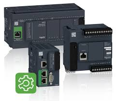

# Контролери та їх програмне забезпечення

На цій сторінці представлені матеріали першої частини курсу "Контролери та їх програмне забезпечення", який читається студентам 3-го курсу спеціальності "Автоматизація та комп'ютерно-інтегровані технології" [на кафедрі АКТСУ Національного університету харочвих технологій](http://www.iasu-nuft.pp.ua/) 

- [**Лекції**](Лекції/README.md)
- [**Лабораторні роботи**](Лаборат/README.md)
- Практичні заняття

- [**Курсове проектування**](Курсовий/README.md)
  - [Методичні рекомендації до виконання курсового проекту (2017 рік)](Курсовий/Метод2017/README.md)

[Сторінка курсу](https://romamirkevich.github.io/PLCBeginner/)

[Матеріали на GitHub](https://github.com/romamirkevich/PLCBeginner)

**Розробники:**

- Ігор Володимирович Ельперін, 
- Олександр Миколайович Пупена, 
- Володимир Володимирович Полупан, 
- Олег Миколайович Клименко, 
- Роман Миколайович Міркевич, 
- Дмитро Валерійович Мацебула

**Лектори:** 

- Ігор Володимирович Ельперін
- Олександр Миколайович Пупена
- Олег Миколайович Клименко

**Лабораторні та практичні заняття:**

- Дмитро Валерійович Мацебула
- Володимир Володимирович Полупан
- Сергій Миколайович Швед