| [<- зміст](README.md)    | [на основну сторінку курсу](../../README.md) |
| ------------------------ | -------------------------------------------- |
| [<- розділи 1-3](1_3.md) | [розділ 5 ->](5.md)                          |

# 4. Вказівки до виконання окремих розділів проекту 

## 4.1. Рекомендована послідовність виконання курсового проекту{#4_1} 

Курсовий проект виконується в кілька основних стадій:

1. Розроблення алгоритмічної структури алгоритму керування об’єктом; 
2. Вибір моделі контролера, його компонування та конфігурування, розробка принципових схем (підключення до ПЛК); 
3. Розроблення прикладного програмного забезпечення для реалізації алгоритму керування; 

4. Відлагодження програмного забезпечення на діючому обладнанні або імітаторі ПЛК.

Етапи стадій можуть виконуватися послідовно або паралельно (без повного закінчення попередніх етапів). Як правило, виконання проекту має ітераційний характер, тобто розділи можуть перероблюватися декілька раз вже після їх виконання. Зокрема 3-тя та 4-та стадії постійно змінюють одна одну.  

Виконання кожного етапу стадії супроводжується створенням схем, описів, таблиць, лістингів (текстового або графічного вигляду) програм та створення прикладного ПЗ. Вимоги до оформлення матеріалів курсового проекту наведені в [розділі 5](5.md).

Робота над проектом завершується його захистом з використанням спеціалізованого програмного забезпечення або на реально діючому обладнанні.

Результат виконання всіх етапів відображаються у пояснювальній записці у вигляді схем, таблиць, копій екранів, пояснювальної інформації, а також текстів програм з необхідними коментарями.

Нижче наведений приклад виконання розділів проекту у тій самій послідовності, як він може розроблятися. Спочатку приведено опис об’єкта автоматизації в тому вигляді, як він дається в завданні.  

### 4.1.1 Опис об’єкта автоматизації (Приклад)

Об’єктом автоматизації є технологічний процес приготування харчової суміші. Продукт готовиться наступним чином. Перед запуском робочого циклу перемикачем вибирають «Вид продукту».

Натискається кнопка «Пуск». Якщо апарат порожній починається робочий цикл, якщо ні – закриваються всі клапани крім Кл5 і апарат вивантажується. Коли апарат стане порожнім, Кл5 закривається і відкривається Кл1. Сировина заповнює апарат до рівня «а». Після цього Кл1 закривається і включається мішалка М1. Далі процес залежить  від вибору типу продукту. Якщо вибраний рецепт продукції №1, відкривається Кл2 і компонент 1 заповнює апарат до Lзад, який дорівнює 80% за показами рівнеміра LT. Кл 2 закривається, повністю відкривається аналоговий Кл4 і пара починає поступати в апарат. Коли температура в апараті досягне заданого значення tзад=70оС включається регулятор температури, який підтримує задане значення протягом 15 хвилин. Після чого регулятор відключається, Кл4 повністю закривається, мішалка відключається, відкривається Кл5 і апарат спорожнюється. Відсутність рідини в баці перевіряється також датчиком рівня LT (<0.5%). Після опустошення апарат може бути використаний для наступного робочого циклу. 

Робочий цикл для продукції за рецептом №2 відрізняється тим, що в апарат подається компонент №2, з параметрами: Lзад = 90%, tзад=75оС. 

 

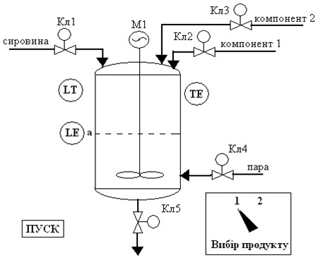

Рис.4.1. Опис об’єкта управління

### 4.1.2 Вимоги до функцій та задач системи (приклад).

Передбачається підключення вимірювальних перетворювачів та виконавчих механізмів з наступними характеристиками сигналів.  

Таблиця 4.1.Перелік змінних та вимоги до них  

| **Назва параметру**                        | **Діапазон  зміни** | **Діапазон сигналу** |
| ------------------------------------------ | ------------------- | -------------------- |
| Рівень "a"                                 | вкл/откл            | Вкл.=24В, Викл=0     |
| Кнопка  «ПУСК»                             | вкл/откл            | Вкл.=24В, Викл=0     |
| Перемикач  вибору продукції: - продукт №1  | вкл/откл            | Вкл.=24В, Викл=0     |
| Перемикач вибору продукції:   - продукт №2 | вкл/откл            | Вкл.=24В, Викл=0     |
| Рівень                                     | 0-10 м              | 0-20 мА              |
| Температура                                | -50-150 °С          | 0-20 мА              |
| Мішалка                                    | вкл/откл            | Вкл.=24В, Викл=0В    |
| Клапани  Кл1-Кл3                           | Відкритий/закритий  | Відкр=24В, Закр=0В   |
| Клапан пари Кл5                            | 0-100%              | 4-20 мА              |

## 4.2. Розроблення алгоритмічної структури задач та функцій для керування об’єктом{#4_2} 

Алгоритмічна структура для виконання задач складається для кращого розуміння алгоритму управління, систематизації і структурування обробки інформації, а також вироблення необхідної послідовності керуючих дій для забезпечення нормального функціонування об’єкта. Алгоритмічна структура програми керування є універсальним носієм інформації і практично не залежить від контролера, на якому цей алгоритм буде реалізований. Тому при описі алгоритмічної структури і окремих її складових необхідно користуватись загальними назвами інформаційних сигналів і керуючих дій. Наприклад: «Якщо рівень в апараті досяг максимального значення», «Відкрити клапан подачі пари» і т. ін. Приклад   блок-схеми алгоритму      управління   для   наведеного   об’єкта представлений на рис.4.2. Вимоги до оформлення блок-семи наведені в [розділі 5.1](5.md).

За необхідності наводиться функціональна схема роботи функцій, що виконуються неперервно. Необхідність та форма оформлення функціональних схем уточнюється з керівником проекту.   

### 4.2.1 Блок-схема    задачі управління приготування продукту (приклад)

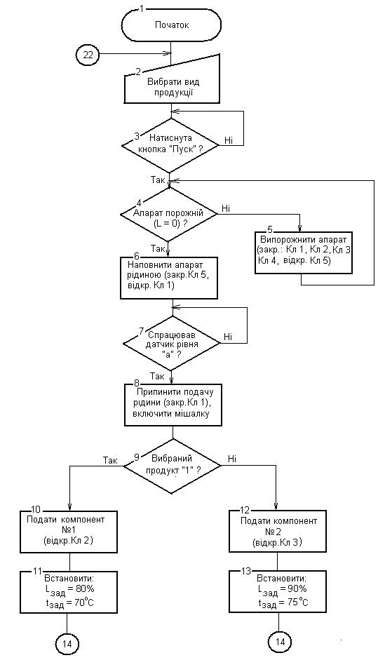

Рис 4.2 Блок-схема алгоритму управління

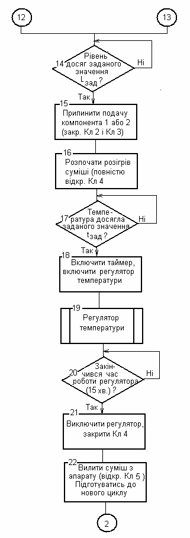

Рис 4.2(а) Блок-схема алгоритму управління (продовження)

## 4.3. Вибір моделі контролера, його компонування та конфігурування, розробка принципових схем{#4_3} 

Перед вибором моделі контролера необхідно визначити кількість каналів вводу/виводу та вимоги до функцій, які повинні виконуватися. Вимоги до функцій можуть включати:

- наявність та кількість контурів регулювання з класичними законами керування (ПІ, ПІД)

- наявність та кількість спеціалізованих функціональних блоків, наприклад: керування серводвигунами, перетворювачами частоти;

- частота обробки входів/виходів в основній задачі (MAST TASK), та наявність додаткових задач;  

- наявність та тип комунікаційних каналів для підключення засобів SCADA/HMI та інших ПЛК чи засобів вводу/виводу;

Для вибору моделі контролера і його конфігурації необхідно визначитись з переліком технічних засобів автоматизації, які будуть використовуватись для реалізації алгоритму управління. При цьому дуже важливо знати параметри сигналів від датчиків і на виконавчі механізми. Спочатку розробляють схему автоматизації та вибирають технічні засоби. Вимоги до оформлення схеми наведені в [розділі 5.2](5.md), приклад наведений в [пункті 4.3.1](#4_3). 

Далі вибирають технічні засоби для ПЛК та роблять його компонування. Приклад компонування ПЛК наведений в [пункті 4.3.2](#4_3). Вимоги до оформлення наведені в [розділі 5.3](5.md). 

Далі розробляють схеми підключення датчиків та виконавчих механізмів до контролера. Приклад схем підключення показаний у [пункті 4.3.3](#4_3), вимоги до оформлення наведені в [розділі 5.4](#_5.4._Вимоги_до).   

У відповідності зі схемами підключення створюється перелік (відомість) вхідних/вихідних сигналів ПЛК. У таблиці бажано вже визначитися з назвою змінних в проекті контролера. Різні організації по різному будують правила найменування. У [пункті 4.3.4](#_4.3.4_Відомість_вхідних/вихідних) наведений приклад, де в якості правил найменування використовується позначення засобів на схемі автоматизації з добавленням за необхідності суфіксів та префіксів. Вимоги до оформлення наведені в [розділі 5.5](#_5.5._Вимоги_до). 

Після визначення схем підключення виконується конфігурування окремих модулів. При конфігуруванні ЦПУ необхідно звернути увагу на:

- операційні режими роботи контролера при старті;

- керування пам’яттю (виділення, використання, ініціалізація, захист);

- особливості комунікацій

При конфігуруванні модулів вводу/виводу необхідно врахувати:

- тип та діапазон сигналу (якщо це конфігурується)

- задача, в якій обробляється канал

- необхідність контролю працездатності каналу та живлення

- стан виходів при зупинці ПЛК або помилці зв’язку з ЦПУ

- налаштування додаткової обробки (наприклад фільтрація сигналу)  

Приклад конфігурування модулів показаний у [пункті 4.3.5](#_4.3.5_Конфігурування_ЦПУ) вимоги до оформлення у [розділі 5.6](#_5.6._Вимоги_до). 

### 4.3.1 Спрощена схема автоматизації (приклад)

На рис. 5.3 наведена спрощена схема автоматизації (функціональна) на якій показані датчики і виконавчі механізми, а також типи сигналів для їх підключення до контролера. 

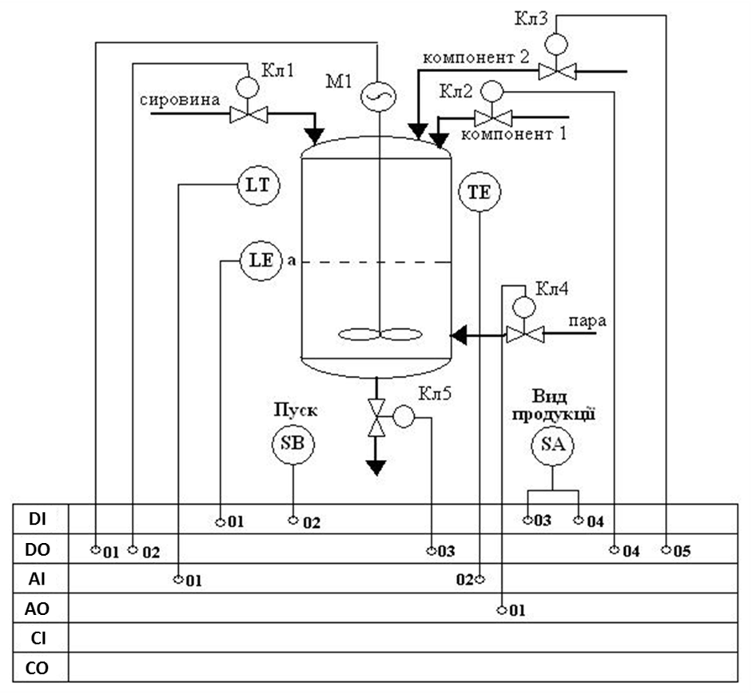

Рис. 4.3. Спрощена схема автоматизації: ВД (DI) – входи дискретні; ДВ (DO) – виходи дискретні; ВА(AI) – входи аналогові; АВ(AO) – аналогові виходи; ВІ(CI) – входи імпульсні; ІВ(CO) – імпульсні виходи

### 4.3.2 Вибір технічних засобів та компонування ПЛК (приклад)

1. Для неперервного вимірювання рівня (LT) – ультразвуковий рівнемір з вихідним сигналом 0 – 20 мА. При підключенні до ПЛК - вхідний аналоговий сигнал (01). 

2. Для сигналізації досягнення рівня «а» (LЕ) - ємнісний сигналізатор рівня. Вхідний дискретний сигнал (01).

3. Для вимірювання температури (ТЕ) – термометр опору з вбудованим нормуючим перетворювачем і вихідним сигналом 0 – 20 мА. Вхідний аналоговий сигнал (02).

4. Кнопка «Пуск» (SB) – вхідний дискретний сигнал (02).

5. Перемикач (виду продукції) (SА) – Два вхідних дискретних сигнала: 03 – при виборі виду продукції №1, 04 - при виборі виду продукції №2.

6. Клапани Кл1, Кл2, Кл3, Кл5 – дискретні пневматичні клапани, що керуються соленоїдами електропневмо-розподілювачів. 4 дискретних вихідних сигнали – 01, 03, 04, 05.

7. Управління мішалкою за допомогою магнітного пускача. Дискретний вихідний сигнал – 02.

8. Клапан Кл 4 – пневматичний клапан з аналоговим електропневматичним перетворювачем. Керуючий сигнал 4 – 20 мА. Аналоговий вихідний сигнал – 01. 

9. Таким чином для управління об’єктом необхідно скомпонувати ПЛК який забезпечує підключення: 4-х дискретних вхідних сигналів, 5-х дискретних вихідних сигналів, 2-х вхідних аналогових сигналів 0 – 20 мА і 1-го аналогового вихідного сигналу 0 – 10 В. 

Для побудови такої конфігурації на базі ПЛК М340 достатньо вибрати:

- модуль ЦПУ – для функцій даної задачі підходить самий економічний з моделі, а саме BMX P34 1000,

- один змішаний модуль на 8 дискретних входів, та 8 дискретних виходів (BMX DDM 16022)

- один змішаний модуль на 4 аналогові входи та 2 аналогові виходи (BMX AMM 600) 

Для такої кількості модулів достатньо одного шасі на 4-ри посадочні місця (BMX XBP400). Модуль живлення для шасі вибираємо на 220В. Для живлення модулів в шасі достатньо BMX CPS 2000. Схема компонування ПЛК показана на рис.4.4.  

 

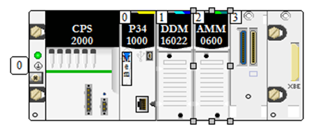

Рис. 4.4. Компонування ПЛК

Для підключення провідників до модулів вводу/виводу, необхідно додатково вибрати клемні колодки для модулів. Для гвинтових зажимів вибираємо BMX FTB 2010. Специфікація засобів автоматизації для контролера матиме вигляд як в таблиці 4.2. 

  Таблиця 4.2. Специфікація засобів автоматизації для ПЛК

| Поз. | Найменування та технічна характеристика засобу               | Тип, марка, позначення  документу, листа опитування | Завод-виготовлювач/  виробник | Одиниця виміру | Кількість | Примітка |
| ---- | ------------------------------------------------------------ | --------------------------------------------------- | ----------------------------- | -------------- | --------- | -------- |
|      | ПРОГРАМОВАНИЙ ЛОГІЧНИЙ КОНТРОЛЕР ПЛК                         |                                                     |                               |                |           |          |
| 1.   | Шасі X80 з Xbus шиною на 4 посадочні місця                   | BMX XBP400                                          | Schneider Electric, Франція   | шт             | 1         |          |
| 2    | Модуль ЦПУ                                                   | BMX P34  1000                                       | Schneider Electric, Франція   | шт             | 1         |          |
| 3    | модуль живлення 100…240 VAC, 20 Вт                           | BMX CPS 2000                                        | Schneider Electric, Франція   |                |           |          |
| 4    | модуль на 8 дискретних входів (24 VDC) та 8 дискретних транзисторних виходів ((24 VDC 0.5 A) | BMX DDM 16022                                       | Schneider Electric, Франція   |                |           |          |
| 5    | модуль на 4 аналогових вхідних сигналів та 2 аналогових вихідних  сигналів | BMX AMM 0600                                        | Schneider Electric, Франція   |                |           |          |
| 6    | 20 контактна з’ємна колодка з гвинтовими зажимами            | BMX FTB 2010                                        | Schneider Electric, Франція   | шт             | 2         |          |

 

### 4.3.3 Схеми підключень вимірювальних перетворювачів та виконавчих механізмів (приклад)

На рис. 4.5-4.6 наведені схеми підключення зовнішніх пристроїв до модулів ПЛК на прикладі TSX Micro.

 

|      |                       |
| ---- | --------------------- |
|      | 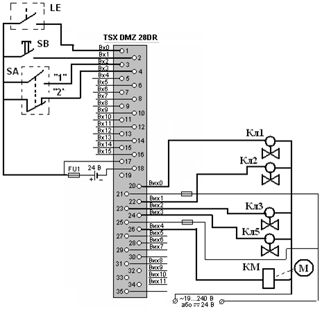 |

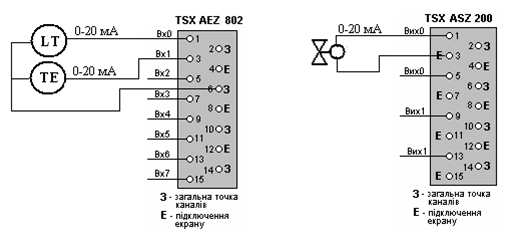

### 4.3.4 Відомість вхідних/вихідних сигналів ПЛК (приклад)

Таблиця 4.3. Відомість вхідних/вихідних сигналів ПЛК M340

| **Вхідні сигнали**                                           |                         |                  |         |          |
| ------------------------------------------------------------ | ----------------------- | ---------------- | ------- | -------- |
| Джерело сигналу                                              | Назва змінної UNITY PRO | Позначення на СА | Адреса  |          |
| Сигналізатор  рівня "a"                                      | LE_A                    | LE               | DI01    | %I0.1.0  |
| Кнопка  «ПУСК»                                               | SB_START                | SB               | DI02    | %I0.1.1  |
| Перемикач  вибору продукції: - продукт №1                    | SA_1                    | SA               | DI03    | %I0.1.2  |
| Перемикач вибору продукції:   - продукт №2                   | SA_2                    | DI04             | %I0.1.3 |          |
| Датчик  рівня (аналоговий)                                   | LT1                     | LT               | AI01    | %IW0.2.0 |
| Датчик  температури                                          | TE1                     | TE               | AI02    | %IW0.2.1 |
| **Вихідні сигнали**                                          |                         |                  |         |          |
| Виконавчий пристрій                                          | Назва змінної UNITY PRO | Позначення на СА | Адреса  |          |
| Магнітний  пускач двигуна мішалки                            | NS1                     | М1               | DO01    | %Q0.1.16 |
| Соленоїд  розподілювача для клапану подачі сировини (дискретний) | LVS1                    | Кл1              | DO02    | %Q0.1.17 |
| Соленоїд  розподілювача для клапану зливу (дискретний)       | LVS5                    | Кл5              | DO03    | %Q0.1.18 |
| Соленоїд  розподілювача для клапану подачі компоненту 1 (дискретний) | LVS2                    | Кл2              | DO04    | %Q0.1.19 |
| Соленоїд  розподілювача для клапану подачі компоненту 2 (дискретний) | LVS3                    | Кл3              | DO05    | %Q0.1.20 |
| Електро-пневмоперетворювач  для клапану подачі пари (аналоговий) | TV4                     | Кл4              | AO01    | %QW0.2.4 |

У відповідності до таблиці 4.3 у UNITY PRO створюються змінні вводу/виводу для зручності написання та відлагодження програми (рис.4.7).   

 

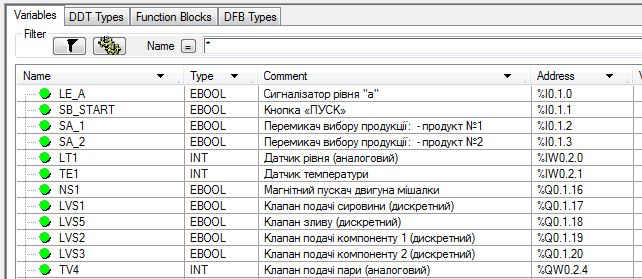

Рис.4.7. Перелік змінних вводу/виводу в UNITY PRO

### 4.3.5 Конфігурування ЦПУ та модулів вводу/виводу ПЛК (приклад)

На рис. 4.8-4.11 наведені вікна конфігурування окремих модулів. На рис.4.8 показане вікно конфігурування модулю ЦПУ. Виділення області локалізованих даних (%M, %MW, %KW) залишається у конфігурації за замовченням. Виставлена опція "Automatic start in RUN" змушує ПЛК при старті переходити в режим виконання. Змінні %MW при холодному старті будуть інціалізуватися значеннями за замовченням.  

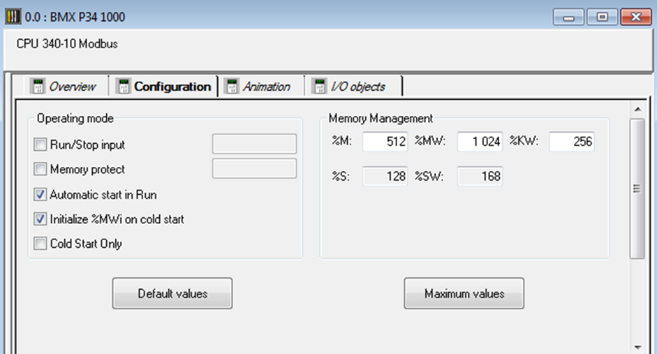

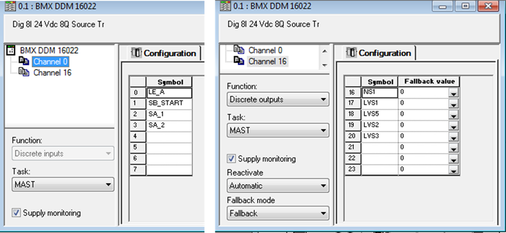

На рис.4.9 показані вікна UNITY PRO конфігурування входів та виходів модуля дискретних входів/виходів M340. Контролером діагностуватиметься живлення входів та виходів, оскільки виставлені опції "Supply monitoring". Тобто при виходу напруги живлення за діапазон, діагностичні змінні та індикатори будуть показувати помилку вводу/виводу, що дасть змогу сигналізувати це оператору через засоби людино-машинного інтерфейсу. Дискретні виходи при зупинці ПЛК повинні залишатися в безпечному стані, значення якого виставляється в полі Fallback Value (режим "Fallback"). Дискретні виходи захищені від перевантажень, режим Reactivate="Automatic" вказує на те, що виходи повинні реактивуватися після спрацювання захисту автоматично через кожні 10 секунд.     

На рис.4.10 показане вікно налаштування аналогових входів. Згідно поставленої задачі входи повинні бути налаштовані на діапазон 0-20 мА. Незадіяні входи в конфігурації відключені ("Used") щоб не діагностувати вихід за діапазон вимірювального сигналу на невикористовуваних каналах. Вхідні сигнали фільтруються фільтром зі ступінню фільтрації 2, що відповідає коефіцієнту 0.875 експоненціального фільтру 1-го порядку. 

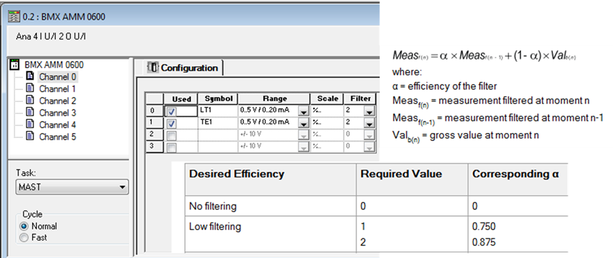

На рис.4.11 показане вікно налаштування аналогових виходів. Згідно поставленої задачі виходи повинні бути в діапазоні 4-20 мА. 

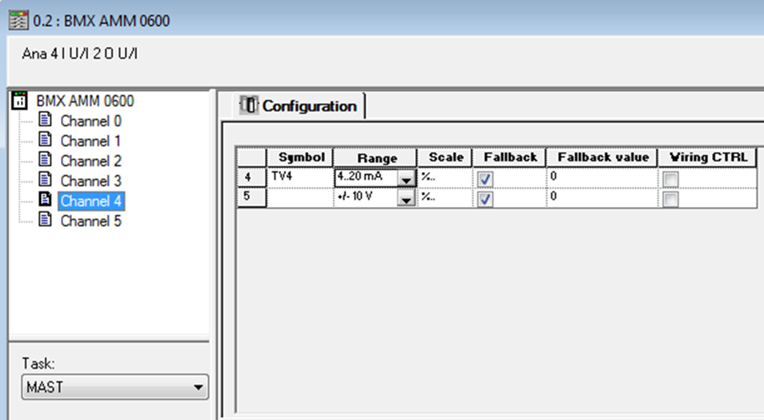

## 4.4. Розроблення прикладного програмного забезпечення для реалізації алгоритму керування{#4_4} 

### 4.4.1. Варіанти структури програми

Структура прикладного програмного забезпечення для ПЛК може відрізнятися в залежності від вимог до функцій та стилю програмування. Нижче пропонується один з можливих варіантів, який детально описано в [1]. 

На рис.4.12 наведена функціональна структура системи управління на базі ПЛК з деталізацією проекту UNITY PRO. 

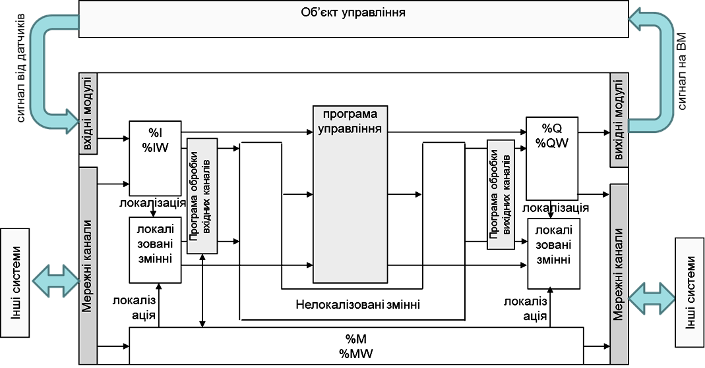

Частина програми, в якій реалізуються алгоритми управління (***програма управління\***) є центральною частиною проекту. У програмі управління можуть використовуватися як змінні, так і безпосередньо самі адреси. Однак у більшості випадків перед використанням даних з вхідних каналів та записом в вихідні – їх необхідно попередньо обробити. Наприклад, аналогові сигнали треба масштабувати або обробити програмними фільтрами. Для цих цілей обробку вхідних каналів можна приводити на початку Задачі, а вихідних – в кінці Задачі. Структура такої Задачі матиме вигляд як на рис.4.13(а). 

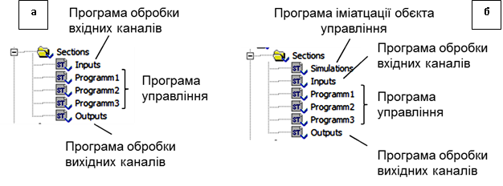

Для можливості відлагодження проекту без наявного обладнання, можна використати програмну імітацію. У залежності від програмної структури проекту, буде відрізнятися програма імітації та її розміщення. Один із варіантів реалізації програми імітації об’єкта управління орієнтований на роботу безпосередньо з вхідними та вихідними змінними (рис.4.14). 

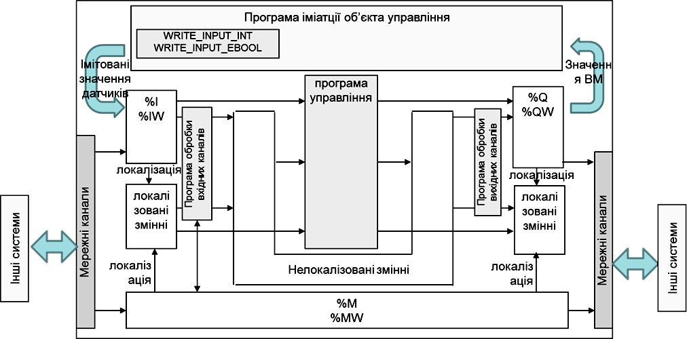

Згідно цього підходу вихідні значення *%**Q* та *%**QW* обробляються програмою імітації та відповідно до їх значення змінюють вхідні значення *%**I* та *%**IW*, використовуючи функції *WRITE_INPUT_EBOOL та WRITE_INPUT_INT*. Структура Задачі може мати вигляд як на рис.4.13(б), тобто на початку програми добавляється секція (секції) програми імітації, а всі інші секції залишаються без змін. При налагодженні та експлуатації системи з реальним об’єктом секція програми імітації об’єкта управління видаляється, або відключається через властивість *Condition*, прив'язавши до неї певну змінну і керуючи її значенням.

Другий варіант може бути застосований при використанні в програмі тільки змінних, тобто без прямого звернення до адрес пам’яті. У цьому випадку змінні, що передбачені в проекті для прив’язки до вхідних/вихідних каналів, тимчасово залишаються нелокалізованими і використовуються програмою імітації об’єкту напряму, тобто без функцій *WRITE_INPUT_EBOOL* та *WRITE_INPUT_INT* (рис.4.15). При налагодженні та експлуатації системи з реальним об’єктом робиться прив’язка, а всі інші дії аналогічні 1-му варіанту.

Обидва наведені вище варіанти при імітації даних від аналогових датчиків потребують цілочисельних обчислень, оскільки значення змінних *%**IW* та *%**QW* як правило змінюються в діапазоні *0-10000*. Дещо простіше реалізувати програму імітації вже в діапазоні реальних величин. У цьому випадку функціональна структура системи може мати вигляд як на рис.4.16 а структура Задачі - як на рис.4. 13(б), однак з виключеними секціями обробки вхідних каналів.  

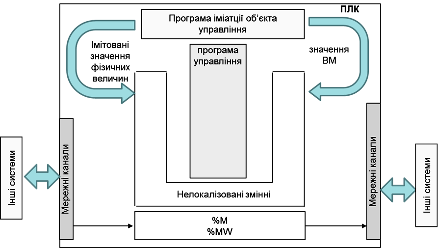

Більш детально приклади імітації описані в [розділі 4.5](#_4.5._Відлагодження_програмного).

### 4.4.2. Технологічні змінні 

Для приведення вхідних та вихідних сигналів ПЛК до технологічних вимог, необхідно створити технологічні змінні. Перелік технологічних змінних для прикладу показаний на рис.4.17. Для швидкого створення змінних можна скопіювати існуючі змінні вводу/виводу, змінити їх тип (EBOOL на BOOL, INT на REAL) та ім’я, наприклад добавивши суфікс "M".   

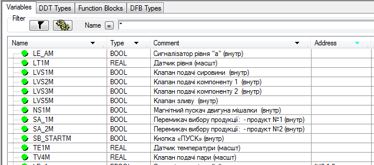

 

 Рис.4.17. Технологічні змінні в Unity PRO (приклад) 

Усі інші технологічні та параметричні змінні (наприклад задані значення регуляторам, тощо) добавлятимуться в програму за необхідності. 

### 4.4.3. Масштабування та перетворення входів/виходів 

У запропонованому підході технологічні змінні масштабуються та за необхідності обробляються в секціях Inputs та Outputs. Для цього можна скористатися звичайними математичними функціями або існуючими функціональними блоками. 

На рис.4.18 показаний приклад секції "INPUTS" в якій відбуваються перетворення вхідних аналогових та дискретних змінних. Вхідні аналогові сигнали масштабуються за допомогою функціональних блоків "SCALING". На рис.4.18 показані також змінні та екземпляри функціональних блоків, що при цьому використовуються. Дискретні вхідні змінні просто переприсвоюються внутрішнім змінним. За необхідності, вхідні сигнали можна додатково обробити, наприклад використати фільтрування або інвертування, більш детально з цим можна познайомитися в [1].   

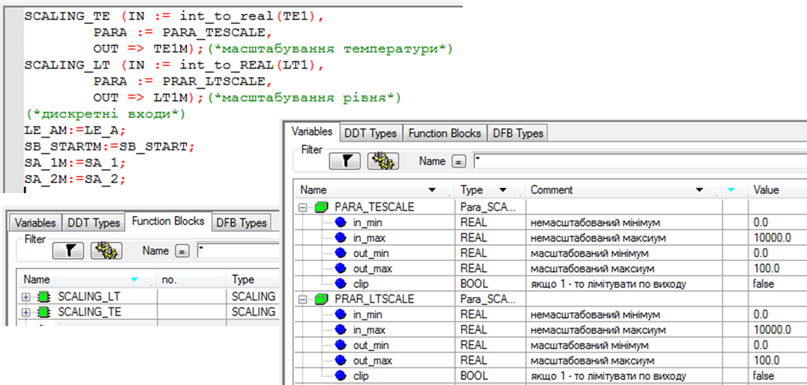 

 Рис.4.18. Приклад реалізації масштабування та перетворення вхідних сигналів (INPUTS)

Масштабування з використанням ФБ SCALING потребує налаштування через змінну типу PARA_SCALE. Це дає змогу вивести параметри масштабування на засоби людино-машинного інтерфейсу, що дуже важливо для служби КВПіА, коли потребується підлаштувати параметри датчика або замінити його на інший діапазон. У всіх інших випадках можна скористатися простою формулою, як це зроблено в секції OUTPUTS для аналогових вихідних каналів (рис.4.19). Оскільки змінна TV4M містить значення для регулюючого органу в діапазоні 0-100%, помноживши його на 100, можна отримати значення для аналогового виходу в діапазоні 0-10000.    

  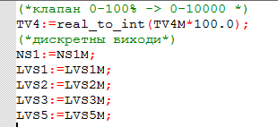

Рис.4.19. Приклад реалізації масштабування та перетворення вихідних сигналів (секція OUTPUTS)

### 4.4.4. Реалізація контурів регулювання з використання PI_B 

Слід зазначити, що в курсовому проекті контури регулювання можуть бути внесені штучно для підвищення складності проекту та добавленні непевних функцій. Так, наприклад, в поставленому завданні температуру в апараті не можна стабілізувати за допомогою ПІ регулятору, замість цього використовується позиційні регулятори. Слід розуміти, що даний курсовий проект направлений саме на розвиток компетенцій в області програмованих контролерів а не проектування. 

Для варіантів, що передбачають контури регулювання на базі класичних законів рекомендується використовувати стандартні функціональні блоки UNITY PRO з бібліотеки CONT_CTL. Опис бібліотеки та приклади використання наведені в [1], [3], [4] та досліджуються в лабораторних роботах курсу. Зокрема там наведені приклади каскадних структур контурів, використання в контурі програмного задавача та побудова контурів з використанням ВМ типу МЕО. Нижче наводиться приклад використання звичайного одноконтурного регулятору для наведеної вище задачі. 

**Приклад**. 

Для зручності відлагодження контур регулювання можна реалізувати у вигляді окремої секції. Необхідно передбачити наступні функції контуру:

- стабілізаційне регулювання температури TE через зміну подачі пари клапаном Кл4 з використанням ПІ-закону;

- можливість зміни коефіцієнтів ПІ-регулятору, та обмежень на вихід виконавчого механізму; 

- можливість роботи регулятору в режимі слідкування, для безпосередньої зміни виходу на ВМ з програми керування;

- можливість роботи регулятору в ручному режимі, коли вихід на ВМ змінюється оператором з ЛМІ;

- безударність переходу з ручного в автоматичний режим та навпаки;

- безударність переходу з режиму слідкування в автоматичний режим;

Реалізація контуру регулювання температурою на мові ST показаний на рис.4.20. Налаштування змінних контуру показано на рис.4.21. У програмі використаний періодичний виклик 1 раз/с за допомогою функціонального блоку SAMPLETM. Режим слідкування необхідний для можливості зміни виходу на виконавчий механізм безпосередньо з програми а не з алгоритму ПІ. У даному випадку для зручності будемо використовувати для режиму слідкування змінну виконавчого механізму TV4M.  

 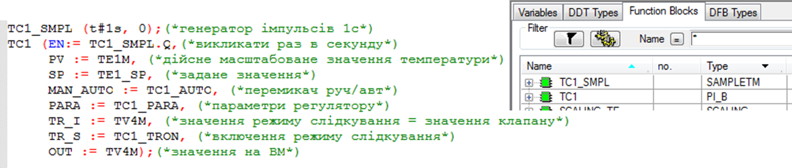

Рис.4.20. Приклад реалізації контуру регулювання (секція LOOP_TC1)

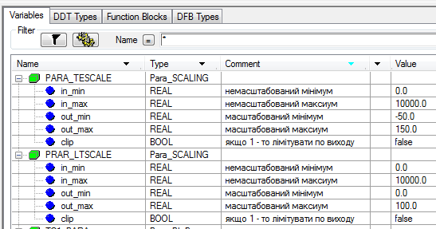

Рис.4.21. Змінні для контуру регулювання TC1

Після створення програми для контурів регулювання, доречно перейти до етапу налагодження контурів, який описаний в [розділі 4.5.3](#_4.5.3_Відлагодження_контурів). 

### 4.4.5. Реалізація логіко-командних задач 

На відміну від контурів регулювання, функції обробки яких повинні викликатися постійно, логіко-командні задачі мають початок і кінець і складаються з певних кроків. Для їх реалізації також можна використати будь з яких доступних мов програмування, хоч для такого класу задач розроблені спеціальні мови Grafcet та SFC. Слід зауважити, що на сьогоднішній день найбільш просунуті методи реалізації керування багатороцептурними виробництвами відображені в стандарті ISA-88, вивчення якого виноситься за рамки даної дисципліни. 

На рис.4.22-4.24 показана загальна структура програми користувача в секції MAST та реалізація логіко-командного управління для приготування продукту в секції PROCEDURE, що реалізована на мові SFC. Вміст кроків та переходів показаний праворуч або ліворуч від них. Вміст секцій для переходів та дій показані стрілками.  

Після створення програми для логіко-командних задач, їх необхідно відлагодити, як це показано у [розділі 4.5.4](#_4.5.4_Відлагодження_програми). 

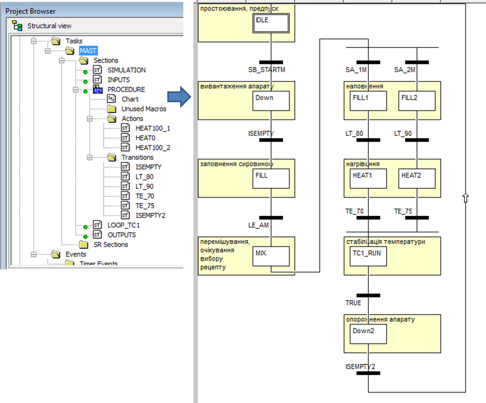 

Рис.4.22. Структура програми користувача та секція PROCEDURE

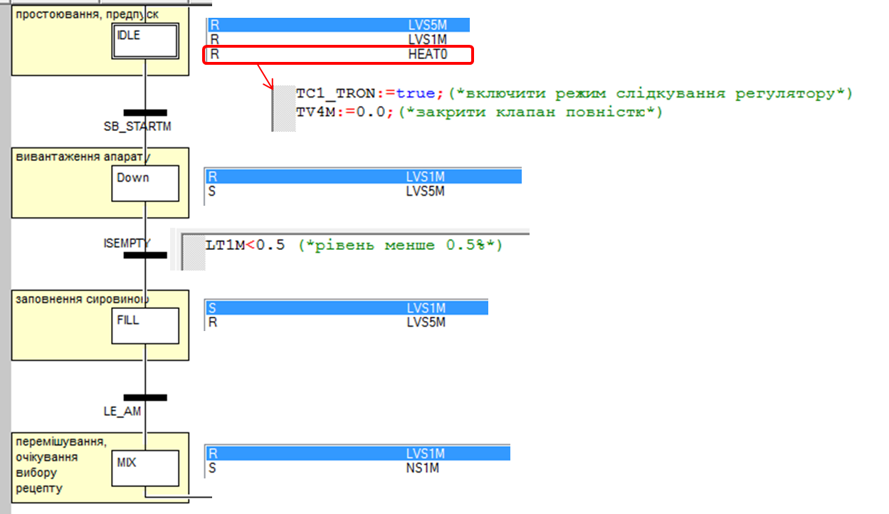

Рис.4.23. Кроки IDLE-MIX

Рис.4.24. Кроки FILL1-Down2

## 4.5. Відлагодження програмного забезпечення на діючому обладнанні або імітаторі ПЛК{#4_5} 

### 4.5.1 Загальні принципи відлагодження 

Середовище UNITY PRO надає ряд засобів для відлагодження роботи програми користувача, зокрема:

- вбудовані анімаційні засоби редакторів мов;

- анімаційні таблиці;

- графічні операторські екрани [2];

- трендові утиліти (Trending Tool);

- засоби відладки панелі Debug;

За допомогою цих засобів можна подивитися та змінити значення змінних в різній формі представлення, зупинити програму в потрібному місці і т.п. У курсовому проекті при перевірці виконання необхідно використовувати графічні операторські екрани. 

У записці повинна бути наведена методика перевірки роботи програми, у якій описана послідовність дій оператору в анімаційному екрані і, за необхідності, вікнах форсування та, відповідно, очікувана реакція на них. Вимоги до оформлення розділу методики перевірки наведені в [розділі 5.8](#_5.8._Вимоги_до). 

Нижче наведений приклад опису процедури методики перевірки для даної задачі.

### 4.5.2 Опис процедури методики перевірки (приклад)

Перевірка роботи програми для керування установки проводиться в декілька етапів:
1. Перевірка каналів (при наявному фізичному ПЛК). 
   a. Перевіряється реакція змінних на вхідні сигнали шляхом подачі на вхідні канали струму/напруги відповідного діапазону та контролю правильності їх відображення.
   b. Перевіряється реакція ВМ або зміна напруги/струму виходів ПЛК на зміну вихідних змінних 
2. Перевірка контуру регулювання TC1.
3. Перевірка задач. 

### 4.5.3 Перевірка та відлагодження контурів регулювання

Для відлагодження роботи регуляторів контурів необхідно мати зворотній сигнал від об’єкта управління. При відсутності об’єкта управління значення технологічної змінної можна імітувати. Для найпростішої імітації можна використати аперіодичну ланку 1-го порядку. Слід звернути увагу, що при цьому сам об’єкт може фізично бути набагато складнішим, однак в даному випадку важливо подивитися працездатність програми контуру, а не налаштувати його повноцінну роботу. 

**Приклад**. **Перевірка контуру регулювання** **TC1**

Перевірка контуру проводиться на імітаторі (включення секції імітації) та при наявному об’єкті та ПЛК на реальному об’єкті управління. Для перевірки роботи представлений графічний операторський екран з мнемосхемою, наведеною на рис.

- у ручному режимі перевіряється реакція ВМ на ручну зміну TV4M;

- у автоматичному режимі перевіряється реакція на зміну стрибкоподібну завдання TE1_SP: значення 20, 40, 60; змінна TE1M повинна виходити на вказане завдання з точністю до 0.5 °C;  

- у автоматичному режимі перевіряється реакція на зміну коефіцієнтів Кп, Ті та обмежень на вихід;

- у режимі слідкування перевіряється реакція на зміну програмного керування з задачі;

У даному прикладі для реалізації аперіодичної ланки використано готовий функціональний блок LAG_FILTER [2]. Програма імітації температури показана на рис.4.25, вона записана в секції SIMULATION проекту UNITY PRO. На вхід екземпляру LAG_TE1 подається значення клапану TV4 з коефіцієнтом підсилення 0.5. Таким чином при 100% відкриття клапану (10000) на виході з певним часом (стала часу 60 секунд) буде 50% від діапазону (5000). Коефіцієнт вибраний 0.5 з метою наступного зсунення робочої точки на ще на 35% відносно 0. Враховуючи що датчик температури має діапазон від -50 до 150 °C, реально вихід з імітатора буде давати значення в діапазоні 20°C (3500) – 120°C (8500) 

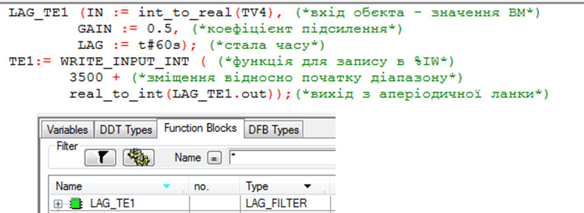

Рис.4.25. Імітація температури за допомогою функціонального блоку LAG_TE1 (секція SIMULATION) 

Для перевірки роботи контуру TC1 в анімаційних екранах необхідно створити сторінку з відображенням плинного стану контуру регулювання та елементами керування (див. рис.4.26). Як працювати з анімаційними екранами Ви можете прочитати в [1] або подивитися в навчальному відеоролику [2]. Приклад анімаційного екрану показаний на рис.4.26. Для реалізації самописця з декількома графіками прямокутники з анімацією Trend Diagram накладаються один на одного.  

У ручному режимі необхідно перевірити як реагує клапан і об’єкт на ручну зміну клапану 0% та 100% відкриття (див. рис.4.26). Після перевірки в ручному режимі необхідно перевірити роботу контуру в автоматичному режимі при різних завданнях, різних налаштуваннях Kp та Ti та подивитися чи працюють обмеження на максимум та мінімум вихідної величини (див. рис.4.27). Слід зауважити, що якість перехідного проценту не має в даному випадку важливого значення. Головне – коректна поведінка роботи контуру.   

 

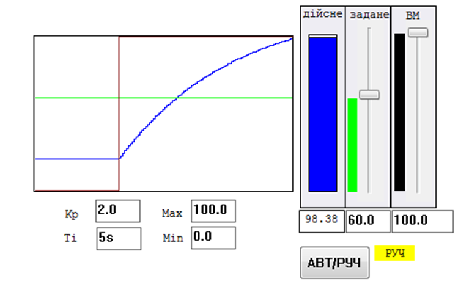

Рис.4.26. Перевірка роботи контуру TC1 в ручному режимі    

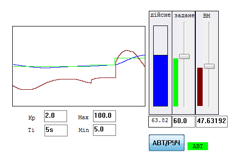

   Рис.4.27. Перевірка роботи контуру TC1 в автоматичному режимі  

 

### 4.5.4 Відлагодження програми керування задачами (логіко-командних функцій) з використанням таблиць перевірки 

Для відлагодження програми, що реалізує логіко-командні функції (задачі) потребується перевірка реакції системи на кожному кроці на різні комбінації значень датчиків. Складність такої перевірки полягає в тому, що окрім значень датчиків необхідно врахувати внутрішній стан об’єкту та системи в кожен момент виконання. При невеликій кількості вимірювальних величин та станів перевірка (та від лагодження в проміжних етапах) може обійтися простим перебором значень датчиків та реакції на них. 

Для вказаного вище прикладу приведемо таблицю перевірки задачі (програми) приготування продукції в апараті (Таб.4.4). Таблиця показує послідовність перевірки роботи програми для реалізації задачі приготування, що базується на зміні значень вхідних змінних (від датчиків) та очікуваної реакції вихідних значень. По суті, методика перевірки базується на тому, що програміст послідовно змінює значення вхідних змінних, та перевіряє реакцію вихідних. Значення, які позначені символом "-" на вказаному кроці взагалі не мають впливати на стан виконавчих механізмів.     

 

**Приклад**. **Задача приготування продукту.**

Таблиця 4.4. Табличний вигляд методики перевірки роботи задачі приготування продуктів в апараті.

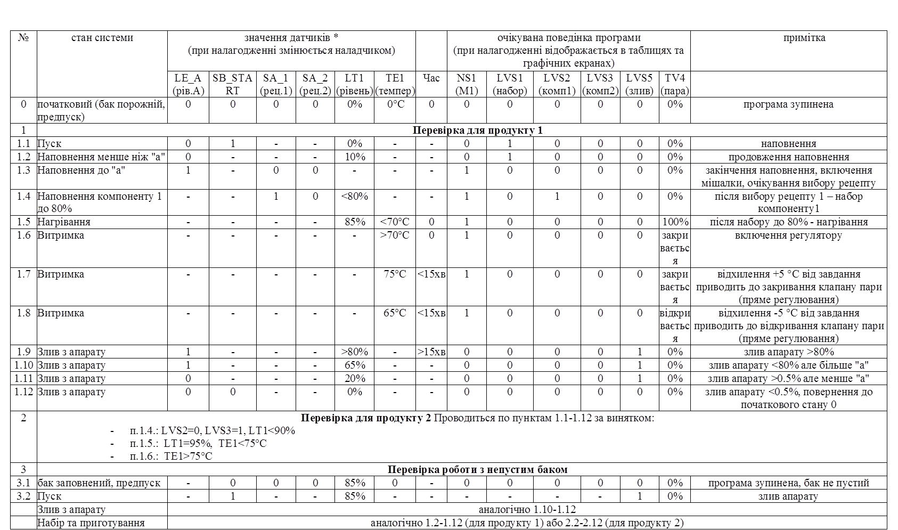

Примітка: символ "-" вказує на те, що значення датчику ніяк не повинно впливати на поведінку системи 

 

### 4.5.5 Використання для відлагодження імітаційних моделей 

Інколи, при великій кількості ітерацій відлагодження є сенс автоматизувати зміну датчиків (імітувати) за вказаним алгоритмом. Для складних багатозв'язних об’єктів варто імітувати об’єкт управління відповідно до його фізичної суті. Відлагоджуючи програми на таких імітаторах розробник максимально наближається до реальних умов і може знайти помилки, які він не міг би передбачити простим плануванням покрокової зміни. Включення секції імітації в структуру програмного проекту описано в п.4.4.1.   

Імітація об’єкта управління може бути як дуже примітивною, так і максимально наближеною до реального об’єкта. У останньому випадку імітаційну модель можна використовувати в системі управління як еталонну. Більш детально про це описано в [1], тут наведемо лиш найбільш прості алгоритми. 

У зв’язку з дискретністю по часу роботи контролера, є сенс алгоритми імітації викликати з певними проміжками часу (наприклад по таймеру). Це дасть змогу налаштувати необхідну швидкість (інерційність) процесу імітації. У процесах, залежних від попереднього стану, необхідно його враховувати. Тому при наступному перерахунку імітаційної величини використовується її попереднє значення. В усіх прикладах будемо користуватися індексами *П* – для попереднього значення та  *Т* – для теперішнього. 

Для імітації рівня в залежності від відкриття трьох клапанів наборів та трьох зливів можна використати таку формулу:

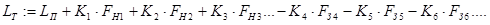        (4.1)

де - відповідно плинний та попередній рівні (%);

 - коефіцієнти які визначають умовний діаметр труб наповнення та зливу;

 - ступені відкриття регулюючих органів на набір (%);

 - ступені відкриття регулюючих органів на злив (%).

При використанні двопозиційних ВМ (закрито, відкрито), (4.1) можна перетворити до наступного вигляду:

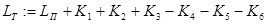                             (4.2)

де для справджується наступна рівність

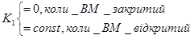               (4.3)

Значення константи вибирається в залежності від діаметру трубопроводу. 

Рівень не може перевищувати 100% і бути менше 0%, тому доречно на значення рівня покласти обмеження по мінімуму та максимуму.

Для імітації спрацювання сигналізатору рівня (AL) можна використати плинне значення рівня, порівнявши його з константою (LSP), тобто:

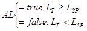                                 (4.4)

 Для імітації температури в апараті, який підігрівається теплоагентом, окрім функціонального блоку LAG_FILTER (див.4.5.4) можна використати його спрощений аналог:

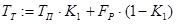                       (4.5)

де 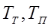- відповідно плинна та попередні температури (% від шкали), 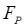- ступінь відкриття регулюючого органу теплоагенту (%), - передаточний коефіцієнт в діапазоні 0..1. Коли управління дорівнює нулю 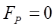 температура буде падати внаслідок охолодження під дією, будемо вважати, прогнозованого збурення. Таким чином коефіцієнт  повинен бути менше, однак близько до значення 1. Чим більше коефіцієнт і періодичність перерахунку (4.5) тим повільніше йде охолодження. 

**Приклад. Імітаційна модель об’єкту.** 

На рис.4.28 показане продовження частина секції SIMULATION (див.4.5.2). Перші рядки фрагменту забезпечують генерування імпульсів в %M101 тривалістю 1-го циклу задачі MAST, та періодичністю 100 мс для генерування постійної дискретності обробки. Імітування показів рівня забезпечується реалізацією формул (4.2)-(4.3). Для коректності роботи імітації використовується також обмеження по мінімуму(0%) та максимуму (100%).   

Для запису значень у вхідні змінні, що прив’язані до %I та %IW використовуються спеціальні функції, відповідно WRITE_INPUT_EBOOL та WRITE_INPUT_INT. Перед записом аналогового значення рівня використовується додаткове перетворення, зворотне до того, що робиться в секції INPUTS. Як вже зазначалося вище така структура дає можливість відключити імітацію об’єкту (що необхідно при впровадженні на реальному об’єкті) відключенням секції імітації.   

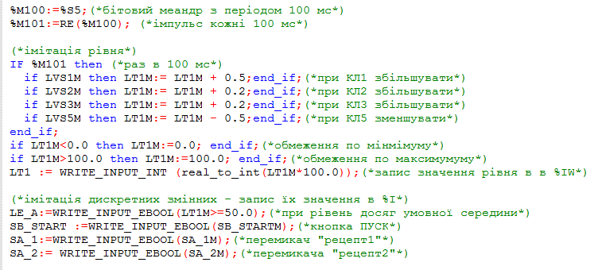

  Рис.4.28. Продовження секції SIMULATION що імітує поведінку об’єкта управління 

 

