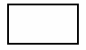
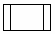

| [<- зміст](README.md) | [на основну сторінку курсу](../../README.md) |
| --------------------- | -------------------------------------------- |
| [<- розділ 4](4.md)   | [розділи 6-7 ->](6_7.md)                     |

# 5. Вимоги до оформлення пояснювальної записки і графічної частини проекту (роботи)

## 5.1. Вимоги до оформлення алгоритмічної структури

Для зображення алгоритму керування у вигляді алгоритмічної структури використовуються загальноприйняті умовні позначення, які застосовуються для опису алгоритмів програмування згідно з ГОСТ 19.701-90, які наведені у табл. 1. Для опису алгоритму функціонування дозволяється також використання інших формальних описових мов, наприклад IDEF або UML. 

 *Таблиця 5.1*

| Умовне  позначення   | Опис алгоритму                                               |
| -------------------- | ------------------------------------------------------------ |
|  | Термінатор. Вихід «до» або вхід «з» зовнішнього  середовища. Початок або кінець програми |
|  | Символ відображає функцію оброблення даних будь-якого  виду. Виконання однієї або групи операцій |
|  | Символ відображає рішення або функцію перемикального  типу. Визначає, по якому з кількох альтернативних виходів піде виконання  алгоритму далі |
|  | Ручне введення. Відображає дані, що вводяться вручну з  будь- яких пристроїв (клавіатура, кнопка, перемикач тощо) |
|  | Дані. Символ відображає дані, носій яких не визначений       |
|  | Символ відображає наперед визначений процес, що складається з однієї або групи операцій |
|  | З’єднувач. Відображає вихід в одну частину схеми або  вихід з іншої. Відповідні з¢єднувачі повинні мати однакові  унікальні позначення |
|  | Підготовка. Символ відображає модифікацію команди з  метою впливу на наступну функцію (модифікація індексу) |

## 5.2. Вимоги до оформлення спрощеної схеми автоматизації

Спрощена схема автоматизації повинна включати в себе:

- спрощену апаратурно-технологічну схему зі вказівкою місць вимірювання (датчиків) та реалізації керуючих дій (виконавчих механізмів), яка видається в завданні на курсовий проект або формується студентом самостійно при виборі індивідуального завдання;

- в нижній частині зображення ПЛК та позначення на ньому типів і номеру підключення, які з’єднані лініями зв’язку з датчиками, перетворювачами та виконавчими механізмами:
  - DI (ВД) – входи дискретні
  - DO (ДВ) – дискретні виходи
  - AI (ВА) – входи аналогові
  - AO (АВ) – аналогові виходи 
  - CI (ВІ) – входи імпульсні (лічильні)
  - CO (ІВ) – імпульсні виходи (ШІМ)

- підписи на лініях зв’язку з типом сигналу, наприклад:
  - для аналогових:
    - 4-20 мА
    - § 0-10 В
  - o  для дискретних
    - 0/24 В
    - 0/220 В
  - o  для імпульсних сигналів
    - 0/24 В 15 кГц 
    - 0/24 В 2с/0.1с/1с  

Для імпульсних вхідних сигналів вказується максимальна частота імпульсів, а для ШІМ виходів – максимальна тривалість імпульсу, мінімальна тривалість та пауза між імпульсами. 

## 5.3. Вимоги до оформлення схеми компонування ПЛК 

Для компонування ПЛК повинна бути наведена схема та специфікація засобів автоматизації. Схема компонування ПЛК повинна містити модулі з вказівкою їх розміщення в шасі, кабелі (за необхідності), якими з’єднуються складові ПЛК. Для відображення компонування може бути використана копія екрану UNITY PRO. Приклад схеми показаний на рис.4.4. 

Специфікація засобів автоматизації для ПЛК повинна включати усі його складові в тому числі модулі, клемні з’єднувачі модулів, кабелі і т.д. Приклад специфікації вказаний в таб. 4.2.

## 5.4. Вимоги до оформлення схеми підключень вимірювальних перетворювачів та виконавчих механізмів

Схеми підключень вимірювальних перетворювачів та виконавчих механізмів виконуються за правилами побудови принципових електричних схем з деяким спрощенням. Засоби автоматизації, які підключаються до каналів ПЛК показуються в спрощеному вигляді без вказівки клем. Дискретні датчики показуються у вигляді контактів, дискретні виходи у вигляді котушок (у випадку реле), резисторів (у випадку резистивного навантаження), ламп або діодів (якщо використовується сигналізація). Аналогові датчики і виконавчі механізми показуються так саме, як на схемі автоматизації. Приклади схем підключень показані на рис.4.5 та рис.4.6. 

## 5.5. Вимоги до оформлення переліку (відомості) вхідних/вихідних сигналів ПЛК

Відомість вхідних/вихідних сигналів ПЛК повинна включати всю інформацію про сигнали від датчиків, перетворювачів та виконавчих механізмів, які безпосередньо підключені до ПЛК. Інформація, яка повинна бути відображена у відомості:

- джерело сигналу: технічний засіб з якого (на який) надходить сигнал;

- позначення на схемі автоматизації джерела сигналу

- назва та адреса змінної в ПЛК

Приклад відомості наведений в таб.4.3.  

## 5.6. Вимоги до оформлення опису конфігурації модулів ПЛК

Опис конфігурації складається з копій екрану конфігураційних вікон середовища розробки та коментарі до них. Приклади наведені в розділі 4.3.5.

## 5.7. Вимоги до оформлення опису програмного забезпечення ПЛК

Опис програмного забезпечення повинен включати структуру програми, на якій видно програмні секції та функціональні блоки, наприклад як показано на рис.4.22. Необхідно показати лістинг програми кожної секції, щоб було видно усі програмні елементи, що використовуються в проекті. У випадку виконання програми у SFC, вказуються усі дії та умови переходу, як показано на рис.4.22-4.24. 

До лістингу програми додається короткий опис, що допомагає зрозуміти код програми.

До опису програмного забезпечення обов'язково приводиться перелік змінних з вказівкою їх імені, типу, адреси та опису призначення (коментар). Якщо створюється власний тип – приводиться його опис структури (поля). При використанні в програмі користувача власних функціональних блоків необхідно навести інтерфейс, наприклад зробивши копію екрану або через таблицю, та лістинг програм секцій.

Якщо в програмі користувача є секція або фрагменти імітаційного моделювання, їх треба описувати окремо, наприклад як в прикладі з розділу 4.5.5.   

## 5.8. Вимоги до оформлення опису методики перевірки роботи програми користувача

Опис методики перевірки роботи повинен розкривати зміст і послідовність перевірки незалежних частин програми користувача. За даною методикою буде проходити перевірка та захист курсового проекту.  Методика повинна забезпечити перевірку функціональності роботи програми у всіх можливих ситуаціях. У курсовому проекті дозволяється дещо спростити і зменшити кількість можливих ситуацій за умови узгодження цього з керівником проекту. 

Для контурів регулювання доречно вказати поведінку роботи виконавчих механізмів у різних режимах при зміні вхідної змінної або змінних процесу (датчиків), зміні завдання та налаштувань регуляторів. Приклад опису методики перевірки контурів регулювання наведений в розділі 4.5.3.   

Для задач необхідно навести перелік станів об’єкту та системи в комбінації з станами вхідних змінних процесів та реакцію на них виконавчих механізмів. Цей перелік можна приводити в табличному вигляді, діаграмах Ганта або іншому вигляді, зручному для його розуміння. Приклад опису методики перевірки логіко-командних задач наведений в розділі 4.5.4.    