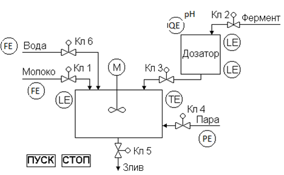

| [<- зміст](README.md)    | [на основну сторінку курсу](../../README.md) |
| ------------------------ | -------------------------------------------- |
| [<- розділи 6-7](6_7.md) |                                              |

# Додаток 1. Стандартна форма завдання

## Д1.1. Схема установки та опис її функціонування

Об’єктом автоматизації є технологічний процес приготування кисломолочного продукту. Продукт готовиться наступним чином. Танк об’ємом 2 м3 наповнюється пастеризованим молоком, відкриваючи клапан 1. У наповнений танк подаються дві дози ферменту (клапан 3) з ферментного дозатору (50 л). Фермент в дозатор подається клапаном 2, вимірювання доз проводиться через сигналізатори рівнів. Протягом 3-5 хвилин (задається оператором) виконується перемішування, після чого молоко в танку підігрівається до температури 68-75 оС (задається оператором) при максимальній швидкості підігріву. Після досягнення заданої температури, регулюючи подачу пари протягом 20 хвилин температура підтримується на заданому значенні, після чого клапан 4 закривається. Відкривається клапан 5, і виконується злив молока. 

Після приготування продукту, необхідно промити танк. Для цього передбачений клапан 6 подачі гарячої води. Промивка ємності відбувається протягом 3 хвилин при відкритому клапані 5.

## Д1.2.Вимоги до функцій та задач системи.

Передбачається підключення вимірювальних перетворювачів та виконавчих механізмів з наступними характеристиками сигналів.  

Таблиця Д1.Перелік змінних та вимоги до них  

| Назва параметру            | Діапазон зміни     | Діапазон сигналу   |
| -------------------------- | ------------------ | ------------------ |
| Витрата води               | 0 - 50м3/год       | 4-20 мА            |
| Витрата молока             | 0 - 20м3/год       | 4-20 мА            |
| Рівень в  апараті          | 0 – 12 м           | 4-20 мА            |
| рН ферменту                | 3 – 11од. рН       | 4-20 мА            |
| Тиск пари                  | 0 – 4 бар          | 4-20 мА            |
| Температура в  апараті     | 0-75 0С            | 4-20 мА            |
| Рівень нижній у  дозаторі  | вкл/откл           | Вкл.=24В, Викл=0   |
| Рівень верхній  у дозаторі | вкл/откл           | Вкл.=24В, Викл=0В  |
| Кл1-Кл3, Кл5,  Кл6         | Відкритий/закритий | Відкр=24В, Закр=0В |
| Кл4                        | 0-100%             | 0-20 мА            |

Система на базі ПЛК повинна забезпечити виконання наступних функцій та задач. 

1. Функції фільтрації та масштабування аналогових вхідних сигналів відповідно до таблиці Д1. 
2. Виконання задачі автоматичного приготування продукту, а саме:
   1. Після натискання кнопки “ПУСК” необхідно забезпечити приготування продукту, відповідно до описаної схеми.
   2. Після приготування промити танк. 
   3. Якщо не натиснута кнопка “СТОП”, продовжити роботу, починаючи з п.1., інакше — завершити роботу програми. 
3. Перехід в дистанційний режим управління ВМ на будь якому кроці виконання.
4. Роботу контуру регулювання температури в апараті. 
5. Можливість зміни оператором всіх необхідних заданих параметрів та коефіцієнтів налаштування регуляторів.  

## Д1.3.Вимоги до видів забезпечень.

Систему розробити на базі ПЛК М340 (Schneider Electric). Стабілізацію температури в апараті необхідно проводити по одному з законів: ПІ чи ПІД. 