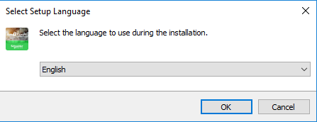
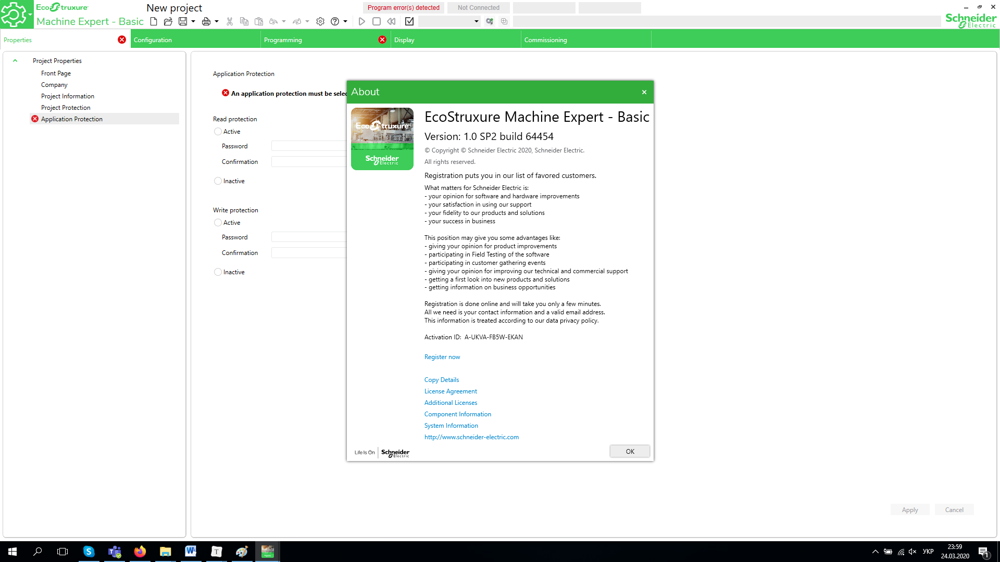
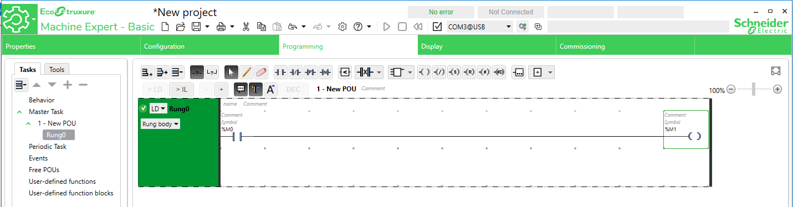
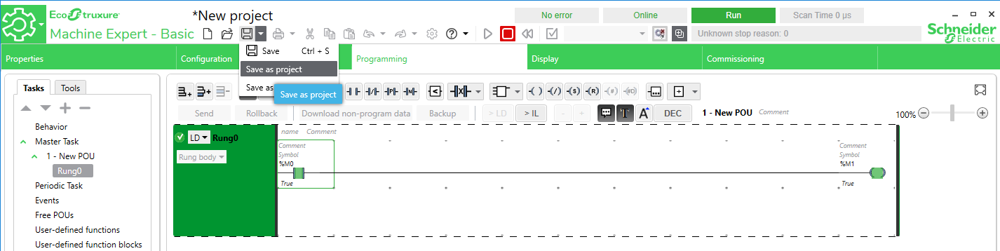

# **ЛАБОРАТОРНА РОБОТА 0

## **Встановлення EcoStruxure Machine Expert - Basic

**Мета:** встановлення програмного середовища та перше знайомство з ним.

### **Лабораторна установка**

**Програмне забезпечення.** EcoStruxure Machine Expert - Basic

**Завдання для виконання роботи.** Необхідно скачати та встановити EcoStruxure Machine Expert - Basic.

### **Порядок виконання роботи**

1. Перейдіть по посиланню та скачайте EcoStruxure Machine Expert - Basic https://www.se.com/ww/en/download/document/Machine_Expert_Basic/.

2. Запустіть програму на встановлення, виберіть мову як показано на рисунку.

   

3. Залишайте параметри по замовченню, ознайомлюйтесь та підтверджуйте ліцензійні угоди.

4. Заповніть всі поля Customer information.

5. Після закінчення інсталяції програма запуститься автоматично. В активній вкладці Application Protection оберіть Inactive для  Read та Write protection і натисніть Apply.

   

6. Створити програму у вкладці Programming, як показано на рисунку , використавши інструменти програмування.

   

   

7. Підключіться до стимулятора ПЛК. Для цього необхідно перейти до вкладки Commissioning --\> Launch simulator. Завантажити проект на виконання і запустити контролер використавши команду RUN. 

   

8. У вкладці Programming натисніть на контакт %M0 та переведіть його в "1". Перевірте щоб при цьому котушка %M1 міняла значення на "1". Зробіть скріншот цього кроку.

9. Збережіть проект під унікальним ім''ям (Save as project)  і закрийте програму.

   

10. Запустіть заново EcoStruxure Machine Expert - Basic і відкрийте ваш проект за допомогою Open Project.

    

    

