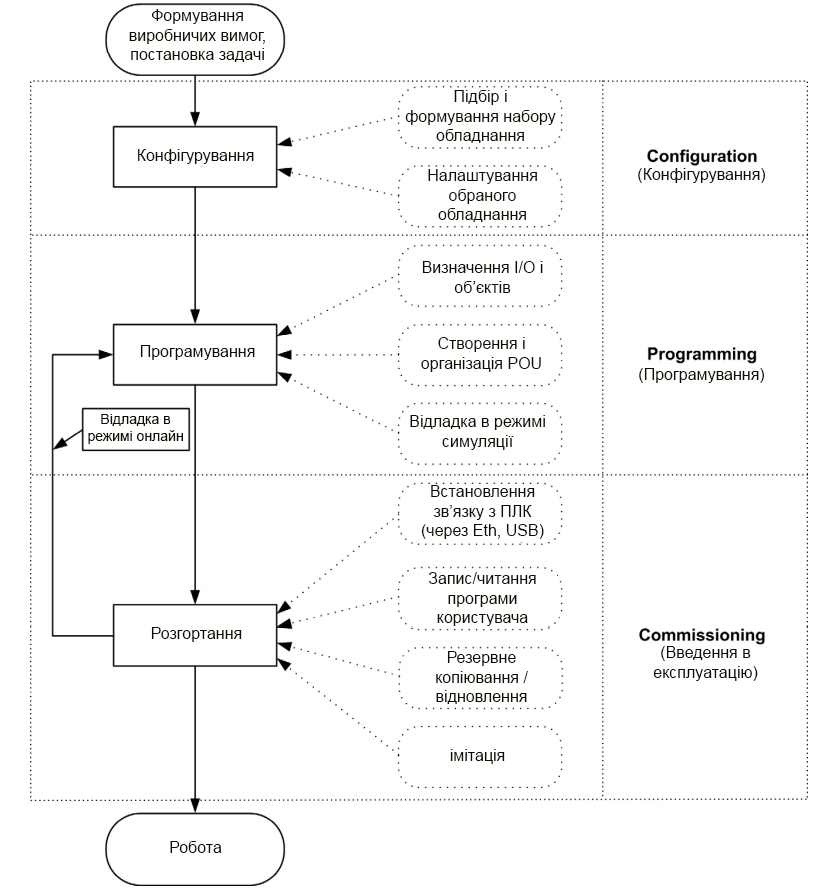

# **ЛАБОРАТОРНА РОБОТА 1**

## **Конфігурування ПЛК Modicon M221**. **Робота зі змінними I/O. Основи програмування**

**Мета:** ознайомлення із середовищем Somachine basic, принципами конфігурування ПЛК Modicon M221, робота із зовнішніми змінними, основи програмування.

### **Лабораторна установка**

**Програмне забезпечення.** Somachine basic V\>=1.5

**Завдання для виконання роботи.** Необхідно створити конфігурацію ПЛК Modicon M221 відповідно до варіанту, створити програму користувача.

### **Порядок виконання роботи**

1.  Ознайомитись з наявними на робочому місці Modicon M221.

2.  Запустити на виконання Somachine basic. Створити новий проект.

3.  Створити конфігурацію ПЛК та його модулів, відповідно до рис.1.1 та таблиці 1.1 (користуйтесь додатком 1.1). Для кожного конфігураційного вікна зробити скріншоти (копії екранів). За необхідності скорегуйте конфігурацію ПЛК.

4.  Зберегти проект.

5.  Створити новий проект. В якості базового модуля використати TM221CE24R, модулі розширення не додавати.

6.  Створити програму, як показано на рис. 1.2. Для цього необхідно перейти до вкладки Program, створити програму, використавши інструменти програмування.

7.  Створити нову Animation Table, внести до неї змінні %M0 та %Q0.1.

8.  Підключіться до стимулятора ПЛК. Для цього необхідно перейти до вкладки Commissioning --\> Launch simulator. Завантажити проект, на виконання і запустити контролер використавши команду RUN. Змінити значення %M0 в 1 і подивитися на стан змінної %Q0.1. Знайдіть на індикаторах ПЛК, який канал змінився.

9.  Отримайте від викладача індивідуальне завдання, виберіть та сконфігуруйте ПЛК відповідно до задачі.

Рис. 1.1. Конфігурація Modicon M221.

*Табл. 1.1. Конфігурування окремих модулів.*

| Адр.  мод | Адреса  аналу | Назва властивості | Значення | Коментар |
| :-------: | :-----------: | :---------------: | :------: | :------: |
|     1     |       2       |         3         |    4     |    5     |
|     0     |                 **TM221CE16R**                          ||||
|           | %I0.1 | Run/Stop | **+** | Обробка Вкл/Викл ПЛК |
|           | %I0.2 | Filtering | No Filter | Не  фільтрувати сигнал |
|           |               | Event | Falling edge | Обробка подій по  задньому фронту |
|           |               | Priority | 2 | Пріоритет |
|           | %I0.4 | Filtering | 12 ms | Зміна часу  фільтрації |
|           | %Q0.1 | Status Alarm | + | Сигналізація  статусу |
|           | %Q0.2 | Fallback value | 1 | Зміна нормального  стану сигналу |
| 1 | **TM3DI16K** |                   |          |          |
|           | %I.1.0 | Symbol | PUSK | Присвоєння каналу  символьного імені |
| 2 | **TM3AI4** |  |  |  |
|           | %IW2.0 | Type | 0-10 V | Діапазон  вхідного сигналу |
|           |               | Sampling | 10 ms/Channel | Частота опитування |
|           | %IW2.1 | Type | 4-20 mA | Діапазон вхідного  сигналу |
| 3 | **TM3TM3** |                   |          |          |
|           | %IW3.0 | Type | PT100 | Діапазон  вхідного сигналу |
|           | %IW3.1 | Type | K Thermocouple | Діапазон вхідного  сигналу |
| 4 | **TM3TM3** |                   |          |          |
|           | %IW4.0 | Type | PT1000 | Діапазон вхідного  сигналу |
| | %IW4.1 | Type | J Thermocouple | Діапазон вхідного  сигналу |
| 5 | **TM3TM3** |  |  |  |
| | %IW5.0 | Type | NI100 | Діапазон вхідного  сигналу |
| | %IW5.1 | Type | E Thermocouple | Діапазон вхідного  сигналу |
| 6 | **TM3DQ16R** |  |  |  |
| | Не конфігурувати |  |  |  |
| 7 | **TM3AQ2** |  |  |  |
| | %QW7.0 | Type | 0-10 V | Тип аналогового  вихідного сигналу |
| | %QW7.1 | Type | 4-20 mA | Тип аналогового  вихідного сигналу |
| |  | Minimum | 0 | Мінімум шкали ЦАП |
| |  | Maximum | 10 000 | Максимум шкали  ЦАП |

Рис. 1.2. Програма користувача.

### **Оформлення роботи**

До захисту приносяться всі занотовані результати та скріншоти.

### **Перевірка виконання роботи та питання до захисту**

Викладачем вибірково перевіряється виконання всіх пунктів роботи та занотовані результати. Кожен результат студент повинен пояснити. У випадку виникнення помилок або запитань щодо проведення певного пункту, цей пункт необхідно буде повторити.

Перед захистом роботи необхідно пояснити постановку задачі та кінцеві результати.

1.  Для вирішення яких задач використовується програмне забезпечення Somachine basic?

2.  Які є формати процесорних модулів контролерів Modicon M221?

3.  Які є модулі розширення контролерів Modicon M221?

4.  Що таке дискретні модулі? З якими сигналами вони працюють?

5.  Що таке аналогові модулі? З якими сигналами вони працюють?

6.  До яких типів модулів підключаються аналогові, дискретні датчики?

7.  До яких типів модулів підключаються аналогові, дискретні виконавчі механізми?

8.  Які засоби потрібні щоб підключити термометри опору до аналогового вхідного модуля з вхідним сигналом 0-10В?

9.  Які змінні ПЛК отримують інформацію з вхідних каналів?

10.  Значення яких змінних ПЛК надходить на виходи ПЛК?

11.  Як зберігається значення аналогових входів/виходів в ПЛК?

12.  Як функціонує робочий цикл ПЛК?

13.  Прокоментуйте скріншоти зроблені в п 3.

14.  Які режими роботи ПЛК Ви знаєте? Чим відрізняються ці режими? Чи може програма в ПЛК працювати без комп'ютера з Somachine basic?

#### Додаток 1.1. Каталог апаратного забезпечення Somachine basic**

Каталог апаратного забезпечення Somachine basic складається з таких пунктів:

1. Модулі центральних процесорів (M221 Logic controllers) -- містить перелік модулів центральних процесорів, розділений на 2 групи: Compact та Modular.

2. Модулі розширення (I/O modules) -- містить перелік модулів розширення ПЛК, розділений на 6 груп:

   a.  дискретні модулі розширення(TM3 Digital I/O Modules) -- містить вхідні та вихідні дискретні модулі на 4, 8, 16 та 32 канали.

   b.  аналогові модулі розширення (TM3 Analog /O Modules) -- містить аналогові вхідні, вихідні та змішані аналогові модулі.

   c.  TM2 дискретні модулі розширення(TM2 Digital I/O Modules) -- застарілі модулі розширення TSX Twido, присутні в каталозі для сумісності із застарілим обладнанням.

   d.  TM2 аналогові модулі розширення (TM2 Analog /O Modules) -- містить застарілі модулі розширення TSX Twido, присутні в каталозі для сумісності із застарілим обладнанням.

   e.  Спеціальні модулі (TM3 Expert I/O Modules) -- модулі, що виконують спеціальні функції, наприклад функції безпеки

   f.  Картриджі (M221 Cartridges) -- містить картриджі розширення, які можна розмістити в модулі CPU.

Рис. 1.3. Каталог апаратного забезпечення Somachine basic.

#### **Додаток 1.2. Конфігурування модулів Modicon M221**

Конфігурування модулів TSX Twido відбувається в розділі Configure --\> Configure the hardware.

При конфігуруванні **дискретних вхідних** сигналів можливе налаштування наступних параметрів:

1.  Symbol -- присвоєння символьного імені змінній.

2.  Filtering -- встановлення/зміна часу фільтрації.

3.  Latch -- використання «защіпки», що дозволяє фіксувати короткочасні сигнали, тривалість яких менша за цикл контролера.

4.  Run/Stop -- присвоєння входу функції управління станом контролера.

5.  Event -- прив'язка апаратної події до каналу.

6.  Priority -- пріоритет апаратної події.

При конфігуруванні **дискретних вихідних** сигналів можливе налаштування наступних параметрів:

1.  Symbol -- присвоєння символьного імені змінній.

2.  Status Alarm -- використання виходу у якості аварійного сигналізатора.

3.  Fallback value -- нормальний стан виходу, коли ПЛК у стані STOP.

При конфігуруванні **аналогових вхідних** сигналів можливе налаштування наступних параметрів:

1.  Symbol -- присвоєння символьного імені змінній.

2.  Type -- тип вхідного сигналу.

3.  Scope -- шкала, по якій відбувається масштабування сигналу.

4.  Minimum -- нижня межа шкали.

5.  Maximum -- верхня межа шкали

При конфігуруванні **аналогових вихідних** сигналів можливе налаштування наступних параметрів:

1.  Symbol -- присвоєння символьного імені змінній.

2.  Type -- тип вхідного сигналу.

3.  Scope -- шкала, по якій відбувається масштабування сигналу.

4.  Minimum -- нижня межа шкали.

5.  Maximum -- верхня межа шкали.

6.  Fallback value -- нормальний стан виходу, коли ПЛК у стані STOP.

#### **Додаток 1.3. Операційні режими роботи Modicon M221**

Для завантаження програми користувача в Modicon M221 необхідно провести підключення контролера до PC. Фізично підключення відбувається за допомогою USB порт ПК та mini-USB порт ПЛК. Програмування у середовищі TwidoSuite може відбуватись в двох режимах -- Offline - комп'ютер не під\'єднаний до контролера, Online - комп'ютер під\'єднаний до контролера. Для переходу між режимами необхідно перейти до вкладки Comissioning --\> Login. При підключенні буде запропоновано один із варіантів дій: завантажити програму у Modicon M221 або зчитати наявну у Modicon M221 програму.

Modicon M221 може знаходитись у двох режимах роботи -- RUN або STOP. В режимі RUN відбувається виконання програми користувача, яка знаходиться в пам'яті Twido, в режимі STOP програма не виконується.

Somachine basic також дозволяє проводити відладку без наявного ПЛК, за допомогою вбудованого симулятора. Робота в стимуляторі аналогічна до роботи з реальним ПЛК. Для запуску стимулятора необхідно виконати Comissioning --\> Launch Simulator.