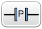
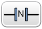
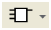
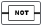

| [<- до лаборної роботи LD](lab2_LD.md)    | [лабораторні](README.md) |
| ----------------------------------------- | ------------------------ |
| [на основну сторінку курсу](../README.md) |                          |

# Графічні елементи LD

Інструкції в LD вставляються шляхом вибору і вставлення графічних елементів з панелі інструментів, що з'являється над робочим простором.  

## Вставлення графічних елементів

Для вставлення графічних елементів на rung: 

| Step | Action                                                       |
| ---- | ------------------------------------------------------------ |
| 1    | Виберіть графічний елемент на панелі для вставки. Якщо графічний елемент представлений через меню, виберіть його з меню. |
| 2    | Перемістіть його в потрібну позицію на rung. Деякі елементи можуть розміщуватися тільки в зоні перевірки, деякі тільки в зоні дій. |
| 3    | Якщо потрібно перейдіть в режим вибору (Selection  mode) для відміни вибору елементу   |

## Rungs 

| Graphic Element       | Name             | Function                                                     |
| --------------------- | ---------------- | ------------------------------------------------------------ |
|  | Створення  rung  | Створення нового порожнього rung нижче останнього в програмі |
|  | Вставлення  rung | Вставлення нового порожнього rung нижче за виділений         |
|  | Видалення rung   | Видалення виділеного rung                                    |

## Режим галуження 

| Graphic Element       | Name             | Function                                                     |
| --------------------- | ---------------- | ------------------------------------------------------------ |
|  | Нормальний режим | Дозволяє розміщувати елементи програмування (наприклад, контакти, котушки тощо), крім функціональних блоків) на тій же  лінії. |
|  | Режим галуження  | Дозволяє розміщувати елементи програмування (наприклад, контакти, котушки тощо), за винятком функціональних блоків у галуженні до виділеної лінії. |

## Вибір та лінії  

| Graphic Element       | Name            |
| --------------------- | --------------- |
|  | Режим вибору    |
|  | Рисування лінії |
|  | Витирання лінії |

## Контакти

| Graphic Element        | Name                                 |
| ---------------------- | ------------------------------------ |
|  | Нормально розімкнутий контакт (НР)   |
|  | Нормально замкнутий контакт (НЗ)     |
|  | Контакт визначення переднього фронту |
|  | Контакт визначення заднього фронту   |

## Блок порівняння (компаратор)

Блоки порівняння розміщуються в тестовій зоні сітки програмування. Блок може з’являтися в будь-якому рядку або стовпці в тестовій зоні до тих пір, поки вся довжина інструкції знаходиться в тестовій зоні.

Графічний елемент для порівняльних блоків займає 2 комірки (1 рядок у висоту на 2 стовпчики в ширину).

| Graphic Element        | Name            | Function                                                     |
| ---------------------- | --------------- | ------------------------------------------------------------ |
|  | Блок порівняння | Використовуйте графічний символ блоку Порівняння, щоб вставити порівняльний вираз у вигялді IL  у LD. Вираз порівняння порівнює 2 операнди; вихід встановлюється в 1, коли результат є істиною, і - в 0, у іншому випадку. |

## Булеві операції

| Graphic Element        | Name             | Operator              |
| ---------------------- | ---------------- | --------------------- |
|  | XOR instructions | XOR, XORN, XORR, XORF |

## Функції

Функціональні блоки завжди з’являються в першому рядку програмної сітки LD; ніякі інструкції LD або лінії не можуть з’являтися над або під функціональним блоком. Тестові інструкції LD (контакти чи компаратори) мають бути з лівого або правого боку функціонального блоку, а інструкції дії - тільки з правого боку.

Графічні елементи функціональних блоків можуть розміщуватися лише в тестовій зоні і вимагати комірок на 2, 3 або 4 рядки і на 2 стовпчики .

| Graphic Element        | Name                                 | Function                                                     |
| ---------------------- | ------------------------------------ | ------------------------------------------------------------ |
|  | Timers, counters, registers, та інші | Кожен з функціональних блоків використовує входи та виходи, що дозволяють посилатися на інші графічні елементи. ПРИМІТКА: Виходи функціональних блоків не можуть бути з'єднані один з одним (вертикальні об'єднання). |

## Котушки (Coils) 

Котушки можуть бути розміщені тільки в зоні дій і займають до однієї комірки (висотою 1 рядок і шириною в одну колнку). 

| Graphic Element        | Name                 |
| ---------------------- | -------------------- |
|  | Пряма котушка        |
|  | Інверсна котушка     |
|  | Котушка встановлення |
|  | Котушка скидання     |

## Інструкції Grafcet (List)  

| Graphic Element        | Name                                                         |
| ---------------------- | ------------------------------------------------------------ |
|  | деактивація плинного кроку та активація (опційно) іншого кроку Grafcet |
|  | деактивація плинного кроку Grafcet та іншого (опціонально)   |

## Операційні блоки  

Операційний блок може бути розміщено в зоні дії і займає 2 колонки на 2 рядки: 

| Graphic Element        | Name             | Operator                    |
| ---------------------- | ---------------- | --------------------------- |
|  | Операційний блок | любі доступні інструкції IL |

## Інші елементи Ladder 

Інші елементи Ladder згруповані в меню . 

Інструкції OPEN та SHORT забезпечують зручний метод для налагодження та усунення несправностей програм Ladder. Ці спеціальні інструкції змінюють логіку rung , закорочуючи або розмикаючи його.

Елементи END/JUMP вставляються в зону дії, займаючи одну клітинку . 

| Graphic Element        | Name                                | Function                                                     |
| ---------------------- | ----------------------------------- | ------------------------------------------------------------ |
|  | Rising edge                         | Evaluates the rising edge of the expression.                 |
|  | Falling edge                        | Evaluates the falling edge of the expression.                |
|  | Logical NOT                         | Passes the inverse value of its operand.                     |
|  | OPEN                                | At the beginning of the rung.  Within a rung: Creates a break in the continuity of a Ladder  rung regardless of the results of the last logical operation. |
|  | SHORT                               | At the beginning of the rung.  Within a rung: Allows the continuity to pass through the rung  regardless of the results of the last logical operation. |
|  | Stop program                        | Defines the end of the program.                              |
|  | Conditional stop program            | Defines a conditional end of the program.                    |
|  | Jump or subroutine call             | Connect to an upstream or downstream labeled rung.  NOTE: When programming in IL,  connection is to an upstream or downstream labeled instruction. |
|  | Conditional jump or subroutine call | Conditional connect to an upstream or downstream labeled  rung.  NOTE: When programming in IL,  connection is to an upstream or downstream labeled instruction. |
|  | Conditional elements                | Conditionally executes a group of statements, depending  on the value of an expression. |
|  | Loop elements                       | Repeats a group of statements.                               |

## Контакти (Contacts) та котушки (Coils) 

При вставки елементу в комірку, відображається додаткова інформація про об'єкт, який буде асоційовано з коміркою: 

| Legend | Item                    | Description                                                  |
| ------ | ----------------------- | ------------------------------------------------------------ |
| 1      | Коментар користувача    | Натисніть для добавлення коментару                           |
| 2      | Символ                  | Натисніть для добавлення ім'я символу з яким асоціюється даний об'єкт |
| 3      | Адреса                  | Натисніть для вказівки адреси з яким асоціюється даний об'єкт |
| 4      | Графічний елемент       | Графічний елемент                                            |
| 5      | Значення реального часу | У режимі онлайн (підключення до ПЛК і програма у виконанні), відображає плинне значення. |