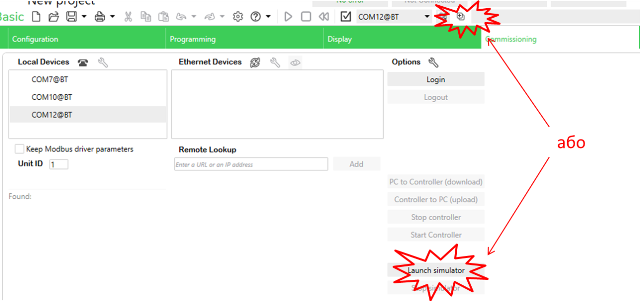
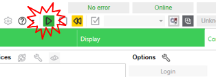

| [<- до лаборних робіт](README.md) | [на основну сторінку курсу](../README.md) |
| --------------------------------- | ----------------------------------------- |
|                                   |                                           |

# Лабораторна робота 3. Робота з функціональними блоками.

## 1. Перевірка роботи таймерів та лічильників.

###### 1.1. Створення та збереження проекту

- Запустіть Machine Expert - Basic
- збережіть проект

###### 1.2. Створення програми з таймером типу TON

- перейдіть на вкладку Programming 
- створіть програму, яка наведена на рисунку 1

рис.1.

###### 1.3. Компіляція програми 

Зробіть компіляцію програми

###### 1.4. Запуск імітатора ПЛК

- Перейдіть на вкладку Commisioning і запустіть імітатор ПЛК  

- запустіть програму в ПЛК на виконання

  

- у вікні, яке з'явиться зробіть підтвердження

###### 1.5. Перевірка програми

Аналогічно до послідовності, описаній у [лабораторній №2](lab2_LD.md), перевірте роботу програми за допомогою імітатора ПЛК та таблиці анімації.

Таблиця 1.1. Послідовність перевірки програми користувача

| Крок | %I0.0  (змінювати) | %Q0.0  (змінюватиметься на) | Примітка                |
| ---- | ----------------------- | -------------------------------- | ----------------------- |
| 1    | 0                       | 0                                | після запуску програми  |
| 2    | 1                       | 0-->1 (через 5 сек.)             | %Q0.0 стає рівною 1     |
| 3    | 0                       | 0                                | %Q0.0 повертається до 0 |

###### 1.6 Перевірка роботи таймерів типу TOF та TP

- Змініть тип таймера у вашій програмі на TOF
- Виконайте перевірку роботи програми, аналогічну п 1.5 .

Таблиця 1.2. Послідовність перевірки програми користувача

| Крок | %I0.0  (змінювати) | %Q0.0  (змінюватиметься на) | Примітка                |
| ---- | ----------------------- | -------------------------------- | ----------------------- |
| 1    | 0                       | 0                                | після запуску програми  |
| 2    | 1                       | 1                                | %Q0.0 стає рівною 1     |
| 3    | 0                       | 1-->0 (через 5 сек.)             | %Q0.0 повертається до 0 |

- Змініть тип таймера у вашій програмі на TP
- Виконайте перевірку роботи програми, аналогічну п 1.5 .

| Крок | %I0.0  (змінювати) | %Q0.0  (змінюватиметься на) | Примітка               |
| ---- | ----------------------- | -------------------------------- | ---------------------- |
| 1    | 0                       | 0                                | після запуску програми |
| 2    | 1                       | 1-->0 (через 5 сек.)             | %Q0.0 стає рівною 1    |
| 3    | 0                       | 0                                |                        |

###### 1.7 Перевірка роботи лічильника

- Створіть програму для перевірки роботи лічильника

  

  Перевірте роботу лічильника за за допомогою імітатора ПЛК або таблиці анімації.

| Крок | %I0.2 (змінювати) | %Q0.1  (змінюватиметься на) | Примітка                                            |
| ---- | ---------------------- | -------------------------------- | --------------------------------------------------- |
| 1    | 0                      | 0                                | після запуску програми                              |
| 2    | 0-->1(5 разів)         | 1                                | %Q0.1 стає рівною 1(лічильник дорахував до уставки) |

- Змініть уставку таймера на 9999, та виконайте нову перевірку

| Крок | %I0.1 (змінювати) | %I0.2 (змінювати) | %Q0.2  (змінюватиметься на) | Примітка                                                     |
| ---- | ---------------------- | ---------------------- | -------------------------------- | ------------------------------------------------------------ |
| 1    | 0                      | 0                      | 0                                | після запуску програми                                       |
| 2    | 0-->1                  | 0                      | 0                                | Плинне значення лічильника стає 9999                         |
| 3    | 0                      | 0-->1                  | 1                                | Плинне значення лічильника стає 0, лічильник сигналізує про переповнення |

- Виконайте ще одну перевірку

| Крок | %I0.0 (змінювати) | %I0.3 (змінювати) | %Q0.0  (змінюватиметься на) | Примітка                                                     |
| ---- | ---------------------- | ---------------------- | -------------------------------- | ------------------------------------------------------------ |
| 1    | 0                      | 0                      | 0                                | після запуску програми                                       |
| 2    | 0-->1                  | 0                      | 0                                | Плинне значення лічильника стає 0                            |
| 3    | 0                      | 0-->1                  | 1                                | Плинне значення лічильника стає 9999, лічильник сигналізує про переповнення |

## 2. Приклад написання програми користувача.

## 3. Створення власної програми користувача.

###### 