| [<- до лаборних робіт](README.md) | [на основну сторінку курсу](../README.md) |
| --------------------------------- | ----------------------------------------- |
|                                   |                                           |

## Лабораторна робота 6. Робота з функціональними блоками.

**Мета:** навчитися створювати програми користувача на мові LD з використанням функціональних блоків.

**Необхідне програмне забезпечення.** EcoStruxure Machine Expert Basic

### Порядок виконання роботи

#### 1. Створення програми з таймером типу TON

- Запустіть Machine Expert Basic
- збережіть проект

- перейдіть на вкладку Programming 
- створіть програму, яка наведена на рисунку 6.1.

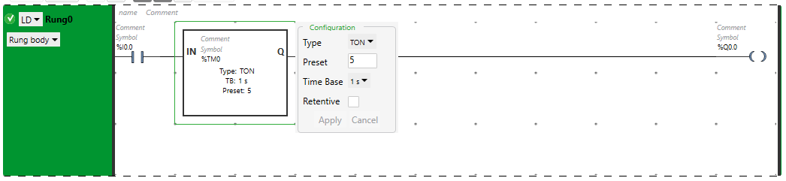

рис.6.1. Налаштування таймеру типу TON

#### 2. Перевірка програми

- Зробіть компіляцію програми

- Перейдіть на вкладку Commisioning і запустіть імітатор ПЛК  

- запустіть програму в ПЛК на виконання

- перевірте роботу програми за допомогою імітатора ПЛК та таблиці анімації.

Таблиця 6.1. Послідовність перевірки програми користувача

| Крок | %I0.0  (змінювати) | %Q0.0  (змінюватиметься на) | Примітка                |
| ---- | ----------------------- | -------------------------------- | ----------------------- |
| 1    | 0                       | 0                                | після запуску програми  |
| 2    | 1                       | 0-->1 (через 5 сек.)             | %Q0.0 стає рівною 1     |
| 3    | 0                       | 0                                | %Q0.0 повертається до 0 |

#### 3. Перевірка роботи таймерів типу TOF та TP

- Змініть тип таймера у вашій програмі на TOF
- Виконайте перевірку роботи програми, аналогічну п.2.

Таблиця 6.2. Послідовність перевірки програми користувача

| Крок | %I0.0  (змінювати) | %Q0.0  (змінюватиметься на) | Примітка                |
| ---- | ----------------------- | -------------------------------- | ----------------------- |
| 1    | 0                       | 0                                | після запуску програми  |
| 2    | 1                       | 1                                | %Q0.0 стає рівною 1     |
| 3    | 0                       | 1-->0 (через 5 сек.)             | %Q0.0 повертається до 0 |

- Змініть тип таймера у вашій програмі на TP
- Виконайте перевірку роботи програми, аналогічну п.2 .

Таблиця 6.3. Послідовність перевірки програми користувача

| Крок | %I0.0  (змінювати) | %Q0.0  (змінюватиметься на) | Примітка               |
| ---- | ----------------------- | -------------------------------- | ---------------------- |
| 1    | 0                       | 0                                | після запуску програми |
| 2    | 1                       | 1-->0 (через 5 сек.)             | %Q0.0 стає рівною 1    |
| 3    | 0                       | 0                                |                        |

#### 4. Перевірка роботи лічильника

- Створіть програму для перевірки роботи лічильника, як це показано на рис.6.2.

  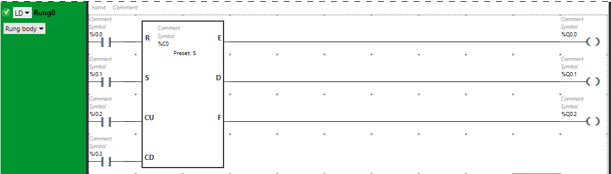

  рис.6.2. Перевірка роботи лічильника.

- Перевірте роботу лічильника за за допомогою анімаційних засобів редактору або таблиці анімації.

Таблиця 6.4. Послідовність перевірки програми користувача

| Крок | %I0.2 (змінювати) | %Q0.1  (змінюватиметься на) | Примітка                                            |
| ---- | ---------------------- | -------------------------------- | --------------------------------------------------- |
| 1    | 0                      | 0                                | після запуску програми                              |
| 2    | 0-->1(5 разів)         | 1                                | %Q0.1 стає рівною 1(лічильник дорахував до уставки) |

- Змініть уставку таймера на 9999, та виконайте нову перевірку

Таблиця 6.5. Послідовність перевірки програми користувача

| Крок | %I0.1 (змінювати) | %I0.2 (змінювати) | %Q0.2  (змінюватиметься на) | Примітка                                                     |
| ---- | ---------------------- | ---------------------- | -------------------------------- | ------------------------------------------------------------ |
| 1    | 0                      | 0                      | 0                                | після запуску програми                                       |
| 2    | 0-->1                  | 0                      | 0                                | Плинне значення лічильника стає 9999                         |
| 3    | 0                      | 0-->1                  | 1                                | Плинне значення лічильника стає 0, лічильник сигналізує про переповнення |

- Виконайте ще одну перевірку відповідно до таблиці 6.6.

Таблиця 6.6. Послідовність перевірки програми користувача

| Крок | %I0.0 (змінювати) | %I0.3 (змінювати) | %Q0.0  (змінюватиметься на) | Примітка                                                     |
| ---- | ---------------------- | ---------------------- | -------------------------------- | ------------------------------------------------------------ |
| 1    | 0                      | 0                      | 0                                | після запуску програми                                       |
| 2    | 0-->1                  | 0                      | 0                                | Плинне значення лічильника стає 0                            |
| 3    | 0                      | 0-->1                  | 1                                | Плинне значення лічильника стає 9999, лічильник сигналізує про переповнення |

#### 5. Завдання для програми користувача з імітацією об'єкта керування.

У даній лабораторній роботі необхідно модифікувати програму користувача, що була зроблена у попередній лабораторній роботі - необхідно добавити умову витримки по часу. Крім того, перевірка завдання проводиться з використанням імітаційної підпрограми. 

- Ознайомтеся з постановкою зміненого завдання для створення програми користувача. Схема технологічної установки, для якої необхідно розробити програму користувача показана на рис.6.3. Опис установки під рисунком, нові умови виділено жирним шрифтом.  

рис.6.3. Спрощена апаратурно-технічна схема установки 

Після натискання кнопки "ПУСК", якщо ємність не порожня, повинен відкритися клапан `LVS3`, і присутня в ємності рідина повинна вивантажитися з неї.  Якщо (коли) ємність буде порожня необхідно закрити клапан `LVS3` і відкрити клапан `LVS1` і почати її наповнювати до спрацювання середнього рівня. Після цього необхідно закрити клапан `LVS1` і відкрити `LVS2` для заповнення ємності до верхнього рівня. Потім клапан `LVS2` треба закрити і відкрити клапан `TV1` повністю. Після досягнення температури 50°С клапан треба залишити відкритим на 50%. **Після досягнення значення 55°С треба витримати рідину в апараті  впродовж 30 секунд. Після завершення витримки необхідно клапан `TV1` треба закрити повністю і вивантажити рідину з апарату.** Якщо не натиснута кнопка "СТОП" - цикл повинен повторюватися.

#### 6. Спрощена імітаційна модель об'єкта

- Ознайомтеся з принципами використання імітаційної моделі об'єкту при тестуванні програми користувача. 

Відповідно до завдання, даний об'єкт має два технологічних параметра, які потребують імітаційного моделювання - рівень в апараті (представлений трьома сигналізаторами рівня) та температура в апараті (представлений аналоговим датчиком температури).

Суть даного імітаційного моделювання полягає у визначенні якісних впливів різних діянь на технологічний об'єкт на дані технологічні параметри. Кількісні впливи при цьому будуть обиратися довільно, основною метою підбору кількісних впливів буде спрощення процесу відлагоджування.

Суть відлагодження програми за допомогою імітаційної моделі зображено на рисунку нижче.

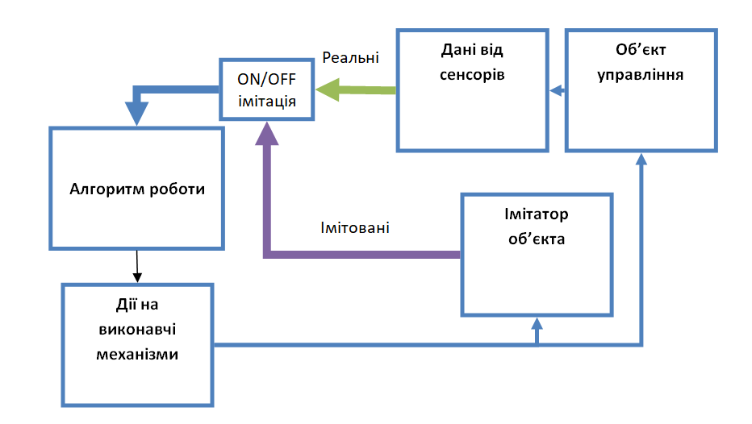

рис.6.4. Функціональна структура програми користувача з імітатором об'єкту

Розглянемо концепцію створення спрощеної імітаційної моделі, вона буде складатися:

- аналіз дій на об'єкт, що впливають на даний параметр (наприклад подача та злив продукту в апарат впливає на рівень, а нагрів - ні).
- аналіз напрямку впливу дій на об'єкт на імітований параметр (наприклад відкритий клапан подачі продукту збільшує рівень, зливу - зменшує).
- вибір величини впливу на імітований параметр (наприклад відкритий клапан зливу буде зменшувати рівень на 1 кожні 100 мс). Даний параметр обирається таким чином, щоб імітація не займала дуже багато чи дуже мало часу.

#### 7. Доповнення методики перевірки.

 Табличний вигляд методики перевірки роботи задачі приготування продукту. 

Таблиця 6.7. Табличний вигляд методики перевірки роботи модифікованої задачі приготування продукту.

| №    | стан/зміна стану  системи   | SB1  | SB2  | LS1  | LS2  | LS3  | TE1   | LVS1 | LVS2 | LVS3 | TV1  | Примітка                    |
| ---- | --------------------------- | ---- | ---- | ---- | ---- | ---- | ----- | ---- | ---- | ---- | ---- | --------------------------- |
| 1    | початковий  (включення ПЛК) | -    | -    | -    | -    | -    | -     | 0    | 0    | 0    | 0    |                             |
| 2    | Предпуск                    | 0    | -    | -    | -    | -    | -     | 0    | 0    | 0    | 0    |                             |
| 3    | Пуск порожнім               | 1    | 0    | 0    | 0    | 0    | -     | 1    | 0    | 0    | 0    |                             |
| 4    | Пуск не порожнім            | 1    | 0    | 1    | 0    | 0    | -     | 0    | 0    | 1    | 0    | Продовжити перевірку з п.14 |
| 5    | Наповн. нижче рівня LS2     | 0    | 0    | 1    | 0    | 0    | -     | 1    | 0    | 0    | 0    |                             |
| 6    | рівень LS2                  |      |      | 1    | 1    | 0    | -     | 0    | 1    | 0    | 0    |                             |
| 7    | Наповн. нижче рівня LS3     | -    | -    | 1    | 1    | 0    | -     | 0    | 1    | 0    | 0    |                             |
| 8    | рівень LS3                  | -    | -    | 1    | 1    | 1    | -     | 0    | 0    | 0    | 100% |                             |
| 9    | Нагрівання 1                | -    | -    | -    | -    | -    | <50°С | 0    | 0    | 0    | 100% |                             |
| 10   | температура 50°С            | -    | -    | -    | -    | -    | 51°С  | 0    | 0    | 0    | 50%  |                             |
| 11   | Нагрівання 2                | -    | -    | -    | -    | -    | <55°С | 0    | 0    | 0    | 50%  |                             |
| 12   | температура 55°С            | -    | -    | -    | -    | -    | 56°С  | 0    | 0    | 0    | 0    |                             |
| 13   | Витримка 30 секунд          | -    | -    | -    | -    | -    | >56°С | 0    | 0    | 0    | 0    |                             |
| 14   | Вивантаження до LS2         | -    | -    | 1    | 1    | 0    | -     | 0    | 0    | 1    | 0    |                             |
| 15   | Вивантаження до LS1         | -    | -    | 1    | 0    | 0    | -     | 0    | 0    | 1    | 0    |                             |
| 16   | Ємність порожня при "СТОП"  | 0    | 1    | 0    | 0    | 0    | -     | 0    | 0    | 0    | 0    | продовжити перевірку з п.2  |
| 17   | Ємність порожня без "СТОП"  | 0    | 0    | 0    | 0    | 0    | -     | 1    | 0    | 0    | 0    | продовжити перевірку з п.5  |

  `-` - вказує незалежність дій від значення вхідних сигналів, бажано перевіряти що стан системи не міняється при зміні цих вхідних сигналів 

#### 8. Створення нових змінних для імітації об'єкта.

Таблиця 6.8. Перелік додаткових змінних.

- створіть змінні та символьні назви для змінних стану з таблиці.

| Опис                                     | Змінна | Символьна назва | Примітка |
| ---------------------------------------- | ------ | --------------- | -------- |
| Включення відладки по імітаційній моделі | %M10   | SIM             |          |
| Імітація спрацювання сигналізатора LS1   | %M11   | LS_LO_SIM       |          |
| Імітація спрацювання сигналізатора LS2   | %M12   | LS_MID_SIM      |          |
| Імітація спрацювання сигналізатора LS3   | %M13   | LS_HI_SIM       |          |
| Імітація роботи датчика TE1              | %M100  | TE_SIM          |          |
| Імітація заповнення апарату рідиною      | %M101  | LE_SIM          |          |

#### 9. Модифікування програми користувача.

- модифікуйте програму користувача [лабораторної роботи №5](lab2_2_LD.md) відповідно до наведених копій екранів Rung

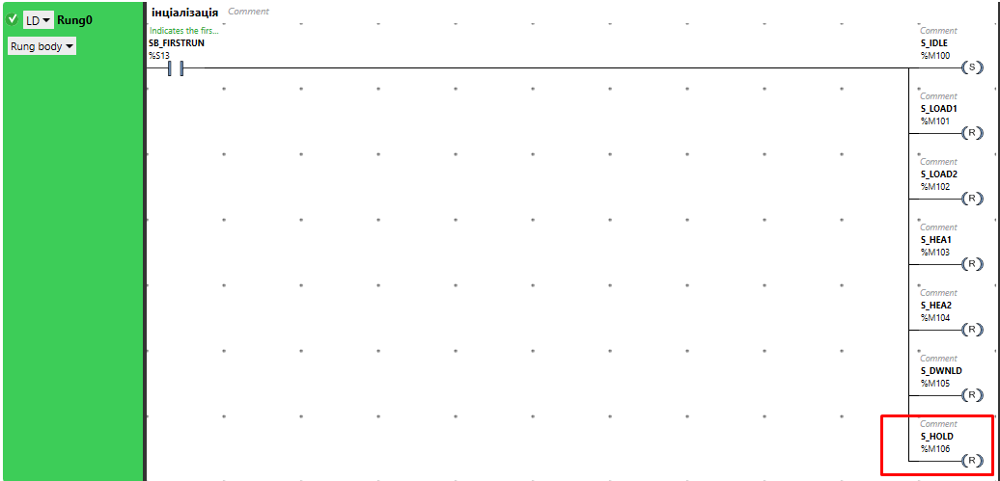

рис.6.5. Модифікація Rung0

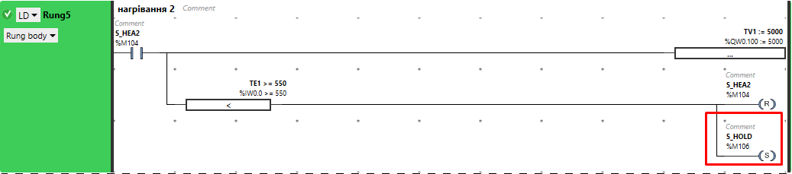

рис.6.6. Модифікація Rung5

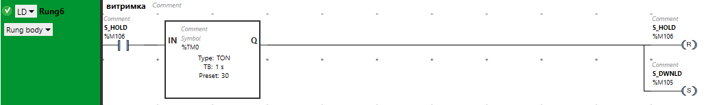

рис.6.7. Модифікація Rung6

#### 10. Перевірка програми користувача з використанням таблиць перевірки.

- Запустіть імітатор ПЛК та запустіть програму користувача на виконання.
- Перевірте роботу програми згідно методики перевірки

#### 11. Доповнення програми користувача імітатором об'єкта керування.

- Модифікуйте програму користувача відповідно до наведених нижче копій екранів

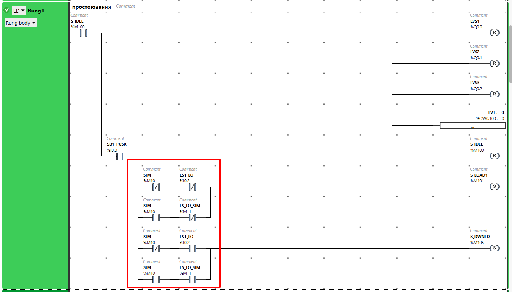

рис.6.8. Змінений Rung1

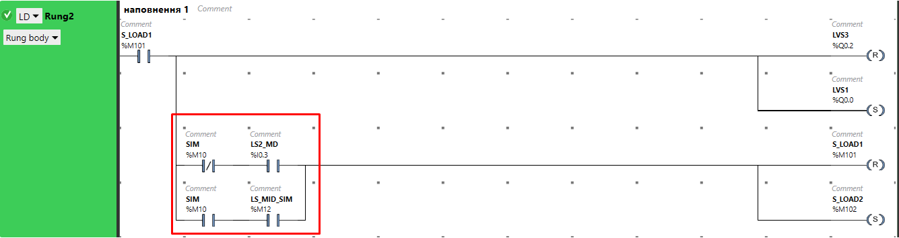

рис.6.9. Змінений Rung2

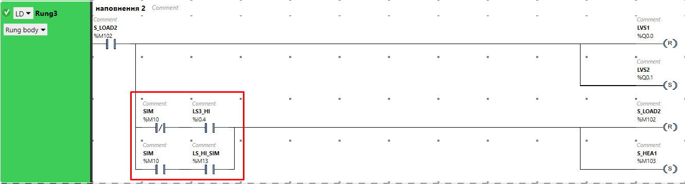

рис.6.10. Змінений Rung3

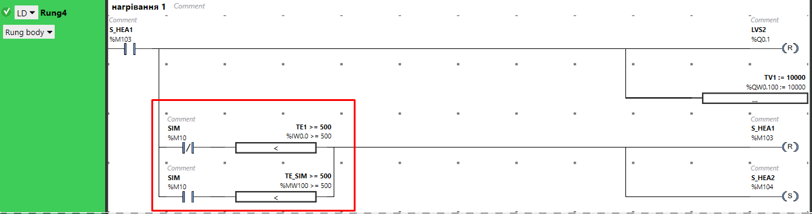

рис.6.11. Змінений Rung4

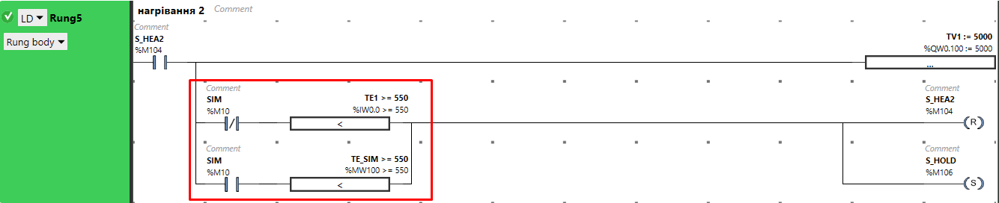

рис.6.12. Змінений Rung5

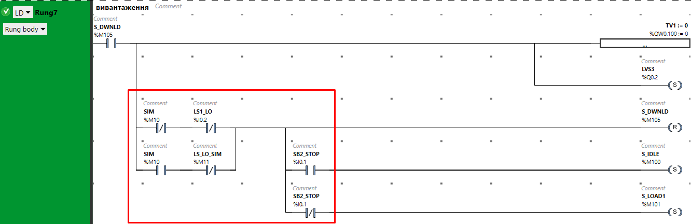

рис.6.13. Змінений Rung7

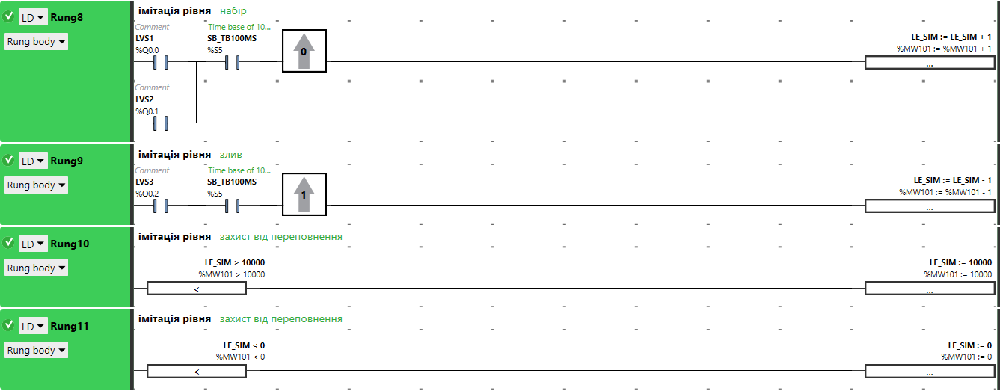

рис.6.14. Добавлені Rung8-11

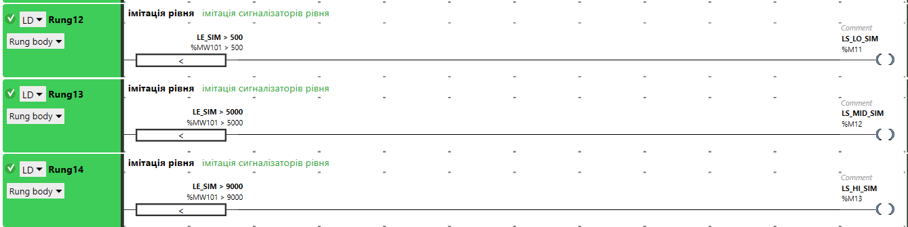

рис.6.15. Добавлені Rung12-Rung14

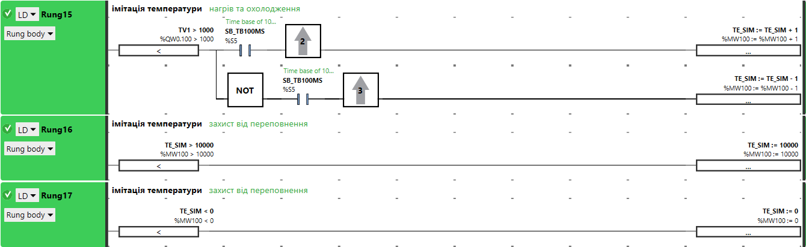

рис.6.16. Добавлені Rung15-Rung17

#### 12. Перевірка програми користувача з використанням імітаційної частини 

- Запустіть імітатор ПЛК та запустіть програму на виконання.

- Перевірте роботу програми згідно наступної методики перевірки:

  - Створіть нову Animation table 

    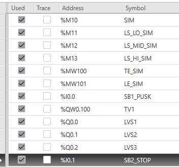

    рис.6.17.

  - Включіть режим відлагодження за допомогою імітаційної моделі (SIM-->1)

  - Змініть змінну "SB1_PUSK" в TRUE 

  - Переконайтесь, що процес наповнення почався

  - Натисніть кнопку "Стоп" в імітаторі ПЛК

  - Дочекайтеся завершення та зупинки процесу, при цьому перевіряйте правильність роботи алгоритму. Зверніть увагу, що імітовані параметри можна також вводити в Animation table вручну, це може прискорити процес відлагодження повільних процесів.
  

#### 13. Зміна власної програми користувача.

- Відкрийте програму користувача для Вашого індивідуального завдання, яке Ви робили на попередінй лабораторній роботі
- Уточніть у викладача щодо змін в завданні (використайте таймерів, лічильників).
- Реалізуйте спрощену імітаційну модель об'єкта
- Модифікуйте програму відповідно до уточненого завдання та підтримки імітації 

- Запустіть програму на виконання та відлагодьте її роботу 

Усі наведені  матеріали разом з програмою користувача будуть звітом для даної роботи.

### Питання до захисту

1. Розкажіть про роботу та налаштування функціонального блоку %TM в режимі TON.
2. Розкажіть про роботу та налаштування функціонального блоку %TM в режимі TOF.
3. Розкажіть про роботу та налаштування функціонального блоку %TM в режимі TP.
4. Розкажіть про роботу та налаштування лычильників.
5. Розкажіть про принципи імітації об'єктів які використані в даній лабораторній роботі.
6. Розкажіть про принципи імітації об'єктів які використані при реалізації програми користувача у Вашому індивідуальному завданні.   

Розробив лабораторну - Дмитро Мацебула [АКТСУ НУХТ](http://www.iasu-nuft.pp.ua)