| [на основну сторінку курсу](../README.md) | [лабораторні](README.md) |
| ----------------------------------------- | ------------------------ |
|                                           | [ЛР4->](lab4_LD.md)      |

## ЛАБОРАТОРНА РОБОТА 3. Конфігурування апаратного забезпечення ПЛК Modicon M221. 

**Мета:** ознайомлення із середовищем EcoStruxure Machine Expert - Basic, принципами конфігурування ПЛК Modicon M221, робота із зовнішніми змінними, основи програмування.

**Програмне забезпечення.** EcoStruxure Machine Expert - Basic

### **Порядок виконання роботи**

#### 1. Встановлення EcoStruxure Machine Expert Basic

**Даний пункт виконується у випадку, якщо ПЗ не встановлене на робочому місці.** 

- Перейдіть по посиланню та завантажте EcoStruxure Machine Expert - Basic https://www.se.com/ua/uk/download/document/Machine_Expert_Basic_V1_2_SP1/.

- Запустіть програму на встановлення, виберіть мову.

рис.3.1. Вибір мови

- Залишайте параметри по замовченню, ознайомлюйтесь та підтверджуйте ліцензійні угоди.

- Заповніть всі поля Customer information.

рис.3.2. Заповнення полів Customer information

- Після закінчення інсталяції програма запуститься автоматично. В активній вкладці Application Protection оберіть Inactive для Read та Write protection і натисніть Apply.

рис.3.3.Завершення встановлення

#### 2. Перший запуск

- Створіть програму у вкладці Programming, використавши інструменти програмування (рис.3.4).

рис.3.4.Створення першої програми користувача

- Підключіться до імітатора ПЛК. Для цього необхідно перейти до вкладки `Commissioning --> Launch simulator`. 
- Завантажте проект на виконання і запустіть контролер використавши команду `RUN`. 

рис.3.5.Запуск імітатора

- У вкладці `Programming` натисніть на контакт `%M0` та переведіть його в `1`. Перевірте щоб при цьому котушка %M1 міняла значення на "1". 

рис.3.6.Зміна значення змінної

- Збережіть проект під унікальним ім'ям (`Save as project`)  і закрийте програму.

рис.3.7.Збереження проекту

- Запустіть заново EcoStruxure Machine Expert - Basic і відкрийте ваш проект за допомогою Open Project.

рис.3.8.Відкривання проекту

#### 3. Ознайомлення із принципами розробки ПЗ

- Ознайомтеся з принципами розробки проекту в EcoStruxure Machine Expert Basic, які наведені нижче 

На наступній діаграмі показані типові етапи розробки проекту на EcoStruxure Machine Expert - Basic (вкладки **Configuration**, **Programming** та **Commissioning**):

Рис.3.9  Етапи розробки проекту на EcoStruxure Machine Expert – Basic

#### 4. Ознайомлення із панеллю інструментів

- Ознайомтеся з головною панеллю EcoStruxure Machine Expert Basic: (рис. 3.10):

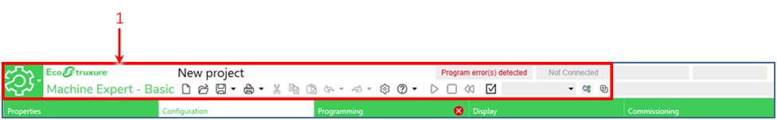

Рис.3.10 Панель інструментів EcoStruxure Machine Expert – Basic

Панель інструментів знаходиться у верхній частині вікна EcoStruxure Machine Expert – Basic, і надає доступ до часто використовуваних функцій.

На панелі інструментів розміщено такі кнопки:

Таблиця 3.1. Кнопки на панелі інструментів.

| **Значок**                    | **Опис**                                                     |
| ----------------------------- | ------------------------------------------------------------ |
|  | Відкрити меню "Start".                                       |
|  | Створити новий проект (CTRL + N)                             |
|  | Відкрити існуючий проект (CTRL + O)                          |
|  | Зберегти поточний проект (CTRL + S). Клацніть  стрілку вниз, щоб відобразити меню з додатковими параметрами збереження. |
|  | Роздрукувати звіт (CTRL + P). Клацніть  стрілку вниз, щоб вибрати звіт для друку або налаштувати вміст та формат  звіту. |
|  | Вирізати (CTRL + X)                                          |
|  | Копіювати (CTRL + C)                                         |
|  | Вставити (CTRL + V)                                          |
|  | Скасувати (CTRL + Z). Клацніть один раз, щоб  скасувати останню дію в редакторі програми. Клацніть стрілку вниз та виберіть  дію зі списку, щоб скасувати всі дії до та включення вибраної дії. Можна  скасувати до 10 дій. |
|  | Повторити (CTRL + Y). Клацніть один раз, щоб  скасувати останню дію «Скасувати». Клацніть стрілку вниз та виберіть дію зі  списку, щоб повторити всі дії до вибраної дії. Можна повторити до 10 дій. |
|  | Відкрити вікно «Налаштування системи».                       |
|  | Довідка. Клацніть стрілку вниз та виберіть  дію зі списку. Показувати онлайн-довідку чи контекстну довідку, примітки,  навчальні посібники та документи електронного навчання, звернутись у технічну  підтримку Schneider Electric. |
|  | Перевести ПЛК в режим **«RUNING»** (CTRL + M). Доступний лише в онлайн-режимі і тоді, коли контролер ще  не знаходиться у режимі **«****RUNING»**. |
|  | Перевести ПЛК в режим **«STOP»** (CTRL + L). Доступний лише в онлайн-режимі та коли контролер  знаходиться у режимі **«RUNING»**. |
|  | Ініціалізувати ПЛК. Доступно лише в  онлайн-режимі.          |
|  | Компілювати програму                                         |
|  | Підключитися (CTRL + G) або відключитися  (CTRL + H) від вибраного контролера.  ПРИМІТКА: Ім'я вибраного контролера  з'являється зліва від цієї кнопки |
|  | Запустити (CTRL + B) або зупинити (CTRL + W)  **симулятор** EcoStruxure Machine Expert – Basic |

Область стану у верхній частині головного вікна відображає інформацію про поточний стан системи (рис. 3.11):

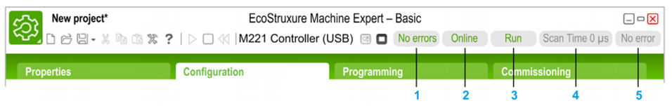

Рис.3.11 Область стану EcoStruxure Machine Expert – Basic

1. **Стан програми**: вказує, чи виявлені в програмі помилки чи ні.
2. **Стан з'єднання**: вказує стан з'єднання між EcoStruxure Machine Expert - Basic та контролером, або імітатором контролера.
3. **Стан контролера**: вказує поточний стан логічного контролера (RUNNING, STOPPED, HALTED та ін.).
4. **Час сканування**: Показує останній час сканування.
5. **Помилка контролера, що була виявлена останньою**: Показує останню виявлену помилку. Інформація витягується із системних бітів та системних слів, якщо контролер знаходиться в стані STOPPED або HALTED.

#### 5. Властивість проекту

- Створіть новий проект.
- Ознайомтеся з вкладкою `Properties`

Вкладка 'Properties' дозволяє вказувати інформацію про проект та захищати його паролем (рис.3.12):

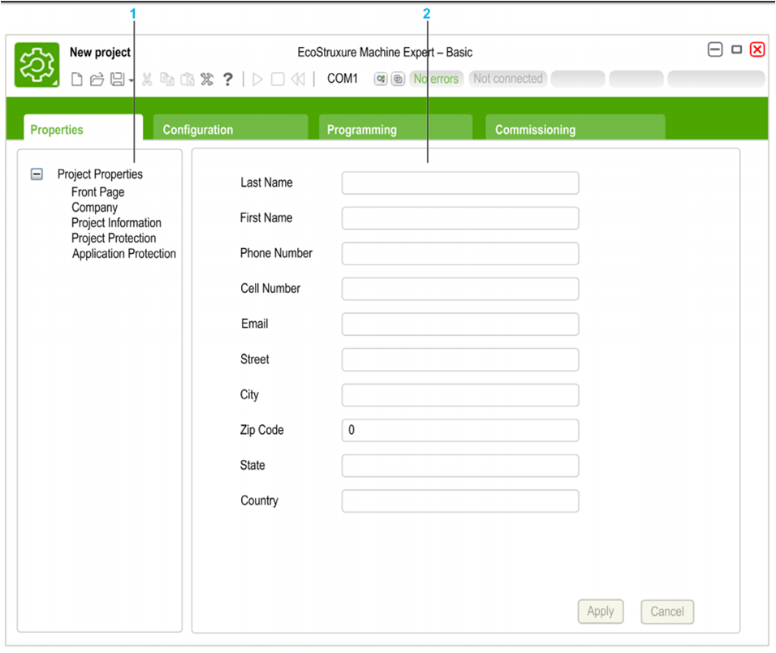

Рис.3.12 Вікно властивостей проекту EcoStruxure Machine Expert – Basic

Вікно **Properties** використовується для того, щоб задати/отримати детальну інформацію про користувача EcoStruxure Machine Expert - Basic, компанії, яка розробляє додаток, та проект. У цьому вікні також можна захистити паролем файл проекту та програми, коли вони записуються в контролер.

- У вікні **Properties** вкажіть Ваше **прізвище** в поле **Last** **Name** та ім’я у поле **First** **Name**

#### 6. Захист проекту паролем

- Ознайомтеся з принципами захисту проекту паролем.

Файл проекту можна зашифрувати та захистити паролем. Якщо проект зашифрований, буде запропоновано ввести пароль шифрування кожного разу, коли Ви намагаєтесь відкрити проект. Якщо проект захищений від модифікацій, то його можна лише переглянути. Щоб змінити проект, необхідно ввести пароль.

Для того, щоб зашифрувати та захистити паролем файл проекту необхідно виконати такі дії:

Таблиця 3.2. Дії для захисту проекту паролем.

| **Крок** | **Дія**                                                      |
| -------- | ------------------------------------------------------------ |
| 1.       | Відкрийте вкладку **Properties** та натисніть **Project  Properties → Project Protection**. |
| 2.       | Виберіть опцію **Active**. Обов’язкові поля для введення інформації позначаються  зірочкою (*). |
| 3.       | Введіть  пароль і введіть його знову у якості підтвердження для шифрування проекту |
| 4.       | Опціонально можна ввести пароль та його  підтвердження для захисту проекту від модифікацій. |
| 5.       | Натисніть **Apply**.                                         |

Для відключення захисту проекту паролем необхідно виконати такі дії:

Таблиця 3.3. Дії для відключення паролю.

| **Крок** | **Дія**                                                      |
| -------- | ------------------------------------------------------------ |
| 1.       | Відкрийте вкладку **Properties** та натисніть **Project  Properties → Project Protection**. |
| 2.       | Виберіть опцію **Inactive**                                  |
| 3.       | Натисніть **Apply.**   **ПРИМІТКА**. Якщо з'явиться запит на пароль модифікації, необхідно ввести пароль  для модифікації проекту та натиснути **Apply**. |

#### 7. Вікно конфігурації

- Відкрийте закладку `Configuration`, познайомтесь з його можливостями.

Вікно **Configuration** (рис. 3.13) використовується для створення конфігурації обладнання контролера та модулів розширення, на базі яких буде розробляться програма.

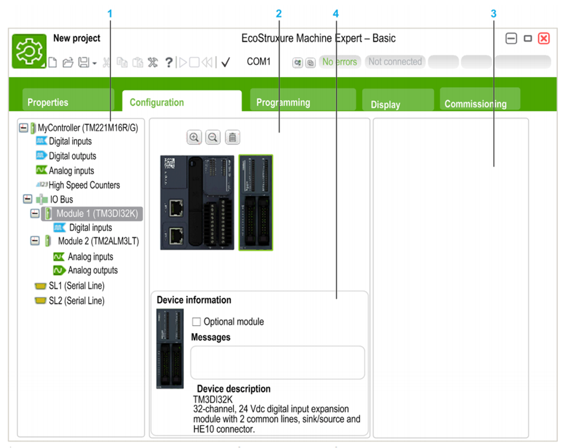

Рис. 3.13 Загальний вигляд вікна `Configuration`

1 **Дерево обладнання** - структурований вигляд конфігурації обладнання.

2 **Конфігурація** – графічне представлення контролера і модулів розширення.

3 **Каталог обладнання** в ньому міститься перелік різноманітних модифікацій контролера та підтримуваних модулів розширення. Для того щоб додати компонент до конфігурації обладнання, необхідно перетягнути його у вікно **конфігурації**.

4 **Властивості компонента**, вибраного в **конфігурації**, або властивості вибраного елемента в **дереві обладнання**.

#### 8. Кроки створення конфігурації

- Ознайомтеся з принципами створення конфгурації, як наведені нижче.

Для створення конфігурації необхідно виконати такі дії (рис.3.14):

Таблиця 3.4. Дії для створення конфігурації.

| **Крок** | **Дія**                                                      |
| -------- | ------------------------------------------------------------ |
| 1.       | Відкрийте вкладку **Configuration**.                         |
| 2.       | Розкрити категорію контролера в області  каталогу обладнання праворуч, якщо вона ще не відображається. |
| 3.       | Виберіть модифікацію контролера **TM221CE16R**.  Короткий опис фізичних властивостей контролера з'являється в області опису  пристрою. |
| 4.       | Перетягніть назву контролера на зображення вже  існуючого контролера в центральній області вікна та вдпустіть його. |
| 5.       | Натисніть кнопку **Yes**, коли з'явиться запит на підтвердження заміни контролера. |

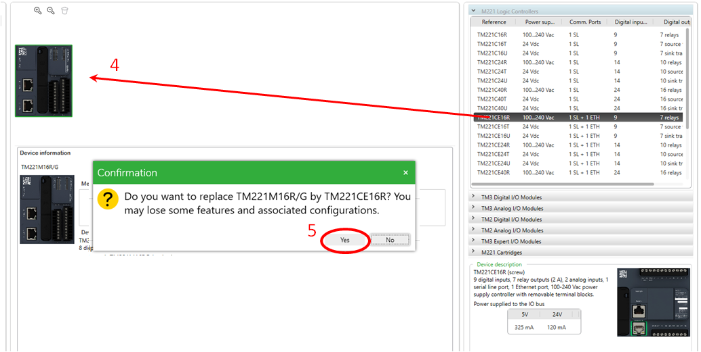

Рис.3.14 Створення конфігурації контролера

Модулі розширення додаються з каталогу аналогічно до конфігурування контролера, шляхом перетягування конкретного модуля з каталогу в центральну робочу область (рис. 3.15).

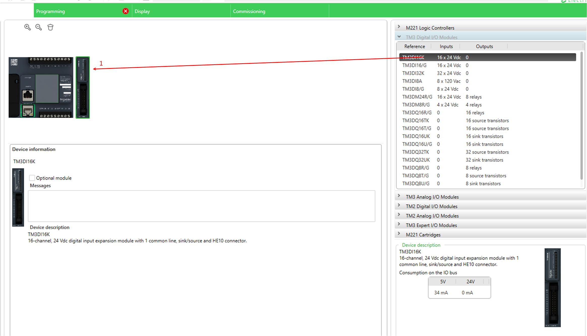

Рис.3.15 Додавання модулів розширення

Більш детально про каталог обладнання можна дізнатися у **додатку 1.**

Для налаштування обраного модуля розширення, а також для конфігурування обраного процесорного модуля контролера необхідно активувати властивість модуля/контролера у **дереві обладнання** (рис. 3.16).

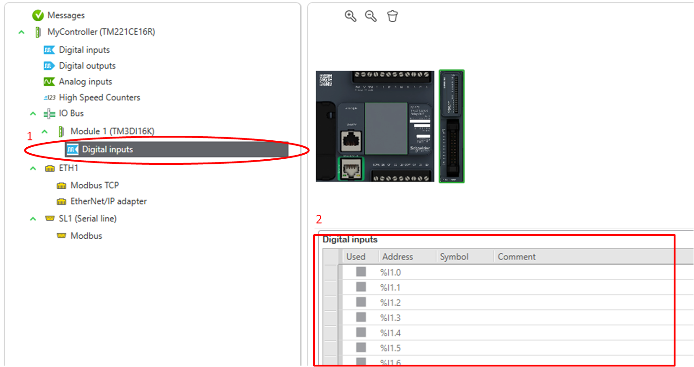

Рис. 3.16 Проведення налаштування створеної конфігурації 

Більш детально про властивості різних модулів розширення можна дізнатись у **додатку 2.**

#### 9. Створення конфігурації

- Створіть конфігурацію ПЛК та його модулів, відповідно до **рис.3.17** та **таблиці 3.5** Для кожного конфігураційного вікна зробити скріншоти (копії екранів). За необхідності скорегуйте конфігурацію ПЛК.

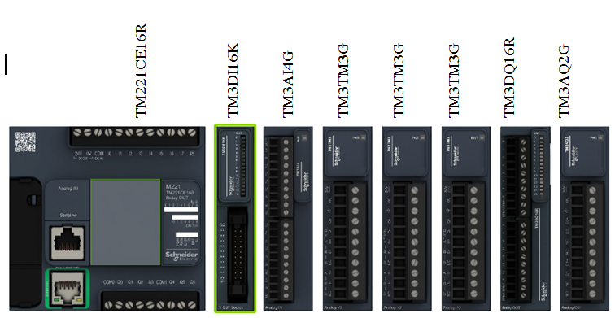

Рис. 3.17 Конфігурація Modicon M221.

Таблиця 3.5. Конфігурування окремих модулів.

| Адр.  мод | Адреса  аналу | Назва властивості | Значення | Коментар |
| :-------: | :-----------: | :---------------: | :------: | :------: |
|     1     |       2       |         3         |    4     |    5     |
|     0     |                 **TM221CE16R**                          ||||
|           | %I0.1 | Run/Stop | **+** | Обробка Вкл/Викл ПЛК |
|           | %I0.2 | Filtering | No Filter | Не  фільтрувати сигнал |
|           |               | Event | Falling edge | Обробка подій по  задньому фронту |
|           |               | Priority | 2 | Пріоритет |
|           | %I0.4 | Filtering | 12 ms | Зміна часу  фільтрації |
|           | %Q0.1 | Status Alarm | + | Сигналізація  статусу |
|           | %Q0.2 | Fallback value | 1 | Зміна нормального  стану сигналу |
| 1 | **TM3DI16K** |                   |          |          |
|           | %I.1.0 | Symbol | PUSK | Присвоєння каналу  символьного імені |
| 2 | **TM3AI4** |  |  |  |
|           | %IW2.0 | Type | 0-10 V | Діапазон  вхідного сигналу |
|           |               | Sampling | 10 ms/Channel | Частота опитування |
|           | %IW2.1 | Type | 4-20 mA | Діапазон вхідного  сигналу |
| 3 | **TM3TM3** |                   |          |          |
|           | %IW3.0 | Type | PT100 | Діапазон  вхідного сигналу |
|           | %IW3.1 | Type | K Thermocouple | Діапазон вхідного  сигналу |
| 4 | **TM3TM3** |                   |          |          |
|           | %IW4.0 | Type | PT1000 | Діапазон вхідного  сигналу |
| | %IW4.1 | Type | J Thermocouple | Діапазон вхідного  сигналу |
| 5 | **TM3TM3** |  |  |  |
| | %IW5.0 | Type | NI100 | Діапазон вхідного  сигналу |
| | %IW5.1 | Type | E Thermocouple | Діапазон вхідного  сигналу |
| 6 | **TM3DQ16R** |  |  |  |
| | Не конфігурувати |  |  |  |
| 7 | **TM3AQ2** |  |  |  |
| | %QW7.0 | Type | 0-10 V | Тип аналогового  вихідного сигналу |
| | %QW7.1 | Type | 4-20 mA | Тип аналогового  вихідного сигналу |
| |  | Minimum | 0 | Мінімум шкали ЦАП |
| |  | Maximum | 10 000 | Максимум шкали  ЦАП |

Наприклад, відповідно до поставленого завдання налаштування модулю **TM221CE16R** (процесорний модуль) буде виглядати наступним чином (рис.3.18-3.19):

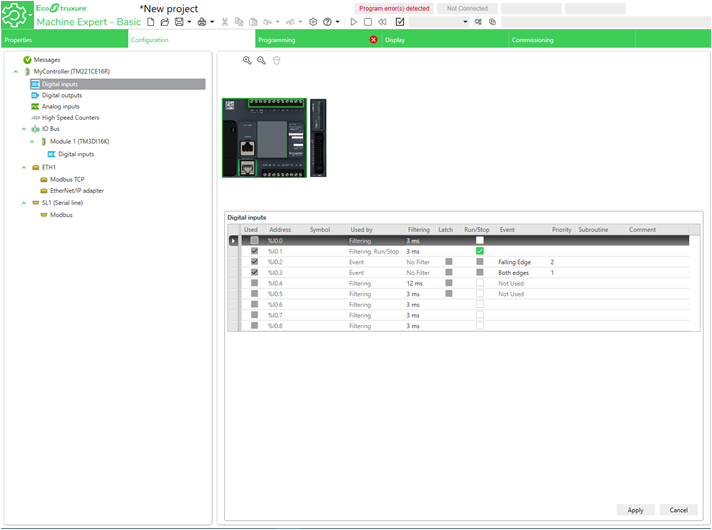

Рис. 3.18 Налаштування дискретних входів процесорного модуля

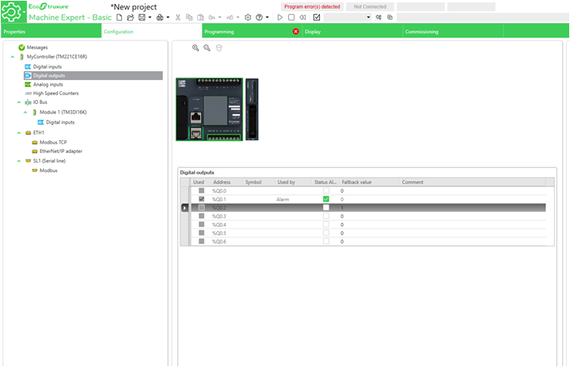

Рис. 3.19 Налаштування дискретних виходів процесорного модуля

- Аналогічно до процесорного модуля виконайте налаштування всіх модулів розширення відповідно до завдання. Зробіть скріншоти (копії екранів).

- Збережіть проект

#### 10. Огляд робочої області програмування

- Створіть новий проект. 

- В якості базового модуля використайте **TM221CE24R**, модулі розширення не додавайте.

- Проаналізуйте зміст вкладки `Programming` 

Вкладка **Programming** розділена на 3 основні області (рис. 3.20):

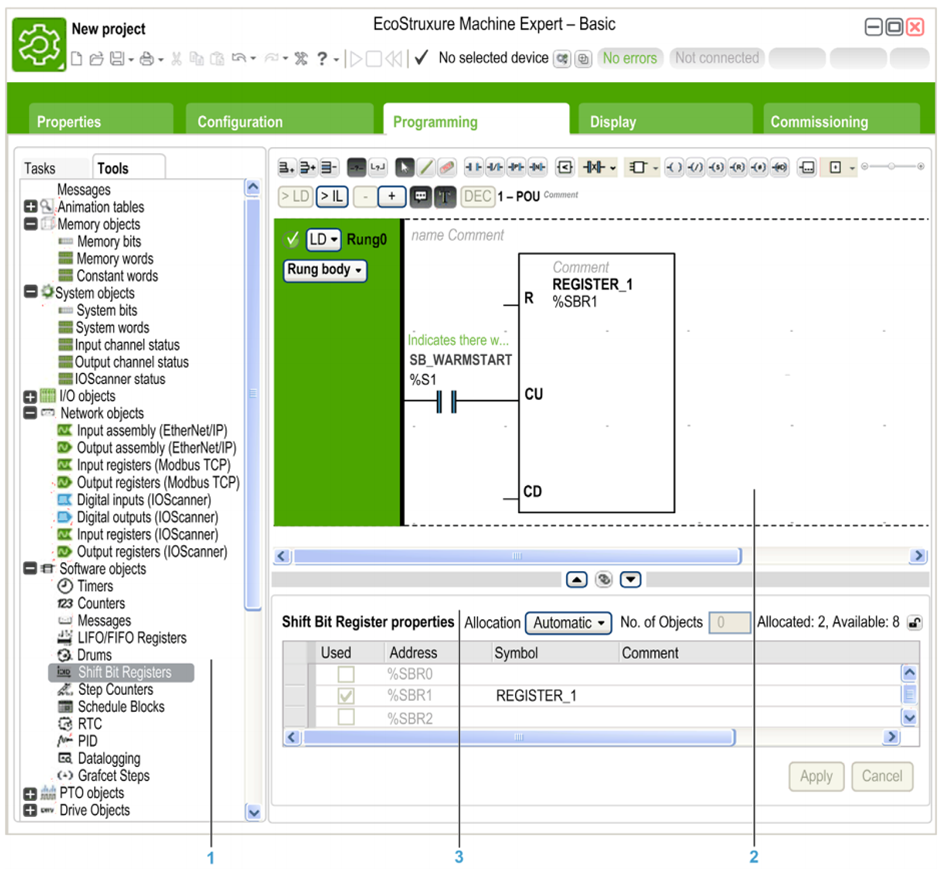

Рис. 3.20 Загальний вигляд вікна **Programming**

1. **Дерево програмування** дозволяє вибрати властивості програми та її об'єкти та функції, а також ряд інструментів, які можна використовувати для моніторингу та відлагодження програми.
2. Верхня центральна область - це робоча область програмування, куди ви вводите вихідний код програми.

3. Нижня центральна область дозволяє переглядати та налаштовувати властивості елемента, вибраного в **робочій області програмування** або в **Дереві програмування**.

#### 11. Створення програм користувача

- Перейдіть до вкладки **Programming**, створіть програму, використавши такі інструменти мови програмування **LD** як **Contact** та **Coil**, знайти які можна на панелі інструментів (рис. 3.21).

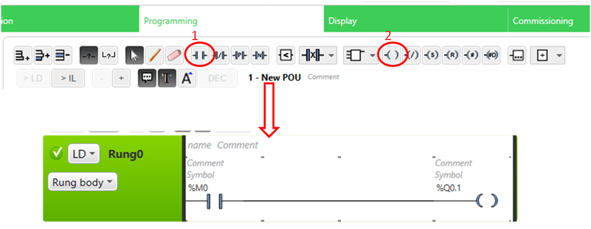

Рис. 3.21 Створення програми

- Для елемента Contact в поле **Address** вкажіть адресу **%M10**, а для елемента Coil в поле **Address** вкажіть адресу **%Q0.1**

#### 12. Кроки завантаження проекту в ПЛК

- Ознайомтеся з кроками, які необхідно для завантаження проекту в ПЛК 

Для завантаження розробленої програми користувача в Modicon M221 необхідно провести підключення до PC контролера. Фізично підключення відбувається за допомогою USB порта ПК та mini-USB порту ПЛК. Можливі також інші варіанти підключення - через послідовний порт або Ethernet. 

Програмування у середовищі EcoStruxure Machine Expert – Basic може відбуватись в двох режимах – Offline - комп’ютер не під’єднаний до контролера, Online - комп’ютер під'єднаний до контролера. Для переходу між режимами необхідно перейти до вкладки **Comissioning**. При підключенні буде запропоновано один із варіантів дій: завантажити програму у Modicon M221 або зчитати наявну у Modicon M221 програму. 

#### 13. Кроки завантаження проекту в імітатор ПЛК

- Ознайомтеся з кроками, які необхідно для завантаження проекту в імітатор ПЛК

EcoStruxure Machine Expert – Basic також дозволяє проводити відлагодження **без наявного ПЛК**, за допомогою вбудованого **імітатора (симулятора)**. Робота в імітаторі аналогічна до роботи з реальним ПЛК. Для запуску імітатора необхідно виконати **Comissioning –> Launch Simulator** (рис. 3.22)**.**

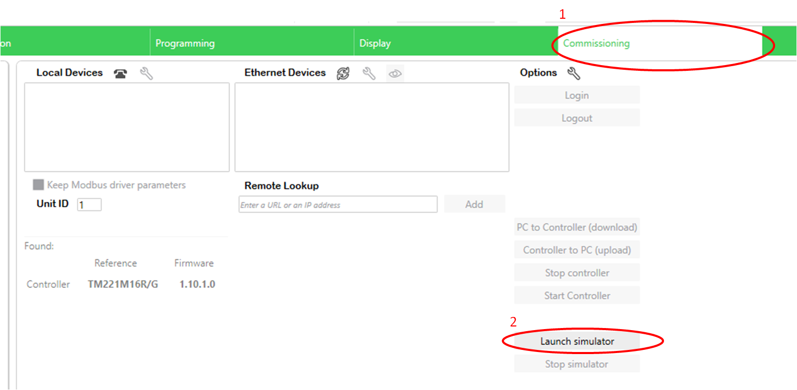

Рис. 3.22 Запуск імітатора ПЛК

За роботою імітатора ПЛК можна спостерігати у окремому вікні (рис. 3.23):

Рис. 3.23 Зовнішній вигляд вікна імітатора ПЛК

#### 14. Режими роботи ПЛК

- Ознайомтеся з режимами роботи ПЛК

Modicon M221 може знаходитись у двох режимах роботи – **RUN** або **STOP**. В режимі **RUN** відбувається виконання програми користувача, яка знаходиться в пам’яті контролера, в режимі **STOP** програма не виконується. Для переходу між режимами роботи необхідно скористатись відповідними кнопками (рис. 3.24):

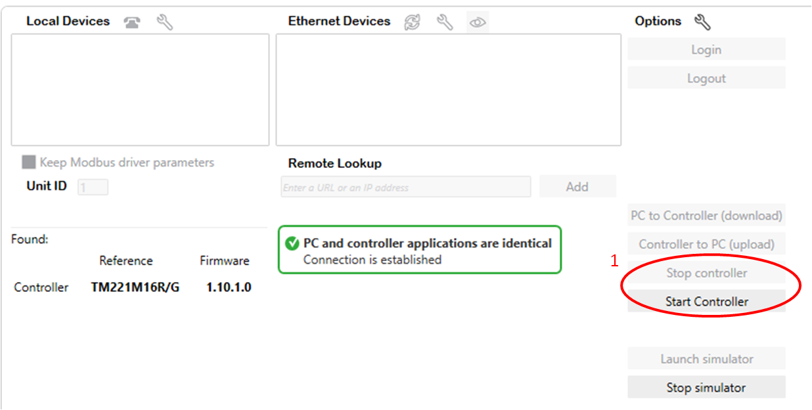

Рис. 3.24 Зміна режимів RUN/STOP контролера

- Переведіть контролер в режим **RUN** натиснувши кнопку **Start** **Controller**

#### 15. Налагодження з використанням таблиці анімацій

- Ознайомтеся з принципами використання `Animation tables`.  

**Таблиці анімацій (Animation tables)**  використовуються для виведення значень змінних для перегляду та зміни. Вони є складовою програми EcoStruxure Machine Expert - Basic, і завантажуються в контролер як частина **непрограмних** даних разом з програмою. 

Створення анімаційної таблиці показано на рис. 3.25-3.26.

Таблиця 3.6. Послідовність створення таблиці анімацій

| **Крок** | **Дія**                                                      |
| -------- | ------------------------------------------------------------ |
| 1.       | У лівій частині вікна **Programming**  виберіть вкладку **Tools**. |
| 2.       | Клацніть правою кнопкою миші на  **Animation  tables** та виберіть **Add new  animation table** з контекстного меню, яке з'явиться.  **Результат**: з’явиться новий елемент таблиці анімацій в області «**Animation tables**» у вкладці «**Tools**», а в нижній центральній області вікна  з’являється вікно властивостей. |

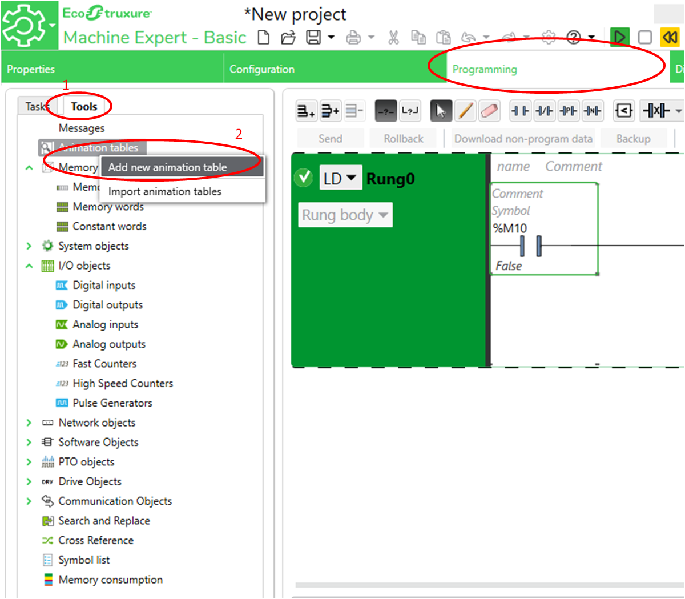

Рис. 3.25 Процедура створення таблиці анімації

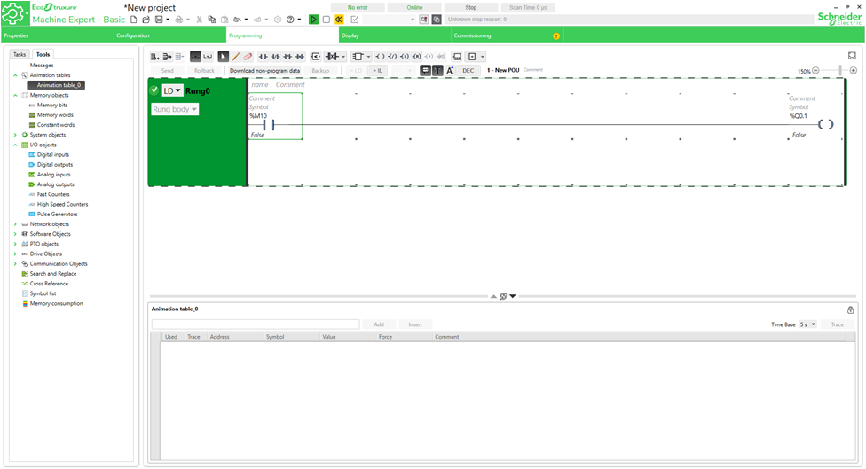

Рис.3.26 Результат створення таблиці анімації

Для можливості перегляду та зміни значень об'єктів, їх необхідно добавити до таблиці анімацій. Додавання окремих об’єктів до анімаційної таблиці показано на рис. 3.27 та таблиці 3.7.

Таблиця 3.7. Послідовність дій для добавлення об'єктів в таблицю анімацій. 

| **Крок** | **Дія**                                                      |
| -------- | ------------------------------------------------------------ |
| 1.       | У лівій частині вікна **Programming**  виберіть вкладку **Tools**. |
| 2.       | Виберіть таблицю анімації, яку потрібно  налаштувати в області «**Animation  tables**» у вкладці«**Tools**»  **Результат**: В нижній центральній області вікна з'явиться вікно властивостей обраної  таблиці |
| 3.       | Щоб додати новий об’єкт у нижній частині  таблиці анімації, введіть ім'я об'єкта в текстове поле та натисніть **Enter** або натисніть кнопку **Add**.  Необхідно додати до таблиці елементи **%M10 та** **%Q0.1** |

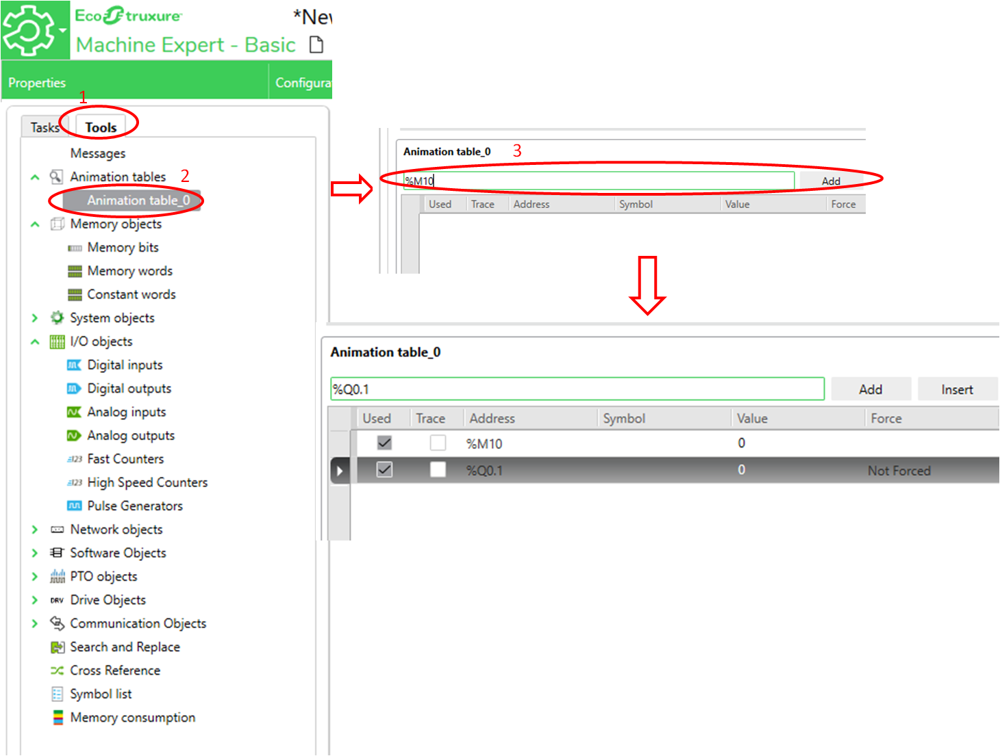

Рис. 3.27 Додавання окремих об’єктів до анімаційної таблиці

- Створіть таблицю анімацій.
- Добавте до таблиці `%M10` та `%Q0.1`
- Використовуючи таблицю модифікуйте значення змінної `%M10` з «0» в «1», використовуючи колонку `Value`

- Переконайтеся, що у відповідності до розробленої програми, значення змінної **%Q0.1** автоматично змінилось на «1»

#### 16. Налагодження з використанням анімаційних можливостей редактору

Візуалізацію роботи програми можна спостерігати у центральному вікні редактора програми (рис. 3. 28)

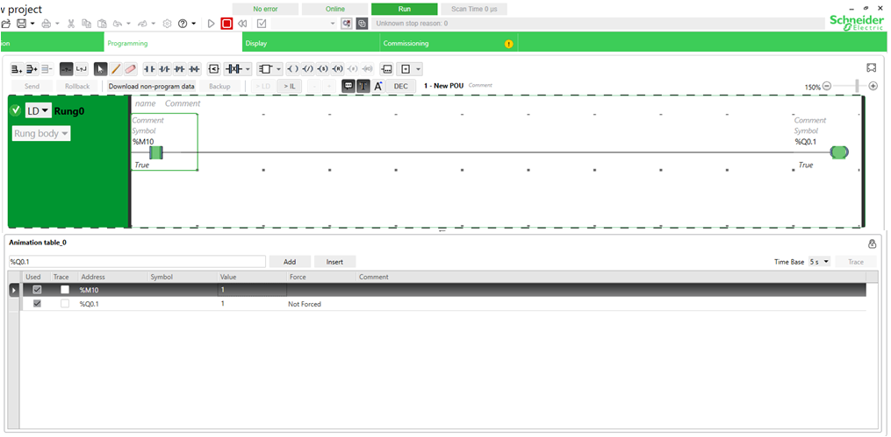

Рис. 3.28 Використання таблиці анімацій

- Подивіться стан контактів та котушок в редакторі LD.
- Знайдіть на індикаторах імітатора ПЛК, який канал змінився.

#### 17. Індивідуальне завдання

- Згідно варіанту виконайте **індивідуальне завдання** з конфігурування контролера. 
- Зробіть копії екранів для звітів.

### Питання до захисту

1. Для вирішення яких задач використовується програмне забезпечення EcoStruxure Machine Expert - Basic?
2. Які є формати процесорних модулів контролерів Modicon M221?
3. Які є модулі розширення контролерів Modicon M221?
4. Що таке дискретні модулі? З якими сигналами вони працюють?
5. Що таке аналогові модулі? З якими сигналами вони працюють?
6. До яких типів модулів підключаються аналогові, дискретні датчики?
7. До яких типів модулів підключаються аналогові, дискретні виконавчі механізми?
8. Які засоби потрібні щоб підключити термометри опору до аналогового вхідного модуля з вхідним сигналом 0-10В?
9. Які змінні ПЛК отримують інформацію з вхідних каналів?
10. Значення яких змінних ПЛК надходить на виходи ПЛК?
11. Як зберігається значення аналогових входів/виходів в ПЛК?
12. Як функціонує робочий цикл ПЛК? 
13. Які режими роботи ПЛК Ви знаєте? Чим відрізняються ці режими? 
14. Чи може програма в ПЛК працювати без комп’ютера з EcoStruxure Machine Expert - Basic? 
15. Що таке сторожовий таймер (`Watchdog`)? Де він налаштовується?
16. У якому стані будуть виходи ПЛК при його зупинці чи відмові?

### Додаток 1. Каталог апаратного забезпечення Somachine basic

Каталог апаратного забезпечення Somachine basic складається з таких пунктів:

1. Модулі центральних процесорів (M221 Logic controllers) – містить перелік модулів центральних процесорів, розділений на 2 групи: Compact та Modular.

2. Модулі розширення (I/O modules) – містить перелік модулів розширення ПЛК, розділений на 6 груп: 

   a. дискретні модулі розширення(TM3 Digital I/O Modules) – містить вхідні та вихідні дискретні модулі на 4, 8, 16 та 32 канали.

   b. аналогові модулі розширення (TM3 Analog /O Modules) – містить аналогові вхідні, вихідні та змішані аналогові модулі.

   c.  TM2 дискретні модулі розширення(TM2 Digital I/O Modules) – застарілі модулі розширення TSX Twido, присутні в каталозі для сумісності із застарілим обладнанням.

   d. TM2 аналогові модулі розширення (TM2 Analog /O Modules) – містить застарілі модулі розширення TSX Twido, присутні в каталозі для сумісності із застарілим обладнанням.

   e.  Спеціальні модулі (TM3 Expert I/O Modules) – модулі, що виконують спеціальні функції, наприклад функції безпеки

Картриджі (M221 Cartridges) – містить картриджі розширення, які можна розмістити в модулі CPU.

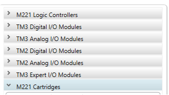

Рис. 3.29. Каталог апаратного забезпечення Somachine basic.

### Додаток 2. Конфігурування модулів **Modicon** **M221**

Конфігурування модулів **Modicon** **M221** відбувається в розділі Configuration.

При конфігуруванні **дискретних вхідних** сигналів можливе налаштування наступних параметрів:

1. Symbol – присвоєння символьного імені змінній.

2. Filtering – встановлення/зміна часу фільтрації.

3. Latch – використання «защіпки», що дозволяє фіксувати короткочасні сигнали, тривалість яких менша за цикл контролера.

4. Run/Stop – присвоєння входу функції управління станом контролера.

5. Event – прив’язка апаратної події до каналу.

6. Priority – пріоритет апаратної події.

При конфігуруванні **дискретних вихідних** сигналів можливе налаштування наступних параметрів:

1. Symbol – присвоєння символьного імені змінній.

2. Status Alarm – використання виходу у якості аварійного сигналізатора.

3. Fallback value – нормальний стан виходу, коли ПЛК у стані STOP.

При конфігуруванні **аналогових вхідних** сигналів можливе налаштування наступних параметрів:

1. Symbol – присвоєння символьного імені змінній.

2. Type – тип вхідного сигналу. 

3. Scope – шкала, по якій відбувається масштабування сигналу.

4. Minimum – нижня межа шкали.

5. Maximum – верхня межа шкали

При конфігуруванні **аналогових вихідних** сигналів можливе налаштування наступних параметрів:

1. Symbol – присвоєння символьного імені змінній.

2. Type – тип вхідного сигналу.

3. Scope – шкала, по якій відбувається масштабування сигналу.

4. Minimum – нижня межа шкали.

5. Maximum – верхня межа шкали.

Fallback value – нормальний стан виходу, коли ПЛК у стані STOP.

Розробили лабораторну - Полупан Володимир, Олег Клименко. [АКТСУ НУХТ](http://www.iasu-nuft.pp.ua)

Редактор - Олександр Пупена.

| [на основну сторінку курсу](../README.md) | [лабораторні](README.md) |
| ----------------------------------------- | ------------------------ |
|                                           | [ЛР4->](lab4_LD.md)      |