| [на основну сторінку курсу](../README.md) | [лабораторні](README.md) |
| ----------------------------------------- | ------------------------ |
| [<-ЛР3](lab3_hard.md)                     | [ЛР5->](lab5_LD2.md)     |

## Лабораторна робота 4. Програмування на мові LD.

**Мета:** навчитися працювати з мовою LD в EcoStruxure Machine Expert Basic.

**Необхідне програмне забезпечення.** EcoStruxure Machine Expert Basic

### Порядок виконання роботи

#### 1. Створення та збереження проекту

- Запустіть Machine Expert - Basic
- збережіть проект

#### 2. Робота з Rung

- перейдіть на вкладку Programming 
- перейдіть у розділ `Tasks` лівої бічної панелі

-  [ознайомтеся з Додатком, в якому описані основні зображення та повденіка елементів LD](lab4_ann.md) 
- пошукайте елементи, які описані в додатку на бічній панелі

#### 3. Створення програми одним НР(нормально розімкнутим) контактом та однією НР котушкою.

- створіть програму, яка наведена на рисунку 4.1

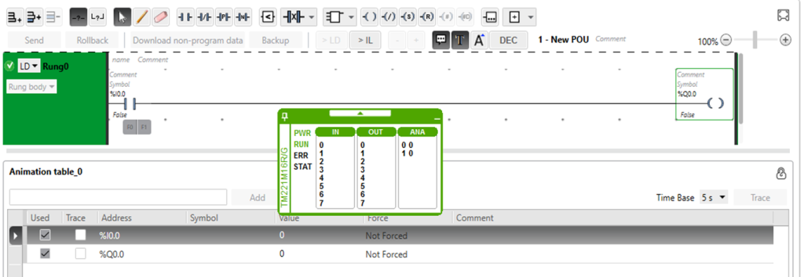

рис.4.1. Приклад простої програми.

#### 4. Компіляція програми 

- Зробіть компіляцію програми

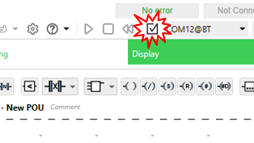

рис.4.2. Компіляція програми

#### 5. Запуск імітатора ПЛК

- Перейдіть на вкладку Commisioning і запустіть імітатор ПЛК  

рис.4.3. Запуск імітатора ПЛК

- запустіть програму в ПЛК на виконання

  

рис.4.4. Запуск програми на виконання

- у вікні, яке з'явиться зробіть підтвердження

#### 6. Створення таблиці послідовності перевірки

- Для перевірки програми, що наведена на рис.4.1 створіть таблицю послідовності, в якій вказано як має перевірятися програма, і які очікувані значення. 

Таблиця 4.1. Послідовність перевірки програми користувача

| Крок | %I0.0  (змінювати) | %Q0.0  (змінюватиметься на) | Примітка                |
| ---- | ----------------------- | -------------------------------- | ----------------------- |
| 1    | 0                       | 0                                | після запуску програми  |
| 2    | 1                       | 1                                | %Q0.0 стає рівною 1     |
| 3    | 0                       | 0                                | %Q0.0 повертається до 0 |

#### 7. Перевірка програми з використанням вікна імітатора

- познайомтеся зі змістом вікна керування імітатором ПЛК

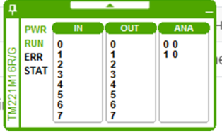

рис.4.5. Вікно імітатора ПЛК 

- натисніть на 0-й вхід і подивіться на стан 0-го виходу, зелений колір показує на стан `ВКЛ`, чорний - `ВИКЛ`; 

- зауважте, що стан входів можна змінювати тільки в імітаторі; для реального ПЛК стан вхідних змінних повністю залежить від входів ПЛК, або їх можна форсувати;   

- перейдіть на вікно "programming" редактору, на ньому в онлайні повинні підсвічуватися стани контактів

  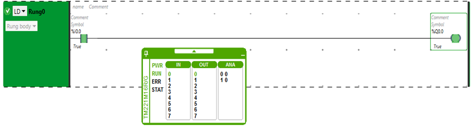

рис.4.6.Відображення станів контактів та котушок в онлайні

-  перевірте роботу програми відповідно до послідовності, вказаної в таблиці 4.1 

#### 8. Перевірка програми з використанням таблиці анімації

- створіть нову таблицю анімації

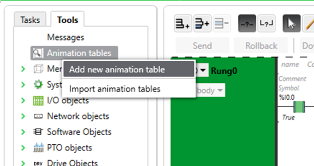

рис.4.7.Створення таблиці анімації.

- добавте в таблицю анімації змінну `%I0.0` та `%Q0.0`

  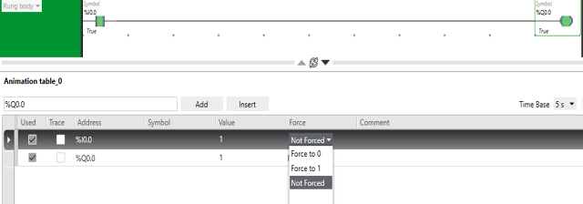

рис.4.8. Добавлення змінних

- оскільки з таблиці анімації не можна змінювати вхідні змінні, перевірте роботу програми шляхом форсування в 0 та в 1
- скиньте режим форсування в `Not Forced`   

#### 9. Перевірка програми з використанням вбудованих засобів редактору LD  

- підведіть вказівник миші до контакту, там з'являться команди `F0` та `F1`

  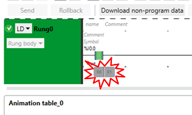

рис.4.9.Команди форсування

-  перевірте як працюють команди  `F0` та `F1`

#### 10. Програма з паралельним та послідовним з'єднанням, використання НЗ (нормально-замкнутого) контакту 

- не зупиняючи програму добавте ще один rung з наступним змістом 

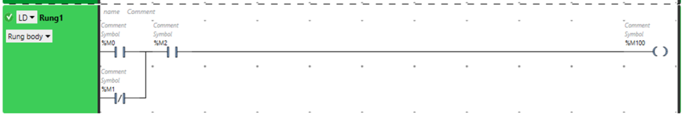

рис.4.10. Добавлення Rung1

- він буде мати помаранчовий колір, що значитиме, що його немає наразі в ПЛК (вірніше його імітаторі); після внесення всіх змін, натисніть `Send` 

  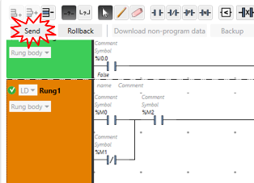

рис.4.11.Відправлення нового Rung в ПЛК

- добавте усі об'єкти з даного rung в таблицю анімацій 

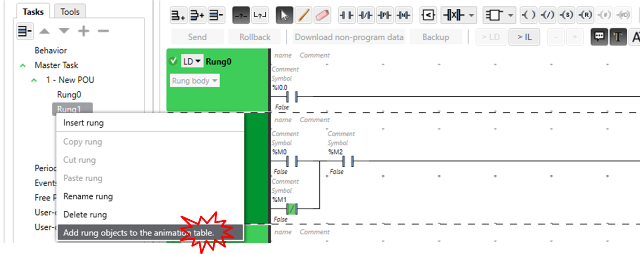

рис.4.12. Добавлення змінних в таблицю анімацій

- заповніть наступну таблицю очікуваними значеннями `%M100`

Таблиця 4.2. Таблиця перевірки програми

| Крок | %M0  | %M1  | %M2  | %M100 | Примітка |
| ---- | ---- | ---- | ---- | ----- | -------- |
| 1    | 0    | 0    | 0    |       |          |
| 2    | 1    | 0    | 0    |       |          |
| 3    | 0    | 1    | 0    |       |          |
| 4    | 0    | 0    | 1    |       |          |
| 5    | 1    | 1    | 1    |       |          |

- з використанням таблиці анімацій перевірте чи дійсно програма працює так, як очікувалося, якщо ні подумайте чому і напишіть в примітках

#### 11. Програма з котушками (/), (S) та (R) 

- використовуючи таблицю анімацій обнуліть зімнні `%M0` та  `%M1` 
- не зупиняючи програму, добавте ще один rung з наступним змістом 

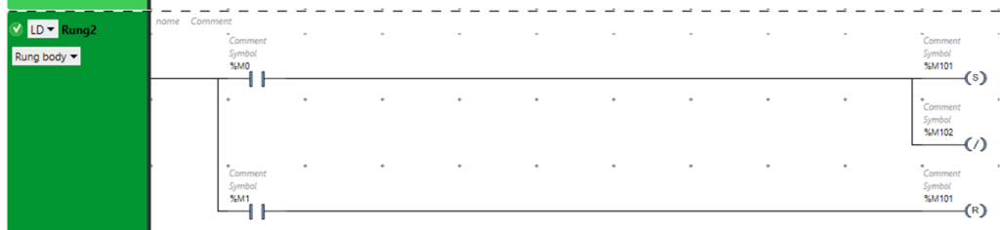

рис.4.13. Зміст Rung2

- добавте усі об'єкти з даного rung в таблицю анімацій 
- заповніть наступну таблицю очікуваними значеннями `%M101` та `%M102`

Таблиця 4.3. Таблиця перевірки

| Крок | %M0  | %M1  | %M101 | %M102 | Примітка |
| ---- | ---- | ---- | ----- | ----- | -------- |
| 1    | 0    | 0    |       |       |          |
| 2    | 1    | 0    |       |       |          |
| 3    | 0    | 0    |       |       |          |
| 4    | 0    | 1    |       |       |          |
| 5    | 1    | 1    |       |       |          |
| 6    | 0    | 0    |       |       |          |

- з використанням таблиці анімацій перевірте чи дійсно програма працює так, як очікувалося, якщо ні подумайте чому і напишіть в примітках

#### 12. Програма з компаратором

- не зупиняючи програму добавте ще один rung з наступним змістом 

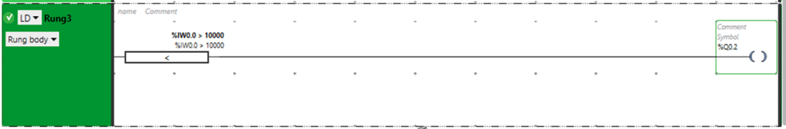

рис.4.14. Зміст Rung3

- заповніть наступну таблицю очікуваними значеннями `%Q0.2` 

Таблиця 4.4. Таблиця перевірки

| Крок | %IW0.0 | %Q0.2 | Примітка |
| ---- | ------ | ----- | -------- |
| 1    | 0      |       |          |
| 2    | 500    |       |          |
| 3    | 2000   |       |          |
| 4    | 5000   |       |          |
| 5    | 500    |       |          |

- використовуючи вікно керування імітатором перевірте роботу фрагменту програми

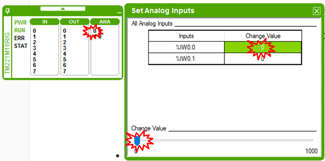

рис.4.15. Зміна значення аналогового входу на імітаторі

#### 13. Програма з операційним блоком

- використовуючи таблицю анімацій обнуліть зімнну `%M0`
- не зупиняючи програму добавте ще один rung з наступним змістом 

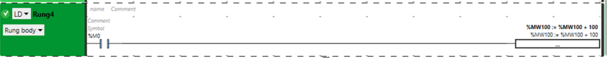

рис.4.16. Зміст Rung4

- заповніть наступну таблицю очікуваними значеннями `%MW100` 

Таблиця 4.5. Таблиця перевірки

| Крок | %M0  | %MW100 | Примітка |
| ---- | ---- | ------ | -------- |
| 1    | 0    |        |          |
| 2    | 1    |        |          |
| 3    | 1    |        |          |
| 4    | 1    |        |          |
| 5    | 0    |        |          |

- поясніть поведінку змінної %MW100

#### 14. Створення символьних назв для змінних

- перейдіть на закладку `Tools` на бічній панелі 

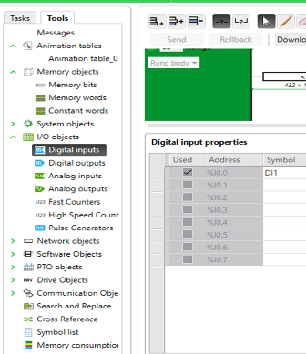

рис.4.17. Створення символьних назв для змінних

- знайдіть усі використані змінні у Вашій програмі і надайте їм символьні імена, які починаються з 'Nm_', де  Nm - перші літери вашого прізвища 
- перейдіть у розділ`Symbol list` і знайдіть усі символи у переліку назв
- подивіться, як відображаються символьні імена в програмі

### Питання до захисту

1. Поясніть призначення усіх типів контактів.
2. Поясніть призначення усіх типів котушок.
3. Поясніть як працюють копаратори.
4. Поясніть як працюють операційні блоки.
5. Поясніть яким чином перевірялися програми користувача в даній лабораторній роботі.
6. Яке призначення імітатору ПЛК? Які можливості імітатору були використані в даній лабораторній роботі.
7. Яким чином можна подивитися значення та змінити змінні при перевірці роботи програми користувача? 
8. Розкажіть про принципи використання паралельного галуження.
9. Розкажіть про принципи використання послідовного підключення контактів. 

Розробив лабораторну - Олександр Пупена. [АКТСУ НУХТ](http://www.iasu-nuft.pp.ua)

| [на основну сторінку курсу](../README.md) | [лабораторні](README.md) |
| ----------------------------------------- | ------------------------ |
| [<-ЛР3](lab3_hard.md)                     | [ЛР5->](lab5_LD2.md)     |