| [<- до лаборних робіт](README.md) | [на основну сторінку курсу](../README.md) |
| --------------------------------- | ----------------------------------------- |
|                                   |                                           |

## Лабораторна робота 8. Робота з Grafсet

**Мета:** навчитися створювати програми користувача на мові Grafсet для керування роботизованою установкою.

**Необхідне програмне забезпечення.** EcoStruxure Machine Expert Basic

### Порядок виконання роботи

#### 1. Створення першого варіанту програми користувача.

- Створіть Grafcet POU
- реалізуйте програму у відповідності до рисунка 8.1

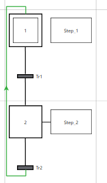

рис.8.1. Створення першого тестового варіанту програми користувача.

- Задайте в якості умови переходів спрацювання `%I0.0` для `Tr1` і `%I0.1` для `Tr2`. `Step1` і `Step2` залиште порожніми.

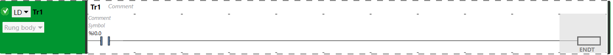

рис.8.2. Зміст Tr1

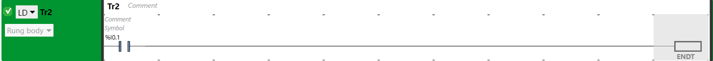

рис.8.3. Зміст Tr2

- Запустіть імітатор ПЛК і переведіть його в RUN
- змінюючи `%I0.0` і `%I0.1`, перевірте зміну активності кроків.

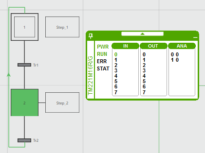

рис.8.4. Перевірка програми користувача.

#### 2. Паралельне розгалуження.

- Добавте ще один крок та з'єднайте його з `Tr1` і `Tr2`. Умови переходів залишаються без змін.

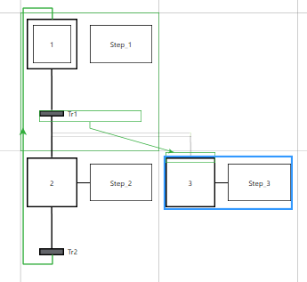

рис.8.5. Добавлення паралельного галуження. 

- В результаті ви повинні отримати такий тип з'єднуючих ліній:

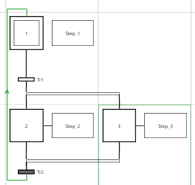

рис.8.6. Готовий варіант з паралельним галуженням.

- Як і для попередньої версії програми зробіть перевірку активності кроків.

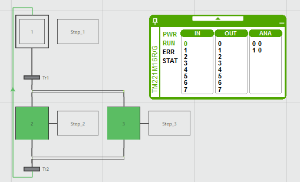

рис.8.7. Перевірка програми з паралельним галуженням.

#### 3. Альтернативне розгалуження.

- Реалізуйте альтернативне галуження. Для реалізації альтернативного розгалуження, новий крок потрібно з'єднувати не з умовами переходу, а з іншими кроками.

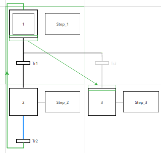

рис.8.8. Добавлення альтернативного галуження. 

- Реалізуйте програму як на рисунку 8.9. Для кожної умови переходу використовуйте наступну вільну адресу `%І`.

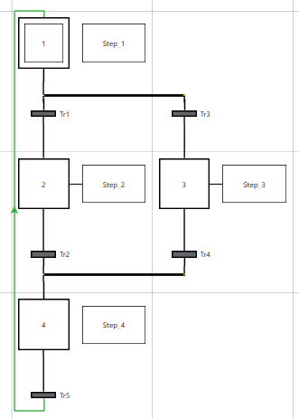

рис.8.9. Готовий варіант з альтернативним галуженням.

- Виконайте перевірку зміни активності кроків.

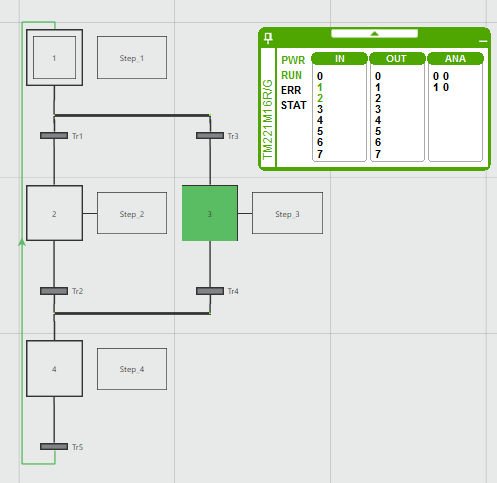

рис.8.10. Перевірка варіанту з альтернативним галуженням.

#### 4. Доповнений варіант завдання.

У даній роботі необхідно реалізувати алгоритм керування об'єктом, який розглядався в лабораторній роботі №6 (Використання функціональних блоків) на мові Grafcet. 

- Ознайомтеся з постановкою доповненого завдання для створення програми користувача. Схема технологічної установки, для якої необхідно розробити програму користувача показана на рис.8.11. Нижче написаний опис алгоритму, у якому нові умови виділено жирним шрифтом. 

рис.8.11. Спрощена апаратурно-технічна схема установки 

Після натискання кнопки "ПУСК", якщо ємність не порожня, повинен відкритися клапан `LVS3`, і присутня в ємності рідина повинна вивантажитися з неї.  Якщо (коли) ємність буде порожня необхідно закрити клапан `LVS3` і відкрити клапан `LVS1` і почати її наповнювати до спрацювання середнього рівня. Після цього необхідно закрити клапан `LVS1` і відкрити `LVS2` для заповнення ємності до верхнього рівня. Потім клапан `LVS2` треба закрити і відкрити клапан `TV1` повністю. Після досягнення температури 50°С клапан треба залишити відкритим на 50%. **Після досягнення значення 55°С треба відкрити клапан `LVS3 ` і  впродовж 30 секунд тримати клапан `TV1` відкритим на 50%. Після вивантаження рідини з апарату закрити клапан`LVS3 `** Якщо не натиснута кнопка "СТОП" - цикл повинен повторюватися.

#### 5. Доповнення методики перевірки.

- Ознайомтеся з табличним виглядом методики перевірки задачі приготування продукту. 

| №    | стан/зміна стану  системи   | SB1  | SB2  | LS1  | LS2  | LS3  | TE1   | LVS1 | LVS2 | LVS3 | TV1  | Примітка                    |
| ---- | --------------------------- | ---- | ---- | ---- | ---- | ---- | ----- | ---- | ---- | ---- | ---- | --------------------------- |
| 1    | початковий  (включення ПЛК) | -    | -    | -    | -    | -    | -     | 0    | 0    | 0    | 0    |                             |
| 2    | Предпуск                    | 0    | -    | -    | -    | -    | -     | 0    | 0    | 0    | 0    |                             |
| 3    | Пуск порожнім               | 1    | 0    | 0    | 0    | 0    | -     | 1    | 0    | 0    | 0    |                             |
| 4    | Пуск не порожнім            | 1    | 0    | 1    | 0    | 0    | -     | 0    | 0    | 1    | 0    | Продовжити перевірку з п.14 |
| 5    | Наповн. нижче рівня LS2     | 0    | 0    | 1    | 0    | 0    | -     | 1    | 0    | 0    | 0    |                             |
| 6    | рівень LS2                  |      |      | 1    | 1    | 0    | -     | 0    | 1    | 0    | 0    |                             |
| 7    | Наповн. нижче рівня LS3     | -    | -    | 1    | 1    | 0    | -     | 0    | 1    | 0    | 0    |                             |
| 8    | рівень LS3                  | -    | -    | 1    | 1    | 1    | -     | 0    | 0    | 0    | 100% |                             |
| 9    | Нагрівання 1                | -    | -    | -    | -    | -    | <50°С | 0    | 0    | 0    | 100% |                             |
| 10   | температура 50°С            | -    | -    | -    | -    | -    | 51°С  | 0    | 0    | 0    | 50%  |                             |
| 11   | Нагрівання 2                | -    | -    | -    | -    | -    | <55°С | 0    | 0    | 0    | 50%  |                             |
| 12   | температура 55°С            | -    | -    | -    | -    | -    | 56°С  | 0    | 0    | 1    | 50%  |                             |
| 13   | Витримка 30 секунд          | -    | -    | -    | -    | -    | >56°С | 0    | 0    | 1    | 50%  |                             |
| 14   | Вивантаження до LS2         | -    | -    | 1    | 1    | 0    | -     | 0    | 0    | 1    | 0    |                             |
| 15   | Вивантаження до LS1         | -    | -    | 1    | 0    | 0    | -     | 0    | 0    | 1    | 0    |                             |
| 16   | Ємність порожня при "СТОП"  | 0    | 1    | 0    | 0    | 0    | -     | 0    | 0    | 0    | 0    | продовжити перевірку з п.2  |
| 17   | Ємність порожня без "СТОП"  | 0    | 0    | 0    | 0    | 0    | -     | 1    | 0    | 0    | 0    | продовжити перевірку з п.5  |

  `-` - вказує незалежність дій від значення вхідних сигналів, бажано перевіряти що стан системи не міняється при зміні цих вхідних сигналів 

#### 6. Створення програми.

- Відкрийте проект з лабораторної роботи 6. Збережіть під іншим іменем. 
- В існуючій секції POU залиште тільки імітатор об'єкту, все інше видаліть.

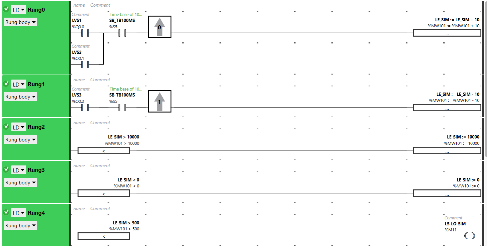

рис.8.12. Частини програми що відповідають за імітацію (колишні Rung8-12)

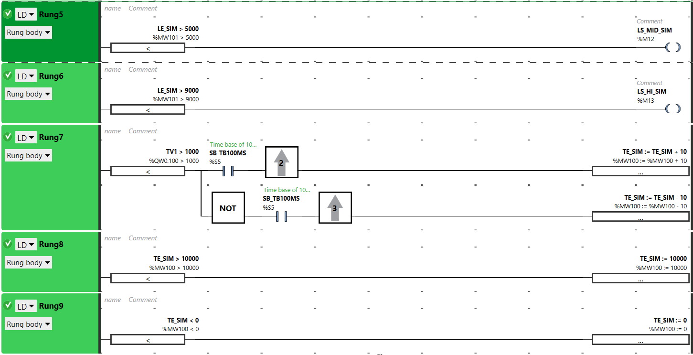

рис.8.13. Частини програми що відповідають за імітацію (колишні Rung13-17)

- Створіть Grafcet POU і реалізуйте програму у відповідності до рисунку 8.14

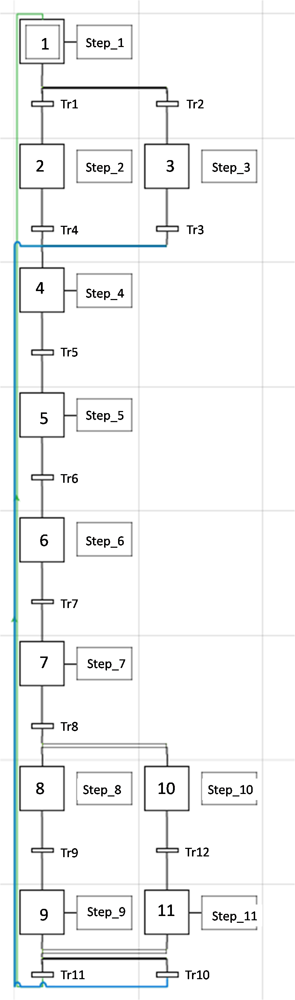

рис.8.14. Структура програми на Grafcet

- У відповідних кроках за допомогою команди `Add a new rung` створіть програму 8.15-8.24

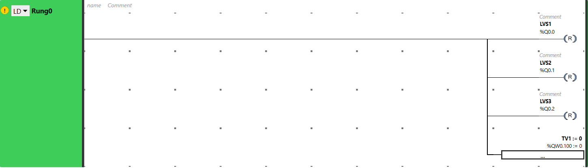

рис.8.15. Step_1

- Step_2 залишається порожнім

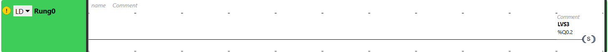

рис.8.16. Step_3

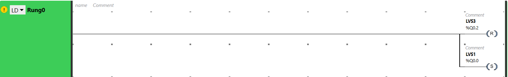

рис.8.17. Step_4

рис.8.18. Step_5

рис.8.19. Step_6

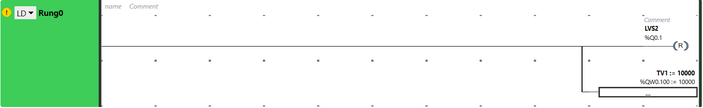

рис.8.20. Step_7

рис.8.21. Step_8

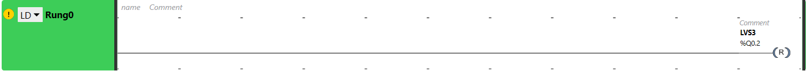

рис.8.22. Step_9

рис.8.23. Step_10

рис.8.24. Step_11

- Умови переходу Transitions задайте у відповідності до рисунків 8.25-8.36

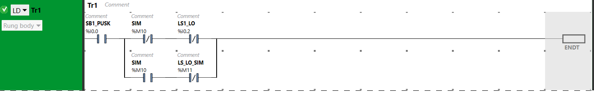

рис.8.25. TR1

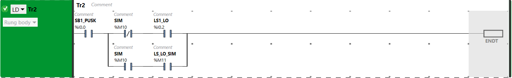

рис.8.26. TR2

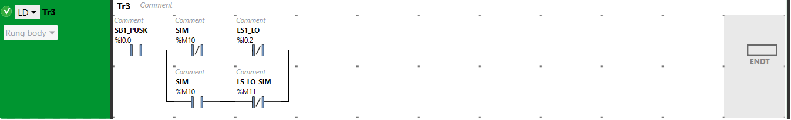

рис.8.27. TR3

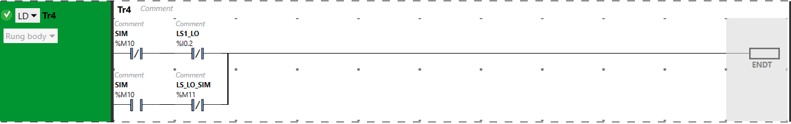

рис.8.28. TR4

рис.8.29. TR5

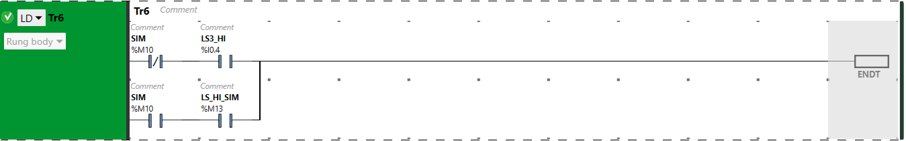

рис.8.30. TR6

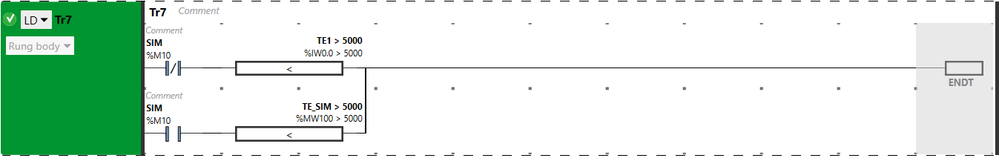

рис.8.31. TR7

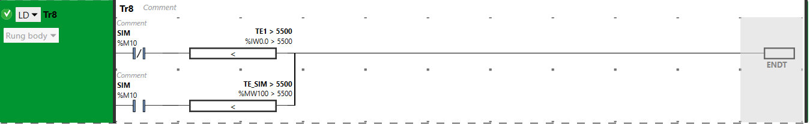

рис.8.32. TR8

рис.8.33. TR9

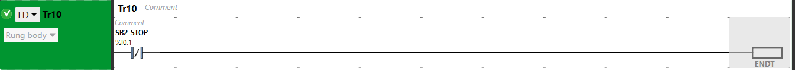

рис.8.34. TR10

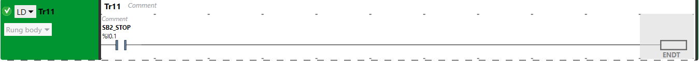

рис.8.35. TR11

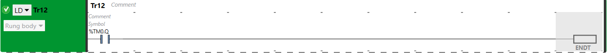

рис.8.36. TR12

#### 7. Налагодження програми.

- Запустіть імітатор ПЛК та запустіть його на виконання.

- Перевірте роботу програми згідно наступної методики перевірки:

  - Включіть налагодження за допомогою імітаційної моделі (SIM-->1)

  - Натисніть кнопку "Пуск" в імітаторі ПЛК

  - Переконайтесь, що процес наповнення почався

  - Натисніть кнопку "Стоп" в імітаторі ПЛК

  - Дочекайтеся завершення та зупинки процесу, при цьому перевіряйте правильність роботи алгоритму. Зверніть увагу, що імітовані параметри можна також вводити в `Animation table` вручну, це може прискорити процес відлагодження повільних процесів.

#### Створення власної програми користувача.

#### 8. Отримання індивідуального завдання.

- Отримайте індивідуальне завдання від викладача, якщо ще не отримали.

#### 9. Модернізуйте код попередньої лабораторної роботи. 

- Перепишіть логіку програми з допомогою Grafcet, імітатор об'єкта залишається в POU.

#### 10. Перевірка програми користувача.

- Використовуючи методику перевірки, перевірте роботу програми користувача на імітаторі.

Усі наведені  матеріали разом з програмою користувача будуть звітом для даної роботи.

### Питання до захисту

1. Які основні елементи використовуються в мові Grafcet.
2. Що таке крок ініціалізації, навіщо він потрібен?
3. Що таке крок. Поясніть що таке активний крок. Як задаються дії для кроків?
4. Що таке перехід. Як задають умови переходу?
5. Для чого використовуються паралельні розгалуження?
6. Для чого використовуються альтернативні розгалуження?  

Розробив лабораторну - Олег Клименко [АКТСУ НУХТ](http://www.iasu-nuft.pp.ua)

| [<- до лаборних робіт](README.md) | [на основну сторінку курсу](../README.md) |
| --------------------------------- | ----------------------------------------- |
|                                   |                                           |