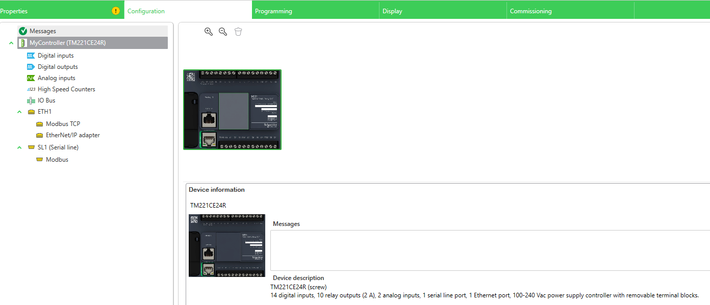
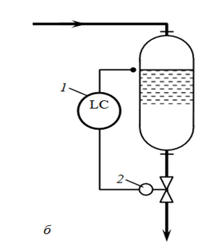
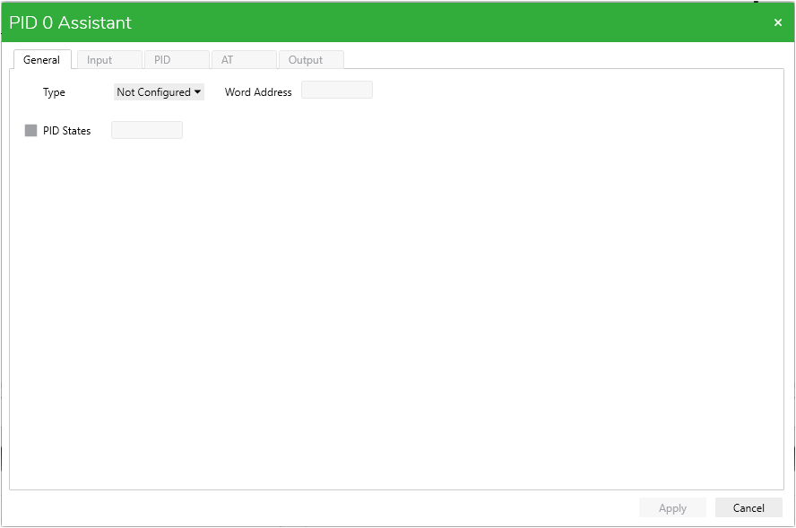
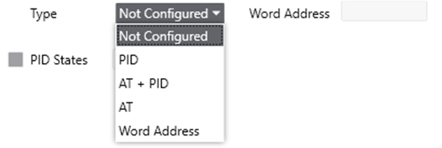
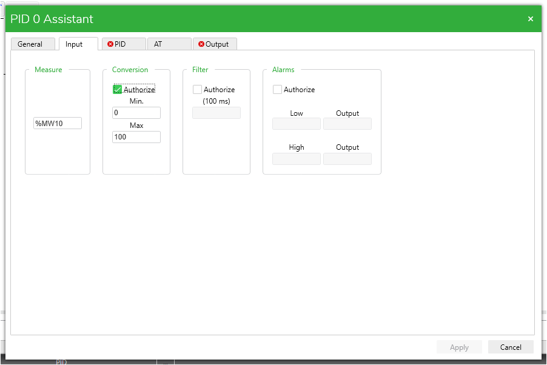
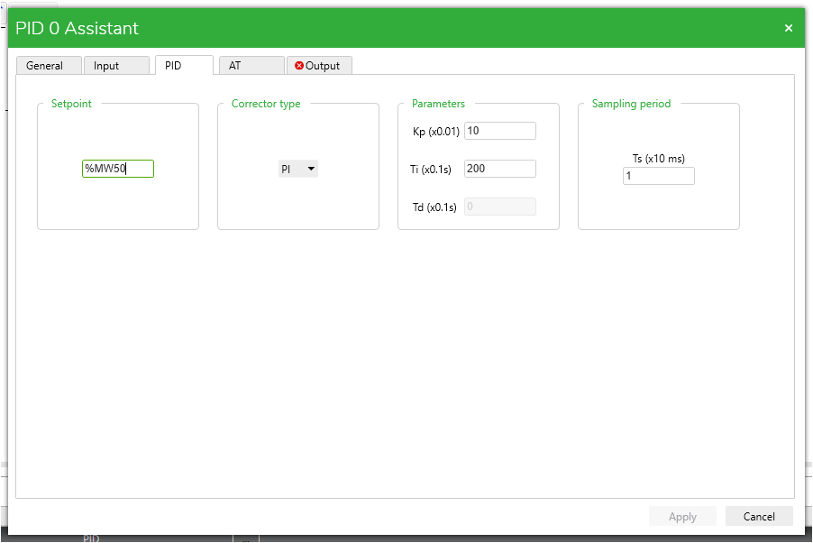
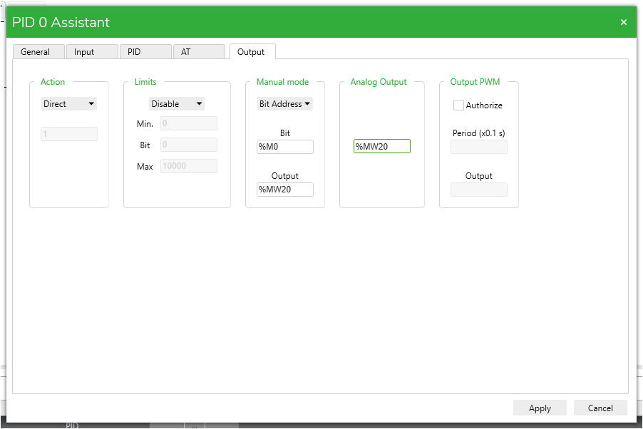

| [<- до лаборних робіт](README.md) | [на основну сторінку курсу](../README.md) |
| --------------------------------- | ----------------------------------------- |
|                                   |                                           |

# Частина 1. Конфігурування PID регулятора 

### 1.1 Створення нового проекту

***УВАГА! Дану частину роботи неможливо перевірити в симуляторі ПЛК, оскільки він не підтримує роботу PID-регулятора. Тому в даній частині виконується лише конфігурація без перевірки працездатності.***

1.1.1. Створіть новий проект в Machine Expert Basic.  У якості процесорного модуля оберіть **TM221CE24R**.

Рис. 6.1. Конфігурація ПЛК

Далі розглянемо розв'язк для наступної задачі:

В змінній **%MW10** умовно зберігається значення з датчика рівня з вихідним уніфікованим сигналом 0-10V, діапазон в ПЛК 0-10000. В змінній **%MW20** умовно зберігається значення керування електричним приводом клапана з уніфікованим сигналом керування 0-10V, діапазон в ПЛК 0-10000, за допомогою якого необхідно підтримувати заданий рівень в ємності:

Рис. 6.2 Функціональна схема об'єкта керування

### 1.2 Конфігурування PID регулятора

Для розв'язання поставленої задачі скористаємось одним з ПІД регуляторів ПЛК М221.

1.2.1. Для виконання конфігурації PID регуляторів необхідно перейти в розділ **Programming > Tools > Software Objects > PID** (рис. 6.3)

 Рис. 6.3 Конфігурування PID регуляторів

У вікні PID propertis можна побачити перелік PID регуляторів, доступних для обраної моделі ПЛК.

1.2.2. Виконаємо конфігурацію регулятора **PID 0**. Для цього необхідно натиснути на кнопку з трьома крапками навпроти регулятора PID 0 в колонці Configuration (рис 6.3).

Відкриється вікно налаштування PID регулятора **PID 0 Assistent** (рис. 6.4).

Рис. 6.4 Вікно конфігурації PID Assistent

Вкладка General дозволяє обрати тип регулятора з переліку:

Рис. 6.5. Вибір типу регулятора

- Not Configured  - регулятор не сконфігуровано, в програмі не використовується
- PID - Звичайний режим роботи PID-регулятора, активний за замовчуванням, коли PID-регулятор запускається.
- AT + PID - У цьому режимі активується функція  автоматичної настройки при запуску PID-регулятора. Після виконання автонастройки регулятор починає працювати як звичайний PID.
- AT - Режим автонастройки - У цьому режимі активується функція  автоматичної настройки при запуску PID-регулятора. Після виконання автонастройки регулятор зупиняється.
- Word Adress - Динамічний режим роботи, при якому необхідний режим роботи можна змінити програмним шляхом, змінюючи значення змінної Word Adress

Оберіть режим PID та перейдіть у вкладку **Input**.

1.2.3. Вкладка Input дозволяє провести налаштування входів PID-регулятора

У зоні **Measure**, вказується змінна, що відповідає за поточне значення вимірюваної величини. У нашому випадку це змінна **%MW10**.

Зона **Conversion** дозволяє провести масштабування значення вимірюваної величини у більш зручний вигляд.

У нашому випадку виконаємо масштабування рівня з діапазону 0-10000 в діапазон 0-100%

Зона **Filter** дозволяє провести цифрове фільтрування вимірювальної величини.

Зона Alarms дозволяє провести налаштування тривог, про вихід регульованого параметру за допустимі межі.

Виконайте налаштування як на рис. 6.6 та перейдіть у вкладку **PID**

Рис. 6.6. Налаштування входів PID-регулятора

1.2.4. У вкладці **PID** проводиться конфігурація основних параметрів регулятора.

Зона **Setpoint** - відповідає за задане значення регульованої змінної. Тут можна записати як константу (наприклад 50), так і адресу змінної (наприклад %MW50) - для можливості зміни заданого значення програмно під час роботи на виробництві.

Зона **Corrector** type - дозволяє обрати режим роботи регулятора ПІ чи ПІД.

**Parametrs** - параметри налаштування ПІД-регулятора:

- Кр - коефіцієнт пропорційності
- Ті - час інтегрування
- Тd - час диференціювання

Дозволяється записувати як константи, так і адреси змінних для програмної зміни під час роботи.

**Sampling period** - частота викликів PID-регулятора. Вона повинна бути від 1 (0,01 с) до 10000 (100 с).

Виконайте налаштування як на рис. 6.7 та перейдіть у вкладку **Output**.

Рис. 6.7. Налаштування параметрів PID-регулятора

1.2.5. У вкладці **Output** проводиться конфігурація виходу регулятора:

**Action** - напрям дії PID-регулятора, прямий - **Direct** (наприклад, якщо об'єкт керування нагрівач), зворотній - **Revers** (наприклад, якщо об'єкт керування охолоджувач). Або з можливістю перемикання - **Bit Address**. У цьому випадку напрям дії можна програмно змінювати за допомогою дискретної змінної, що вказується у відповідному полі.

**Limits** - дозволяє виконати обмеження виходу PID регулятора.

**Manual mode** - ручний режим, дозволяє керування виходом регулятора в ручному режимі:

- Disable - відключено
- Enable - постійно включено
- Bit Address - з можливістю перемикання руч/авто. У цьому випадку режим роботи  можна змінювати за допомогою дискретної змінної, що вказується у відповідному полі. "0" - автоматичний режим, "1" - ручний
- Output - вихід регулятора в ручному режимі.

**Analog Output** - аналоговий вихід PID регулятора.

Output PWM - у випадку, коли необхідно керувати об'єктом за принципом широтно-імпульсної модуляції, обирається дана опція. У такому випадку задається дискретний вихід регулятора, а період імпульсів. Більш детально про даний режим роботи у наступному розділі.

Виконайте налаштування як на рис. 6.8 та натисніть **Apply**.

Рис. 6.8. Налаштування виходу PID-регулятора

### 1.3. використання PID регулятора в програмі.

1.3.1 Для того, щоб створений PID-регулятор почав працювати необхідно його викликати в програмі.

Для цього в новому ранзі за допомогою блоку **Operation Block** зробити виклик PID 0 рис. 6.9.

Рис. 6.9. Програмування виклику PID-регулятора

За такого виклику PID-регулятора він буде безумовно працювати постійно з моменту запуску ПЛК. За необхідності можна додати умови запуску регулятора так само, як і в інших варіантах використання **Operation Block**.

### 1.4. Виконання індивідуального завдання згідно варіанту.

1.4.1 Виконайте конфігурацію регулятора згідно з  Вашим варіантом, та надішліть файл проекту на перевірку.

## Частина 2. Перевірка роботи PID-регулятора

На стадії розробки

| [<- до лаборних робіт](README.md) | [на основну сторінку курсу](../README.md) |
| --------------------------------- | ----------------------------------------- |
|                                   |                                           |