| [<- до лаборних робіт](README.md) | [на основну сторінку курсу](../README.md) |
| --------------------------------- | ----------------------------------------- |
|                                   |                                           |

## Лабораторна робота 10. Створення власних функцій та функціональних блоків. 

**Мета:** навчитися створювати власні функції та функціональні блоки.

**Необхідне програмне забезпечення.** EcoStruxure Machine Expert Basic

### Порядок виконання роботи

#### 1. Постановка завдання для написання власної функції

- У лабораторній роботі необхідно реалізувати власну функцію. Розгляньте постановку завдання для  функції, яка має виконувати масштабування вимірюваного значення з аналогового входу в інженерні одинці. 

Враховуючи що вимірювальне значення отримується з аналогового входу через змінну `%IW` в цілочисельному форматі (наприклад в діапазоні 0-10000), при відображенні оператору воно неінформативне. Для відображенні на засобах людино-машинного інтерфейсу (ЛМІ), наприклад панелях оператора чи комп'ютері, його необхідно перетворити в інженерні одиниці. Таке перетворення прийнято називати масштабуванням. Як правило, засоби ЛМІ вміють робити лінійне масштабування, однак інколи необхідно це робити на самому ПЛК. 

Лінійне масштабування, тобто перетворення вхідних `сирих` одиниць у `інженерні` масштабовані може проводитися за формулою (див. рис.10.1):

```mathematica
S = k*R + Sb 			(10.1)
```

де `S `– отримуване масштабоване значення в інженерних одиницях; `R` – вхідне сире немасштабоване значення, `Sb` – зміщення; `k` – коефіцієнт, який дорівнює тангенсу кута нахилу прямої масштабування до осі абсцис.     


рис.10.1. Лінійне масштабування

Задавання масштабування у вигляді (10.1) вимагає від розробника додаткових розрахунків. Замість цього зручніше задавати тільки мінімальні та максимальні межі для *сирого* (*raw*) і *масштабованого* (*scaled*) значення. На рис.10.1 межі сирого значення показані як `Rmax` та `Rmin`, а масштабованого як `Smax` та `Smin`. Так, наприклад, якщо в ПЛК значення від датчика задається в діапазоні від 0-10000 (одиниць ПЛК) а на ЛМІ воно повинно відображатися як 50.0-150.0 (°С), то:

```mathematica
Rmin = 0 (одиниць ПЛК) –> Smin = 50.0 (°С)
Rmax = 10000 (одиниць ПЛК) -> Smax = 150.0 (°С)
```

Формула визначення `S` з використанням змінних діапазонів матиме вигляд:

```mathematica
S = Smin + (R-Rmin)(Smax-Smin)/(Rmax-Rmin) 				(10.2)
```

#### 2. Визначення параметрів власної функції

- Проаналізуйте які параметри необхідні для наведеної вище функції. Це розглядається нижче. 

Параметрами функції будуть усі необхідні вхідні значення, потрібні для масштабування:

- `%RAW` - сире значення вимірювальної величини типу `WORD`
- `%RMIN`- нижня межа сирого значення вимірювальної величини типу `WORD`
- `%RMAX`- верхня межа сирого значення вимірювальної величини типу `WORD`
- `%SMIN` - нижня межа масштабованого значення величини типу `Float`
- `%SMAX` - верхня межа масштабованого значення величини типу `Float`

Виходом функції буде масштабоване значення `%SRET` типу `Float`.

У процесі розрахунку необхідно робити проміжні перетворення. Зокрема, треба перетворити цілі числа у дійсні, щоб зробити арифметичні операції, наведені в формулі (10.2), тому що не дозволяється робити обчислення з різними типами. Зрештою, можна б було написати одну велику формулу, яка б враховувала і ці перетворення, однак в середовищі є певні обмеження на максимальну кількість операндів. Тому додатково необхідно ввести проміжні змінні: 

- `%K` - для розрахунку співвідношень масштабів 
- `%RAW_F` - сире значення вимірювальної величини перетвореного в `Float`
- `%RMIN_F` - нижня межа сирого значення вимірювальної величини перетвореного в `Float`
- `%RMAX_F` - верхня межа сирого значення вимірювальної величини перетвореного в `Float`

#### 3. Створення функції та конфігурування параметрів

- Створіть новий проект
- У закладці `Programming` створіть власну функцію

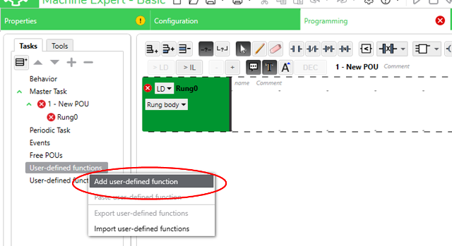

рис.10.2. Створення власної функції

- Змініть адресу та тип значення що повертає функція, як це показано на рис.10.3.
- Використовуючи кнопку "Add a parameter" добавте необхідні параметри, як це показано на рис.10.3

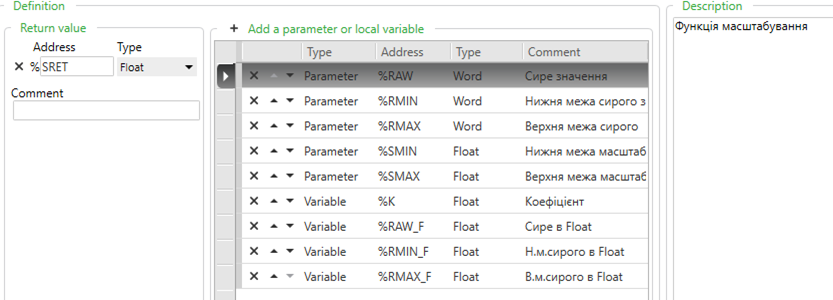

рис.10.3. Інтерфейс функції масштабування 

- Натисніть `Apply` для підтвердження параметрів 

- Переіменуйте функцію в `SCALE` (рис.10.4)

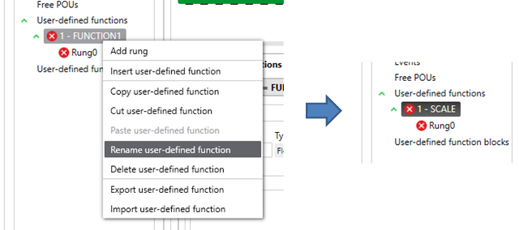

рис.10.4. Перейменування функції

#### 4. Створення коду функції 

- У Rung функції впишіть код, який показано на рис.10.5


рис.10.5. Реалізація коду функції масштабування 

- Проаналізуйте наведений код.

Перші три оператори переводять значення з типу `INT` в `REAL` Четвертий оператор розраховує частину формули `(Smax-Smin)/(Rmax-Rmin) `, останній вже робить кінцевий розрахунок:

```
%SRET := %SMIN + %RAW_F * %K
```

#### 5. Створення програми з використанням власної функції 

- У основній програмі створіть виклик функції користувача `SCALE` (рис.10.6). 

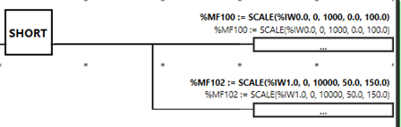

рис.10.6. Реалізація прикладу використання функції масштабування 

- Проаналізуйте наведений код.

Перший виклик функції реалізовує перетворення виміряного значення з аналогового входу, вбудованого в модуль ЦПУ (`%IW0.0`) в діапазон `0-100%`. Другий виклик реалізовує перетворення з аналогового входу модуля  `%IW1.0` в значення сигналу `50.0-150.0 °C`. Значення записуються в `%MF100` та `%MF102`. 

>  Зверніть увагу, що змінні `%MF` знаходяться в комірках пам'яті через одну, оскільки `%MF100` займає дві комірки підряд, тобто `%MW100` та `%MW101`, а `%MF101` - `%MW101` та `%MW102`.  

#### 6. Перевірка роботи програми користувача 

- Перевірте роботу програми користувача на імітаторі ПЛК. Для перевірки використовуйте дані, описані у варіанті завдання. 
- Зробіть копії екранів з реалізацією функції, програмою де вона використовується та таблицею анімації в якій показані вхідні та вихідне значення. 

#### 7. Ознайомлення з інструментами створення функціонального блоку

- Ознайомтеся з інструментами створення функціонального блоку з тексту наведеного нижче.

Так само, як і в функціях, у функціональних блоках доступні для використання параметри, локальні та  глобальні змінні.

- **%PARAMn** - параметр функції користувача, який вказується при виклику функції;може бути типів   `Word`, `Double` або `Float` ;
- **%VARn**  - локальна змінна функції користувача; вона не вказується при виклику і слугує внутрішньою змінною для розрахунку та збереження проміжних результатів між викликами; може бути типів `Word`, `Double` або `Float`  

Додатково є можливість добавити булеві входи та виходи. Таким чином можна керувати функціональним блоком через булеві входи, у свою чергу забираючи булеві результати. При необхідності використання числових входів/виходів використовуються параметри, які можна змінювати ззовні функціонального блоку звертаючись до них за іменем. 

Наступний рисунок показує дії, доступні у вікні `Properties` для функціональних блоків користувача:

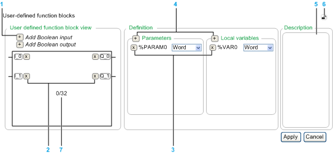

рис.10.7. Налаштування функціональних блоків користувача.

> 1 - добавлення входів та виходів змінних, 2 - видалення входів/виходів, 3 - видалення параметру або локальної змінної, 4 - добавлення параметру або локальної змінної, 5 - опис призначення функціонального блоку, 6 - відкріплення вікна властивостей, 7 - кількість використаних екземплярів даного типу функціонального блоку

Функціональні блоки використовуються так само, як і інші функціональні блоки. Так, наприклад, до їх параметрів можна звертатися за назвою UDFB та назвою параметру через крапку (наприклад `%UDFB1.PARA1`). Параметри доступні як для читання, так і для запису. 

#### 8. Постановка і декомпозиція завдання для створення користувацького ФБ

- Розгляньте приклад створення та використання функціональних блоків користувача для керування клапаном, наведений в даному пункті.

Необхідно розробити фрагмент керування програмою користувача для керування клапанами з датчиками кінцевого положення. Необхідно реалізувати:

- окремі режими ручний/автомат:
  - передбачається окрема булева змінна (АВТ/РУЧ) для керування режимом з засобів людино-машинного інтерфейсу
  - передбачається окрема булева змінна для ВКЛ/ВІДКЛ клапану у ручному режимі з засобів людино-машинного інтерфейсу
  - передбачається окрема булева змінна для ВКЛ/ВІДКЛ клапану у автоматичному режимі з програми користувача
- для клапанів використовувати керування одним дискретним виходом: ВКЛ - на відкриття, ВІДКЛ - на закриття 
- передбачити використання 2-х датчиків кінцевого положення: позиція "відкритий" і "закритий"  
- контроль стану клапану (див. рис.10.8) з метою відображення його на засобах людино-машинного інтерфейсу різними кольорами:  
  - відкривається - проміжний стан, коли йде сигнал на відкриття, але кінцевик ВІДКРИТО ще не спрацював
  - закривається - проміжний стан, коли йде сигнал на закриття, але кінцевик ЗАКРИТО ще не спрацював
  - відкрито - кінцевий стан, коли йде команда на відкриття і спрацьовує кінцевик ВІДКРИТО, при цьому кінцевик ЗАКРИТО відключений   
  - закрито - кінцевий стан, коли йде команда на закриття і спрацьовує кінцевик ЗАКРИТО, при цьому кінцевик ВІДКРИТО відключений
  - при включенні ПЛК переходити у один з проміжних станів, в залежності від команди    

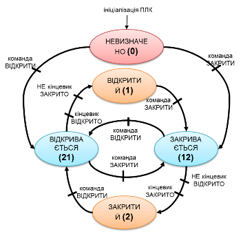

рис.10.8. Діаграма для автомату станів клапану

- сигналізування тривог з використанням окремих дискретних сигналів: 
  - не відкрився, якщо клапан знаходиться в проміжному стані "ВІКДРИВАЄТЬСЯ" більше, ніж задано часом уставки   
  - не закрився, якщо клапан знаходиться в проміжному стані "ЗАКРИВАЄТЬСЯ" більше, ніж задано часом уставки   
  - загальна помилка датчика або довільний зсув:
    - коли обидва датчика спрацьовують
    - коли в кінцевому стані без зміни команди спрацьовують або відключаються датчики положення  

#### 9. Створення інтерфейсу функціонального блоку

- Створіть новий проект.

- Створіть новий тип функціонального блоку (рис.10.9)

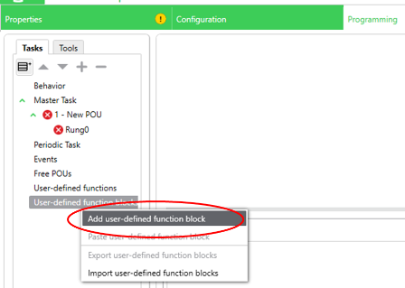

рис.10.9. Створення нового типу функціонального блоку

- У інтерфейсі функціонального блоку визначіть усі його булеві входи та виходи, параметри та локальні змінні. Зокрема, для клапану означте наступні булеві входи (рис.10.10):
  - `CMD` - подача команди в автоматичному режимі
  - `AUTO` - ручний (0), або автоматичний (1) режим 
  - `MCMD` - подача команди в ручному режимі
  - `GSOPN` - датчик кінцевого положення ВІДКРИТО
  - `GSCLS` - датчик кінцевого положення ЗАКРИТО 

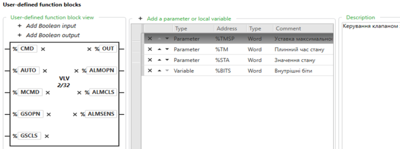

рис.10.10. Означення інтерфейсу функціонального блоку

- З функціонального блоку повинні виходити наступні булеві виходи (див.рис.10.10):
  - `OUT` - вихід на виконавчий механізм
  - `ALMOPN` - вихід сигналу тривоги "НЕ ВІДКРИВСЯ" 
  - `ALMCLS` - вихід сигналу тривоги "НЕ ЗАКРИВСЯ" 
  - `ALMSENS` - вихід сигналу тривоги "Помилка датчика або довільний зсув" 

- Для налаштування функціонального блоку та контролю повинні використовуватися наступні параметри та змінні (див.рис.10.10):
  - `%TMSP` - параметр, який вказує на максимальний час відкриття (в секундах) 
  - `%TM` -параметр, який вказує час плинного стану (в секундах)  
  - `%STA` - параметр, який вказує плинний стан клапану: 0 - ініціалізація, 1 - відкритий, 2 - закритий, 12 - відкривається, 21 - закривається
  - `%BITS` - внутрішня змінна, для розрахунку та збереження бітових результатів

Параметри видимі в програмі користувача поза функціонального блоку, внутрішні змінні видимі тільки в межах функціонального блоку.

#### 10. Створення програми функціонального блоку

- У програму реалізації функціонального блоку добавте фрагмент, який показано на рис.10.11.  

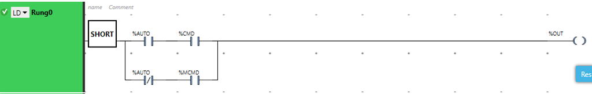

рис.10.11. Керування виходом `OUT` у залежності від режиму. 

Вихід `OUT` керується входом `CMD` в режимі `AUTO` і `MCMD` у ручному режимі. Зрештою такий ланцюжок можна прокоментувати так:

- `%OUT := %CMD` при `%AUTO=1`
- `%OUT := %MCMD` при `%AUTO=0`


- У програму реалізації функціонального блоку добавте фрагмент, який показано на рис.10.12.  

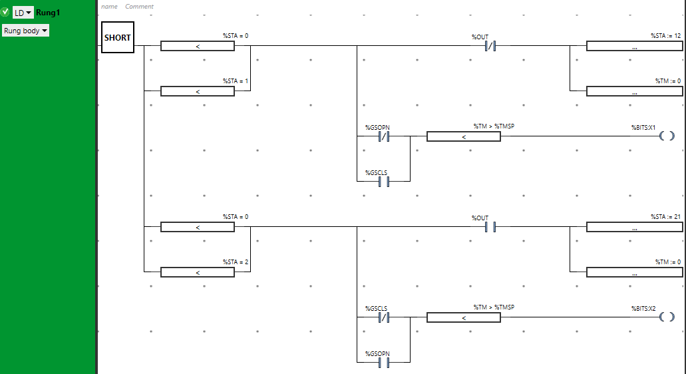

рис.10.12. Фрагмент програми для реалізації станів 0, 1 і 2

У цьому фрагменті реалізована поведінка в станах 0, 1 та 2:

- якщо у стані відкритий (1) або ініціалізації (0) відсутній вихід `OUT`, значення часу (`%TM`) стану обнуляється і стан переходить в значення 12 - закривається;

> значення 12 і 21 взято для зручності читання, і читається як перехід з 1 в 2, та перехід з 2 в 1 відповідно;

- якщо у стані відкритий (1) вмикається кінцевик ЗАКРИТО або відключається кінцевик ВІДКРИТО, то це очевидно помилка датчика; при цьому перевіряється, що стан тримається протягом максимального часу переходу між станами

> зверніть увагу, що як тільки у відкритому стані вікдлючиться вихід - спочатку обнулиться час кроку, а потім вже відбудеться перевірка датчиків, тому в цій ситуації помилка датчика не відловиться

> зверніть увагу, що замість булевих змінних можна використовувати біти слів, так запис `%BITS:X1`вказує на використання 1-го біту в слові `%BITS`    

Аналогічно реалізовані переходи та перевірка для закритого стану.  


- У програму реалізації функціонального блоку добавте фрагмент, який показано на рис.10.13.  


рис.10.13. Реалізація перехідного режиму.

У перехідних станах (21 і 12) перевіряється час стану (рис.10.13). Якщо цей час `%TM` більше заданого максимального `%TMSP` спрацьовує відповідний вихід тривоги. Перехідний стан завершується при спрацюванні відповідних датчиків, при цьому обнуляється час стану, саме присвоєння новому стану йде в наступному ланцюгу (див. рис.10.14). Якщо у перехідному стані, команда змінюється, то стан переходить в інший перехідний (наприклад з 21-го в 12-й при відключенні `OUT`).

Наступний фрагмент коду реалізує перехід в кінцеві стани при відповідних умовах, а також спрацювання виходу тривоги помилки датчика або довільного зсуву.   

- У програму реалізації функціонального блоку добавте фрагмент, який показано на рис.10.14.  


рис.10.14. Реалізація переходу в кінцеві стани та контроль помилок.  

- У програму реалізації функціонального блоку добавте фрагмент, який показано на рис.10.15.  

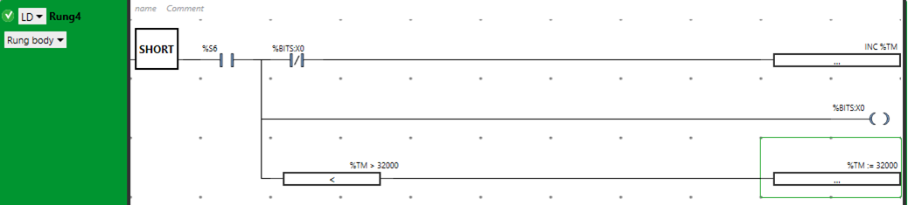

рис.10.15. Реалізація часу кроку. 

Час кроку реалізується через змінну `%TM`, яка збільшується з кожною секундою. Для цього використаний бітовий меандр `%S6` , який протягом `0.5` секунд тримає логічну одиницю, і стільки ж логічний нуль.  У М221 не можна ловити фронти на системних бітах, тому для відлову переходів з `0` в `1` треба зберігати попереднє значення `%S6` в 0-му біті внутрішнього слова `%BITS`. 

Важливо зробити обмеження збільшення часу `%TM`, так як при досягненні верхньої межи додатного значення (32767), змінна перейди у від'ємне значення. Тут плинне значення використовується більше для контролю перехідних станів, тому обмеження в `8` з чимось годин (32000/60/60) для цих задач цілком достатньо. При необхідності більшого часу, необхідно реалізовувати додаткові лічильники, або використовувати змінну типу `DWORD`.  

#### 11. Створення програми користувача з функціональними блоками

- У основній програмі користувача створіть фрагмент для керування одним клапаном (рис.10.16). Функціональний блок користувача вставляється через відповідний пункт меню (рис.10.17)


рис.10.16. Використання функціонального блоку користувача для одного клапану

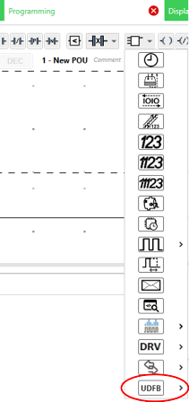

рис.10.17. Вставлення функціонального блоку користувача

У першому `Rung` виставляється уставка часу (5 секунд) для клапану `%VLV1`. У `Rung2` клапан функціонального блоку підключається до відповідних глобальних змінних. 

> Зверніть увагу, в даному прикладі виходи тривог записуються в біти слова `%MW`. Нерідко, засоби людино-машинного інтерфейсу сприймають біти тривог через 16-бітні слова. Сам процес записування булевих значень в біти слів називають "упакуванням".     

#### 12. Перевірка роботи програми користувача з функціональним блоком

- Складіть таблицю перевірки програми з функціональним блоком. 
- Перевірте роботу функціонального блоку на імітаторі ПЛК. 
- Зробіть копії екранів та таблиці для звітності.

#### 14. Експортування функціонального блоку

- Зробіть експортування функціонального блоку в окремий файл 

 

рис.10.18. Експортування функціонального блоку у файл

#### 15. Імпортування функціонального блоку у власну програму керування

- Відкрийте програму реалізації Вашого індивідуального варіанту на LD за лабораторної роботи  №6. 
- Зробіть імпортування функціонального блоку у Ваш проект

#### 16. Дороблення програми користувача

У Вашому завданні є дискретні клапани або двигуни. 

- Для клапанів: Модифікуйте програму так, щоб виконувалась перевірка закривання та відкривання клапану перед переходом до наступних кроків. 

- Для двигунів (якщо дискретних клапанів немає): модифікуйте функціональний блок та програму так, щоб виконувалась перевірка спрацювання двигуна (зворотній сигнал по контакту від контактору).  

У випадку не зрозумілості постановки завдання, уточніть завдання у викладача.

- Модифікуйте таблиці перевірки так, щоб вони відповідали новій програмі користувача.
- Перевірте працездатність програми користувача.

#### 17. Дороблення функціонального блоку

**Це завдання не є обов'язковим для виконання. За успішного виконання цього завдання, студент отримує додаткові бали на іспиті**

- модифікуйте функціональний блок таким чином, щоб у нього був додатковий вхід з керуванням режимом імітації:
  - у нормальному режимі стан клапану залежить від значення датчиків кінцевого положення
  - у режимі імітації, значення датчиків для автомату станів не має значення, а час переходу між станами відбувається з часом `%TMSP-1`

### Питання до захисту

1. Коли виникає необхідність у створенні власних функціональних елементів?
2. Розкажіть про інтерфейс та область видимості.
3. Що таке функції?
4. Що таке вхідні та вихідні параметри функціональних елементів?
5. Поясніть поняття "формальні параметри" та "фактичні параметри".
6. Назвіть кілька функцій з бібліотеки системних функцій.
7. Що таке функції користувача? Навіщо в лабораторній роботі створювалася функція користувача?
8. Що таке локальна змінна функції?
9. Чим функціональний блок принципово відрізняється від функції?
10. Розкажіть про призначення функціонального блоку, який реалізований в даній лабораторній роботі.
11. Поясніть програмну реалізацію функціонального блоку, який реалізований в даній лабораторній роботі.  


Розробив лабораторну - Олександр Пупена. [АКТСУ НУХТ](http://www.iasu-nuft.pp.ua)

| [<- до лаборних робіт](README.md) | [на основну сторінку курсу](../README.md) |
| --------------------------------- | ----------------------------------------- |
|                                   |                                           |