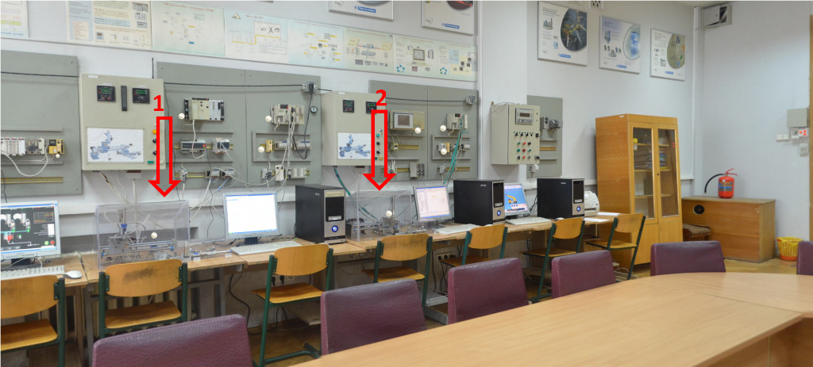
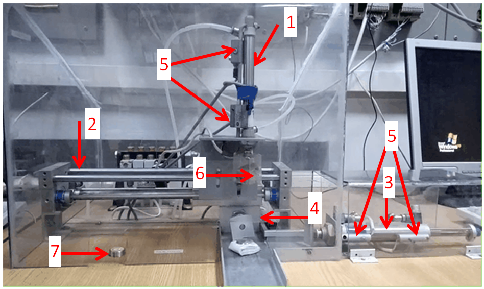
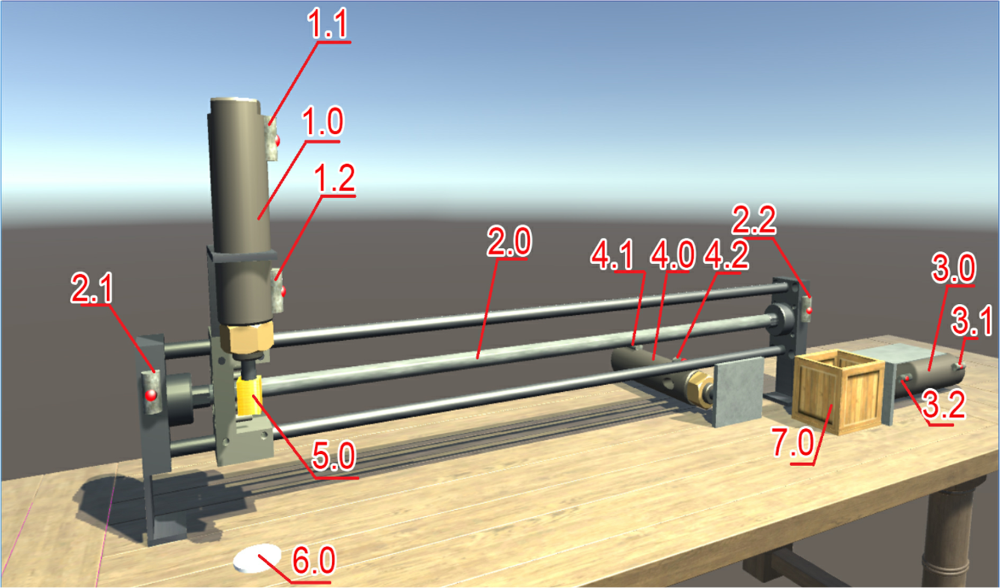
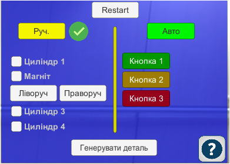
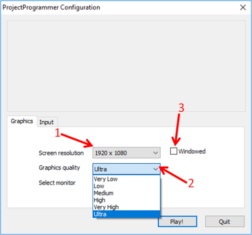
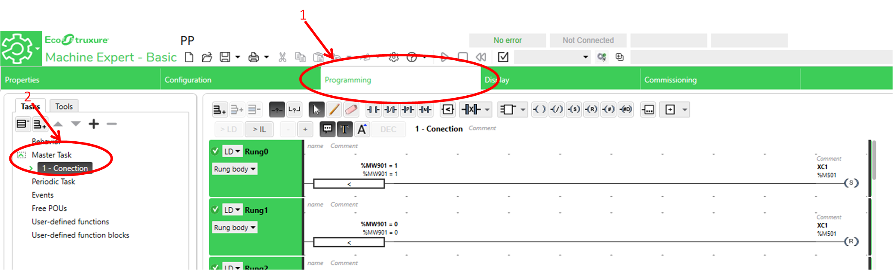
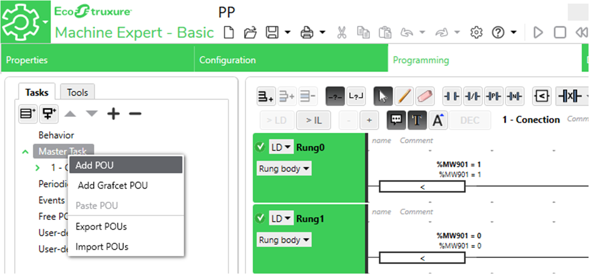
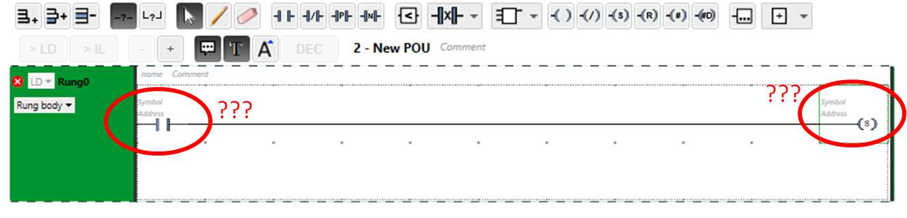
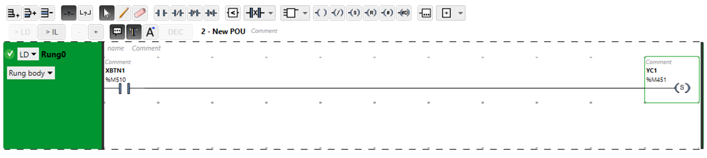
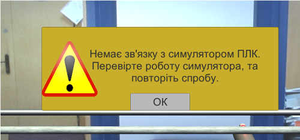

| [на основну сторінку курсу](../README.md) | [лабораторні](README.md) |
| ----------------------------------------- | ------------------------ |
| [<-ЛР6](lab6_FB.md)                       | [ЛР8->](lab8_SFC.md)     |

## Лабораторна робота 7. Керування роботизованою установкою.

**Мета:** навчитися створювати програми користувача на мові LD для керування роботизованою установкою.

**Необхідне програмне забезпечення.** EcoStruxure Machine Expert Basic

### Опис роботи установки.

#### 1. Опис роботи реальної установки.

При виконанні даної лабораторної роботи студенти виконують розробку прикладного програмного забезпечення ПЛК для керування роботизованою навчальною установкою (рис. 7.1)

Рис. 7.1 Розміщення навчальних установок в навчальній лабораторії

Даний маніпулятор складається з таких елементів (рис. 7.2):

Рис. 7.2 Опис функціональних елементів

- 1-4 - пневмоциліндри - для здійснення переміщень ;
- 5 - герконові датчики кінцевого положення - дискретні датчики, які призначені для відслідковування поточного положення кожного пневмоциліндра (по 2 датчика на кожен пневмоциліндр, для сигналізації кожного із кінцевих положень)
- 6 електромагніт - може захоплювати невеликі металеві елементи (найчастіше монетки)
- 7 датчик наявності металевих елементів (монетки) - дискретний датчик спрацьовує, коли поруч з ним знаходиться металевий елемент.

Один з можливих алгоритмів роботи установки показано на анімаційному рисунку 7.3.

Рис. 7.3 Демонстрація роботи лабораторної установки

Після натискання кнопки "Пуск" і за умови наявності металевої деталі на датчику наявності деталі 7. Необхідно перемістити електромагніт за допомогою пневмоциліндра 2 в положення "ліворуч", далі за допомогою пневмоциліндра 1 здійснюється переміщення електромагніту "вниз" до деталі. Після цього електромагніт вмикається. Далі електромагніт із захопленою металевою деталлю піднімається у "верхнє" положення за допомогою пневмоцилінда 1. Переміщується в положення "праворуч" за допомогою пневмоциліндра 2. За допомогою пневмоциліндра 1 електромагніт з деталлю опускається в "нижнє" положення. Електромагніт відключається і повертається у "верхнє" положення за допомогою пневмоциліндра 1. За допомогою пневмоциліндру 4 деталь виштовхується "вперед" і пневмоциліндр 4 повертається у вихідне положення. Цикл повторюється.

Для керування даною установкою з контролера. Усі його функціональні елементи підключено до відповідних входів/виходів ПЛК М221.

Таким чином конфігурація ПЛК буде наступною:

- Дискретні входи: кнопка "Пуск", 8 датчиків кінцевого положення (по 2 на кожен пневмоциліндр), датчик наявності металевих деталей.

- Дискретні виходи: сигнал керування електромагнітом, 5 сигналів керування пневмоциліндрами. 

  **Зверніть увагу, пневмоциліндр 2 - є бістабільним, тобто для керування ним потрібно 2 сигнали: один - для руху ліворуч, інший, для руху праворуч.**

  **Інші циліндри є моностабільними, тобто керуються одним дискретним сигналом - логічна "1" - пневмоциліндр у витягнутому положенні, логічний "0" - у початковому (засунутому).**

#### 4.2. Опис роботи віртуальної установки.

Оскільки доступ до реального лабораторного стенду може бути відсутнім було розроблену віртуальну  повнофункціональну модель даного лабораторного стенду(рис. 7.4):

Рис. 7.4. Загальний вигляд віртуального лабораторного стенду

Віртуальний лабораторний стенд умовно ділиться на 2 частини: 

1 - безпосередньо візуальна модель лабораторної установки;

2 - панель керування установкою

Один з можливих алгоритмів роботи віртуальної установки показано на анімаційному рисунку 7.5.

Рис. 7.5 Демонстрація роботи віртуальної лабораторної установки

Функціонально дана установка складається з таких елементів (Рис. 7.6):

Рис. 7.6 Позначення функціональних елементів віртуальної установки

Таблиця 7.1. Опис елементів установки

| **Позначення** | **Опис**                                                     |
| -------------- | ------------------------------------------------------------ |
| 1.0            | Пневмоциліндр з моностабільним  керуванням (сигнал «1» - пряма дія, сигнал «0» зворотна дія) |
| 1.1            | Датчик кінцевого положення  пневмоциліндра 1.0               |
| 1.2            | Датчик кінцевого положення  пневмоциліндра 1.0               |
| 2.0            | Пневмоциліндр з бістабільним  керуванням (має два сигнали керування перший для переміщення «праворуч»,  другий для переміщення «ліворуч») |
| 2.1            | Датчик кінцевого положення  пневмоциліндра 2.0               |
| 2.2            | Датчик кінцевого положення  пневмоциліндра 2.0               |
| 3.0            | Пневмоциліндр з моностабільним  керуванням (сигнал «1» - пряма дія, сигнал «0» зворотна дія) |
| 3.1            | Датчик кінцевого положення  пневмоциліндра 3.0               |
| 3.2            | Датчик кінцевого положення  пневмоциліндра 3.0               |
| 4.0            | Пневмоциліндр з моностабільним  керуванням (сигнал «1» - пряма дія, сигнал «0» зворотна дія) |
| 4.1            | Датчик кінцевого положення  пневмоциліндра 4.0               |
| 4.2            | Датчик кінцевого положення  пневмоциліндра 4.0               |
| 5.0            | Електромагніт (сигнал «1»  - включити, сигнал «0» відключити) |
| 6.0            | Датчик наявності деталі                                      |
| 7.0            | Коробка для деталей                                          |

Робота з віртуальним стендом відбувається з панелі керування (рис. 7.7).

Рис. 7.7. Панель керування віртуальним лабораторним стендом

Віртуальний лабораторний стенд може функціонувати у двох режимах **"Ручний"** і **"Автоматичний"**

Переключення між цими двома режимами відбувається за допомогою відповідних кнопок **"Руч."** і **"Авто"**.

В **ручному** режимі користувач може керувати усіма функціональними елементами з панелі керування на власний розсуд за допомогою наступних кнопок:

- **"Циліндр 1"** - керування пневмоциліндром 1;

- **"Магніт"** - керування магнітом (вкл/викл);
- **"Ліворуч"/"Праворуч"** - керування пневмоциліндром 2;
- **"Циліндр 3"**- керування пневмоциліндром 3;
- **"Циліндр 4"**-керування пневмоциліндром 4;

У **автоматичному** режимі керування стендом відбувається із ПЛК відповідно до закладеного у нього алгоритму.

Для автоматичного режиму передбачено дві вільнопрограмовані кнопки: **"Кнопка 1" і "Кнопка 2"**, їх призначення визначає розробник програми для ПЛК.

**Зверніть увагу, "Кнопка 3" у даній версії віртуального стенду не задіяна!!!**

За допомогою кнопки **"Генерувати деталь"** можна створити деталь для подальшого використання. Працює як в **ручному** так і в **автоматичному** режимі.

Кнопка **"Restart"** - скидає роботу лабораторного стенду до початкового стану.

Кнопка із зображенням знаку запитання відкриває сторінку з довідковою інформацією.

### Порядок виконання роботи

#### 1. Завантаження віртуальної установки.

- Завантажте віртуальну установку за [посиланням](https://romamirkevich.github.io/PLCBeginner/%D0%9B%D0%B0%D0%B1%D0%BE%D1%80%D0%B0%D1%82/media4/pp.rar) і розархівуйте завантажений архів.

- У тому місці, куди Ви розархівували завантажений архів знайдіть папку **"ProjectProgrammer_V1.3"**, всередині даної папки знаходиться виконуваний файл **"ProjectProgrammer_V1.3.exe"**, який необхідно запустити.

- Перед запуском віртуальної лабораторної установки відкриється конфігураційне вікно (рис. 7.8)

Рис. 7.8. Вікно початкової конфігурації віртуального лабораторного стенду

У даному вікні є можливість обрати розподільчу здатність програми (1), а також якість відображення графіки в програмі (2). 

**Зверніть увагу, що чим більша якість відображуваної графіки - тим більше потребується комп'ютерних ресурсів на роботу програми. У випадку, коли обчислювальних ресурсів вашого комп'ютера буде недостатньо, може спостерігатися сповільнена робота віртуального стенду. У такому випадку рекомендується понизити рівень налаштувань якості графіки, а також розподільчу здатність програми.**

За допомогою опції (3) можна обрати, як саме буде запускатись віртуальна установка - в повноекранному чи у віконному.

Працездатність даної лабораторної установки протестовано на комп'ютерах з ОС Windows 10 x64

#### 2. Робота з віртуальною установкою в ручному режимі.

- У ручному режимі за допомогою панелі керування перевірте роботу кожного з фукнкціональних елементів віртуального стенду.

- У ручному режимі за допомогою панелі керування виконайте наступну задачу. 
  - За допомогою пневмоциліндру 3 підготуйте одну коропку для подальшої її наповнення деталями.

  - За допомогою кнопки "Генерувати деталь" створіть одну деталь і перемістіть її в підготовлену коробку за допомогою панелі керування.
  - Аналогічним чином перемістіть у дану коробку ще дві деталі (загальна кількість деталей у коробці має бути 3).
  - За допомогою пневмоциліндру 4 перемістіть коробку "вперед" і підготуйте наступну коробку для наступного циклу роботи.
  - Для того, щоб скинути програму в початковий стан скористайтеся кнопкою **"Restart"**.

#### 3. Опис розробки програми ПЛК для керування віртуальною лабораторною установкою

- Ознайомтеся з особливостями побудови програми користувача для ПЛК при роботі з віртуальною установкою.

Для того, щоб мати можливість прив'язати розроблювану програму для ПЛК з віртуальною установкою має існувати певний інформаційний зв'язок між віртуальним стендом і симулятором ПЛК М221. Віртуальний лабораторний стенд має можливість підключатися до симулятора ПЛК М221 за допомогою протоколу **Modbus**.

#### 4. Завантаження проекту-шаблону.

Для того, щоб організувати правильний обмін даними між стендом і контролером було створено спеціальний проект-шаблон, який вже містить програму для обміну даними з віртуальним лабораторним стендом, а також у ньому визначено перелік змінних з якими Вам доведеться працювати.

- Знайдіть, у тому місці де було розархівовано раніше завантажений архів, файл проекту-шаблону **PP.smbp** та відкрийте його.

- Ознайомтеся, зі вмістом даного проекту, переконайтеся, що вкладка **Programming** містить в розділі **Master Task** програму **"1 Connection"** (рис. 7.9).

Рис. 7.9. Вміст проекту-шаблону для програмування віртуального лабораторного стенду.

#### 5. Розробка програми керування

- Для того, щоб почати програмувати роботу віртуального лабораторного стенду необхідно в даному проекті створити нову програму **POU**. (рис. 7.10);

Рис. 7.10. Створення POU.

В створеній програмі буде реалізований простий алгоритм:
- Після натискання програмованої кнопки "Кнопка 1" необхідно опустити електромагніт у нижнє положення.
- При досягненні нижнього положення необхідно підняти магніт у початкове положення.

Відповідно до поставленого завдання програма буде складатися з двох умов і двох дій. Перша частина алгоритму буде звучати наступним чином: "При спрацюванні **Кнопка 1** необхідно увімкнути **Пневмоциліндр 1**"

- Запишіть даний фрагмент програми на мові LD (рис. 7.11). 

**Але в такому випадку має виникнути питання адресації. А точніше, до яких адрес пам'яті контролера необхідно звернутися для того, щоб прочитати стан "Кнопка 1", та подати сигнал керування на "Циліндр 1"**?

Рис. 7.11. Фрагмент програми керування

Відповідь на дане питання надає таблиця 7.2. у якій описані всі сигнали і відповідні їм в проекті символьні назви змінних.

Таблиця 7.2 опис змінних ПЛК

| **Позначення** **на рис. 4.6** | **Опис**                                                     | **Назва змінної ПЛК (**Symbol) |
| ------------------------------ | ------------------------------------------------------------ | ------------------------------ |
|                                | Кнопка  1 – вільно програмована кнопка                       | XBTN1                          |
|                                | Кнопка  2 – вільно програмована кнопка                       | XBTN2                          |
| 1.0                            | Пневмоциліндр з моностабільним  керуванням (сигнал «1» - пряма дія, сигнал «0» зворотна дія) | YC1                            |
| 1.1                            | Датчик кінцевого положення  пневмоциліндпа 1.0               | XNC1                           |
| 1.2                            | Датчик кінцевого положення  пневмоциліндпа 1.0               | XC1                            |
| 2.0                            | Пневмоциліндр з бістабільним  керуванням (має два сигнали керування перший для переміщення «праворуч»,  другий для переміщення «ліворуч») | YC2 (праворуч)  YNC2 (ліворуч) |
| 2.1                            | Датчик кінцевого положення  пневмоциліндпа 2.0               | XNC2                           |
| 2.2                            | Датчик кінцевого положення  пневмоциліндпа 2.0               | XC2                            |
| 3.0                            | Пневмоциліндр з моностабільним  керуванням (сигнал «1» - пряма дія, сигнал «0» зворотна дія) | YC3                            |
| 3.1                            | Датчик кінцевого положення  пневмоциліндпа 3.0               | XNC3                           |
| 3.2                            | Датчик кінцевого положення  пневмоциліндпа 3.0               | XC3                            |
| 4.0                            | Пневмоциліндр з моностабільним  керуванням (сигнал «1» - пряма дія, сигнал «0» зворотна дія) | YC4                            |
| 4.1                            | Датчик кінцевого положення  пневмоциліндпа 4.0               | XNC4                           |
| 4.2                            | Датчик кінцевого положення  пневмоциліндпа 4.0               | XC4                            |
| 5.0                            | Електромагніт (сигнал «1»  - включити, сигнал «0» відключити) | YMAG                           |
| 6.0                            | Датчик наявності деталі                                      | XDET                           |
| 7.0                            | Коробка для деталей                                          |                                |

Таким чином, з таблиці 7.2 видно, що за програмовану кнопку "Кнопка 1" відповідає змінна XBTN 1. А сигналом керування пневмоциліндром 1 є змінна YC1.

Тому наведений на рис. 7.11. набуде наступного вигляду:

Рис. 7.12. Фрагмент програми керування

**Зверніть увагу, що символьні назви змінних необхідно вводити в поле Symbol, а не в поле Address.**

- Аналогічно реалізовуйте другу частину алгоритму, яка буде звучати наступним чином: "при спрацюванні датчика кінцевого положення пневмоциліндра 1 (пневмоциліндр у висунутому положенні) необхідно вимкнути **Пневмоциліндр 1**".

Згідно таблиці 7.2 необхідному датчику кінцевого положення в програмі відповідатиме змінна **ХС1**.

Таким чином програма керування виглядатиме наступним чином:

Рис .7.13. Фрагмент програми керування

#### 6. Перевірка роботи алгоритму

- Запустіть імітатор ПЛК та переведіть його в **RUN.**

- Переведіть віртуальний лабораторний стенд в автоматичний режим за допомогою кнопки **"Авто"**.

У випадку, якщо симулятор ПЛК не запущено, або якщо через інші проблеми віртуальний лабораторний стенд не зможе підключитися до симулятора ПЛК, з'явиться повідомлення про **помилку** (рис. 7.14).

Рис. 7.14. Можлива помилка при переході в автоматичний режим

- Якщо помилки не виникло можна перевірити роботу розробленої програми натисканням програмованої кнопки "Кнопка 1". Пневмоциліндр 1 має висунути свій шток і при досягненні кінцевого положення автоматично повернутися у початкове положення.

- За роботою програми можна спостерігати в режимі "Онлайн", розмістивши поруч вікна віртуального лабораторного стенду та редактора Machine Expert Basic (рис. 7.15)

Рис. 7.15 Візуалізація роботи розробленого алгоритму керування

#### 7. Опис задачі роботи віртуальної установки для самостійного виконання

- У відповідності до функціональних можливостей віртуального лабораторного стенду і засвоєного матеріалу з поточної дисципліни пропонується розв'язати задачі програмування трьох рівнів складності:

**Задача базового рівня складності:**

Необхідно розробити програму для ПЛК по керуванні роботою віртуальним лабораторним стендом за наступним алгоритмом:

- При натисканні "Кнопка 1" і за умови наявності деталі на датчику наявності деталі необхідно опустити магніт у нижнє положення. 
- Підняти магніт з деталлю у верхнє положення
- Перемістити магніт з деталлю праворуч
- Опустити магніт з деталлю у нижнє положення
- зробити витримку часу - 3 секунди
- відключити магніт
- підняти магніт
- За допомогою Пневмоциліндра 4 виштовхнути деталь вперед
- Повернути пневмоциліндр 4 у початкове положенні і одночасно перемістити магніт у положення ліворуч
- цикл повторюється

**Задача середнього рівня складності:**

Необхідно розробити програму для ПЛК по керуванні роботою віртуальним лабораторним стендом за наступним алгоритмом:

- При натисканні "Кнопка 1" і за умови наявності деталі на датчику наявності деталі необхідно 
- Підготувати коробку для деталі за допомогою пневмоциліндра 3 (висунути шток і повернути у вихідне положення)
- опустити магніт у нижнє положення. 
- Підняти магніт з деталлю у верхнє положення
- Перемістити магніт з деталлю праворуч
- Опустити магніт з деталлю у підготовлену коробку
- зробити витримку часу - 3 секунди
- відключити магніт
- підняти магніт
- За допомогою Пневмоциліндра 4 виштовхнути коробку з деталлю вперед
- Повернути пневмоциліндр 4 у початкове положення і одночасно перемістити магніт у положення ліворуч
- цикл повторюється

**Задача високого рівня складності:**

Необхідно розробити програму для ПЛК по керуванні роботою віртуальним лабораторним стендом за наступним алгоритмом:

- При натисканні "Кнопка 1" і за умови наявності деталі на датчику наявності деталі необхідно 
- Підготувати коробку для деталі за допомогою пневмоциліндра 3 (висунути шток і повернути у вихідне положення)
- опустити магніт у нижнє положення. 
- Підняти магніт з деталлю у верхнє положення
- Перемістити магніт з деталлю праворуч
- Опустити магніт з деталлю у підготовлену коробку
- зробити витримку часу - 3 секунди
- відключити магніт
- підняти магніт
- **всього в 1 коробку необхідно помістити 3 деталі**
- За допомогою Пневмоциліндра 4 виштовхнути коробку з трьома деталями вперед
- Повернути пневмоциліндр 4 у початкове положення і одночасно перемістити магніт у положення ліворуч
- цикл повторюється

**Зверніть увагу, що віртуальний лабораторний стенд знаходиться в стадії розробки і тестування тому цілком можлива ситуація, коли коробки будуть застрягати, чи магніт буде повертатись "лівіше" свого крайнього лівого положення. У таких випадках рекомендується скинути програму кнопкою "Restart".**

#### 8. Робота з реальною установкою

Після тестування програми на віртуальній установці необхідно перевірити розроблений алгоритм на реальній установці в лабораторії. 

- У програмі замініть змінні з таблиці 7.2 на адреси змінних, що відповідають за актуальне підключення датчиків і сигналів пневмоциліндрами до ПЛК. 
- Перевірте конфігурацію процесорного модуля в проекті.

### Питання до захисту

1. Розкажіть про лабораторну установку.
2. Як відбувається прив'язка програми користувача в EcoStruxure Machine Expert Basic до віртуальної установки. 
3. Розкажіть про алгоритм роботи програми користувача з віртуальною установкою, який був вибраний Вами для реалізації.
4. Розкажіть про усі контакти і котушки, які були використані при створенні програми користувача. Чому були вибрані саме вони?
5. Розкажіть про усі функціональні блоки які були використані при створенні програми користувача. Чому були вибрані саме вони?

**Приклад роботи з віртуальним стендом можна подивитися у наступному відео:** https://youtu.be/AlzEJIRDaIQ

<iframe width="560" height="315" src="https://www.youtube.com/embed/AlzEJIRDaIQ" frameborder="0" allow="accelerometer; autoplay; encrypted-media; gyroscope; picture-in-picture" allowfullscreen></iframe>

Розробив лабораторну - Полупан Володимир. [АКТСУ НУХТ](http://www.iasu-nuft.pp.ua)

| [на основну сторінку курсу](../README.md) | [лабораторні](README.md) |
| ----------------------------------------- | ------------------------ |
| [<-ЛР6](lab6_FB.md)                       | [ЛР8->](lab8_SFC.md)     |