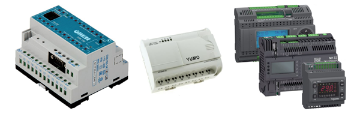
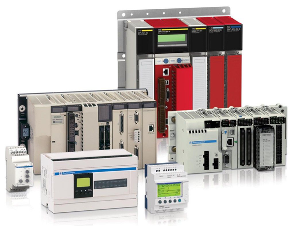
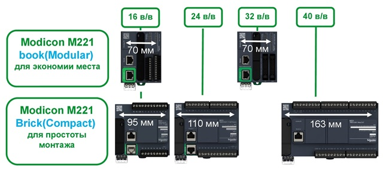
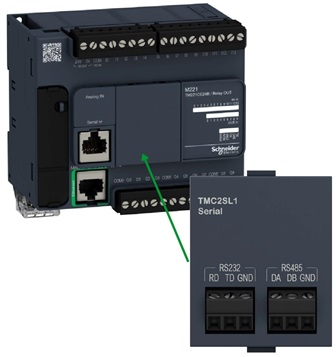

[Перейти до списку лекцій](README.md)

# Фізична структура ПЛК М221 

## Загальна структура ПЛК

ПЛК (програмований логічний контролер) - електронний мікропроцесорний засіб, що використовується для автоматизації технологічних процесів. Він спеціально розроблений для використання у виробничих умовах. ПЛК постійно контролює стан пристроїв вводу та приймає рішення на основі програми користувача для управління станом вихідних пристроїв.

ПЛК повинен відповідати певним вимогам:

- Робота в «жорсткому» реальному часі;
- Тривала автономна робота без обслуговування;
- Стійкість до факторів навколишнього середовища;
- Можливість швидкої заміни компонентів;
- Прості в розумінні мови програмування;
- Можливість перепрограмування «в полі»;
- Можливість обміну даними зі сторонніми пристроями.

ПЛК забезпечує обробку вхідної інформації з об’єкту управління (вхідних змінних процесу) та формування управляючих дій (вихідних змінних процесу) відповідно до програми користувача, яку створює розробник системи управління.

За конструктивним виконанням ПЛК ділять на моноблочні і модульні. У корпусі моноблочного ПЛК поряд з ЦП, пам'яттю і блоком живлення розміщується фіксований набір входів / виходів. У модульних ПЛК використовують модулі входів / виходів, що  встановлюються окремо. Згідно з вимогами МЕК 61131, їх тип і кількість можуть змінюватися в залежності від поставленого завдання і оновлюватися з плином часу. 

Моноблочні ПЛК:

Модульні ПЛК:

Основні типи модулів ПЛК:

- Блок живлення (PS);

- Центральний процесор (CPU);

- Сигнальні модулі;

- Модулі доступу до промислових мереж;

- Спеціальні модулі.

  

  

  

Джерело живлення може бути вбудованим в основний блок ПЛК, але частіше виконаний у вигляді окремого блоку живлення (БЖ), що закріплюється поруч на стандартній рейці.

CPU - центральний компонент ПЛК. Виконує наступні функції:

- Забезпечує виконання програми користувача;
- Забезпечує циклічне опитування вхідних даних і запис вихідних;
- Виконує діагностику ПЛК в цілому;
- Зберігає програму користувача і всі дані системи.

Модулі DI відрізняються:

- Величиною і типом фізичного сигналу (24 VDC, 220 VAC ...);
- Наявністю спеціальних функцій;
- Максимальною кількістю оброблюваних сигналів.

Модулі DO відрізняються:

- Величиною і типом фізичного сигналу (24 VDC, 220 VAC ...);
- Наявністю спеціальних функцій;
- Максимальною кількістю оброблюваних сигналів;
- Максимальним струмом вихідного сигналу;
- Типом виходу.

Типи дискретних вихідних сигналів

Позитивна і негативна логіка підключення DI

Позитивна і негативна логіка підключення DO

Модулі АI відрізняються:

- Величиною і типом оброблюваного сигналу (0-10 В, 4-20 мА, pt100 ...;
- Наявністю гальванічної розв'язки між каналами;
- Максимальною кількістю оброблюваних сигналів;
- Роздільною здатністю АЦП.

Модулі АO відрізняються:

- Величиною і типом оброблюваного сигналу (0-10 В, 4-20 мА ...);

- Наявністю гальванічної розв'язки між каналами;

- Максимальною кількістю оброблюваних сигналів;

- Роздільною здатністю ЦАП.

  

  

Модулі промислових мереж, призначені для забезпечення можливості зв'язку за певними стандартами промислових мереж, наприклад ModBus RTU, ProfiBus, CanOpen ...
Існують такі типи FieldBus модулів:

- Фізичний інтерфейс без логіки (наприклад RS485);
- Фізичний інтерфейс з логікою (наприклад CanOpen Master)

Спеціальні модулі, призначені для виконання специфічних завдань. Вони мають вбудовані апаратні механізми для реалізації певного функціоналу.
Існують такі типи спеціальних модулів:

- Спеціальні DI, DO, AI, AO;
- Модулі для незалежного управління.

Один ПЛК може обробити від десятків сигналів I/O до сотень тисяч сигналів I/O, в залежності від типу.  Залежно від максимально можливої кількості входів-виходів всі ПЛК поділяють на: 

- мікро -до 64;
- малі -до 128; 
- середні -до 512; 
- великі -до 1024; 
- надвеликі - понад 1024.

Для реалізації  великих проектів може використовуватись архітектура з декількома ПЛК.

## Структура ПЛК М221

M221 - Швидкодія і можливості:

- Пряма заміна Twido;
- 5 раз ШВИДШЕ ніж Twido;
- 10 рази БІЛЬШЕ пам'яті ніж Twido;
- SD-карта;
- USB-порт програмування;
- Перемикач RUN / STOP;
- Живлення по USB.

М221 - Картриджі розширення:

- 2 аналогових входи/виходи:
  - 0-10 В;
  - 0-20/4-20 мА;
  - Термопари і термосопротивления.

М221 - Картридж послідовного зв'язку:

- RS232/485;
- Modbus RTU/ASCII;
- Символьний режим.

SoMachine Basic - основні можливості:

- Ladder/IL;

- Зв'язок з контролером через USB/Ethernet/Serial;

- Можливість конвертації проектів TwidoSuite;

- Збереження і повторне використання ділянок коду;

- Симуляція проекту;

- ПО поставляється безкоштовно.

## Модулі TM3

Повністю оновлена система входів/виходів TM3

TM3 - швидкодія:

- Час реакції:
  - 10 x швидше ніж TM2 (Типова конфігурація: 4 дискр. модуля, 2 аналог і 1 експертних);
- Швидкодія:
  - Частота шини 2 МГц замість 1 МГц;
  - Період тиші між байтами зменшений;
  - Зменшено час обробки аналогових сигналів;
- Авто адаптація:
  - Модулі TM2 і TM3 можуть застосовуватися спільно (швидкодія падає до рівня TM2);
- Простота:
  - 1 система модулів входів/виходів для 5 ПЛК та деяких HMI в майбутньому.

- Інтеграція з ПЛК;

- Інтеграція в ПО програмування.

  

