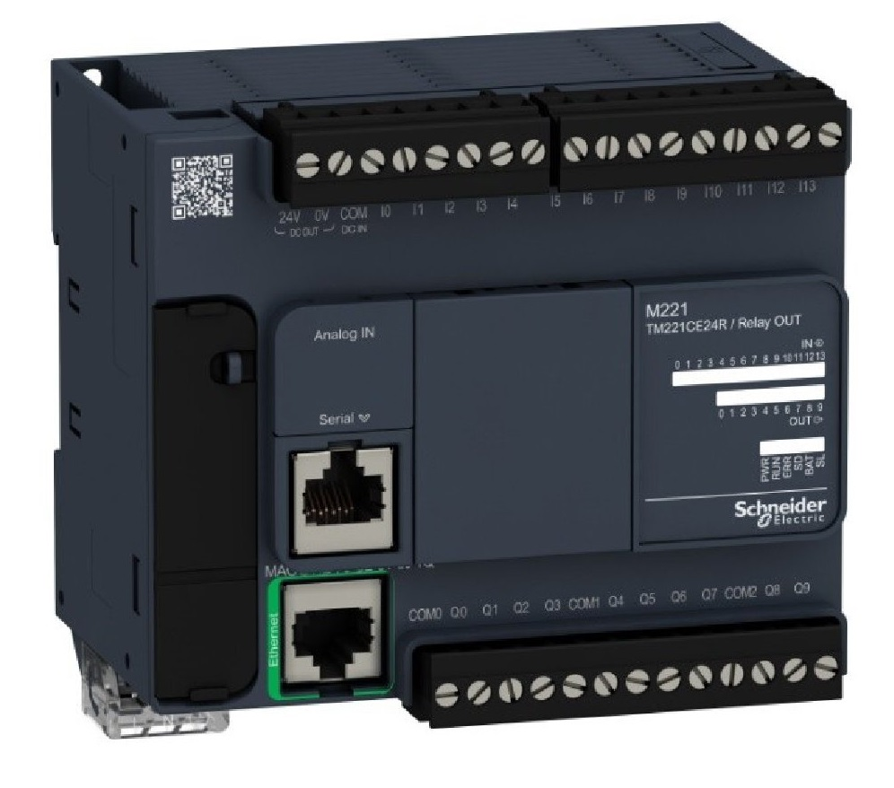
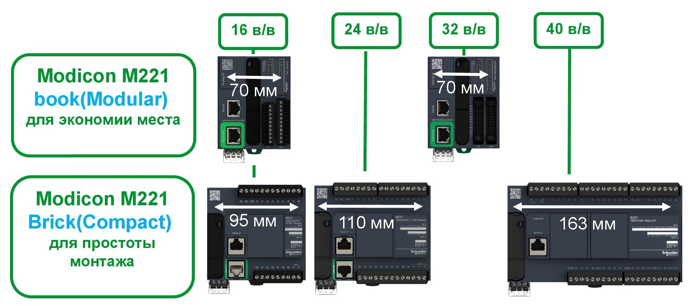
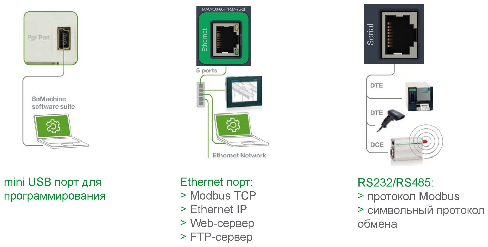
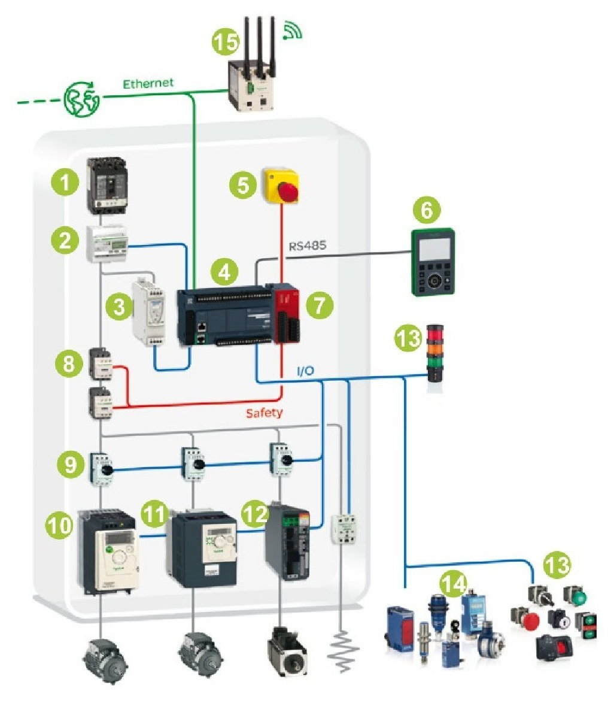
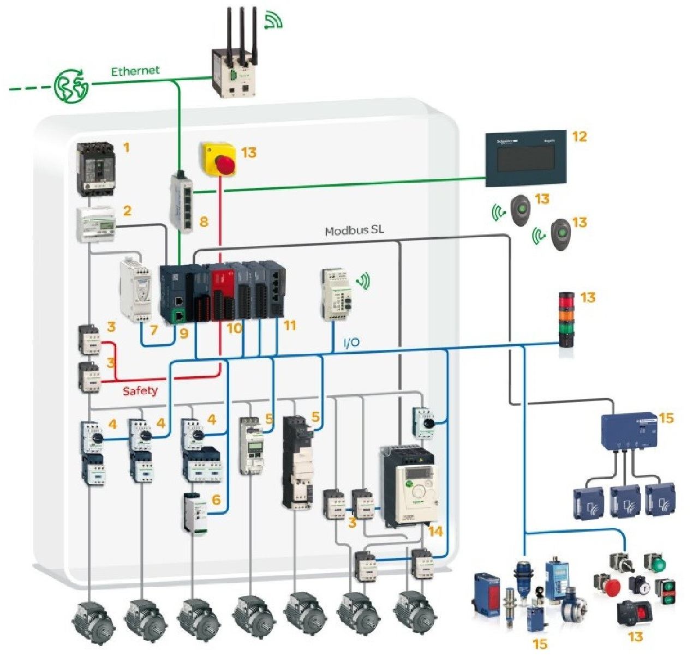

M221 - Швидкодія і можливості:

- Пряма заміна Twido;
- 5 раз ШВИДШЕ ніж Twido;
- 10 рази БІЛЬШЕ пам'яті ніж Twido;
- SD-карта;
- USB-порт програмування;
- Перемикач RUN / STOP;
- Живлення по USB.

М221 - Картриджі розширення:

- 2 аналогових входи/виходи:
  - 0-10 В;
  - 0-20/4-20 мА;
  - Термопари і термосопротивления.

М221 - Картридж послідовного зв'язку:

- RS232/485;
- Modbus RTU/ASCII;
- Символьний режим.

SoMachine Basic - основні можливості:

- Ladder/IL;

- Зв'язок з контролером через USB/Ethernet/Serial;

- Можливість конвертації проектів TwidoSuite;

- Збереження і повторне використання ділянок коду;

- Симуляція проекту;

- ПО поставляється безкоштовно.