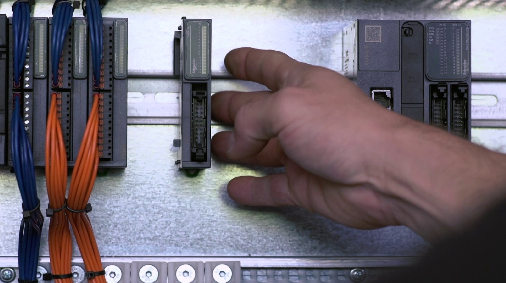
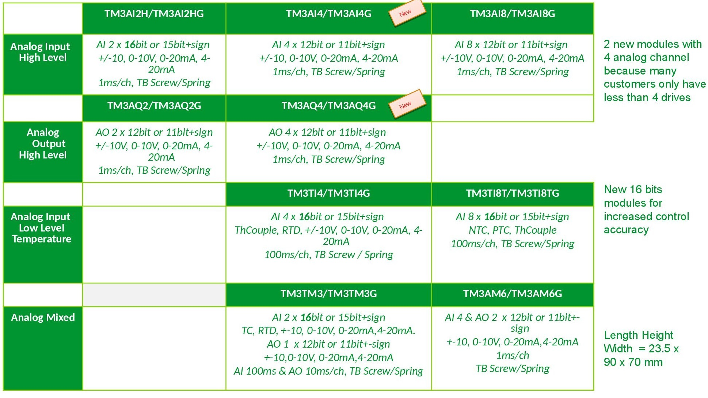

Повністю оновлена система входів/виходів TM3

TM3 - швидкодія:

- Час реакції:
  - 10 x швидше ніж TM2 (Типова конфігурація: 4 дискр. модуля, 2 аналог і 1 експертних);
- Швидкодія:
  - Частота шини 2 МГц замість 1 МГц;
  - Період тиші між байтами зменшений;
  - Зменшено час обробки аналогових сигналів;
- Авто адаптація:
  - Модулі TM2 і TM3 можуть застосовуватися спільно (швидкодія падає до рівня TM2);
- Простота:
  - 1 система модулів входів/виходів для 5 ПЛК та деяких HMI в майбутньому.

- Інтеграція з ПЛК;
- Інтеграція в ПО програмування.

