| [<- до лекцій](README.md)                | [на основну сторінку курсу](../README.md)          |
| ---------------------------------------- | -------------------------------------------------- |
| [<- Базові функціональні блоки](4_fb.md) | [Стано-орієнтоване програмування ->](statebase.md) |

# Використання експертних функціональних блоків 

## Експертні входи/виходи

Логічний контролер M221 забезпечує:
Чотири швидкі входи (% I0.0,% I0.1,% I0.6 і% I0.7)
Два швидкі виходи контролерів, що містять транзисторні виходи (% Q0.0 і % Q0.1)
Чотири швидкі виходи у контролерів TM221C40U і TM221CE40U (% Q0.0,% Q0.1,% Q0.2 і% Q0.3)

Контролери з релейними виходами не містять швидких виходів.

### Експертні входи

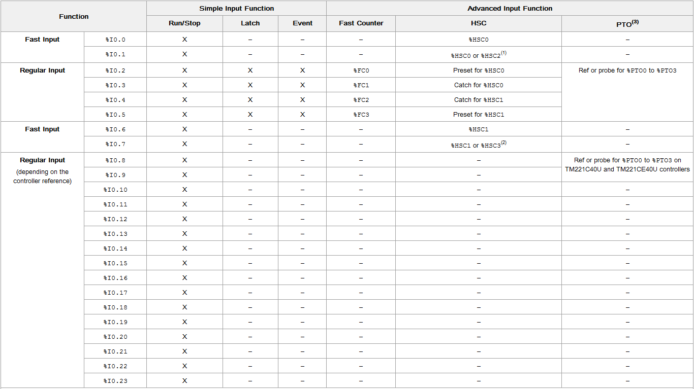

`X `Функція доступна

– Функція не доступна

(1) %HSC2 доступна при конфігурації %HSC0 як Single Phase чи Not  Configured.`

(2)  %HSC3 доступна при конфігурації %HSC1 як Single Phase чи Not  Configured.

(3) `Функція PTO fДоступна у контролерів з транзисторними виходами.

### Експертні виходи

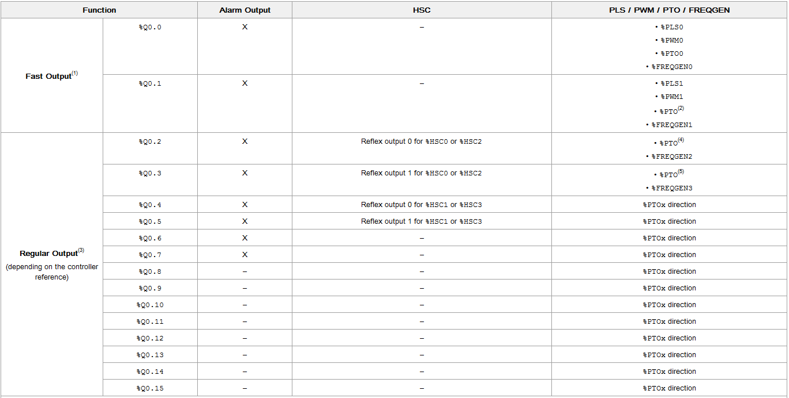

(1) Функція швидких виходів доступна лише  у контролерів з транзисторними виходами. 

(2) %PTO0 напрямок у режимі виходів [CW/CCW](javascript:void(0)), чи %PTO1 (не доступне якщо сконфігуровано %PTO0 у режимі виходів [CW/CCW](javascript:void(0)) ), чи %PTOx напрямок у інших випадках. 

(3) %Q0.2 і %Q0.3 швидкі виходи у контролерів  TM221C40U і TM221CE40U. 

(4) %PTO2 у контролерів  TM221C40U і TM221CE40U, чи %PTOx напрямок у інших випадках.  

(5) %PTO2 напрямок у режимі виходів [CW/CCW](javascript:void(0)) у контролерів TM221C40U і TM221CE40U, чи %PTO3 (не доступне якщо сконфігурован %PTO2 у режимі виходів [CW/CCW](javascript:void(0)) ) у контролерів TM221C40U і TM221CE40U, чи %PTOx напрямок у інших випадках.

## Fast Counter (Швидкий лічильник)

### Опис роботи

Функціональний блок Fast Counter виконує функції "лічильника вгору" або "лічильника вниз". Він може рахувати передні фронти цифрових входів частотою до 5 кГц в обчислювальному режимі з одним словом або з подвійним словом. Оскільки функціональні блоки Fast Counter управляються певними апаратними перериваннями, підтримка максимальної частоти дискретизації сигналу може змінюватися в залежності від конкретної програми та конфігурації обладнання.
Функціональні блоки Fast Counter % FC0, % FC1, % FC2 та % FC3 використовують визначені входи        % I0.2, % I0.3, % I0.4 та % I0.5 відповідно. Ці біти не зарезервовані виключно для Fast Counter, тому слід  враховувати, що вони можуть використовуватись іншими функціональними блоками.

| Параметр     | Можливі значення                    | Опис                                                         |
| ------------ | ----------------------------------- | ------------------------------------------------------------ |
| Used         | Використовується в програмі         | Якщо опція стоїть, цей функціональний блок (адреса) використовується в програмі |
| Address      | Адреса об'єкта (%FCi)               | Програма може вміщувати тільки обмежену кількість даних об'єктів. |
| Input        | %IO.i                               | Визначений вхід, пов'язаний з цим екземпляром функціонального блоку.  %IO.2...%IO.5 |
| Symbol       | Символьна назва                     | Символьна назва об'єкта, асоційованого  з швидким лічильником. |
| Configured   | Рахувати вверх чи вниз              | Можливі варіанти:                                                                               Не використовується                                                                      Рахувати вверх                                                                               Рахувати вниз |
| Preset       | Задане значення (%FCi.P чи %FCi.PD) | Може задаватись початкове значення:   Для режиму з одним словом через змінну %FCi.P  в діапазоні від 1 до 65535 ,  Для режиму з подвійним словом через змінну %FCi.PD в діапазоні від 1 до 4294967295. |
| Double  Word | Режим з подвійним словом            | Якщо опція стоїть, цей функціональний блок використовує режим з подвійним словом , інакше - з одним. |
| Comment      | Коментар                            | Створення коментаря, асоційованого  з швидким лічильником.   |

Функціональний блок швидкого лічильника має наступні входи/виходи: 

| Мітка | Значення                             | Опис                                                         |
| ----- | ------------------------------------ | ------------------------------------------------------------ |
| IN    | Вхід доступності                     | В стані "1" плинне значення оновлюється у відповідності до імпульсів на фізичному вході. В стані "0" плинне значення не змінюється. |
| R     | Вхід скидання лічильника             | Ініціалізація блоку. Якщо R дорівнює 1, встановлює плинне значення лічильника рівним 0 для лічильника вверх, встановлює значення %FC.P чи %FC.PD для лічильника вниз. Також онуляє вихід %FC.D. |
| D     | Індикатор досягнення уставки (вихід) | Виставляється в "1" якщо плинне значення %FCi.V чи %FCi.VD досягає значення уставки %FCi.P чи %FCi.PD для лічильника вверх, чи якщо плинне значення %FCi.V чи %FCi.VD досягають значення 0 для лічильника вниз. |

Fast Counters знаходяться в I/O Objects у розділі Tools  вкладки Programing.

Розглянемо роботу швидких лічильників на прикладі:

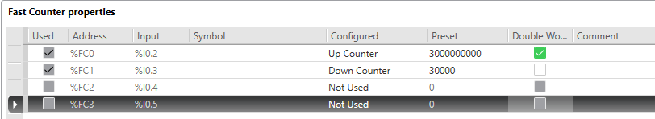

%FC0 змінюватиме плинне значення по фізичному входу %I0.2. Він налаштований як лічильник вверх, тому з кожним імпульсом на %I0.2 плинне значення (%FC0.VD) буде зростати на 1. При використанні режиму з подвійним словом значення уставки (%FC0.PD) можна виставити доволі великим.

%FC1 змінюватиме плинне значення по фізичному входу %I0.3. Він налаштований як лічильник вниз, тому з кожним імпульсом на %I0.3 плинне значення (%FC0.V) буде зменшуватись на 1. Використовується режим з одним словом і значення уставки (%FC0.P) виставлене рівним 30000.

Після конфігурації швидких лічильників використовуємо їх у програмі користувача.

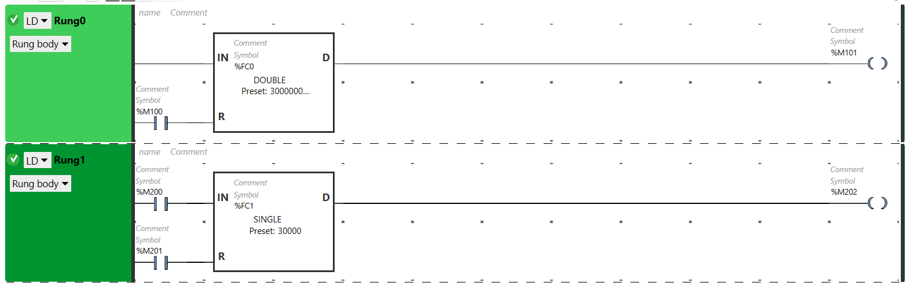

У відповідності до програми, швидкий лічильник %FC0 доступний завжди (завжди рахуватиме імпульси %I0.2). Якщо контакт %М100 замкнеться,  плинне значення онулиться  (%FC0.VD=0) і індикатор досягнення уставки також стане False. Котушка %М101 замкнеться, коли плинне значення досягне уставки  (%FC0.VD=3000000000) при цьому індикатор досягнення уставки %FC0.D стане True.

Швидкий лічильник %FC1 доступний за умови, що контакт %М200 замкнений (рахуватиме імпульси %I0.3 при %М200=1 і не змінюватиме плинне значення при %М200=0). Якщо контакт %М201 замкнеться,  плинне значення проініціалізується  (%FC1.V=30000) і індикатор досягнення уставки стане False. Котушка %М202 замкнеться, коли плинне значення досягне 0  (%FC1.V=0) при цьому індикатор досягнення уставки %FC1.D стане True.

## High Speed Counter (Високошвидкісний лічильник)

### Опис роботи

Функціональний блок High Speed Counter в EcoStruxure  Machine Expert - Basic може налаштовуватись на виконання однієї з наведених функцій 

- Двофазний [Імпульс / Напрямок]  
- Двофазний [Quadrature X1]  
- Двофазний [Quadrature X2]  
- Двофазний [Quadrature X4]  
- Однофазний 
- Вимір частотиr 

Функціональний блок High Speed Counter працює з максимальною частотою 100 kHz для всіх методів вимірювання з діапазоном від 0  до 65535 в режимі з одним словом і  від 0 до 4294967295 в режимі з подвійним словом. Він використовує визначенні входи/виходи. Перед використанням, функціональний блок потрібно провести ініціалізацію через [High Speed Counter  Assistant](m221aflg_D-SE-0044100.htm#D-SE-0044100.12).

| Параметр   | Можливі значення                      | Опис                                                         |
| ---------- | ------------------------------------- | ------------------------------------------------------------ |
| Used       | Використовується в програмі           | Якщо опція стоїть, цей функціональний блок (адреса) використовується в програмі |
| Address    | Адреса об'єкта (%HSCi)                | Програма може вміщувати тільки обмежену кількість даних об'єктів. |
| Symbol     | Символьна назва                       | Символьна назва об'єкта, асоційованого  з швидким лічильником. |
| Configured | Рахувати вверх чи вниз                | Можливі варіанти:                                                                               Не використовується                                                                      Рахувати вверх                                                                               Рахувати вниз |
| Preset     | Задане значення (%HSCi.P чи %HSCi.PD) | Може задаватись початкове значення:   Для режиму з одним словом через змінну %HSCi.P  в діапазоні від 1 до 65535 ,  Для режиму з подвійним словом через змінну %HSCi.PD в діапазоні від 1 до 4294967295. |
| S0         | Порогове значення                     | від 1 до 65535 для %HSCi.S0  та від 1 до 4294967295 для %HSCi.S0D. Порогове значення 0 використовується як компаратор з поточним значенням. Порогове значення 0 обов'язково має бути меншим за порогове значення 1 (%HSCi.S1). |
| S1         | Порогове значення                     | від 2 до 65535 для %HSCi.S1  та від 2 до 4294967295 для %HSCi.S1D. Порогове значення 1 використовується як компаратор з поточним значенням. Порогове значення 1 обов'язково має бути більшим за порогове значення 0 (%HSCi.S0). |
| Time  Base | Часова база 100 ms чи 1 s для %HSCi.T | 100 ms чи 1 s для %HSCi.T Часова база частоти вимірювання.   |
| Comment    | Коментар                              | Створення коментаря, асоційованого  з швидким лічильником.   |

Функціональний блок високошвидкісного лічильника має наступні входи/виходи: 

| Мітка | Значення                                | Опис                                                         |
| ----- | --------------------------------------- | ------------------------------------------------------------ |
| IN    | Вхід доступності                        | В стані "1" функція лічильника виконується. В стані "0" функція лічильника не виконується. |
| S     | Вхід виставлення на рівень уставки      | Якщо S дорівнює 1:   ініціалізує значення з уставкою для:   Двофазний [Quadrature X1],   Двофазний [Quadrature X2],   Двофазний [Quadrature X4], чи   Двофазний [Імпульс / Напрямок]  з функцією підрахунку вниз;  скидає значення в 0 для:   Однофазний чи  Двофазний [Імпульс / Напрямок]  з функцією підрахунку вверх |
| F     | Вихід переповнення                      | Виставляється в "1" якщо відбулось арифметичне переповнення плинного значення |
| U     | Вихід напрямку підрахунку               | Виставляється системою для двофазного режиму: 0 - вниз; 1- вверх |
| TH0   | Вихід спрацювання порогового значення 0 | Виставляється в "1" якщо плинне значення більше чи дорівнює пороговому значенню S0 (%HSCi.S0). |
| TH1   | Вихід спрацювання порогового значення 1 | Виставляється в "1" якщо плинне значення більше чи дорівнює пороговому значенню S1 (%HSCi.S1). |

Для правильної роботи програми користувача використовуйте TH0 і TH1 не більше одного разу в програмі.

Використання фізичних входів для для різних типів високошвидкісних лічильників наведено нижче.

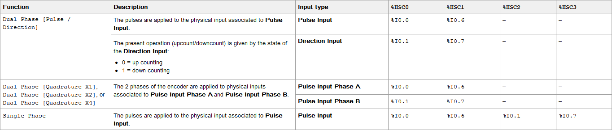

Нижче наведена діаграма функціонування лічильника в режимі з одним словом. 

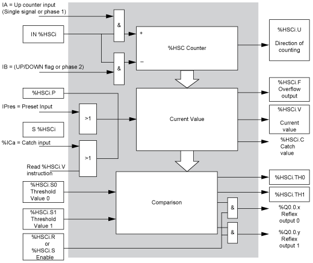

#### Часова діаграма для двофазного режиму [Імпульс / Напрямок] 

Приклад налаштування рефлекторних виходів:

| Рефлекторний вихід | Плинне значення < %HSC0.S0 | %HSC0.S0 <= Плинне значення < %HSC0.S1 | Плинне значення >= %HSC0.S1 |
| ------------------ | -------------------------- | -------------------------------------- | --------------------------- |
| %Q0.2              | 0                          | 0                                      | 1                           |
| %Q0.3              | 1                          | 1                                      | 0                           |

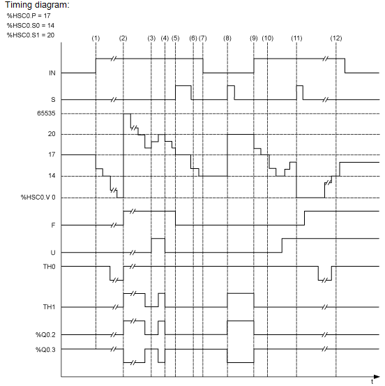

(1) `Вхід IN виставляється в 1, тому запускається режим підрахунку вниз  (%HSC0.U = 0, IB =  1) 

(2) Плинне значення досягає 0 тому вихід F виставляється в 1 і %HSC0.V стане дорівнювати 65535 на наступному циклі підрахунку`

(3) Зміна на вході IB, тепер лічильник працюватиме в режимі підрахунку вверх, %HSC0.U =  1 `

(4) Вхід IB=1,   тому лічильник працюватиме в режимі підрахунку вниз, а %HSC0.U  стає 0`

(5) Вхід S стає 1 підчас роботи лічильника в режимі підрахунку, тому %HSC0.V ініціалізується до уставки %HSC0.P = 17  `

(6) Вхід S стає 0  і  значення уставки %HSC0.P міняється на 20 `

(7) Вхід IN виставляється в 0 тому функція не активна, %HSC0.V не оновлюється `

(8)  Вхід S стає 1, значення уставки оновлюється і береться до розрахунку (%HSC0.P = 20), також оновлюються рефлекторні виходи. 

(9) Вхід IN виставляється в 1, тому функція перезапускається в режимі підрахунку вниз

(10) Порогове значення %HSC0.S1 виставляється рівним 17`

(11) Вхід S активує нове порогове значення S1 з наступного циклу підрахунку  і скидає % HSC0.V до 0

(12) `Відбувається захоплення плинного значення %HSC0.V і %HSC0.C = 14 

Потрібно врахувати: %HSC0.R  і %HSC0.S мають бути TRUE і мати сконфігуровані рефлекторні виходи. 

#### Часова діаграма для двофазного режиму [Quadrature X1], [Quadrature X2],   [Quadrature X4]  

Фізичний енкодер видає два сигнали, зміщенні на 90°, що дозволяє рахувати імпульси і визначати напрям обертання: 

X1 - 1 рахунок на кожен цикл енкодера 

X2 - 2 рахунки на кожен цикл енкодера 

X4 - 4 рахунки на кожен цикл енкодера

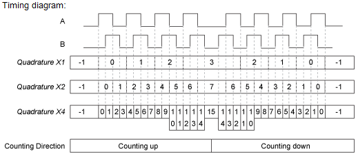

##### Quadrature X1 `

Коли сигнал каналу A передує сигналу каналу B, плинне значення лічильника збільшується по передньому фронту каналу A. Коли сигнал каналу В передує сигналу каналу А, плинне значення лічильника зменшується по задньому фронту каналу A.

##### Quadrature X2 

Лічильник збільшується чи зменьшується по кожному фронту каналу А, в залежності від того, сигнал якого каналу йде першим. За один цикл енкодера значення лічильника змінюється на 2.`

##### Quadrature X4 `

Лічильник збільшується чи зменьшується по кожному фронту каналу А і каналу В, в залежності від того, сигнал якого каналу йде першим. За один цикл енкодера значення лічильника змінюється на 4.

#### Часова діаграма для однофазного режиму 

Приклад налаштування рефлекторних виходів: 

| Рефлекторний вихід | Плинне значення < %HSC0.S0 | %HSC0.S0 <= Плинне значення < %HSC0.S1 | Плинне значення >= %HSC0.S1 |
| ------------------ | -------------------------- | -------------------------------------- | --------------------------- |
| %Q0.2              | 0                          | 1                                      | 0                           |
| %Q0.3              | 1                          | 0                                      | 1                           |

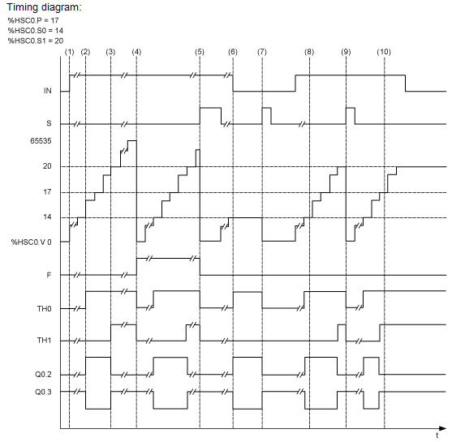

(1) Вхід IN виставляється в 1, тому функція активується (%HSC0.U = 1, оскільки %HSC0 iлічильник вверх)

(2) %Q0.2 (Рефлекторний вихід)  іTH0 стають в 1 

(3)  TH1 стає в  1 `

(4)  Досягнуто максимального значення, тому на наступному підрахунку %HSC0.V скинеться на 0 і F стане 1  `

(5) Вхід S стає 1, плинне значення, %HSC0.V, стає 0`

(6) Функція не активна поки вхід IN = 0`

(7) Поки функція не активна, вхід S стає 1 і плинне значення онуляється

(8) Задаємо порогове значення S1 рівним 17`

(9) Вхід S = 1, тому з наступного підрахунку встановиться нове значення S1 w

(10) Вхід захоплення захоплення плинного значення стає 1, тому %HSC0.C = 17

## Pulse (Генератор імпульсів)

### Опис роботи

Функціональний блок Pulse використовується для генерації послідовності імпульсів. В EcoStruxure  Machine Expert - Basic доступні два блоки Pulse на каналах %Q0.0 і %Q0.1, але лише у контролерів з транзисторними виходами. Для блоку можна задати кількість імпульсів або тривалість послідовності імпульсів. Конфігурується блок у  Configuration → Pulse  Generators.

| Параметр    | Можливі значення                        | Опис                                                         |
| ----------- | --------------------------------------- | ------------------------------------------------------------ |
| Used        | Використовується в програмі             | Якщо опція стоїть, цей функціональний блок (адреса) використовується в програмі |
| Address     | Адреса об'єкта (%PLSi)                  | Програма може вміщувати тільки обмежену кількість даних об'єктів. |
| Symbol      | Символьна назва                         | Символьна назва об'єкта, асоційованого  з швидким лічильником. |
| Preset      | Задане значення періоду (%PLSi.P)       | Може задаватись початкове значення:                                Часова база = 1 s, %PLSi.P=1 or 2                                                   Часова база = 10 ms, 1<=%PLSi.P<=200                                  Часова база = 1 ms, 1<=%PLSi.P<=2000                                     Часова база = 0.1 ms, 1<=%PLSi.P<=20000 |
| Num.  Pulse | Кількість імпульсів (%PLSi.N, %PLSi.ND) | Щоб задати необмежену кількість імпульсів задайте %PLS.N чи %PLS.ND рівним 0. |
| Current     | Поточний вихід (%PLSi.Q)                | Може мати значення 0 чи 1.                                   |
| Done        | Імпульс зроблений (%PLSi.D)             | В стані 1, генерація імпульсів завершена. Кількість імпульсів досягла уставки. Скидається або входом IN або виставленням 1 на вхід R. |
| Comment     | Коментар                                | Створення коментаря, асоційованого  з швидким лічильником.   |

Функціональний блок генератор імпульсів має наступні входи/виходи: 

| Мітка | Значення                             | Опис                                                         |
| ----- | ------------------------------------ | ------------------------------------------------------------ |
| IN    | Вхід доступності                     | В стані "1" на фізичному виході генеруються імпульси. В стані "0" на фізичному виході 0. |
| R     | Вхід скидання генератора             | В стані "1", виходи %PLSi.Q і  %PLSi.D онуляються.  Кількість імпульсів згенерованих за період  T також онуляється. |
| Q     | Вихід виконання генерації %PLSi.Q    | В стані "1", показує, що відбувається генерація імпульса на визначеному фізичному виході. |
| D     | Вихід завершення генерації (%PLSi.D) | В стані "1", генерація імпульсів завершена, необхідна кількість імпульсів досягнена. |

В наступній таблиці описані доступні періоди для генератора імпульсів:

| Часова база | Частота           |
| ----------- | ----------------- |
| 0.1 ms      | 0.5 Hz...10000 Hz |
| 1 ms        | 0.5 Hz...1000 Hz  |
| 10 ms       | 0.5 Hz...100 Hz   |
| 1 s         | 0.5 Hz...1 Hz     |

Об'єкти генератора імпульсів: 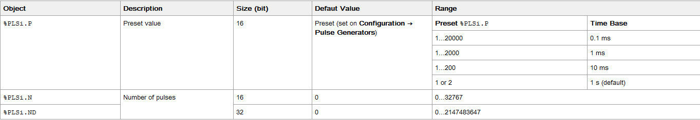

Період вихідного сигналу T розраховується як T = %PLSi.P x Часову базу. 

При їх налаштуванні можливі наступні ситуації.

Якщо  %PLSi.P: 

- змінено, період вихідного сигналу зміниться в кінці поточного періоду .  
- переводиться в 0, то генератор імпульсів зупиняється.  
- виходить за допустимі межі, то параметр онуляється і генератор імпульсів зупиняється. 

Якщо %PLSi.N (чи %PLSi.ND в режимі подвійного слова) : 

- змінено, кількість імпульсів що мають згенеруватись застосовуються з наступного виконання блоку (%PLSi.D = 1 чи після %PLSi.R = 1).  
-  переводиться в 0, генерується нескінченна кількість імпульсів.  
- виходить за допустимі межі, то параметр онуляється. 

#### Часова діаграма для генератора імпульсів

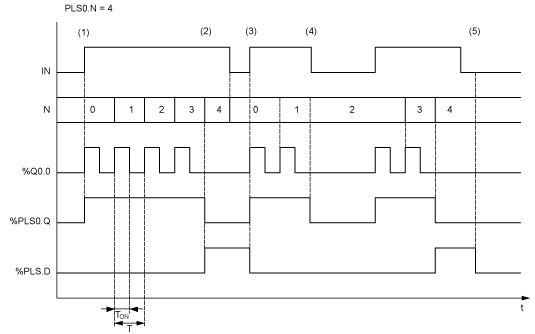

(1) Вхід IN виставляється в "1", тому імпульсний сигнал генерується на визначеному виході (%Q0.0), а %PLSi.Q стає "1".  `

(2) Досягається кількість імпульсів %PLS0.N (=4), тому вихід %PLS0.D стає "1" і генератор імпульсів зупиняється  (%PLS0.Q = 0) `

(3) Вхід IN виставляється в 1, тому  %PLS0.D онуляється`

(4) Вхід IN виставляється в "0", тому фізичний вихід стає "0" і  %PLS0.Q = 0  показує що блок не активний`

(5) `%PLS0.D виставляється в "0"  шляхом зміни R на "1"

#### Приклад

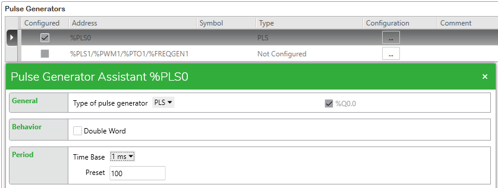

Генератор імпульсів %PLS0 прив'язаний до виходу %Q0.0, працює в режимі з одним словом. Період імпульсу дорівнює 100ms (Preset 100 * Time Base 1ms).

В Rung0 задається кількість імпульсів, що має генеруватись.

Коли %M100 стане "1", генератор почне працювати, на виході %Q0.0 стане "1", також спрацює вихід Q функціонального блоку і %M102 стане "1". Коли блок згенерує 5 імпульсів, вихід D, а отже і %М103, стане "1", а %Q0.0 буде "0" і не мінятиметься. Щоб запустити нову чергу з 5 імпульсів треба подати "1" на вхід R, змінивши %М101.

## Pulse Width Modulation (Широтно-імпульсна модуляція)

### Опис роботи

Функціональний блок Pulse Width Modulation використовується для генерації імпульсу заданої ширини на визначеному виході %Q0.0 чи %Q0.1. Доступні лише у контролерів з транзисторними виходами. %PWM0 використовує вихід %Q0.0, а %PMW1 використовує вихід %Q0.1. Оскільки функціональний блок Pulse  %PLS також може використовувати ці виходи, варто зазначити що один вихід може бути сконфігурований під будь-яку з цих функції, але не під обидві одразу.  Конфігурується блок у  Configuration → Pulse  Generators.

| Параметр    | Можливі значення                  | Опис                                                         |
| ----------- | --------------------------------- | ------------------------------------------------------------ |
| Used        | Використовується в програмі       | Якщо опція стоїть, цей функціональний блок (адреса) використовується в програмі |
| Address     | Адреса об'єкта (%PWMi)            | Програма може вміщувати тільки обмежену кількість даних об'єктів. |
| Symbol      | Символьна назва                   | Символьна назва об'єкта, асоційованого  з швидким лічильником. |
| Preset      | Задане значення періоду (%PWMi.P) | Може задаватись початкове значення:                                %PWMi.P=1 якщо Часова база=1 s                           1<=%PWMi.P<=100 якщо Часова база=10 ms  1<=%PWMi.P<=1000 якщо Часова база=1 ms  1<=%PWMi.P<=10000 якщо Часова база=0.1 ms |
| Duty  cycle | Робочий цикл                      | Робочий цикл управляється об'єктом %PWMi.R, і показує процентне відношення стану "1" сигналу до загальної його тривалості. Ширина стану "1" (Tp) розраховується так:  TP = T x (%PWMi.R/100). %PWMi.R задається з програми користувача. |
| Comment     | Коментар                          | Створення коментаря, асоційованого  з швидким лічильником.   |

Функціональний блок має лише вхід IN (В стані "1" на фізичному виході генеруються імпульси. В стані "0" на фізичному виході 0) .

В наступній таблиці описані доступні періоди для генератора імпульсів:

| Часова база | Частота         |
| ----------- | --------------- |
| 0.1 ms      | 1 Hz...10000 Hz |
| 1 ms        | 1 Hz...1000 Hz  |
| 10 ms       | 1 Hz...100 Hz   |
| 1 s         | 1 Hz...1 Hz     |

Об'єкти генератора імпульсів: 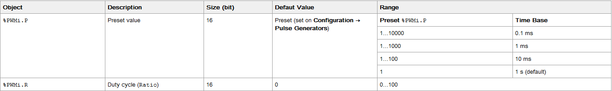

При їх налаштуванні можливі наступні ситуації.

Якщо %PWMi.P: 

- змінено, період вихідного сигналу зміниться в кінці поточного періоду .  
- переводиться в "0", то блок зупиняється.  
- виходить за допустимі межі, то параметр онуляється і блок зупиняється. 

Якщо %PWMi.R: 

- задається 0, то блок зупиняється, на фізичному виході "0".
- задається 100, то на фізичному виході постійна "1".
- змінено, співвідношення сигналів зміниться в кінці циклу.  
- переводиться в 0, генерується нескінченна кількість імпульсів.  
- виходить за допустимі межі, то параметр онуляється. 

#### Часова діаграма для генератора імпульсів

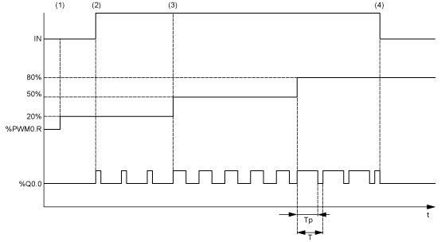

(1) Співвідношення блоку PWM (%PWMi.R) задається як 20%, IN = 0 тому блок не активний.

(2) Вхід IN виставляється в "1", тому вихід PWM активується

(3) Запрограмована ширина імпульсу (Tp) змінюється параметром %PWM.R 

(4) Вхід IN виставляється в "0", тому функція  PWM function зупиняється

| [<- до лекцій](README.md)                | [на основну сторінку курсу](../README.md)          |
| ---------------------------------------- | -------------------------------------------------- |
| [<- Базові функціональні блоки](4_fb.md) | [Стано-орієнтоване програмування ->](statebase.md) |