| [<- до лекцій](README.md)                       | [на основну сторінку курсу](../README.md) |
| ----------------------------------------------- | ----------------------------------------- |
| [<- Фізична структура ПЛК M221](01_HardM221.md) | [Змінні ПЛК ->](8_vars.md)                |

# Режими роботи та структура програм ПЛК

**Це тимчасова версія лекції, вона найближчим часом буде перероблена**

Цикл роботи контролера - протягом кожного робочого циклу процесор читає всі входи, приймає ці значення, і вмикає або вимикає виходи відповідно до програми користувача.

Час циклу сканування - час, необхідний для завершення циклу сканування, показує, як швидко контролер може реагувати на зміни входів.

Якщо контролер повинен реагувати на вхідний сигнал, який змінюється декілька разів за час сканування, можливо цо ПЛК ніколи не зможе виявити цю зміну або пропустити деякі з них!!!

Наприклад, якщо контролер сканує програму за 8 мс. А вхідний контакт відкривається і закривається кожні 4 мс, Програма може не відповідати на зміну контакту.

Контролер виявляє зміну, якщо вона тривала довше ніж час циклу(період сканування)!!

Час сканування залежить від:

• Швидкість процесора модуля;

• Довжина програми;

• Тип виконаних інструкцій.

Фактичний час сканування розраховується та зберігається в пам'яті ПЛК.

Дані про час сканування можна відстежувати за допомогою середовища програмування ПЛК. 

Сканування зазвичай є безперервним і послідовним процесом читання статусу входів, виконання програми та оновлення виходів.

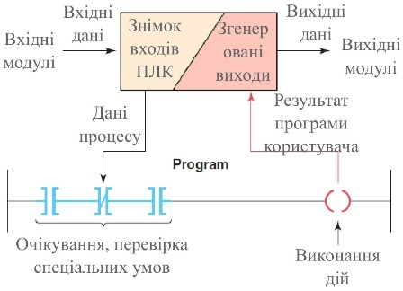

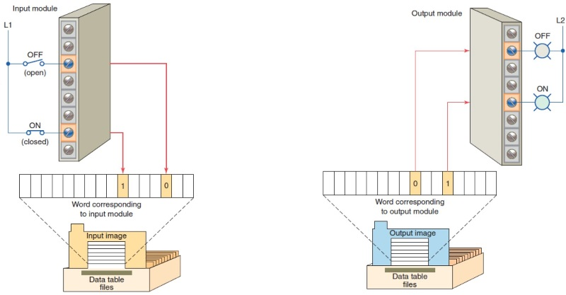

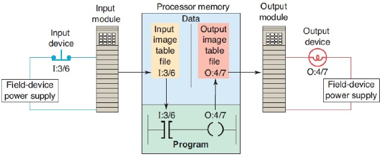

. Операція сканування процесу можна узагальнювати наступним чином:

Крок 1: Оновлення таблиці вхідних даних, відстеживши стан входів. На підставі відсутності або наявності напруги, виставляється 0 або 1. це зберігається в біт пам'яті, виділеному Для конкретного входу.

Крок 2: Якщо умови, що управляють виходом, виконуються контролер негайно записує 1 в свою пам'ять, що вказує на те, що вихід буде включено; навпаки, якщо умова не виконується записується 0, що вказує на те, що пристрій буде вимкнено.

Крок 3: Оновлення виходів відповідно до програми користувача.

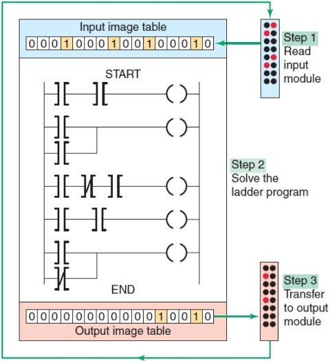

Кожна інструкція, введена в програму, вимагає певного часу для її виконання. 

Необхідний час залежить від інструкції.

Наприклад, процесору потрібно менше часу, щоб прочитати статус Вхідного контакту, ніж це, щоб прочитати накопичене Значення таймера або лічильника.

Час сканування користувацької програми також залежить від тактової частоти Мікропроцесорної системи. Чим вище тактова частота Тим швидше буде швидкість сканування.

Існує два основні шаблони сканування, які PLC використовують для виконання функції сканування:

- Горизонтальне;
- Вертикальне.

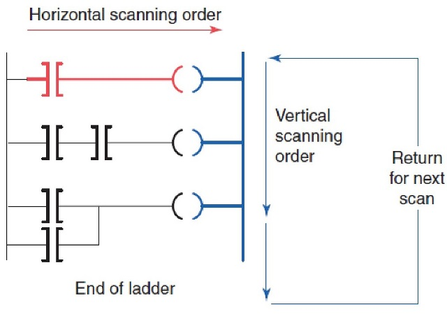

Кожна інструкція, введена в програму, вимагає певного часу для її виконання. 

Необхідний час залежить від інструкції.

Наприклад, процесору потрібно менше часу, щоб прочитати статус Вхідного контакту, ніж це, щоб прочитати накопичене Значення таймера або лічильника.

Час сканування користувацької програми також залежить від тактової частоти Мікропроцесорної системи. Чим вище тактова частота Тим швидше буде швидкість сканування.

Modicon M221: 

- Master task  - основна задача;
- Periodic task - періодична;
- Event task – переривання по події;

Мaster tasks може бути сконфігурована наступним чином: 

- Freewheeling mode;
- Periodic mode.

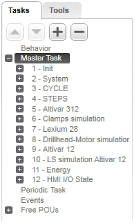

Master tasks – ОСНОВНА ЗАДАЧА

Запускається безперервним циклічним скануванням або програмним часом, вказуючи період сканування 2 ... 150 мс (за замовчуванням 100 мс) в періодичному режимі.

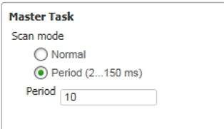

Periodic tasks – ПЕРІОДИЧНА ЗАДАЧА

Запускаються таймерами програмного забезпечення, таким чином настроюються шляхом визначення періоду сканування 5 ... 255 мс (за замовчуванням 255 мс) в періодичному режимі.

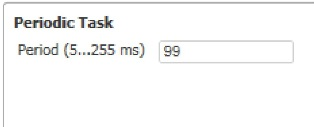

Event tasks – ПЕРЕРИВАННЯ ПО ПОДІЇ

Запускаються за допомогою фізичних входів або функціональних блоків HSC. Ці події пов'язані з вбудованими цифровими входами (% I0.2 ...% I0.5) (підйом, падіння або обидві сторони) або з високошвидкісними лічильниками (% HSC0 і% HSC1) (коли граф досягає лічильника високої швидкості) Поріг) Ви можете налаштувати 2 події для кожного функціонального блоку HSC.

Ви повинні налаштувати пріоритет для кожного Event tasks . Діапазон пріоритетів становить від 0 до 7 , 0 - Найвищий пріоритет.

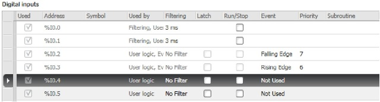

Freewheeling mode 

Це безперервний режим циклічного сканування. У цьому режимі новий цикл починається відразу ж після завершення попереднього циклу.

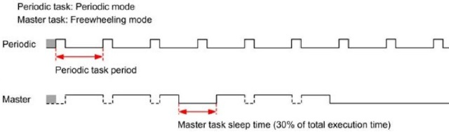

Рeriodic mode

Контролер чекає до того часу, поки налаштований час сканування не минув. Тому кожна перевірка триває однаково.

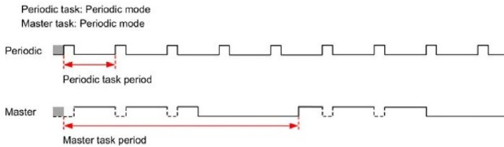

Event

Пріоритети події регулюють взаємозв'язок між завданнями події, основними завданнями та періодичними завданнями. Завдання події перериває основне завдання та періодичне завдання.

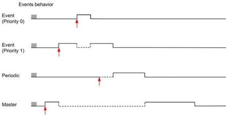

Watchdog Timer

Ви можете налаштувати спеціальний таймер сторожового таймера для головного завдання та періодичних завдань. Якщо час виконання завдання.

перевищує налаштований період сторожового таймера, логічний контролер переходить до стану HALTED. Цей таймер керується таймерами програмного забезпечення. Таймер перевіряє, чи логіка користувача завантажує більше 80% ємності обробки процесора.

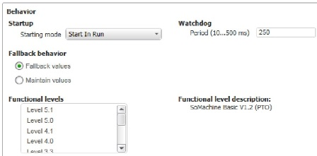

Термін "мова програмування ПЛК " описує метод за допомогою якого користувач передає інформацію до ПЛК.

Стандарт IEC 61131  був встановлений щоб стандартизувати мови програмуванням PLC і визначив наступні стандартні мови:

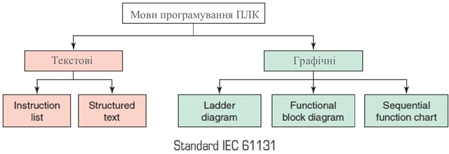

- **Ladder Diagram (LD)** —графічне зображення релейно-контактних схем які були замінені ПЛК;
- **Function Block Diagram (FBD)** —графічне зображення проходження процесу за допомогою зєднання блоків, які виконують певну обробку даних;
- **Sequential Function Chart (SFC)** —графічне зображення кроків, дій і переходів між ними;
- **Instruction List (IL)** —мова програмування нижнього рівня, яка управляє процесом за допомогою визначених інструкцій;
- **Structured Text (ST)** —мова програмування верхнього рівня, яка управляє процесом за допомогою визначених інструкцій, подібна до PASCAL, BASIC і т. д.
- 

| [<- до лекцій](README.md)                       | [на основну сторінку курсу](../README.md) |
| ----------------------------------------------- | ----------------------------------------- |
| [<- Фізична структура ПЛК M221](01_HardM221.md) | [Змінні ПЛК ->](8_vars.md)                |