Термін "мова програмування ПЛК " описує метод за допомогою якого користувач передає інформацію до ПЛК.

Стандарт IEC 61131  був встановлений щоб стандартизувати мови програмуванням PLC і визначив наступні стандартні мови:

- **Ladder Diagram (LD)** —графічне зображення релейно-контактних схем які були замінені ПЛК;
- **Function Block Diagram (FBD)** —графічне зображення проходження процесу за допомогою зєднання блоків, які виконують певну обробку даних;
- **Sequential Function Chart (SFC)** —графічне зображення кроків, дій і переходів між ними;
- **Instruction List (IL)** —мова програмування нижнього рівня, яка управляє процесом за допомогою визначених інструкцій;
- **Structured Text (ST)** —мова програмування верхнього рівня, яка управляє процесом за допомогою визначених інструкцій, подібна до PASCAL, BASIC і т. д.

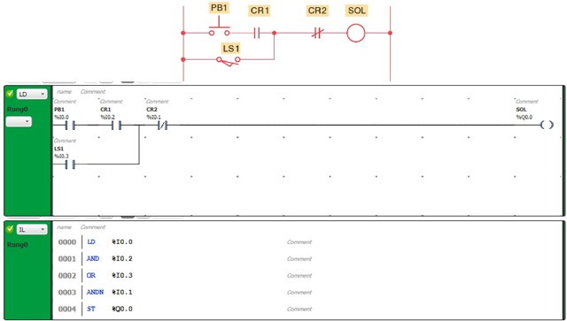

Мова релейних або релейно-контактних схем (РКС) - графічна мова, яка реалізує структури електричних ланцюгів. Найкраще LD підходить для побудови логічних перемикачів, але досить легко можна створювати і складні ланцюги.

Ліворуч і праворуч схема обмежена вертикальними лініями - шинами живлення. Між ними розташовані ланцюги, утворені контактами і обмотками реле, за аналогією зі звичайними електронними ланцюгами.

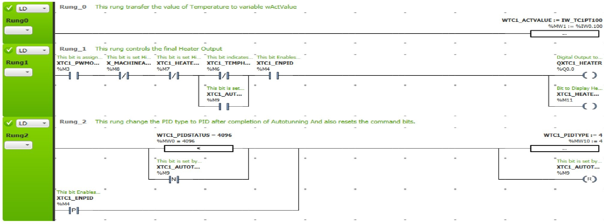

Зліва будь-який ланцюг починається набором контактів, які посилають зліва направо стан «ON» або «OFF», відповідні логічним значенням ІСТИНА або БРЕХНЯ. Кожному контакту відповідає логічна змінна. Якщо змінна має значення ІСТИНА, то стан передається через контакт. Інакше праве з'єднання отримує значення вимкнено («OFF»).

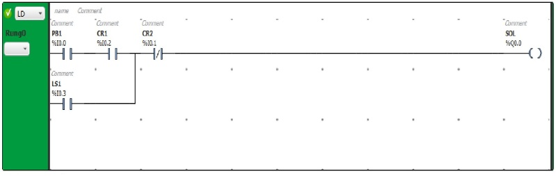

Контакт

Контакти позначаються двома паралельними лініями і можуть мати стан «ON» або «OFF». Ці стани відповідають значенням ІСТИНА або ХИБНІСТЬ. Кожному контакту відповідає логічна змінна. Якщо значення змінної ІСТИНА, то контакт замкнутий. Контакти можуть бути з'єднані паралельно, тоді з'єднання передає стан «ON», коли хоча б одна з гілок передає «ON» .Якщо контакти з'єднані послідовно, то для того, щоб з'єднання передало «ON», необхідно, щоб обидва контакти передавали «ON» . Це відповідає електричній паралельній і послідовній схемі. Контакт може бути інвертованим. Такий контакт позначається за допомогою символу |/| і передає стан «ON», якщо значення змінної ХИБНІСТЬ.

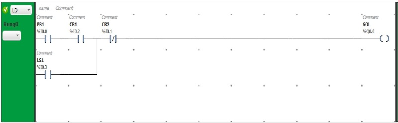

Обмотка

У правій частині схеми може бути будь-яке кількість обмоток (реле), які позначаються круглими дужками ( ). Вони можуть з'єднуватися тільки паралельно. Обмотка передає значення з'єднання зліва направо і копіює його в відповідну логічну змінну. В цілому ланцюг може бути або замкнутим (ON), або розімкнутим(OFF). Це як раз і відбивається на обмотці і відповідно на логічної змінної обмотки (ІСТИНА / хибність). Обмотки також можуть бути інверсними. Якщо обмотка інверсна (позначається символом (/)), тоді в відповідну логічну змінну копіюється інверсне значення.

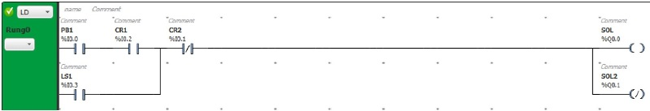

Мова програмування SFC (Sequential Function Chart - Послідовні функціональні схеми) це одна із складових частин стандарту IEC61131-3. Sequential Function Chart хоч і називається мовою програмування промислових контролерів, по суті своїй є допоміжним засобом структурування програм.

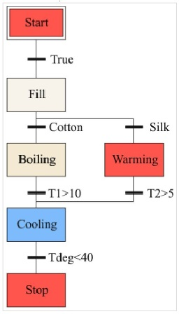

Послідовні функціональні схеми (SFC) представляють собою графічний інструмент стандарту МЕК 61131, для структурування послідовності виконання дій, пов'язаних з конкретними моментами часу або подіями. Основними елементами SFC (Sequential Function Chart) є такі поняття як стан і перехід.

Якщо поставити собі за мету описати всі базові елементи мови програмування SFC, то виглядати він буде наступним чином:

- **КРОК**. У цьому блоці описують деякі події;
- **УМОВА ПЕРЕХОДУ**. Кожен з подібних блоків володіє логічним виразом виконання;
- **АЛЬТЕРНАТИВНЕ РОЗГАЛУДЖЕННЯ**. При наявності різних умов алгоритм можна розгалужувати;
- **ПАРАЛЕЛЬНЕ РОЗГАЛУДЖЕННЯ**. Має загальну умова на перехід;
- **ЗУПИНКА АЛГОРИТМУ** (або повернення на початковий крок).

**КРОК** - у цьому блоці виконуються певні дії.

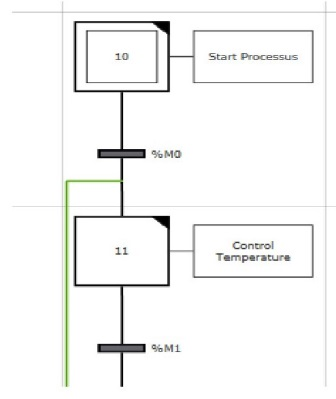

**УМОВА ПЕРЕХОДУ** - кожен з подібних блоків володіє логічним виразом виконання.

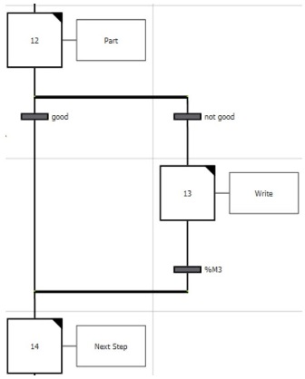

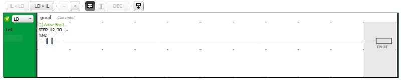

**АЛЬТЕРНАТИВНЕ РОЗГАЛУДЖЕННЯ** - при наявності різних умов алгоритм можна розгалужувати.

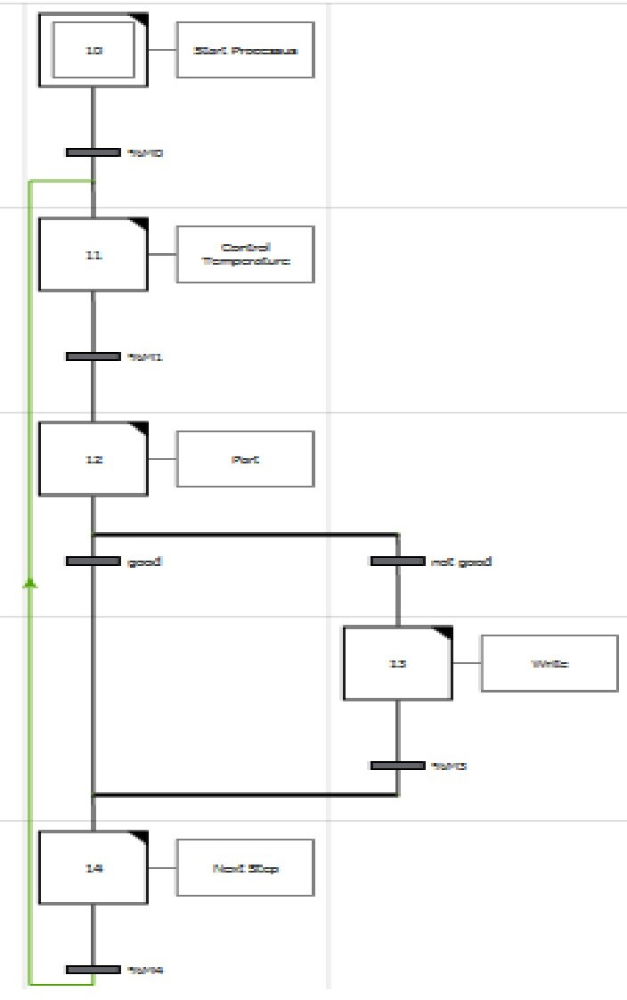

**ПАРАЛЕЛЬНЕ РОЗГАЛУДЖЕННЯ** - має загальну умова на перехід.

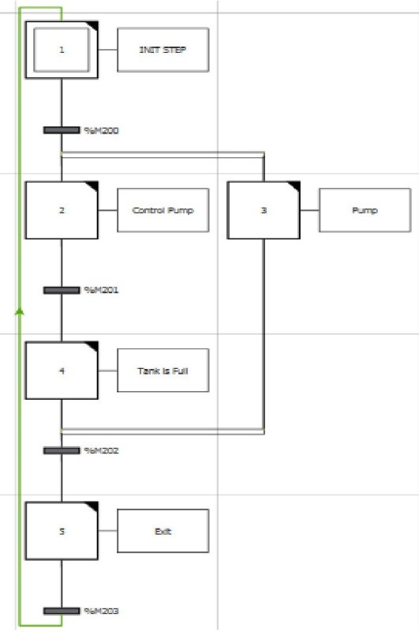