# Ladder Diagram

**Ladder Diagram** подібний до релейно – контактних схем. 

Основними відмінностями між ними є наступні особливості програмування, які відрізняються від релейно контактних схем:

- Всі входи та бінарні логічні біти представлені символами контактів;
- Всі виходи та бінарні логічні біти представлені символами котушки;
- Числові операції включені в графічний набір інструкцій.

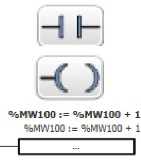

Всі входи, пов'язані з комутаційним пристроєм, в логічній схемі реле показані як контакти.

Вихідна котушка M1 на логічній схемі реле представлена символом вихідної котушки.

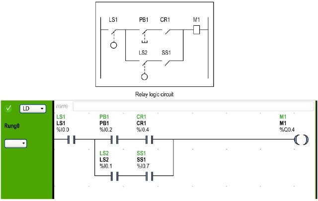

## **Ladder Diagram Rungs**

Програма, написана на мові "Ladder Diagram ", складається з Rungs, які є наборами графічних Інструкції, росташованими між двома вертикальними потенціалами. 

Rungs контролером виконуються послідовно .

Rungs не може підтримувати більше однієї гілки

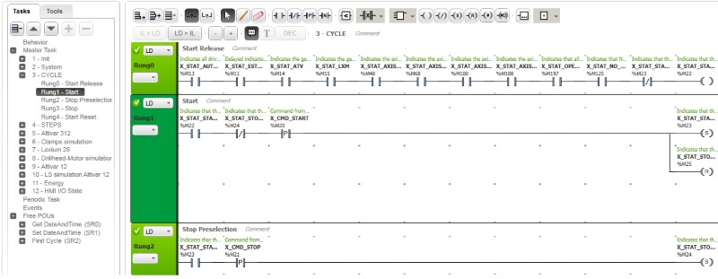

Набір графічних інструкцій представляє наступні функції:

- Входи/виходи контролера (кнопки, датчики, реле, сигнальні лампи, і так далі)
- Функції контролера (таймери, лічильники тощо)
- Математичні та логічні операції (додавання, поділ, AND, XOR тощо)
- Оператори порівняння та інші числові операції  (A<B, A=B, зміщення, обертання та ін.)
- Внутрішні змінні в контролері (біти, слова, тощо)

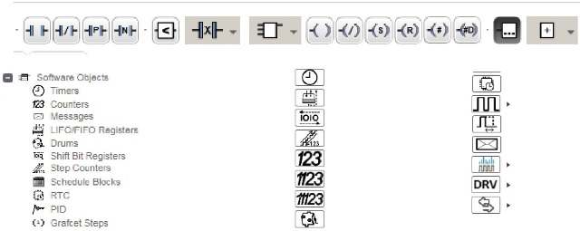

Кожен **Rung** складається з сітки довжиною до 255 рядків по 11 ... 30 стовпчиків, організованих у 2 зони: зона перевірки і зона виконання.

**Зона** **перевірки**

Містить умови, які перевіряються для виконання дій. Складається з колонок від 1 до n, де n - це кількість наведених стовпців і містить контакти, функціональні блоки та блоки порівняння.

**Зона** **виконаня**

Містить результат, який буде виконуватися відповідно до зони перевірки, складається з колонок n-1, де n – число стовпчиків і містить котушки та  операційні блоки.

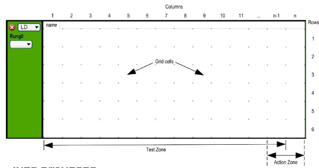

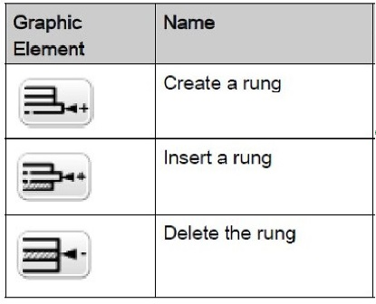

**Normal mode** - дозволяє розмістити елементи програмування (наприклад, контакти, котушки тощо, за винятком функціональних блоків), послідовно в лінію з'єднання.

**Branching mode** - дозволяє розмістити елементи програмування (наприклад, контакти, котушки тощо, за винятком функціональних блоків), з розгалуженням лінії з'єднання.

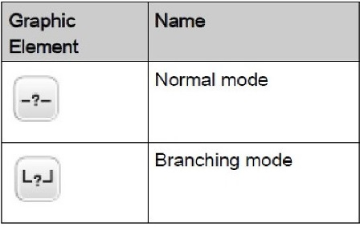

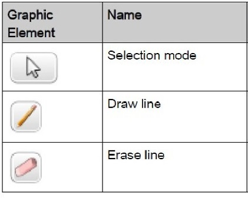

## Контакти

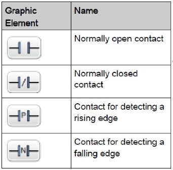

## **Comparison Block**

Блоки порівняння розміщуються в зоні перевірки сітки програмування. Блок може з'явитися в будь-якому рядку чи стовпчику в зоні перевірки. Графічний елемент для блока порівняння займає 2 клітинки (1 клітинку висотою та 2 клітинки шириною).

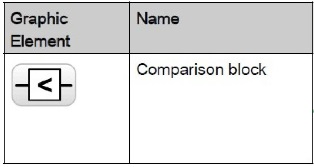

## Контакти XOR 

- Інструкція XOR виконує взаємовиключне АБО.  0 коли контакт і попередній результат однакові;
- Інструкція XORN виконує взаємовиключне АБО. 0 коли інвертоване значення контакта і попередній результат однакові;
- Інструкція XORR виконує взаємовиключне АБО. 0 коли передній фронт контакта і попередній результат однакові;
- Інструкція XORF виконує взаємовиключне АБО. 0 коли задній фронт контакта і попередній результат однакові.

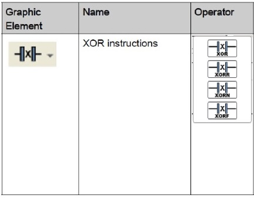

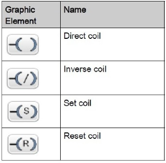

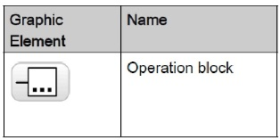

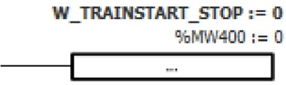

## Інші елементи

Інструкції OPEN та SHOT надають зручний спосіб для налагодження та усунення несправностей програми.

Елементи END/JUMP дозволяють переміщуватись по програмі користувача

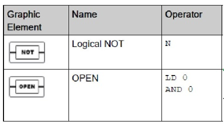

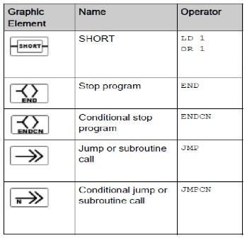

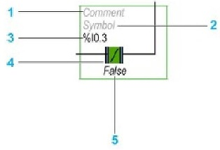

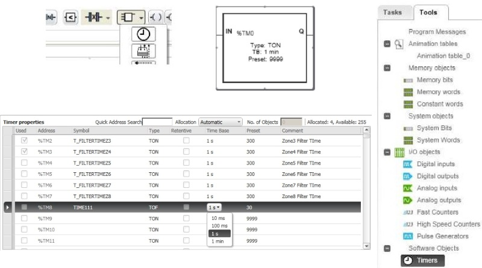