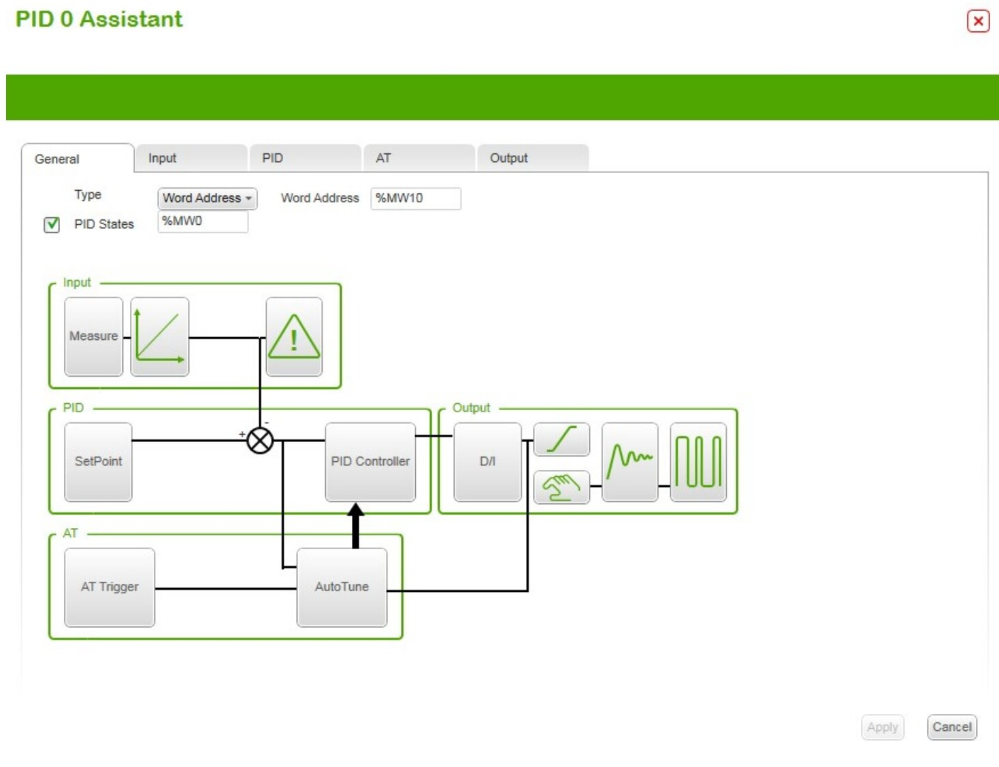

SoMachine Basic PID controller:

- PID mode;
- AT + PID mode;
- AT mode;
- Word address.

Якщо вибрано Word Address  то режим регулятора визначається значенням змінної:

- %MWxx = 0: Регулятор відключений;
- %MWxx = 1: simple PID mode;
- %MWxx = 2: AT+ PID mode;
- %MWxx = 3: AT mode only; 
- %MWxx = 4: PID mode, with PI corrector type.

