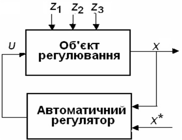
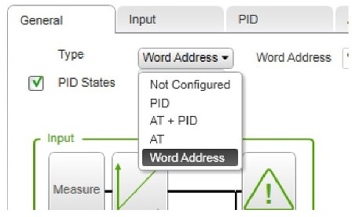
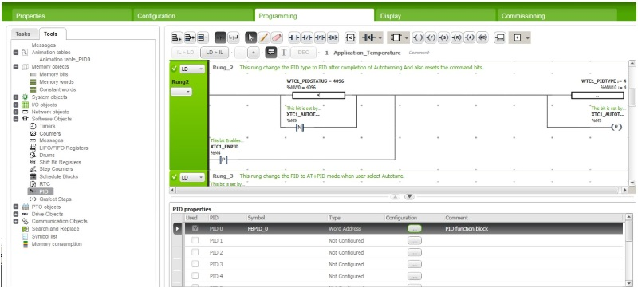
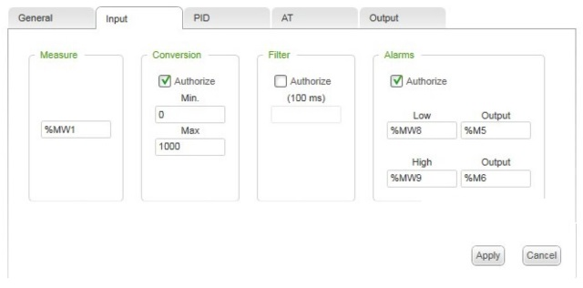
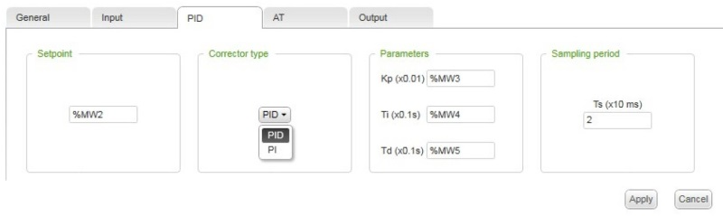
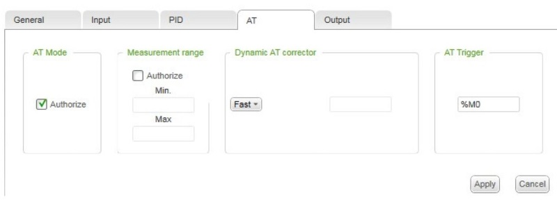

| [<- до лекцій](README.md)    | [на основну сторінку курсу](../README.md)           |
| ---------------------------- | --------------------------------------------------- |
| [<- Елементи мови ST](st.md) | [Розробка власних функціональних блоків ->](DFB.md) |

# Використання експертних функціональних блоків PID 

## Основні принципи регулювання

Практично всі автоматичні системи регулювання (АСР) побудовані на базі використання двох основних принципів регулювання: за відхиленням і за збуренням, причому АСР за відхиленням є найбільш поширеною.
У цій системі на автоматичний регулятор (АР) надходить сигнал регульованої змінної від об'єкта регулювання (Х) і  її задане значення (Х *). Тобто на вхід регулятора надходить "відхилення (розузгодження)" (ΔХ = Х-Х *) регульованої змінної від заданого значення. Автоматичний регулятор (АР) виробляє керуючий вплив (U), який надходить на вхід об'єкта регулювання (ОР) з метою ліквідації цього відхилення.
Перевага такої АСР в тому, що для регулювання не потрібно вимірювати збурення, тому що відхилення є наслідком дії їх усіх. Ця система також називається замкнутої АСР, або АСР зі зворотним зв'язком. Недоліком системи є те, що процес регулювання починається тільки після виникнення розузгодження ΔХ. Для інерційних об'єктів це може привести до неприпустимих за технологією відхилень.

### П - регулятор

У пропорційних (П) регуляторах  управляюча дія пропорційна сигналу розузгодження:

​                                                                                *U*р=*К*р*ΔХ 

Аналіз даного регулятора показав, що  управляюча дія почне змінюватись зі зміною розузгодження. Тобто регулювання почнеться практично одночасно з появою відхилення регульованої змінної від заданого значення. 

Як тільки розузгодження перестане змінюватись, процес регулювання досить швидко завершується. Але при цьому величина ΔХ може не дорівнювати 0. Це означає, що регульована змінна не досягла заданого значення, а залишилася на величині, яка відрізняється від нього. Це призводить до виникнення статичної похибки – різниці між заданим значенням регульованої змінної та її значенням, яке залишається в кінці процесу регулювання.

Величина статичної похибки залежить від коефіцієнта передачі регулятора *К*р. Це значення є параметром настроювання П-регулятора, значення якого вибирається в залежності від властивостей об’єкта регулювання і показників якості процесу регулювання, що встановлюється для даної АСР. Чим більший коефіцієнт передачі, тим менша статична похибка. Але збільшення коефіцієнта передачі обмежене вимогами стійкості системи регулювання. При великих значеннях *К*р незначне розузгодження ΔХ може призвести до значних змін *U*р і процес регулювання буде наближатися до межі стійкості.

Таким чином, П-регулятори мають добрі динамічні характеристики, тобто процес регулювання характеризується малим часом регулювання і погані статичні характеристики, тому що в кінці регулювання виникає статична похибка. Тому П-регулятори використовуються у випадках, коли час регулювання має бути невеликим, а технологічний процес припускає наявність статичної похибки.

### ПІ - регулятор

У пропорційно-інтегральних (ПІ) регуляторах управляюча дія пропорційна як розузгодженню, так і інтегралу від нього.

Аналіз даного регулятора показав, що процес регулювання почнеться, як і в системі з П-регулятором, тобто коли почне змінюватись розузгодження. Але закінчиться процес регулювання лише тоді, коли регульована величина стане дорівнювати заданій, тобто коли ΔХ=0. За рахунок цього
 ПІ-регулятор ліквідує статичну похибку, але має час регулювання приблизно вдвічі більший, ніж у П-регулятора. 

Крім коефіцієнта пропорційності *К*р, регулятор має також настройку часу інтегрування *T*i, яка визначає «вагу» інтегральної складової. Збільшення часу інтегрування приводить до збільшення інерційності роботи інтегральної складової, тобто до збільшення часу регулювання. 

### ПІД - регулятор

У випадках, коли необхідно поліпшити динамічні характеристики П- та ПІ-регуляторів, а саме збільшити швидкість реагування регулятора на виникнення розузгодження, використовуються пропорційно-диференціальні ПД- та пропорційно-інтегрально-диференціальні ПІД-регулятори, в які додатково введено диференціальну складову.

Аналіз показує, що в цьому регуляторі процес регулювання починається вже при появі сигналу по прискоренню зміни розузгодження, тобто значно швидше, ніж у ПІ-регуляторів. Форсування початку регулювання призводить до того, що системи з цими регуляторами мають маленьку динамічну похибку. Але, незважаючи на ці переваги, ПІД-регулятори використовують рідко, тому що вони складніші як за конструкцією, так і в настроюванні. Диференціальна складова налаштовується часом диференціювання *Т*д або коефіцієнтом диференціювання *К*д=*К*р×*Т*д.

## Режими роботи PID регулятора

EcoStruxure Machine Expert - Basic пропонує 4 різні режими роботи PID, які можна налаштувати на загальній вкладці PID Assistant:

- PID mode;

- AT + PID mode;

- AT mode;

- Word address.

  

### Режим PID 

Простий режим PID-контролера активний за замовчуванням, коли PID-регулятор запускається. Значення налаштувань Kp, Ti та Td, що задаються на вкладці PID, повинні бути відомі заздалегідь для нормальної роботи процесу. Ви можете вибрати тип контролера (PID або PI) на вкладці PID на екрані PID Assistant. Якщо обраний тип коректора PI, поле налаштування Td не активне.

У режимі PID функція автоматичної настройки відключена, і тому вкладка AT екрана конфігурації не активна.

### AT + PID Режим 

У цьому режимі функція автоматичної настройки активується при запуску PID-регулятора. Потім функція автоматичної настройки обчислює значення налаштувань Kp, Ti та Td та тип PID. В кінці послідовності автоматичної настройки контролер переходить у режим PID для відрегульованої заданої точки, використовуючи параметри, обчислені автоматичною настройкою.

Якщо алгоритм автоматичної настройки виявляє помилку, то параметр PID не обчислюється. Вихід автоматичної настройки встановлюється на вихід, який застосовано до процесу перед запуском автоматичної настройки. Повідомлення про помилку з’являється у спадному списку «Список станів PID». PID-регулятор скасовується.

Перебуваючи в режимі AT + PID, перехід від автоматичної настройки до режиму PID - автоматичний та безперебійний.

### AT Режим 

У цьому режимі функція автоматичної настройки активується при запуску PID-регулятора і автоматично обчислює як значення налаштувань Kp, Ti, так і Td  так і тип PID-регулятора. Після успішного визначення налаштувань, або після виявлення помилки в алгоритмі автоматичної настройки, числовий вихід автоматичної настройки встановлюється в 0, повідомлення про завершення автоматичного налаштування з’являється у спадному списку «Список станів PID». Потім PID-контролер зупиняється і чекає. Обчислені коефіцієнти PID Kp, Ti та Td доступні у відповідних словах пам'яті (% MWx).

### Word Address 

Якщо вибрано Word Address  то режим регулятора визначається значенням змінної:

- %MWxx = 0: Регулятор відключений;
- %MWxx = 1: простий PID режим;
- %MWxx = 2: AT+ PID режим;
- %MWxx = 3: AT режим; 
- %MWxx = 4: PID режим, з PI корекцією.

## Налаштування PID регулятора

ПІД-регулятори знаходяться у вкладці Tools -> Sotware Objets -> PID. Тут можна побачити перелік регуляторів та їх тип, задати символьне ім'я, добавити коментарі.

При натисканні на кнопку Configuration [...], з'являється вікно PID Assistant. Він використовується для конфігурації регулятора та містить декілька вкладок.

### General

У цій вкладці обирається один з режимів роботи регулятора, що розглянуті вище. При виборі режиму Word Address, стає активним поле з аналогічною назвою для введення адреси змінної.

У вкладці можна активувати опцію PID States. Якщо встановити прапорець, щоб увімкнути цю опцію, ви можете вказати слово пам'яті у відповідному полі (% MWxx), яке використовується контролером PID для зберігання поточного стану регулятора. Коди станів і можливих помилок доступні у HELP.

### Input

Дана вкладка потрібна для прив'язки регульованого параметра. У полі Measure задається змінна процесу, що має регулюватись. Адреса може бути як внутрішня (% MWxx) так і аналоговий вхід (% ІWx.x). Шкала за замовчуванням - від 0 до 10000.

Поля Conversion, Filter і Alarms є опціональними  і активуються прапорцем Authorize.

Conversion використовується для перетворення діапазону 0 - 10000 у лінійну шкалу [Min...Max]. Ці перетворення будуть стосуватись і завдання. Значення Min і Max можуть бути як внутрішні слова (%MWxx), константи (%KWxx), або значення від -32768 до +32767. Значення Min обов'язково має бути меншим за Max.

У Filter можна вказати значення фільтра від 0 до 10000 або адресу слова пам'яті (% MWxx). Базова одиниця часу фільтра - 100 мс.

 Alarms дозволяє сигналізувати вихід вимірюваної величини за певні межі. Значення Low і High можуть задаватись як внутрішні слова (%MWxx), константи (%KWxx), або конкретні значення. При використанні Conversion, Low і High мають бути в діапазоні [Min...Max]. Якщо Conversion не застосовується, то доступний діапазон для аварійних значень буде від 0 до 10000. У Output задається фізичний вихід чи внутрішній біт, що буде переходити в "1" при досягненні порогових значень.

### PID

У поле Setpoint задається завдання у вигляді внутрішнього слова (%MWxx), константи (%KWxx), або конкретного значення. Завдання має бути в межах [Min...Max]. 

Для режимів PID чи AT + PID у полі Corrector  type можна обрати тип регулятора (PI чи PID). Для інших режимів (AT чи Word Address) дане поле матиме значення Auto.

У Parameters задаються настройки регулятора. В полі Kp вказується коефіцієнта передачі регулятора PID, помножений на 100.  Дійсний діапазон для параметра Kp: 0 <Kp <10000. Якщо Kp помилково встановлено на 0 (Kp ≤ 0 недійсний), значення Kp = 100 за замовчуванням автоматично призначається функцією PID.

У полі Ti задається час інтегрування для часової бази 0,1 секунди. Він повинен бути від 0 до 36000. Для відключення І-складової Ti виставляють рівним 0.

У полі Td задається час диференціювання для часової бази 0,1 секунди. Він повинен бути від 0 до 10000. Для відключення Д-складової Td виставляють рівним 0. При виборі PI типу регулятора дане поле залишається неактивним.

Всі значення можуть бути внутрішніми  словами (% MWxx), константми (% KWxx) або конкретними значеннями. Проте,  у режимах з автоматичними настройками, можуть здаватись лише через внутрішні  слова (% MWxx).

У Sampling  period  вказується період опитування регулятора (часова база10 ms) в межах від 1 (0.01 s) до 10000 (100 s). 

### AT

Дана вкладка активна лише у режимах з автоматичними настройками. У режимі Word Address можна активувати чи деактивувати прапорець Authorize.

У Measurement  Range зазначається діапазон вимірювань.

Параметр Dynamic AT  corrector  впливає на величину  коефіцієнта пропорційності (Kp), обчислену процесом AT.
Fast забезпечує швидкий час реакції з більшою динамічною похибкою, ніж у Medium.
Medium забезпечує середній час реакції при середній динамічній похибці.
Slow забезпечує більш повільний час реакції з меншою динамічною похибкою, ніж у Medium.
Word address забезпечує час реакції, налаштований у вказаному слові % MW.

Параметр AT  Trigger дозволяє запускати процес AT щоразу, коли з'являється передній фронт на виділеному біті.

### Output

У полі Action вказується тип дії PID для процесу. Доступні три варіанти: Reverse, Direct і Bit Address. Якщо збільшення виходу викликає збільшення вимірюваної величини технологічного процесу, то тип дії Reverse (Зворотній); з іншого боку, якщо це викликає зменшення значення процесу, зробіть PID Direct (Прямим). При Bit Address тип дії буде мінятись в залежності від прив'язаного біта (1- Direct, - Reverse).

Обмеження вихідної величини можуть задаватись у Limits.  Limits можуть бути у стані Enable, Disable чи  Bit Address. При Enable чи  Bit Address = 1 можуть задаватись значення Min та Max.

Режим Manual mode також може бути у стані Enable, Disable чи  Bit Address. При Bit Address 1- ручний режим, 0- автоматичний. Вихід в ручному режимі повинен містити значення, яке ви хочете призначити аналоговому виходу (Analog output ), коли PID знаходиться в ручному режимі. Цей вихід може бути словом (% MWxx) або прямим значенням у форматі [0 ... 10 000].

Аналоговий вихід (Analog output ) може бути адресою внутрішнього слова або аналоговою вихідною адресою. При використанні функції PWM дозволяється використовувати лише слова внутрішньої пам'яті.

У Output PWM вказується період модуляції у текстовому полі Період (0,1 с). Цей період повинен бути від 1 до 500 і може бути словом (% MWxx) або константою (% KWxx). 

Точність ШІМ залежить як від періоду ШІМ, так і від періоду опитування. Точність підвищується, коли співвідношення ШІМ (% PWM.R) має найбільшу кількість значень. Наприклад, при періоді опитування = 20 мс та періоді ШІМ = 200 мс, PWM.R може приймати значення 0%, 10%, 20%, 30%, 40%, 50%, 60%, 70%, 80%, 90 %, 100%. З періодом опитування = 50 мс та періодом ШІМ = 200 мс, PWM.R може приймати значення 0%, 25%, 50%, 75% та 100% періоду ШІМ.

| [<- до лекцій](README.md)    | [на основну сторінку курсу](../README.md)           |
| ---------------------------- | --------------------------------------------------- |
| [<- Елементи мови ST](st.md) | [Розробка власних функціональних блоків ->](DFB.md) |