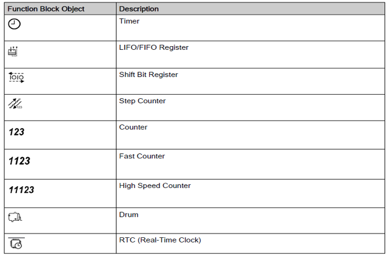
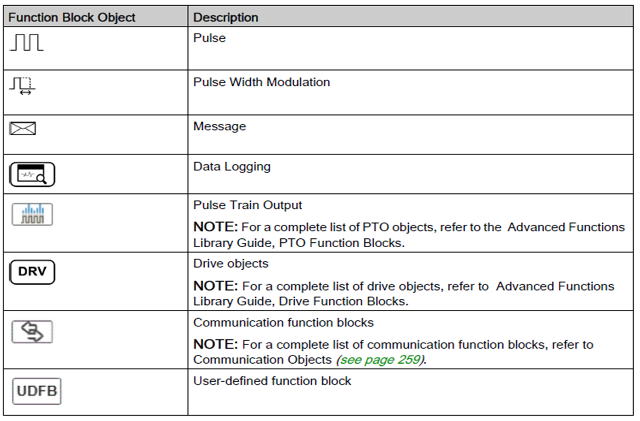
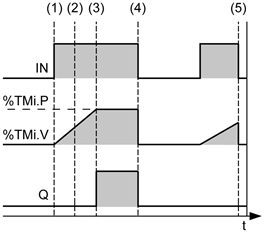
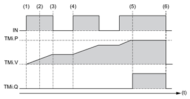
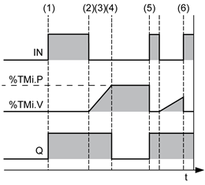
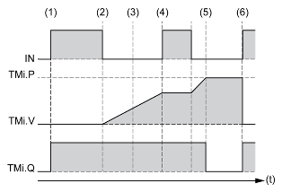
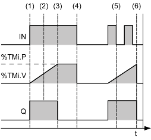
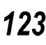
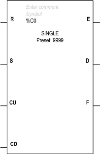
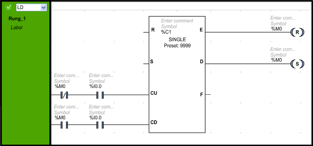

[Перйти до списку лекцій](README.md)

# Використання базових функціональних блоків (таймерів та лічильників) 

## Про функціональні блоки

### Загальні принципи використання

**Функціональні блоки (ФБ)** - це повторно використовувані об'єкти, що приймають одне або більше значень та повертають одне бо більше вихідних значень. 

Ви можете вставляти до п'яти функціональних блоків в кожен rung Ladder Diagram . 

Зміна параметрів функціональних блоків не доступне, якщо:

- ПЛК не підтримує даний ФБ, 
- ФБ не був сконфігурований

У програмах LD функціональний блок вставляється в rung, після чого конфігуруються параметри та підключаються входи виходи.   

### Типи функціональних блоків 

У таблиці наведені функціональні блоки, доступні в ПЛК M221/222

У таблиці наведений короткий опис функціональних блоків 

| Назва                         | Опис                                   |
| ----------------------------- | -------------------------------------- |
| Timer                         | Таймери                                |
| LIFO/FIFO Register            | Регістри типу LIFO/FIFO                |
| Shift Bit Register            | Регістри для зсуву бітів               |
| Step Counter                  | Крокові лічильники                     |
| Counter                       | Лічильники (програмні)                 |
| Fast Counter                  | Швидкі лічильники (апаратні)           |
| High Speed Counter            | Високо-швидкісні лічильники (апаратні) |
| Drum                          | Барабанний регулятор                   |
| RTC (Real-Time Clock)         | Годинник реального часу                |
| Pulse                         | Генератор імпульсів                    |
| Pulse Width Modulation        | Широтно-імпульсна модуляція            |
| Message                       | Повідомлення                           |
| Data Logging                  | Збереження даних                       |
| Pulse Train Output            | Генератор послідовності імпульсів      |
| Drive objects                 | Об'єкт "Привод"                        |
| Communication function blocks | Комунікаційний функціональний блок     |
| User-defined function block   | Функціональний блок користувача        |

### Конфігурування функціонального блоку в Ladder Diagram 

На відео показаний приклад вставлення та конфігурування таймеру: 

<iframe width="640" height="480" src="https://www.youtube.com/embed/7njpNluybzg" frameborder="0" allow="accelerometer; autoplay; encrypted-media; gyroscope; picture-in-picture" allowfullscreen></iframe>

## Таймери

### Загальні принципи використання

Функціональний блок Timer використовується для означення періоду часу, який повинен пройти щоб виконалася якась дія. Таймери, що використовуються в Machine Expert Basic означені в стандарті IEC-61131.    

Таймери мають наступні входи:

| Мітка | Опис                   | Значення                                                     |
| ----- | ---------------------- | ------------------------------------------------------------ |
| IN    | вхід керування таймеру | Запускає таймер таймер: при TRUE (TON або TP), при FALSE (для TOF) . |

Таймери мають наступні виходи:

| Мітка | Опис                                 | Значення                                                     |
| ----- | ------------------------------------ | ------------------------------------------------------------ |
| Q     | Вихід спрацювання таймеру (`%TMi.Q`) | Асоційований біт Associated `%TMi.Q` встановлюється в 1 (залежить від типу Timer) коли таймер дійшов до уставки . |

Поведінка таймеру залежить від його типу. Можливі наступні типи: 

- TON - Timer on-Delay  (default), з затримкою на включення   
- TOF - Timer off-Delay,  з затримкою на відключення
- TP - Pulse timer (monostable), імпульсний таймер, (генератор імпульсу вказаної тривалості) 

Таймер відраховує час в указаній в параметрах TB (TimeBase) часовій базі. 

Налаштування таймеру проводиться через наступні параметри:

| Параметр  | Можливі значення            | Опис                                                         | Можливість зміни в онлайні |
| --------- | --------------------------- | ------------------------------------------------------------ | -------------------------- |
| Used      | Використовується в програмі | Якщо опція стоїть, цей функціональний блок (адреса) використовується в програмі | Ні                         |
| Address   | Адреса об'єкта (`%TMi`)     | Програма може вміщувати тільки обмежену кількість таймерних об'єктів. | Ні                         |
| Symbol    | Символьна назва             | Символьна назва об'єкта, асоційованого  з таймером.          | Ні                         |
| Type      | Тип таймеру                 | Один з наступних: TON - Timer on-Delay  (default),   TOF - Timer off-Delay,  TP - Pulse timer (monostable) | Так                        |
| Retentive | Так/Ні                      | Якщо стоїть дана опція (за замовченням), значення буде запам'ятовуватися | Yes1                       |
| Base      | Часова база                 | Часова база, якою буде рахувати таймер. Чим менше, тим точніше буде задаватися час, але тим менше буде максимальне значення. Можливі значення:  1 ms  (тільки для `%TM0`...`%TM5`), 10 ms, 100 ms, 1 sec, 1 min  (за замовченням) | Так                        |
| Preset    | Задане значення             | 0...9999. Default value is 9999.  Timer Period = Preset x Time Base  Timer Delay = Preset x Time Base  This configured preset value can be read, tested, and modified  using the associated object `%TMi.P`. | Так                        |
| Comment   | Коментар                    | A comment can be associated with this object.                | Ні                         |

Функціональний блок таймера має об'єкти-змінні, які можуть бути доступні з будь-якої частини програми: 

| Об'єкт   | Значення        | Опис                                                         |
| -------- | --------------- | ------------------------------------------------------------ |
| `%TMi.P` | Задане значення | Задане значення для таймеру. Може бути змінене в програмі користувача. |
| `%TMi.V` | Плинне значення | Дане слово буде збільшуватися з 0 до заданого значення `%TMi.P` до тих пір, поки таймер буде запущений. Значення може бути використане для перегляду та для перевірки на умову, але не може бути змінене в програмі користувача. Але це значення може бути змінене в таблиці анімацій. |
| `%TMi.Q` | Вихід           | Може бути використане в програмі користувача для контролю спрацювання виходу таймеру. |

### TON

**TON (On-Delay Timer)** - таймер з затримкою на включення, використовується для керування діями затримки на включення.

(1) - Таймер починає відрахунок по передньому фронту сигналу IN.
(2) - Поточне значення `%TMi.V` збільшується від 0 до `%TMi.P` з кроком 1 часової бази.
(3) - Вивід `%TMi.Q` встановлюється в 1, коли поточне значення досягає заданого значення `%TMi.P`.
(4) - Вихідний біт `%TMi.Q` залишається на 1, поки IN-вхід дорівнює 1.
(5) - Коли на вході IN виявляється задній фронт сигналу, таймер зупиняється, навіть якщо таймер не досяг значення `%TMi.P`, `%TMi.V` скидається на 0.

Якщо встановлена властивість таймера Retentive, його поведінка описується іншою діаграмою.

 

(1) - Таймер починає відрахунок по передньому фронту сигналу IN.
(2) - Поточне значення `%TMi.V` збільшується від 0 до `%TMi.P` з кроком 1 часової бази.
(3) - По задньому фронту входу IN таймер зупиняється і зберігає незмінним плинне значення до наступного значення переднього фронту на вході IN
(4) - По передньому фронту входу IN таймер знову запускається зі значенням на якому зупинився 
(5) - Вихідний біт `%TMi.Q` встановлюється в 1, коли значення досягає уставки `%TMi.P`
(6) - По задньому фронту входу IN, при умові що таймер досяг уставки `%TMi.P`, значення `%TMi.V` скидається в 0

### TOF

**TOF (Off-Delay Timer)** - таймер з затримкою на відключення, використовується для керування діями затримки на виключення.

(1)  - По передньому фронту вхідного значення IN, `%TMi.Q` одразу встановлюється в 1.
(2) - Відрахунок часу починається по задньому фронті вхідного значення.
(3) - Поточне значення `%TMi.V` збільшується до заданої величини `%TMi.P` з кроком часової бази.
(4) - Вихід `%TMi.Q` скидається до 0, коли поточне значення досягає заданого значення `%TMi.P`.
(5) - По передньому фронту входу IN, `%TMi.V` встановлюється на 0, вихід встановлюється в 1.
(6) - По передньому фронту входу IN, `%TMi.V` встановлюється в 0, навіть якщо попередньо встановлене значення не досягнуто.

Якщо встановлена властивість таймера Retentive, його поведінка описується іншою діаграмою.

### TP

**TP (Pulse Timer)** - імпульсний таймер, використовується для формування імпульсу заданої довжини.

(1) - Таймер починає відрахунок по передньому фронті вхідного сигналу IN. Поточна величина %TMi.V встановлюється на 0 і `%TMi.Q` встановлюється в 1.
(2) - Поточне значення `%TMi.V` таймера збільшується від 0 до встановленого значення `%TMi.P` з кроком часової бази.
(3) - вихідний біт `%TMi.Q` встановлюється на 0, коли поточне значення досягає заданого значення `%TMi.P`.
(4) - Поточне значення `%TMi.V` встановлюється в 0, коли `%TMi.V` дорівнює `%TMi.P`.
(5) - Цей таймер не може бути скинутий.
(6) - Коли `%TMi.V` дорівнює `%TMi.P` і вхід IN становить 0, то `%TMi.Q` встановлюється в 0

## Лічильники

### Опис роботи

Функціональний блок **Counter (лічильник)** призначений для підрахунку фронтів зміни значень входів. На відміну від швидких лічильників та високошвидкісних лічильників, ці лічильники є програмними і не можуть працювати з лічильними каналами ПЛК.

Функціональний блок лічильника має наступні входи : 

| Мітка | Значення                           | Опис                                                         |
| ----- | ---------------------------------- | ------------------------------------------------------------ |
| R     | вхід скидання лічильника           | Якщо R дорівнює 1, встановлює плинне значення лічильника (`%Ci.V`) рівним 0 |
| S     | вхід виставлення на рівень уставки | Якщо S дорівнює 1, встановлює плинне значення лічильника (`%Ci.V`) рівним уставці лічильника (`%Ci.P`) |
| CU    | рахувати вверх                     | по передньому фронту збільшує плинне значення лічильника  (`%Ci.V`) на 1 |
| CD    | рахувати вниз                      | по передньому фронту зменшує плинне значення лічильника  (`%Ci.V`) на 1 |

Функціональний блок лічильника має наступні виходи : 

| Мітка | Значення                       | Опис                                                         |
| ----- | ------------------------------ | ------------------------------------------------------------ |
| E     | Індикатор переповнення   вниз  | Асоційований біт `%Ci.E`  (counter empty) встановлюється в 1 коли лічильник досяг значення 0. Наступна 1 на вхід CD переведе лічильник в значення 9999. |
| D     | Індикатор досягнення уставки   | Асоційований біт `%Ci.D` (count  done) встановлюється в 1 коли `%Ci.V` = `%Ci.P` |
| F     | Індикатор переповнення   вгору | Асоційований біт `%Ci.F`(counter full) встановлюється в 1, коли %Ci.V змінюється з 9999 в 0 |

### Приклад

У прикладі, що показаний на рисунку, підраховуються спрацювання `%I0.0` на збільшення  (при `%M0 = False`) або на зменшення  (при `%M0 = True`) в залежності від значення `%M0`. Якщо `%M0` в False (режим збільшення), кожен фронт змінної `%I0.0` буде збільшувати `%C1.V` до досягнення `%C1.P`,  після чого виставить на `%C1.D` у логічну одиницю. У свою чергу вихід `%C1.D` встановить `%M0` в логічну одиницю і перемкне схему на підрахунок вниз. Тепер при кожному фронті `%I0.0` значення `%C1.V` зменшуватиметься поки не досягне 0. Вихід `%C1.E` у свою чергу перемкне `%M0` в логічний нуль, тобто на збільшення. 

## Відео

### Використання в програмі функціонального блока таймера

<iframe width="800" height="600" src="https://www.youtube.com/embed/7njpNluybzg" frameborder="0" allow="accelerometer; autoplay; encrypted-media; gyroscope; picture-in-picture" allowfullscreen></iframe>

### Використання у програмі функціонального блока лічильника

<iframe width="800" height="600" src="https://www.youtube.com/embed/PcJXX49P3q0" frameborder="0" allow="accelerometer; autoplay; encrypted-media; gyroscope; picture-in-picture" allowfullscreen></iframe>