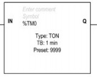
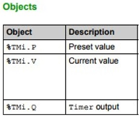
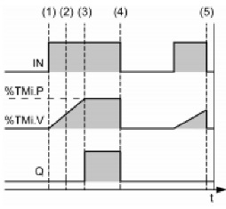
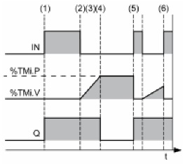
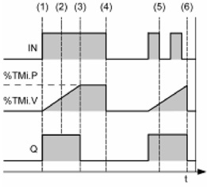
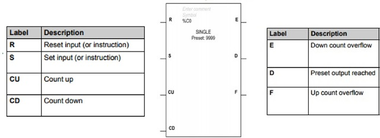
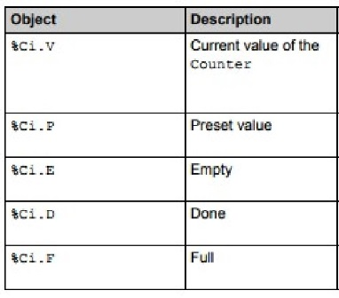
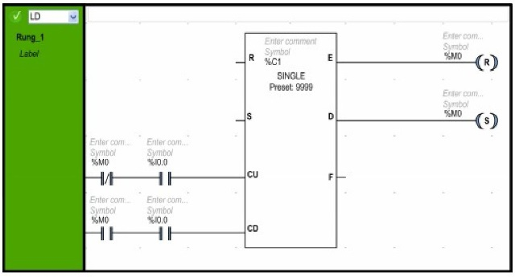

**TON: On-Delay Timer**

Тип таймера використовується для керування діями затримки на включення.

(1) - Таймер починаєвідрахунок по передньому фронту сигналу IN.

(2) - Поточне значення %TMi.V збільшується від 0 до %TMi.P з кроком 1 базового значення.

(3) - Вивід %TMi.Q встановлюється в 1, коли поточне значення досягає заданого значення% TMi.P.

(4) - Вивідний біт %TMi.Q залишається на 1, тоді як IN-вхід дорівнює 1.

(5) - Коли на вході IN виявляється задній фронт сигналу, таймер зупиняється, навіть якщо таймер не досяг значення %TMi.P %TMi.V скидається на 0.

**TOF: Off-Delay Timer**

Тип таймера використовується для керування діями затримки на виключення.

(1)  - По передньому фронті вхідного значення IN, %TMi.Q встановлено на 1.

(2) - Відрахунок часу починається по задньому фронті вхідного значення.

(3) - Поточне значення% TMi.V збільшується до заданої величини% TMi.P з кроком базової величини.

(4) - Вихід %TMi.Q скидається до 0, коли поточне значення досягає заданого значення %TMi.P.

(5) - При передньому фронті входу IN,%TMi.V встановлено на 0.

(6) - При передньому фронті входу IN,% TMi.V встановлюється в 0, навіть якщо попередньо встановлене значення не досягнуто.

**TP: Pulse Timer**

Тип таймера використовується для формування імпульсу заданої довжини.

(1) - Таймер починається відрахунок по передньому фронті вхідного сигналу IN. Поточна величина %TMi.V встановлена на 0 і %TMi.Q встановлено в 1.

 (2) - Поточне значення %TMi.V таймера збільшується від 0 до встановленого значення %TMi.P з кроком одного базового значення.

(3) - Біт виводу %TMi.Q встановлений на 0, коли поточне значення досягає заданого значення% TMi.P.

(4) - Поточне значення %TMi.V встановлено на 0, коли %TMi.V дорівнює %TMi.P.

(5) - Цей таймер не може бути скинутий.

(6) - Коли %TMi.V дорівнює %TMi.P і вхід IN становить 0, то %TMi.Q встановлюється в 0.

