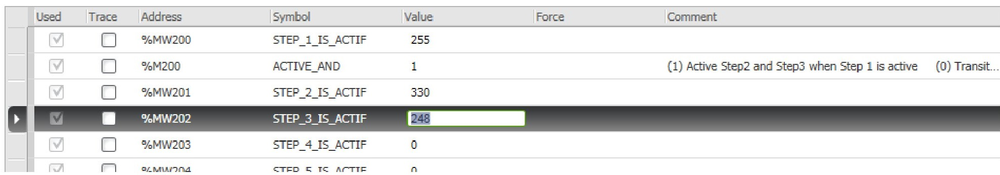
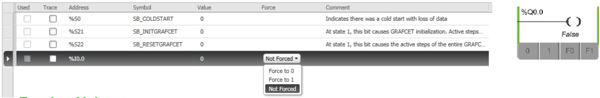
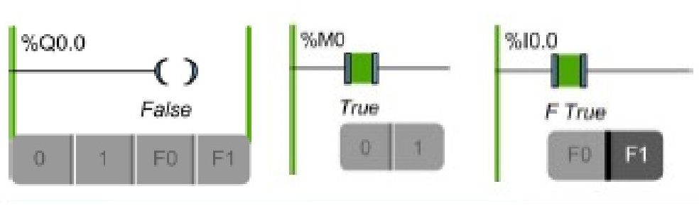

SoMachine Basic підтримує наступні функції наладки:

- Trace Window;
- Modifying Values;
- Forcing Values.

Trace Window дозволяє відображати в графічному вигляді значення аналогових або дискретних змінних (до 12 годин безперервного запису). До Trace Window можна додати до 8 об'єктів. Ви можете експортувати дані у файл для подальший аналіз.

Мінімальний час налаштування періоду оновлення для Trace Window становить 1 секунда Тому, наприклад, зміни значень логічних змінних між основними циклами завдань простежити не можливо!!!

Виберіть "Elapsed time", щоб встановити час початку відстеження на 00:00:00, або "Controller time", щоб використати час та дату логічного контролера як час початку відслідковування.

Trace Window відображає окремі графіки для кожного типу даних, обраних для відстеження в анімації:

- Цілі і реальні значення з'являються в області Numerical trace. Усі числові значення мають однакову шкалу на графіку. Виберіть «Auto scale for values» для автоматично налаштовування вертикальної осі. В іншому випадку введіть Maximum та Minimum значення, щоб відобразити фіксований діапазон значень;
- Дискретні значення з'являються в області Logical trace. Кожне Дискретні значення простежується за шкалою 0 і 1.

Натисніть START, щоб почати відстежувати змінні.

Натисніть STOP, щоб призупинити трасування в реальному часі.

Натисніть «RESET», щоб очистити всі попередньо відстежені дані з графіків та скинути значення тривалості запису до 0.

Натисніть EXPORT, щоб експортувати всі простежені дані в файл на ПК. Дані зберігаються у форматі CSV.

**Modifying Values**

В режимі онлайн, SoMachine Basic дозволяє змінювати значення деяких типів об'єктів. Зміна в режимі онлайн можлива лише в тому випадку, якщо об'єкт має доступ до читання/запису. 

Наприклад:

- Значення аналогового вводу не може бути змінено;
- Можна оновити значення параметра Preset (об'єкт %TM0.P) функціонального блоку таймера.

Щоб змінити значення об'єкта, додайте його до таблиці анімації  та встановіть його властивості в міру необхідності.

**Forcing Values**

В режимі онлайн, ви можете примусово виставити значення деяких логічних типів об'єктів. Це дозволяє встановлювати входи до певних значень. Ця функція використовується для налагодження та точного налаштування програми.

Існує кілька способів форсування значення логічних об'єктів у режимі онлайн:

- Використовуйте таблицю анімації;
- Змінити значення логічного об'єкта безпосередньо в редакторі LD.

Дискретні входи та виходи не можна форсувати, якщо:

- Вхід використовується як переключатель для START/STOP контролера;
- Налаштовано як швидкі вхідні лічильники (FC);
- Налаштовано як високошвидкісний лічильник (HSC);
- Налаштовано як швидкі виходи.

