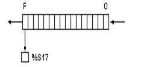
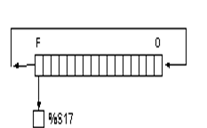
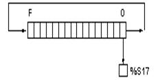
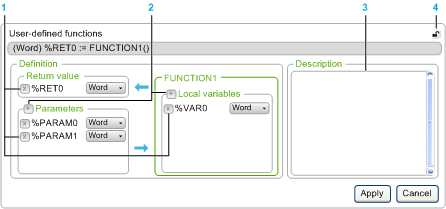
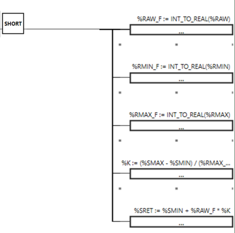
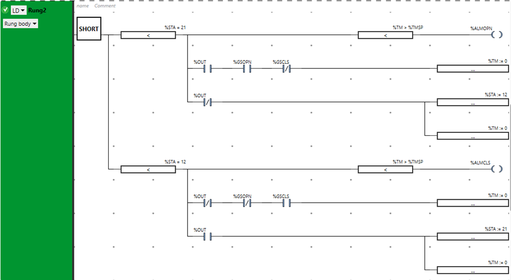
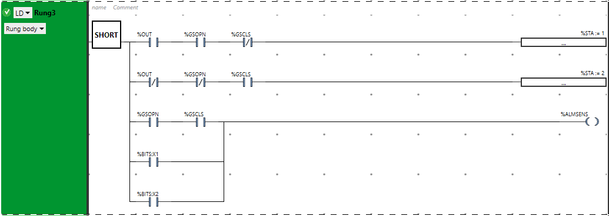
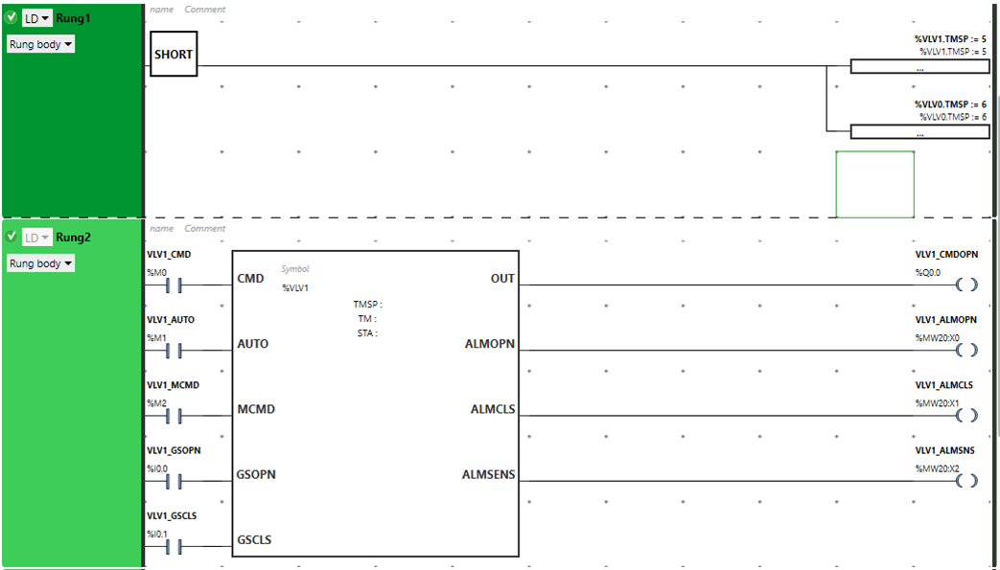

| [<- до лекцій](README.md)        | [на основну сторінку курсу](../README.md) |
| -------------------------------- | ----------------------------------------- |
| [<- PID-регулювання](4_1_PID.md) |                                           |

# Бібліотечні функції та розробка власних функціональних елементів

## Необхідність у створенні власних функціональних елементів 

Хоч для комп'ютерних програмістів використання функцій та об'єктно-орієнтованого підходу до програмування є очевидними речами, програмісти-початківці АСКТП, що розробляють програми для ПЛК, їх можуть взагалі не використовувати. Це часто пов'язано з тим, що останні не мають навики розбивання автоматизованих функцій на повторювані елементи коду. 

Розглянемо приклад. Припустимо на об'єкті є кілька клапанів з датчиками кінцевого положення, для яких необхідно реалізувати:

- окремі режими ручний/автомат;
- керування з зовнішньої функції сигналами ВКЛ/ВІДКЛ у автоматичному режимі; 
- керування окремим сигналом ВКЛ/ВІДКЛ у ручному режимі;
- контроль стану клапану: відкривається, закривається, відкрито, закрито;
- сигналізування тривог не відкрився та не закрився, якщо відповідні датчики не спрацювали при відповідному сигналі керування.     

При реалізації алгоритму для цих функцій, наприклад в LD, необхідно кілька ланцюжків . Якщо клапан один, то створення цього коду не потребує виділення окремих функцій. Якщо клапанів кілька, пряма реалізація методом "копі-паста" приведе до того, що кожна частина коду буде повторювати попередню. При цьому змінюватися будуть операнди, які прив'язані до елементів LD.  При реалізації і обслуговуванні коду можуть виникнути незручності та проблеми.  

**По-перше.** Код буде дуже громіздким. Чим більше буде клапанів, тим більше буде програма користувача. Читабельність такого коду також ускладнюється.

**По-друге.** У такому коді зі збільшенням кількості клапанів значно збільшується ймовірність помилки, так як після "копі-паста", кожний елемент треба змінювати під потреби конкретного клапану. Причому зміни необхідно зробити у багатьох місцях.

**По-третє.** Припустимо, код на кілька десятків клапанів повністю відлагоджений і він працює відмінно. Але в житті, навіть самий налагоджений код потребує зміни, коли змінюється завдання. Зміна завдання може бути пов'язане з різними обставинами, але таке буває дуже часто. У цьому випадку задача зміни приводить практично до повного переписування кожного шматка коду.       

Для інших мов проблеми будуть такі самі. Тому для таких ситуацій необхідно робити такі програми користувача, які б повторюваний код реалізовували у вигляді функціональних елементів - підпрограм, функцій, процедур або функціональних блоків. Тобто код реалізовується в одному місці з використанням формальних параметрів, і викликається кілька раз з підстановкою фактичних параметрів. 

Іншими словами, для наведеного прикладу створюється тільки один код для керування клапаном, в якому замість реальних змінних типу `%I`, `%Q`, `%M`, чи інших використовуються якісь локальні, не прив'язані до реального клапану, змінні. При виклику такого коду замість локальних змінних підставляються реальні. При такому підході код буде значно компактніше, краще читабельним, менш піддатний помилкам та простіше змінюватиметься. Останнє пов'язано з тим, що зміни треба вносити тільки в одному місці.               

## Поняття інтерфейсу та області видимості

Функціональні елементи при виклику приймають параметри, які використовуються у його програмі та видають результат роботи. Які параметри будуть використовуватися при виклику означується **інтерфейсом** функціонального елементу.  

Крім параметрів, при написанні програм функціональних елементів є потреба у використанні внутрішніх змінних, які невидимі поза межами цього елементу. Такі змінні називаються локальними. У цей же час, можна користуватися змінними, які видимі у всіх частинах програми, не тільки в межах функціонального елементу. 

У ПЛК M221 змінні з адресами %M, %MW, %Q, %I і т.д. можуть використовуватися у будь якій частині програми, тому є **глобальними**.  **Локальні змінні**  -- це змінні, які можуть бути використані тільки в середині програми самого функціонального блоку або функції і невидимі назовні. Хоч в М221 в межах функціональних елементів можна використовувати глобальні змінні, цього краще уникати. Необхідні змінні варто передавати через параметри інтерфейсу.   

## Функції 

### Особливість функцій

**Функції** - це програмні елементи, які дають (повертають) результуюче значення, що залежить від  вхідних параметрів. Наприклад, виклик функції `ABS(-3.5)` дає значення по модулю від числа `-3.5`, тобто `3`. В середині функції `ABS` може бути реалізований такий  алгоритм:

```
ABS (IN1)
- повертає значення IN1, якщо IN1>0, інакше повертає значення IN1*-1.0
```

 При цьому  `IN1` є формальним параметром, яким оперує ця функція всередині. Кажуть що в `інтерфейсі` цієї функції є один вихід типу `Float`  та один **вхідний параметр** також типу  `Float`. При виклику на місце параметру `IN1` вставляється  значення (наприклад `-3.5`), або змінна (наприклад `%MF100`). Ці підстановлювальні значення, які фактично використовуються в роботі функції називаються **фактичними параметрами**. 

Результат виклику функції завжди залежить лиш від значення вхідних параметрів. Це значить, що функції не можуть зберігати проміжні внутрішні результати, які будуть впивати на наступний виклик, тобто вони не мають пам'яті. Крім того функції завжди повертають одне розраховане значення і не впливають на фактичні параметри.  

У "EcoStruxure Machine Expert - Basic" функції користувача хоч і можуть зберігати значення змінних між викликами, але ці значення доступні для кожного виклику. 

Система "EcoStruxure Machine Expert - Basic"  надає велику кількість бібліотечних функцій та має спеціальні оператори. Деякі з них наведені нижче. Крім того, можна написати власні функції, використовуючи мови `LD` або `IL`.

### Бібліотека системних функцій

У  "EcoStruxure Machine Expert - Basic" є функції роботи з різними числовими параметрами.  

Таб.1. Функції та оператори для роботи з цілими та дійсними числовими параметрами

| Operator                        | Function                                                     |
| ------------------------------- | ------------------------------------------------------------ |
| REM                             | Залишок ділення 2-х операндів                                |
| SQRT(Op2)                       | квадратний корінь                                            |
| LOG(Op2)                        | Алгоритм з 10-ковою базою                                    |
| LN(Op2)                         | натуральний логарифм                                         |
| TRUNC(Op2)                      | відкинення дробової частини `TRUNC(927.8904)` дасть `927`    |
| EXP(Op2)                        | натуральний показник (`e` в степені)                         |
| EXPT(Op2,Op3)                   | взведення в степінь                                          |
| SIN, COS, TAN, ASIN, ACOS, ATAN | тригонометричні функції                                      |
| DEG_TO_RAD, RAD_TO_DEG          | перетворення відповідно градусів в радіани та радіанів в градуси |
| INC                             | інкремент (збільшення на 1)                                  |
| DEC                             | декремент (зменшення на 1)                                   |
| ABS(Op2)                        | абсолютне значення операнду                                  |
| BTI(Op2)                        | перетворення BCD в Binary                                    |
| ITB(Op2)                        | перетворення Binary в BCD                                    |
| LW(Op2)                         | отримання молодшого слова з подвійного слова                 |
| HW(Op2)                         | отримання старшого слова з подвійного слова                  |
| CONCATW (Op2, Op3)              | конкатенація (об'єднання) 2 слів в подвійне слово            |
| DWORD(Op2)                      | перетворення одинарного (16-бітного) слова в подвійне слово (32-бітне) |

При необхідності побітових операцій зсуву користувачу надаються типові функції, означені  в стандарті IEC 61131-3.

Таб.2. Робота з словами як з бітовими послідовностями.

| Instruction | Function                                                     |                                                            |
| ----------- | ------------------------------------------------------------ | ---------------------------------------------------------- |
| SHL(op2,n)  | зсув бітів на n позицій ліворуч                              |                                      |
| SHR(op2,n)  | зсув бітів на n позицій праворуч                             |                                    |
| ROL(op2,n)  | круговий зсув бітів на n позицій ліворуч, з добавленням "випавших" бітів праворуч |                                      |
| ROR(op2,n)  | круговий зсув бітів на n позицій праворуч, з добавленням "випавших" бітів ліворуч |                                    |
|             |                                                              | n - ціле число:  для word: 1...16, для double word: 1...32 |

Як у більшості ПЛК, в М221 повинна забезпечуватися жорстка типізація. Це значить, що не можна проводити операції з різними типами даних. Так, наприклад, щоб до цілого числа додати дійсне (з плаваючою комою), їх треба привести до одного з двох типів. Для цього використовуються функції перетворення типів. 

Таб.3. Функції перетворення типів.

| Operator     | Function                                                     |
| ------------ | ------------------------------------------------------------ |
| INT_TO_REAL  | перетворення цілого значення в значення з плаваючою комою    |
| DINT_TO_REAL | перетворення подвійного слова (integer) в значення з плаваючою комою |
| REAL_TO_INT  | перетворення значення з плаваючою комою в ціле (з округленням) |
| REAL_TO_DINT | перетворення значення з плаваючою комою в подвійне ціле (з округленням) |

Крім наведених вище функцій, "EcoStruxure Machine Expert - Basic" підтримуються також:

- функції роботи з текстовими змінними `ASCII` 
- оператори роботи зі стеком
- оператори роботи з таблицями (масивами)
- інструкції роботи з входами/виходами (негайне зчитування/запис)

Розгляд даних функцій виходить за рамки даної лекції.

### Функції користувача в М221 (User Defined Fucntion)

**Функція користувача** (**user-defined function**) - створюються на базі мов `IL` та `LD` з використанням інтерфейсу. У інтерфейсі означуються вхідні параметри, локальні змінні та значення, що повертається. Функції користувача зберігаються як частина проекту "Machine Expert Basic". Після їх створення, їх можна викликати у задачах Master, Periodic,  Events або Free POUs.

У програмі реалізації функції користувача дозволяється використовувати будь як глобальні змінні (наприклад `%M`, `%MW` ... ) а також спеціальні об'єкти інтерфейсу функції користувача, а саме:

- **%RET0** - значення, що повертає функція; може бути типів `Word`, `Double` або `Float` 
- **%PARAMn** - вхідний параметр функції, який вказується при виклику функції; 
- **%VARn**  - локальна змінна функції користувача; вона слугує внутрішньою змінною для розрахунку. 

У нових версіях системи, адреси цих параметрів можна змінювати, але вони завжди починаються зі знаку `%`. 

Таким чином параметри використовуються для передачі необхідних значень у функцію, а результат функції виводиться як `%RET0`. Змінні функції користувача використовуються для проміжних розрахунків і збереження їх між викликами. При цьому збережене значення є спільним для всіх викликів. Параметри і змінні не можуть бути використані для зміни та відображення в таблиці анімації чи в програмі користувача, за винятком передачі значень параметрам при виклику функції. 

Наступний рисунок показує дії, доступні у вікні `Properties` функції користувача:



рис.1.

> 1 - видалення змінних, параметрів та значення, що повертається, 2 - добавлення змінних, параметрів та значення, що повертається, 3 - необов'язковий опис цілей функції користувача, 4 - відкріплення вікна властивостей

У програмі реалізації функції користувача можна використовувати інші функції користувача, однак не саму себе, тобто не дозволяється рекурсивний виклик. 

Після створення функції користувача вона може бути використана в програмі в  `Operation  Block` або `Comparison Block` так само як і інші (системні) функції.  

Функції користувача зберігаються разом з проектом. Якщо необхідно використати її в інших проектах, її можна експортувати а потім імпортувати в проект.  

### Приклад створення користувацької функції

Розглянемо приклад, в якому необхідно зробити масштабування вимірюваного значення з аналогового входу в інженерні одинці. Враховуючи що вимірювальне значення отримується з аналогового входу через змінну `%IW` в цілочисельному форматі (наприклад в діапазоні 0-10000), при відображенні оператору воно неінформативне. Для відображенні на засобах людино-машинного інтерфейсу (ЛМІ), наприклад панелях оператора чи комп'ютері, його необхідно перетворити в інженерні одиниці. Таке перетворення прийнято називати масштабуванням. Як правило, засоби ЛМІ вміють робити лінійне масштабування, однак інколи необхідно це робити на самому ПЛК. 

Лінійне масштабування, тобто перетворення вхідних `сирих` одиниць у `інженерні` масштабовані може проводитися за формулою (див. рис.3.4):

```mathematica
S = k*R + Sb 			(1)
```

де `S `– отримуване масштабоване значення в інженерних одиницях; `R` – вхідне сире немасштабоване значення, `Sb` – зміщення; `k` – коефіцієнт, який дорівнює тангенсу кута нахилу прямої масштабування до осі абсцис.     


рис.2. Лінійне масштабування

Задавання масштабування у вигляді (1) вимагає від розробника додаткових розрахунків. Замість цього зручніше задавати тільки мінімальні та максимальні межі для *сирого* (*raw*) і *масштабованого* (*scaled*) значення. На рис.2 межі сирого значення показані як `Rmax` та `Rmin`, а масштабованого як `Smax` та `Smin`. Так, наприклад, якщо в ПЛК значення від датчика задається в діапазоні від 0-10000 (одиниць ПЛК) а на ЛМІ воно повинно відображатися як 50.0-150.0 (°С), то:

```mathematica
Rmin = 0 (одиниць ПЛК) –> Smin = 50.0 (°С)
Rmax = 10000 (одиниць ПЛК) -> Smax = 150.0 (°С)
```

Формула визначення `S` з використанням змінних діапазонів матиме вигляд:

```mathematica
S = Smin + (R-Rmin)(Smax-Smin)/(Rmax-Rmin) 				(2)
```

Реалізуємо формулу (2) у вигляді функції. Параметрами функції будуть усі необхідні вхідні значення, потрібні для масштабування:

- `%RAW` - сире значення вимірювальної величини типу `WORD`
- `%RMIN`- нижня межа сирого значення вимірювальної величини типу `WORD`
- `%RMAX`- верхня межа сирого значення вимірювальної величини типу `WORD`
- `%SMIN` - нижня межа масштабованого значення величини типу `Float`
- `%SMAX` - верхня межа масштабованого значення величини типу `Float`

Виходом функції буде масштабоване значення `%SRET` типу `Float`.

У процесі розрахунку необхідно робити проміжні перетворення. Зокрема, треба перетворити цілі числа у дійсні, щоб зробити арифметичні операції, наведені в формулі (2), тому що не дозволяється робити обчислення з різними типами. Зрештою, можна б було написати одну велику формулу, яка б враховувала і ці перетворення, однак в середовищі є певні обмеження на максимальну кількість операндів. Тому додатково необхідно ввести проміжні змінні: 

- `%K` - для розрахунку співвідношень масштабів 
- `%RAW_F` - сире значення вимірювальної величини перетвореного в `Float`
- `%RMIN_F` - нижня межа сирого значення вимірювальної величини перетвореного в `Float`
- `%RMAX_F` - верхня межа сирого значення вимірювальної величини перетвореного в `Float`

Загальний вигляд інтерфейсу функції користувача матиме вигляд:

 

рис.3. Інтерфейс функції масштабування 

Код функції по суті вміщує тільки обчислення, без логіки. Наглядніше б було зробити його на мові `IL`, тим не менше для універсальності нижче показаний код на мові `LD`. 



рис.4. Реалізація коду функції масштабування 

Перші три оператори переводять значення з типу `INT` в `REAL` Четвертий оператор розраховує частину формули `(Smax-Smin)/(Rmax-Rmin) `, останній вже робить кінцевий розрахунок:

```
%SRET := %SMIN + %RAW_F * %K
```

На рис.5 показаний приклад використання функції користувача `SCALE`. Перший виклик функції реалізовує перетворення виміряного значення з аналогового входу, вбудованого в модуль ЦПУ (`%IW0.0`) в діапазон `0-100%`. Другий виклик реалізовує перетворення з аналогового входу модуля  `%IW1.0` в значення сигналу `50.0-150.0 °C`. Значення записуються в `%MF100` та `%MF102`. 

>  Зверніть увагу, що змінні `%MF` знаходяться в комірках пам'яті через одну, оскільки `%MF100` займає дві комірки підряд, тобто `%MW100` та `%MW101`, а `%MF101` - `%MW101` та `%MW102`.  


рис.5. Реалізація прикладу використання функції масштабування 

## Розробка власних функціональних блоків

### Відмінність функціональних блоків від функції

Функції не мають пам'яті. Хоч в М221 можна зберігати значення між викликами, воно спільне для кожного виклику. Щоб зрозуміти, коли необхідна для виклику пам'ять розглянемо програмний лічильник. Лічильник повинен підраховувати кількість імпульсів на його вході. Для того, щоб ця кількість десь зберігалася, необхідна внутрішня змінна. У функціях користувача М221 є внутрішні змінні, які зберігають значення між викликами. Але якщо лічильників буде кілька, кожен виклик буде працювати з одним і тим же екземпляром, тобто значенням лічильнику, що очевидно не підходить для даної задачі. Тобто кожен виклик функції лічильника повинен вміщувати свою локальну копію (**екземпляр**) значення лічильника. 

Функції, що зберігають локальні дані у окремому, виділеному для неї блоці пам'яті називають **функціональними блоками**.  Тобто `функціональний блок` = `функція` + `локальні дані для неї`. Тому для кожного екземпляру функціонального блоку виділяється пам'ять. Саме тому, при виклику лічильника - вибирається один з екземплярів (`%C0`, `%C1` і т.д). Якщо викликати  один екземпляр кілька раз, буде проводитися обрахунок з тим же значенням лічильнику. Те саме стосується і інших функціональних блоків. 

Оскільки виклик функціонального блоку потребує окремого виділення пам'яті, то кажуть що є:

- **тип функціонального блоку** -  який вказує на програмну реалізацію 
- **екземпляр функціонального блоку** - який вказує на виділену пам'ять     

У  "EcoStruxure Machine Expert - Basic" є велика кількість функціональних блоків, яка розглядалася в кількох попередніх лекціях, зокрема в

- [Використання базових функціональних блоків (таймерів та лічильників)](4_fb.md) 
- [Використання експертних функціональних блоків](11_exp_fb.md) 
- [Використання експертних функціональних блоків PID](4_1_PID.md) .      

Окрім цього, для М221 можна створювати власні функціональні блоки на мовах `IL` та `LD`.        

### Функціональні блоки в М221 (User Defined Fucntion Blocks)  

**Функціональні блоки користувача** (**UDFB**, User Defined Fucntion Blocks) - це функціональні блоки, які розробляються на мовах програмування ПЛК. У М221 їх можна викликати в задачах Master, Periodic, Events  і Free POUs.

Так само, як і в функціях, у функціональних блоках доступні для використання параметри, локальні та  глобальні змінні.

- **%PARAMn** - параметр функції користувача, який вказується при виклику функції;може бути типів   `Word`, `Double` або `Float` ;
- **%VARn**  - локальна змінна функції користувача; вона не вказується при виклику і слугує внутрішньою змінною для розрахунку та збереження проміжних результатів між викликами; може бути типів `Word`, `Double` або `Float`  

Додатково є можливість добавити булеві входи та виходи. Таким чином можна керувати функціональним блоком через булеві входи, у свою чергу забираючи булеві результати. При необхідності використання числових входів/виходів використовуються параметри, які можна змінювати ззовні функціонального блоку звертаючись до них за іменем. 

Наступний рисунок показує дії, доступні у вікні `Properties` для функціональних блоків користувача:


рис.6.

> 1 - добавлення входів та виходів змінних, 2 - видалення входів/виходів, 3 - видалення параметру або локальної змінної, 4 - добавлення параметру або локальної змінної, 5 - опис призначення функціонального блоку, 6 - відкріплення вікна властивостей, 7 - кількість використаних екземплярів даного типу функціонального блоку

Функціональні блоки використовуються так само, як і інші функціональні блоки. Так, наприклад, до їх параметрів можна звертатися за назвою UDFB та назвою параметру через крапку (наприклад `%UDFB1.PARA1`). Параметри доступні як для читання, так і для запису. 

### Приклад створення користувацького ФБ

Розглянемо приклад створення та використання функціональних блоків користувача для керування клапаном. Для початку уточнемо завдання і розіб'ємо його на кілька функцій.   

#### Постановка і декомпозиція завдання

Необхідно розробити фрагмент керування програмою користувача для керування клапанами з датчиками кінцевого положення. Необхідно реалізувати:

- окремі режими ручний/автомат:
  - передбачається окрема булева змінна (АВТ/РУЧ) для керування режимом з засобів людино-машинного інтерфейсу
  - передбачається окрема булева змінна для ВКЛ/ВІДКЛ клапану у ручному режимі з засобів людино-машинного інтерфейсу
  - передбачається окрема булева змінна для ВКЛ/ВІДКЛ клапану у автоматичному режимі з програми користувача
- для клапанів використовувати керування одним дискретним виходом: ВКЛ - на відкриття, ВІДКЛ - на закриття 
- передбачити використання 2- датчиків кінцевого положення: позиція "відкритий" і "закритий"  
- контроль стану клапану (див. рис.7) з метою відображення його на засобах людино-машинного інтерфейсу різними кольорами:  
  - відкривається - проміжний стан, коли йде сигнал на відкриття, але кінцевик ВІДКРИТО ще не спрацював
  - закривається - проміжний стан, коли йде сигнал на закриття, але кінцевик ЗАКРИТО ще не спрацював
  - відкрито - кінцевий стан, коли йде команда на відкриття і спрацьовує кінцевик ВІДКРИТО, при цьому кінцевик ЗАКРИТО відключений   
  - закрито - кінцевий стан, коли йде команда на закриття і спрацьовує кінцевик ЗАКРИТО, при цьому кінцевик ВІДКРИТО відключений
  - при включенні ПЛК переходити у один з проміжних станів, в залежності від команди    


рис.7. Діаграма для автомату станів клапану

- сигналізування тривог з використанням окремих дискретних сигналів: 
  - не відкрився, якщо клапан знаходиться в проміжному стані "ВІКДРИВАЄТЬСЯ" більше, ніж задано часом уставки   
  - не закрився, якщо клапан знаходиться в проміжному стані "ЗАКРИВАЄТЬСЯ" більше, ніж задано часом уставки   
  - загальна помилка датчика або довільний зсув:
    - коли обидва датчика спрацьовують
    - коли в кінцевому стані без зміни команди спрацьовують або відключаються датчики положення  

#### Створення інтерфейсу функціонального блоку

У інтерфейсі функціонального блоку визначаються усі його булеві входи та виходи, параметри та локальні змінні. 

Для клапану варто означити наступні булеві входи (рис.8):

- `CMD` - подача команди в автоматичному режимі
- `AUTO` - ручний (0), або автоматичний (1) режим 
- `MCMD` - подача команди в ручному режимі
- `GSOPN` - датчик кінцевого положення ВІДКРИТО
- `GSCLS` - датчик кінцевого положення ЗАКРИТО 


рис.8.

З функціонального блоку виходять наступні булеві виходи (див.рис.8):

- `OUT` - вихід на виконавчий механізм
- `ALMOPN` - вихід сигналу тривоги "НЕ ВІДКРИВСЯ" 
- `ALMCLS` - вихід сигналу тривоги "НЕ ЗАКРИВСЯ" 
- `ALMSENS` - вихід сигналу тривоги "Помилка датчика або довільний зсув" 

Для налаштування функціонального блоку та контролю використовуються наступні параметри та змінні (див.рис.8):

- `%TMSP` - параметр, який вказує на максимальний час відкриття (в секундах) 
- `%TM` -параметр, який вказує час плинного стану (в секундах)  
- `%STA` - параметр, який вказує плинний стан клапану: 0 - ініціалізація, 1 - відкритий, 2 - закритий, 12 - відкривається, 21 - закривається
- `%BITS` - внутрішня змінна, для розрахунку та збереження бітових результатів

Параметри видимі в програмі користувача поза функціонального блоку, внутрішні змінні видимі тільки в межах функціонального блоку.

#### Створення програми функціонального блоку

Вихід `OUT` керується входом `CMD` в режимі `AUTO` і `MCMD` у ручному режимі. Фрагмент програми функціонального блоку матиме вигляд як на рис.9.  Зрештою такий ланцюжок можна прокоментувати так:

- `%OUT := %CMD` при `%AUTO=1`
- `%OUT := %MCMD` при `%AUTO=0`


рис.9. Керування виходом `OUT` у залежності від режиму. 

У наступному фрагменті (рис.10) показана поведінка в станах 0, 1 та 2:

- якщо у стані відкритий (1) або ініціалізації (0) відсутній вихід `OUT`, значення часу (`%TM`) стану обнуляється і стан переходить в значення 12 - закривається;

> значення 12 і 21 взято для зручності читання, і читається як перехід з 1 в 2, та перехід з 2 в 1 відповідно;

- якщо у стані відкритий (1) вмикається кінцевик ЗАКРИТО або відключається кінцевик ВІДКРИТО, то це очевидно помилка датчика; при цьому перевіряється, що стан тримається протягом максимального часу переходу між станами

> зверніть увагу, що як тільки у відкритому стані вікдлючиться вихід - спочатку обнулиться час кроку, а потім вже відбудеться перевірка датчиків, тому в цій ситуації помилка датчика не відловиться

> зверніть увагу, що замість булевих змінних можна використовувати біти слів, так запис `%BITS:X1`вказує на використання 1-го біту в слові `%BITS`    

Аналогічно реалізовані переходи та перевірка для закритого стану.  


рис.10. 

У перехідних станах (21 і 12) перевіряється час стану (рис.11). Якщо цей час `%TM` більше заданого максимального `%TMSP` спрацьовує відповідний вихід тривоги. Перехідний стан завершується при спрацюванні відповідних датчиків, при цьому обнуляється час стану, саме присвоєння новому стану йде в наступному ланцюгу (див. рис.12). Якщо у перехідному стані, команда змінюється, то стан переходить в інший перехідний (наприклад з 21-го в 12-й при відключенні `OUT`).



рис.11.

Наступний фрагмент коду реалізує перехід в кінцеві стани при відповідних умовах, а також спрацювання виходу тривоги помилки датчика або довільного зсуву.   



рис.12. 

Час кроку реалізується через змінну `%TM`, яка збільшується з кожною секундою. Для цього використаний бітовий меандр `%S6` , який протягом `0.5` секунд тримає логічну одиницю, і стільки ж логічний нуль.  У М221 не можна ловити фронти на системних бітах, тому для відлову переходів з `0` в `1` треба зберігати попереднє значення `%S6` в 0-му біті внутрішнього слова `%BITS`. 

Важливо зробити обмеження збільшення часу `%TM`, так як при досягненні верхньої межи додатного значення (32767), змінна перейди у від'ємне значення. Тут плинне значення використовується більше для контролю перехідних станів, тому обмеження в `8` з чимось годин (32000/60/60) для цих задач цілком достатньо. При необхідності більшого часу, необхідно реалізовувати додаткові лічильники, або використовувати змінну типу `DWORD`.  


рис.13. 

#### Використання функціональних блоків

Фрагмент використання функцоінального блоку для одного клапану показаний на рис.14. У першому `Rung` виставляється уставка часу (5 секунд) для клапану `%VLV1`. У `Rung2` клапан функціонального блоку підключається до відповідних глобальних змінних. 

> Зверніть увагу, в даному прикладі виходи тривог записуються в біти слова `%MW`. Нерідко, засоби людино-машинного інтерфейсу сприймають біти тривог через 16-бітні слова. Сам процес записування булевих значень в біти слів називають упаковкою.     



рис.14. Використання функціонального блоку користувача для одного клапану


| [<- до лекцій](README.md)        | [на основну сторінку курсу](../README.md) |
| -------------------------------- | ----------------------------------------- |
| [<- PID-регулювання](4_1_PID.md) |                                           |

Розробив Олександр Пупена