[Перейти до списку лекцій](README.md)

# Фізична структура ПЛК М221 

## Загальна структура ПЛК

ПЛК (програмований логічний контролер) - електронний мікропроцесорний засіб, що використовується для автоматизації технологічних процесів.

ПЛК повинен відповідати певним вимогам:

- Робота в «жорсткому» реальному часі;

- Тривала автономна робота без обслуговування;

- Стійкість до факторів навколишнього середовища;

- Можливість швидкої заміни компонентів;

- Прості в розумінні мови програмування;

- Можливість перепрограмування «в полі»;

- Можливість обміну даними зі сторонніми пристроями.

  Один ПЛК може обробити від десятків сигналів I/O до сотень тисяч сигналів I/O, в залежності від типу.

ПЛК найчастіше - модульний виріб. Основні типи модулів ПЛК:

- Блок живлення (PS);

- Центральний процесор (CPU);

- Сигнальні модулі;

- Модулі доступу до промислових мереж;

- Спеціальні модулі.

  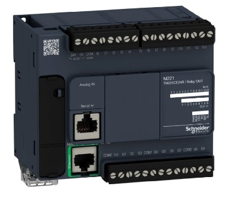

CPU - центральний компонент ПЛК. Виконує наступні функції:

- Забезпечує виконання програми користувача;
- Забезпечує циклічне опитування вхідних даних і запис вихідних;
- Виконує діагностику ПЛК в цілому;
- Зберігає програму користувача і всі дані системи

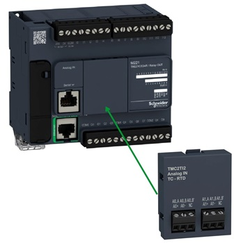

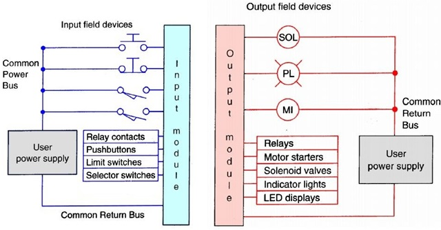

Модулі DI відрізняються:

- Величиною і типом фізичного сигналу (24 VDC, 220 VAC ...);
- Наявністю спеціальних функцій;
- Максимальною кількістю оброблюваних сигналів.

Модулі DO відрізняються:

- Величиною і типом фізичного сигналу (24 VDC, 220 VAC ...);
- Наявністю спеціальних функцій;
- Максимальною кількістю оброблюваних сигналів;
- Максимальним струмом вихідного сигналу
  типом виходу

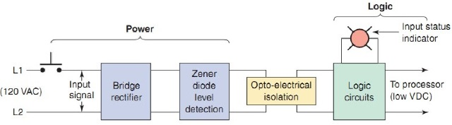

Спрощена електрична схема дискретного вхідного АС модуля

Структурна схема дискретного вихідного АС модуля

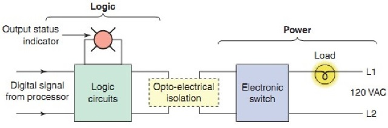

Спрощена електрична схема дискретного вихідного АС модуля

Типи дискретних вихідних сигналів

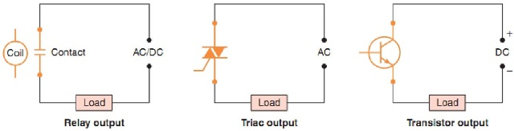

Позитивна і негативна логіка підключення DI

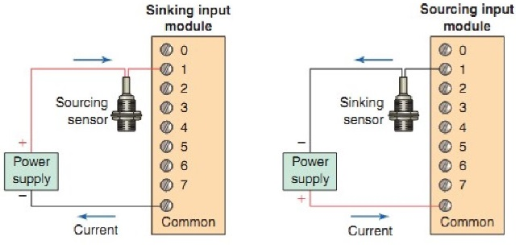

Позитивна і негативна логіка підключення DO

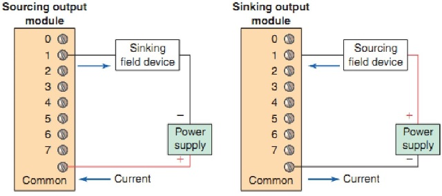

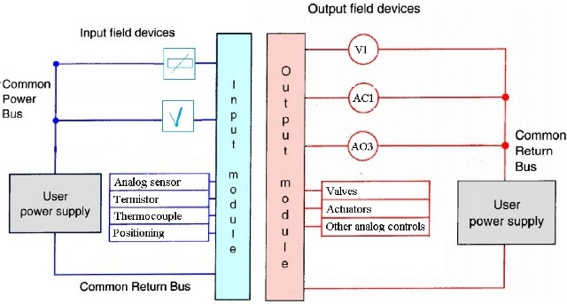

Модулі АI відрізняються:

- Величиною і типом оброблюваного сигналу (0-10 В, 4-20 мА, pt100 ...;
- Наявністю гальванічної розв'язки між каналами;
- Максимальною кількістю оброблюваних сигналів;
- Роздільною здатністю АЦП.

Модулі АO відрізняються:

- Величиною і типом оброблюваного сигналу (0-10 В, 4-20 мА ...);

- Наявністю гальванічної розв'язки між каналами;

- Максимальною кількістю оброблюваних сигналів;

- Роздільною здатністю ЦАП.

  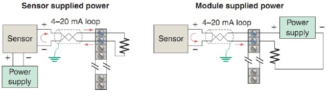

Модулі промислових мереж, призначені для забезпечення можливості зв'язку за певними стандартами промислових мереж, наприклад ModBus RTU, ProfiBus, CanOpen ...
Існують такі типи FieldBus модулів:

- Фізичний інтерфейс без логіки (наприклад RS485);
- Фізичний інтерфейс з логікою (наприклад CanOpen Master)

Спеціальні модулі, призначені для виконання специфічних завдань.
Існують такі типи спеціальних модулів:

- Спеціальні DI, DO, AI, AO;
- Модулі для незалежного управління.

Мають вбудовані апаратні механізми для реалізації певного функціоналу.

## Структура ПЛК М221

M221 - Швидкодія і можливості:

- Пряма заміна Twido;
- 5 раз ШВИДШЕ ніж Twido;
- 10 рази БІЛЬШЕ пам'яті ніж Twido;
- SD-карта;
- USB-порт програмування;
- Перемикач RUN / STOP;
- Живлення по USB.

М221 - Картриджі розширення:

- 2 аналогових входи/виходи:
  - 0-10 В;
  - 0-20/4-20 мА;
  - Термопари і термосопротивления.

М221 - Картридж послідовного зв'язку:

- RS232/485;
- Modbus RTU/ASCII;
- Символьний режим.

SoMachine Basic - основні можливості:

- Ladder/IL;

- Зв'язок з контролером через USB/Ethernet/Serial;

- Можливість конвертації проектів TwidoSuite;

- Збереження і повторне використання ділянок коду;

- Симуляція проекту;

- ПО поставляється безкоштовно.

## Модулі TM3

Повністю оновлена система входів/виходів TM3

TM3 - швидкодія:

- Час реакції:
  - 10 x швидше ніж TM2 (Типова конфігурація: 4 дискр. модуля, 2 аналог і 1 експертних);
- Швидкодія:
  - Частота шини 2 МГц замість 1 МГц;
  - Період тиші між байтами зменшений;
  - Зменшено час обробки аналогових сигналів;
- Авто адаптація:
  - Модулі TM2 і TM3 можуть застосовуватися спільно (швидкодія падає до рівня TM2);
- Простота:
  - 1 система модулів входів/виходів для 5 ПЛК та деяких HMI в майбутньому.

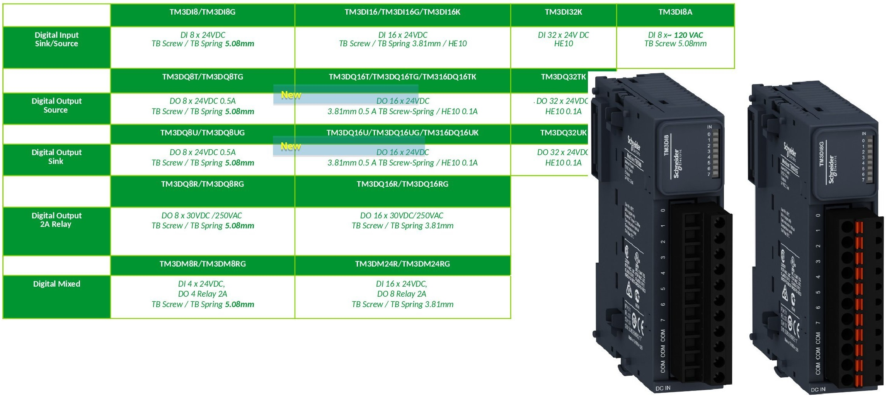

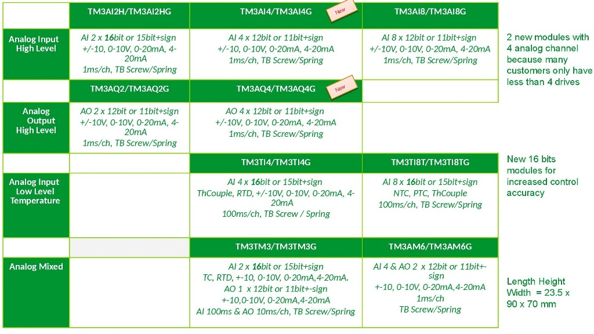

- Інтеграція з ПЛК;

- Інтеграція в ПО програмування.

  

