| [<- до лекцій](README.md)  | [на основну сторінку курсу](../README.md) |
| -------------------------- | ----------------------------------------- |
| [<-Мова Grafcet](6_SFC.md) | [PID-регулювання ->](4_1_PID.md)          |

# Мова IL

## Загальні відомості про мову IL

**IL (Instruction List, список інструкцій)** є текстовою мовою програмування низького рівня, яка дуже схожа на **Assembler**, але до конкретної архітектури процесора не прив'язана. Вона дозволяє описувати функції, функціональні блоки і програми, а також кроки і переходи в мові Grafcet. Однією з ключових переваг мови IL є її простота і можливість досягти оптимізованого коду для реалізації критичних секторів програм. Особливості мови IL роблять її незручною для опису складних алгоритмів з великою кількістю розгалужень.

Основа мови програмування IL, як і в Assembler - це переходи по мітках і акумулятор. В акумулятор завантажується значення змінної, а подальше виконання алгоритму є читання значення з акумулятора і проведення над ним операцій.

Програма, написана мовою **IL**, складається з послідовності інструкцій, які послідовно виконуються ПЛК. Кожна інструкція представлена одним рядком програми та складається з наступних компонентів:

- Номер рядка
- Поточне значення (лише в онлайн-режимі)
- Операційна Інструкція
- Операнд
- Коментар (необов’язково)

Далі наведено приклад програми Інструкції зі списку інструкцій (рис. 1).

Рис. 1 Приклад програми на мові IL

###### Номер рядка

Чотиризначні номери рядків генеруються автоматично при створенні нової лінії програми.

###### Поточне значення (лише в онлайн-режимі)

Коли редактор знаходиться в режимі **онлайн** (підключений до ПЛК чи симулятора і програма працює), він відображає поточні значення об'єктів у вікні редактора IL.

Відображені значення цих об'єктів оновлюються.

###### Операційна Інструкція

Операційна інструкція (оператор) - ключове слово, яке ідентифікує операцію, яку слід виконати за допомогою операндів. Типові оператори задають булеві та числові операції.
Наприклад, у наведеному вище прикладі програми (рис. 1) **LD** є коротким ключовим словом оператора **LOAD**. Інструкція **LOAD** розміщує (завантажує) значення операнду %M1 у внутрішній регістр, який називається булевим акумулятором.
В основному існує два типи операторів:

- Оператори перевірки
  Використовуються для перевірки умов, які повинні виконатись для виконання дії. Наприклад, **LOAD** (**LD**) та **AND**.
- Оператори дії
  Виконують дії в результаті  виконання попередньої логіки. Наприклад, оператори **STORE (ST)** і **RESET (R)**.

###### Операнди

**Операнд** - це об'єкт, адреса або символ, що представляє значення, яким програма може керувати в інструкції. Наприклад, у прикладній програмі вище, операнд %I0.1 - це адреса, що відповідає значенню вбудованого дискретного входу ПЛК. Інструкція може мати від 0 до 3 операндів, залежно від типу оператора інструкцій.

Операнди можуть відображати:

- Входи та виходи ПЛК.
- Заздалегідь визначені системні функції, такі як таймери та лічильники.
- Арифметичні, логічні, порівняльні та числові операції.
- Внутрішні змінні контролера, такі як системні біти та слова.

## Налаштування редактора LD/ IL

Для перемикання режимів відображення редактора з LD в режим IL необхідно скористатися кнопкою **>IL** (рис.2)

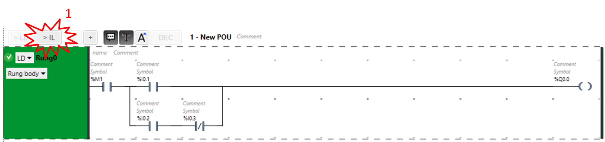

Рис. 2. Перемикання редактора в режим IL

Для перемикання режимів відображення редактора з IL в режим LD  необхідно скористатися кнопкою **>LD** (рис.3)

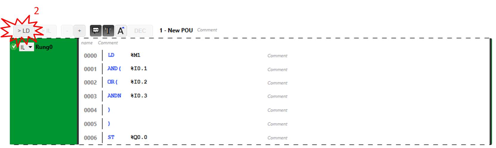

Рис. 3. Перемикання редактора в режим LD

**Важливо!** При розробці прикладної програми на мові LD завжди є можливість перемкнутися в режим IL. Але обернена операція не завжди може бути доступною.

## Перелік інструкцій мови IL

### Інструкції перевірки

Наступна таблиця описує інструкції перевірки мови IL

| Ключове слово         | Назва                                            | Еквівалентний елемент мови  LD | Призначення                                                  |
| --------------------- | ------------------------------------------------ | ------------------------------ | ------------------------------------------------------------ |
| LD                    | Load                                             |            | Завантажує булеве значення  операнда в акумулятор.           |
| LDN                   | Load Not                                         |            | Завантажує інвертоване  булеве значення операнда в акумулятор. |
| LDR                   | Load Rising                                      |            | Завантажує булеве значення  операнда в акумулятор, коли значення змінюється від 0 до 1 (по передньому  фронту). Після цього у значення акумулятора буде завантажено 0 до наступного  переходу операнду від 0 до 1. |
| LDF                   | Load Falling                                     |            | Завантажує булеве значення  операнда в акумулятор, коли значення змінюється від 1 до 0 (по задньому  фронту). Після цього у значення акумулятора буде завантажено 1 до наступного  переходу операнду від 1 до 0. |
| AND                   | And                                              |            | Булевий результат, що  дорівнює логічному «І» між булевим результатом попередньої інструкції (який  зберігається в акумуляторі) та статусом операнду. Потім результат інструкції  неявно завантажується в акумулятор, перезаписуючи попереднє значення. |
| ANDN                  | And Not                                          |            | Булевий результат, що  дорівнює логічному «І» між булевим результатом попередньої інструкції (який  зберігається в акумуляторі) та інвертованим статусом операнду. Потім  результат інструкції неявно завантажується в акумулятор, перезаписуючи  попереднє значення. |
| ANDR                  | And Rising                                       |            | Булевий результат, що  дорівнює логічному «І» між булевим результатом попередньої інструкції  та переднім фронтом  операнда. Потім результат інструкції неявно  завантажується в акумулятор, перезаписуючи попереднє значення. |
| ANDF                  | And Falling                                      | 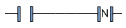           | Булевий результат, що  дорівнює логічному «І» між булевим результатом попередньої інструкції  та заднім фронтом операнда. Потім результат інструкції неявно  завантажується в акумулятор, перезаписуючи попереднє значення. |
| OR                    | Or                                               | 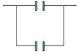           | Булевий результат, що  дорівнює логічному «АБО» між булевим результатом попередньої інструкції та  статусом операнда. |
| AND(                  | And With                                         | 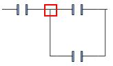          | Логічне І (Максимум 32  рівні вкладеності дужок). В дужках вказується проміжний логічний вираз. Результат  цього виразу обчислюється за логічним «І» зі значенням в акумуляторі. |
| OR(                   | Or With                                          | 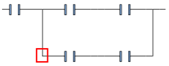          | Логічне АБО (Максимум 32  рівні вкладеності дужок). В дужках вказується проміжний логічний вираз. Результат  цього виразу обчислюється за логічним «АБО» зі значенням в акумуляторі. |
| XOR  XORN  XORR  XORF | Ex Or   Ex Or Not   Ex Or Rising   Ex Or Falling | 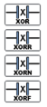          | Виключне АБО                                                 |
| MPS  MRD  MPP         | Memory Push Store   Memory ReaD   Memory PoP     | 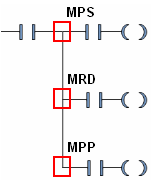          | Оператори розгалудження  для реалізації декількох дій.       |
| N                     | Not                                              |           | Інвертує значення  операнда.                                 |

### Інструкції дії

Наступна таблиця описує інструкції дій мови IL

| Ключове слово | Назва           | Еквівалентний елемент мови  LD | Призначення                                                  |
| ------------- | --------------- | ------------------------------ | ------------------------------------------------------------ |
| ST            | Store           |            | Асоційований операнд  приймає значення результату зони порівняння. |
| STN           | Store Not       |            | Асоційований операнд  приймає інвертоване значення результату зони порівняння. |
| S             | Set             |            | Асоційований операнд  встановлюється в логічну 1, коли результат зони порівняння дорівнює 1. |
| R             | Reset           |            | Асоційований операнд  встановлюється в логічну 0, коли результат зони порівняння дорівнює 1. |
| JMP           | Jump            | 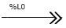           | Безумовний перехід до вказаної  послідовності (вище чи нижче по програмі) |
| SRn           | Subroutine      | 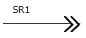           | Перехід до початку  підпрограми (виклик підпрограми)         |
| END           | End             |            | Безумовний кінець програми                                   |
| ENDCN         | End Conditional |            | Умовний кінець програми  при булевому результаті 0           |

## Приклади програм

### Приклад використання інструкції AND

Наступні приклади показують, як використовувати дужки з інструкцією AND:

| Інструкція IL                                                | Еквівалент на мові LD |
| ------------------------------------------------------------ | --------------------- |
| LD  %I0.0 AND  %I0.1 OR   %I0.2 ST   %Q0.0       | 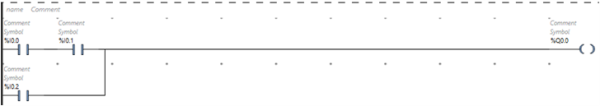  |
| LD   %I0.0 AND( %I0.1 OR   %I0.2 ) ST   %Q0.1 | 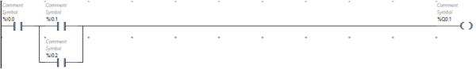  |

### Приклад використання інструкції OR

Наступні приклади показують, як використовувати дужки з інструкцією OR:

| Інструкція IL                                                | Еквівалент на мові LD |
| ------------------------------------------------------------ | --------------------- |
| LD   %I0.0 AND  %I0.1 OR(  %I0.2 AND  %I0.3 ) ST   %Q0.0 | 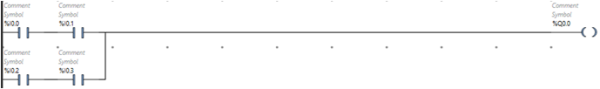  |

### Модифікатори

У наступній таблиці описано модифікатори, що можна використати разом з дужками.

| Модифікатор | Функція        | Приклад                                   |
| ----------- | -------------- | ----------------------------------------- |
| N           | Заперечення    | AND(N or OR(N                             |
| F           | Задній фронт   | AND(F or OR(F                             |
| R           | Передній фронт | AND(R or OR(R                             |
| [           | Порівняння     | Більш детально в розділі числові операції |

### Правила використання вкладеності дужок

Можна використовувати до 32 рівнів вкладеності за допомогою дужок

При використанні дужок необхідно дотримуватись таких правил:

- Кожна відкрита дужка повинна мати відповідну закриту дужку.
- Мітки (`%Li :`), підпрограми (`SRi :`), інструкції JMP (`JMP`) та інструкції функціональних блоків не можуть розміщуватися у виразах між дужками.
- Інструкції дій (`ST`, `STN`, `S` і `R`) не повинні розміщуватися між дужками.

Приклад використання вкладеності дужок

| Інструкція IL                                                | Еквівалент на мові LD |
| ------------------------------------------------------------ | --------------------- |
| LD     %I0.0 AND(   %I0.1 OR(N   %I0.2 AND    %M3 ) ) ST    %Q0.0 | 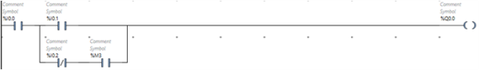  |
| LD   %I0.1 AND( %I0.2 OR(  %I0.5 AND   %I0.6 ) AND   %I0.4 OR(   %I0.7 AND   %I0.8 ) ) ST   %Q0.0 | 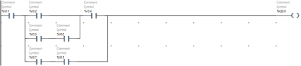  |

### Числові операції

Числові інструкції зазвичай стосуються 16-бітних слів та 32-бітних подвійних слів. Вони записуються **між квадратними дужками**. Якщо результат попередньої логічної операції був істинним (булевий акумулятор = 1), чисельна інструкція виконується. Якщо результат попередньої логічної операції був хибним (булевий акумулятор = 0), числова інструкція не виконується, і операнд залишається незмінним.

### Інструкція  присвоєння

Інструкція  присвоєння застосовуються для завантаження значення Op2 (операнд 2) в Op1 (операнд 1).

| Оператор | Синтаксис                                |
| -------- | ---------------------------------------- |
| :=       | [Op1: = Op2]   Op1 приймає значення  Op2 |

Приклад присвоєння для типу word

| Інструкція IL                           | Еквівалент на мові LD |
| --------------------------------------- | --------------------- |
| LD 1 [%SW112:=%MW100]               | 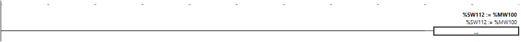  |
| LD %I0.2 [%MW0[%MW10]:=%KW0[%MW20]] | 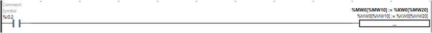  |
| LD %I0.3 [%MW10:=100]               | 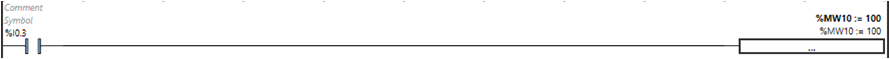  |

### Арифметичні оператори

Арифметичні оператори використовуються для виконання арифметичних операцій між 2 цілими операндами або з 1 цілим операндом.

У таблиці перелічені типи арифметичних операторів:

| Оператор | Функція                                     |
| -------- | ------------------------------------------- |
| +        | Додавання двох операндів                    |
| -        | Віднімання двох операндів                   |
| *        | Множення двох операндів                     |
| /        | Ділення двох операндів                      |
| REM      | Залишок від ділення двох  операндів         |
| SQRT     | Квадратний корінь операнда                  |
| INC      | Інкрементування операнда (збільшення  на 1) |
| DEC      | Декрементування операнда (зменшення  на 1)  |
| ABS      | Абсолютне значення  операнда                |

Синтаксис для арифметичних інструкцій:

| Оператор    | Синтаксис                 |
| ----------- | ------------------------- |
| +,-,*,/,REM | [Op1: = Op2 operator Op3] |
| INC, DEC    | [operator Op1]            |
| SQRT (1)    | [Op1: = SQRT(Op2)]        |
| ABS (1)     | [Op1: = ABS(Op2)]         |

Приклади  арифметичних інструкцій:

| Інструкція IL                    | Еквівалент на мові LD |
| -------------------------------- | --------------------- |
| LD %M0 [%MW0:=%MW10+10]      | 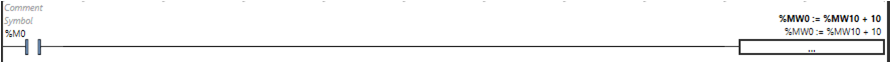  |
| LD %I0.2 [%MW0:=SQRT(%MW10)] | 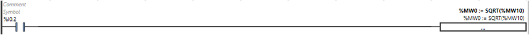  |
| LDR %I0.3 [%MW10:=32767]     | 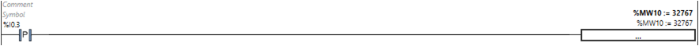  |

Розробив лекцію - Полупан Володимир. [АКТСУ НУХТ](http://www.iasu-nuft.pp.ua)

| [<- до лекцій](README.md)  | [на основну сторінку курсу](../README.md) |
| -------------------------- | ----------------------------------------- |
| [<-Мова Grafcet](6_SFC.md) | [PID-регулювання ->](4_1_PID.md)          |