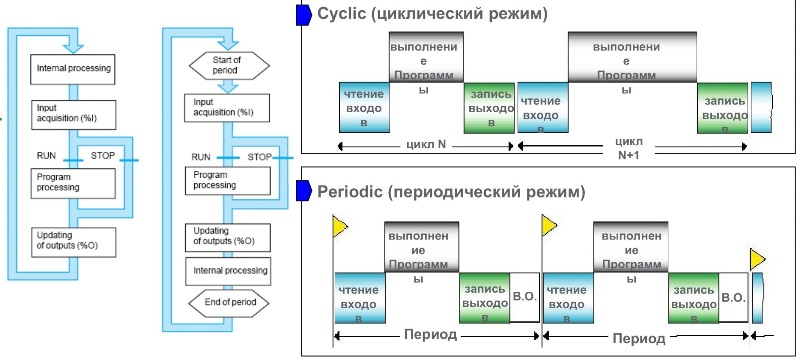
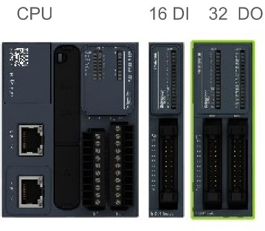
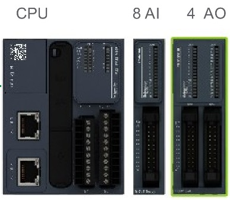
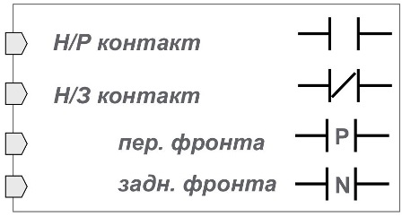
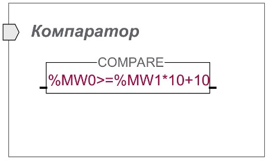
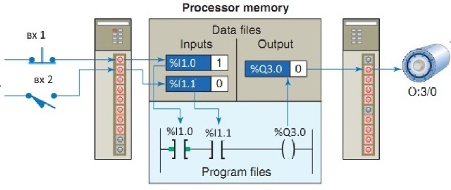
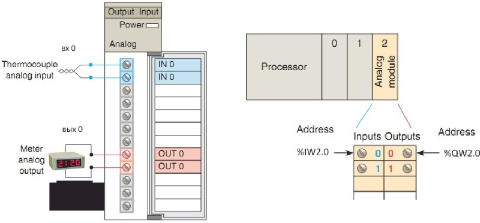

- Оперативна пам'ять (RAM) - зберігає програму користувача і дані, не зберігається при втраті живлення.
- Постійна пам'ять (ROM, EPROM, Flash) - зберігає прошивку, програму користувача, дані та інше, зберігається при втраті живлення.
- М221 містить 512 Kb RAM, 1,5 Mb Flash. Пам'ять може бути додатково розширена картою SD.

**Memory objects (M)** - Внутрішня пам'ять - використовується для зберігання призначених для користувача даних;

**System objects (S)** - Системна пам'ять - використовується для діагностики;

**I/O objects (I, Q)** - Відображення даних процесу з вхідних і та вихідних модулів;

**Software objects** - Зберігає в собі дані програмних об'єктів (таймерів, лічильників і т.д.).

У розділі Tools  вкладки Programing відображаються всі доступні змінні контролера у відповідності до його конфігурації.

**Memory objects (M)**

Memory bits - біти внутрішньої пам'яті, можуть приймати значення TRUE або FALSE. Всього доступно 512 бітів з адресами %M0 - %M511.

Memory words - слова внутрішньої пам'яті, приймають цілочисельні значення зі знаком. Всього доступно 2000 слів з адресами %MW0 - %MW1999. 

В середовищі EcoStruxure Machine Expert - Basic доступна побітна адресація до слова. Оскільки одне слово містить 16 біт, для %MW0 можлива адресація від %MW0:Х0 до %MW0:Х15. для інших слів адресація аналогічна.

В свою чергу можна звертатись не до слова, а до подвійного слова, також  цілочисельних зі знаком. В такому випадку адреса може бути в діапазоні %MD0 - %MD1998. Варто враховувати, що це все одна область пам'яті, а отже звертаючись до %MD0 ви задієте слова %MW0 і %MW1, %MD1 - %MW1 і %MW2 і т.д.

При необхідності використання значень з плаваючою комою використовуються %MF0 - %MF1998. Аналогічно до %MD, %MF займає два слова, відповідно %MF0 займає слова %MW0 і %MW1.

Constant words - слова константи. Вони подібні до слів внутрішньої пам'яті, проте не можуть змінюватись з програми користувача. Доступно 512 слів в діапазоні від %KW0 - %KW511. Можливе використання %KD і %KF, побітна адресація відсутня.

**System objects (S)**

System bits - системні біти, визначені виробником. По замовченню вони одразу мають символьну назву і коментарі. В залежності від призначення, системні біти можуть бути доступними для зміни з програми користувача або ні. Діапазон адрес %S0-%S159.

System words - системні слова. Діапазон %SW0-%SW233. За допомогою системних слів можна відстежувати стан контролера, максимальний час сторожового таймера та інше. 

Input channel status - слово статуса аналогового входу. Генеруються автоматично у відповідності до конфігурації контролера. Звернення до слова у вигляді %IWSi.j, де i- номер модуля, j - номер каналу.

Output channel status - слово статуса аналогового виходу. Генеруються автоматично у відповідності до конфігурації контролера. Звернення до слова у вигляді %QWSi.j, де i- номер модуля, j - номер каналу.

**I/O objects (I, Q)** 

Адресація залежить від розміщення модуля в конфігурації контролера.

Digital inputs - дискретні входи. Звернення до слова у вигляді %Ii.j, де i- номер модуля, j - номер каналу.

Digital outputs - дискретні виходи. Звернення до слова у вигляді %Qi.j, де i- номер модуля, j - номер каналу.

Analog inputs - аналогові входи. Звернення до слова у вигляді %IWi.j, де i- номер модуля, j - номер каналу.

Analog outputs - аналогові виходи. Звернення до слова у вигляді %QWi.j, де i- номер модуля, j - номер каналу.

Fast counter - швидкі лічильники для підключення енкодерів,  можуть застосовуватись лише з деякими дискретними каналами. Звернення у вигляді %FC0.

**Software objects**

Сюди відносяться таймери, лічильники та інші об'єкти, які будуть розглянуті пізніше.

Процес апаратного конфігурації - важливий початковий етап програмування ПЛК. Його суть - резервування області пам'яті CPU під конкретний модуль.

Стандартом IEC 61131 описано 5 мов програмування ПЛК:

1. Instruction list (IL) - текстова асемблер-подібна низькорівнева платформо-незалежна мова.
2. Ladder diagram (LD) - графічна мова, програмна реалізація релейно-контактних схем.
3. Function block diagram (FBD) - графічна мова, кожен блок відображає якусь підпрограму або операцію.
4. Sequential function chart (SFC) - графічна мова, представляє собою програмну реалізацію математичного апарату мереж Петрі.
5. Structured text (ST) - текстова паскале-подібна мова.

- контакти/компаратори не можуть розміщуватися в останній колонці;
- контакти/компаратори не можуть розміщуватися після (праворуч) котушок/операц. блоків.

