Промислова мережа - мережа передачі даних, що зв'язує різні датчики, виконавчі механізми, промислові контролери і використовувана в промислової автоматизації.

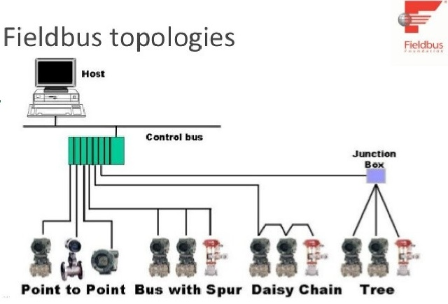

Без промислових мереж

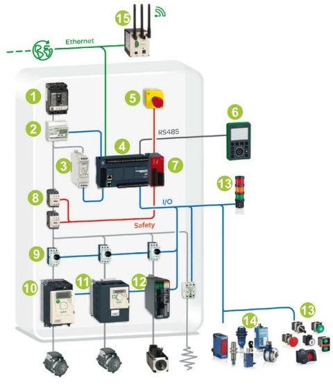

**Modbus** в якості промислової мережі

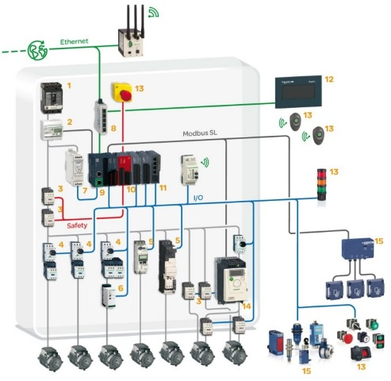

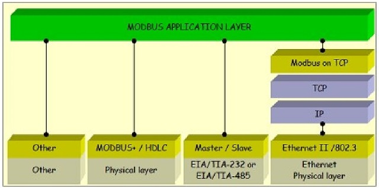

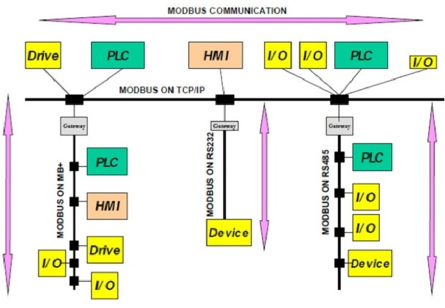

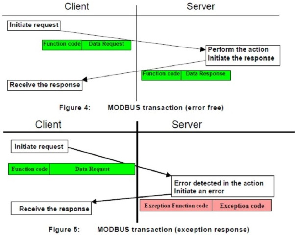

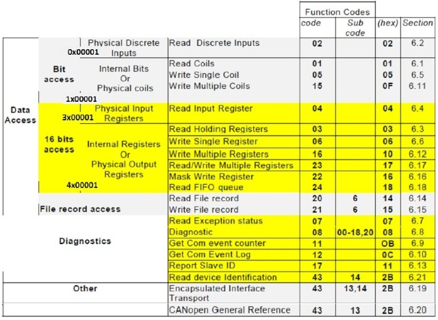

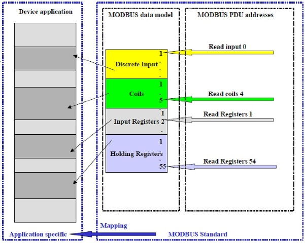

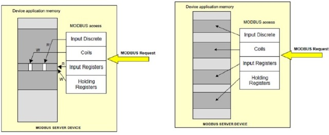

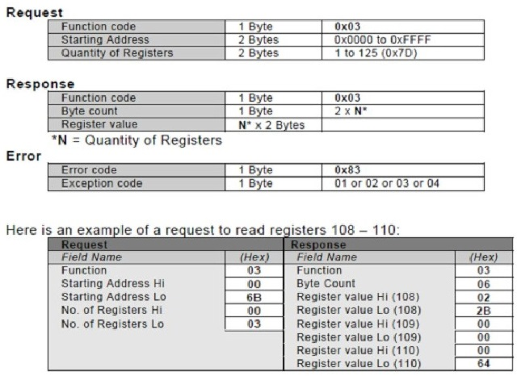

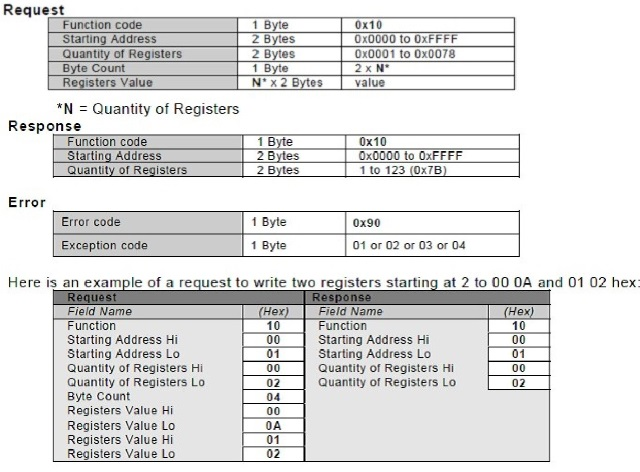

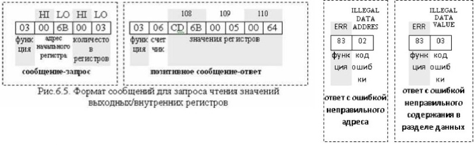

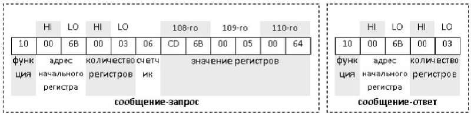

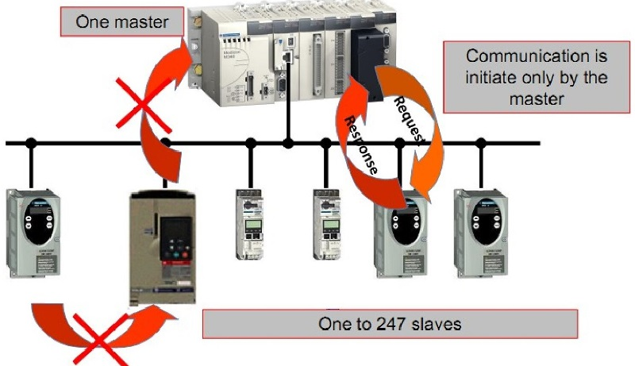

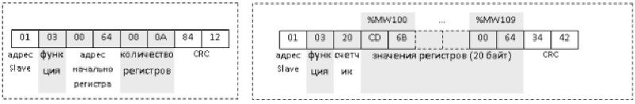

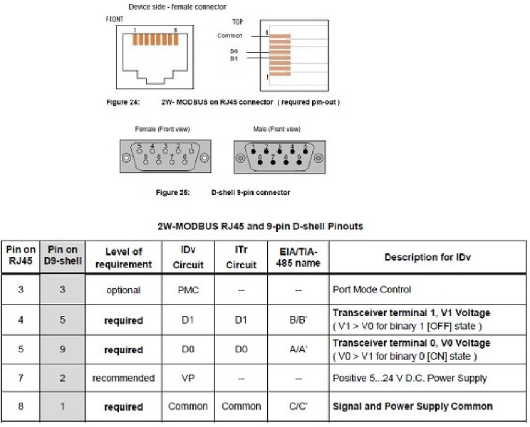

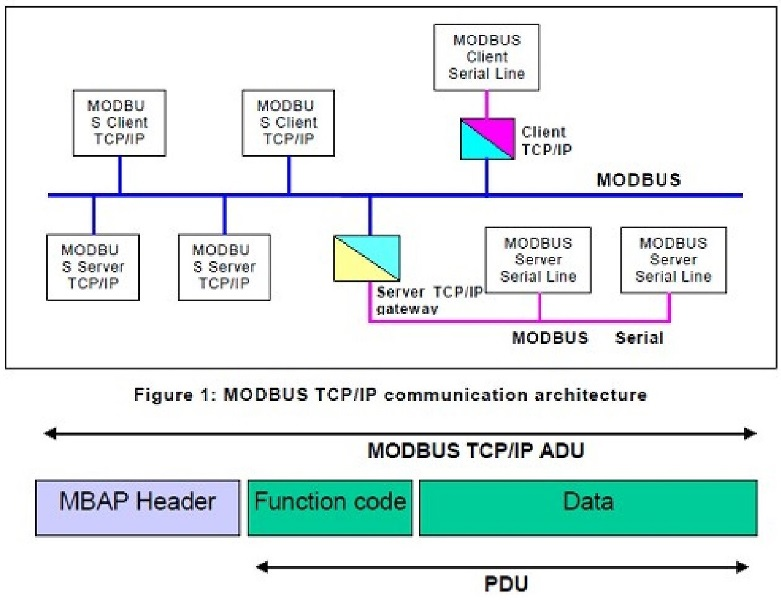